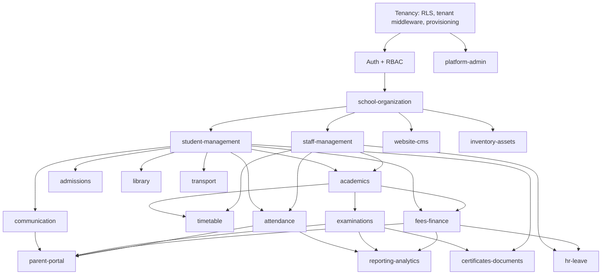

# Phase 2 — Core Build (Backend + Frontend of the Core Modules)

> **Agent Context**
> **Summary:** Covers lifecycle activities 6–7 (backend/API development, frontend development). The longest phase (~14 weeks, a **recommendation**): builds the multi-tenant foundation (tenancy → auth/RBAC → school-organization), then all core modules in dependency order, each landing complete per the definition-of-done (migrations+seeds, RBAC rows, cross-tenant tests, OpenAPI, feature flag). CI runs from week 1 — Phase 5 gates testing, it does not start it.
> **Co-load with:** [`phase-plan.md`](phase-plan.md) · [`../02-architecture/multi-tenancy.md`](../02-architecture/multi-tenancy.md) · [`../02-architecture/api-architecture.md`](../02-architecture/api-architecture.md) · [`../02-architecture/auth-and-rbac.md`](../02-architecture/auth-and-rbac.md)

## Objective

Deliver a multi-tenant platform on which a pilot school can run daily operations end-to-end without spreadsheets: tenancy, auth/RBAC, and every core module built to the same definition-of-done, exposed through the versioned REST API and the Next.js dashboard, with the public website renderer and platform console operational.

## Entry Criteria

- Phase 1 gates G1–G4 passed; core-module ERD frozen; OpenAPI skeletons merged.
- Monorepo + backend repo scaffolded per `repo-structure.md`; environments (dev, staging) provisioned.
- **CI operational before the first feature branch** (see Activity 1).
- Team staffed (recommendation: 2–3 backend, 2 frontend, 1 designer support, 1 QA from week 1).

## Activities

### 1. CI and engineering baseline (week 1, before feature work)

- GitHub Actions pipelines: lint, unit/integration tests, migration check, OpenAPI-vs-skeleton diff, TS type generation, build, deploy-to-staging.
- Test scaffolding including the **cross-tenant test harness**: a fixture pair of tenants + a reusable assertion that every endpoint denies (404s) cross-tenant reads/writes, per [`multi-tenancy.md`](../02-architecture/multi-tenancy.md) §3.5.
- Sentry, structured logging with request IDs, and feature-flag plumbing wired in from the first deploy — monitoring is instrumented here, go-live alerting is [`phase-6-launch.md`](phase-6-launch.md).

### 2. Build order

Modules land in dependency tiers; a tier starts when its upstream dependencies expose stable contracts (not necessarily polished UI). Rationale per edge is data dependency: you cannot mark attendance without students and a timetable; you cannot invoice without students and academic structure.

| Tier | Modules | Rationale |
| ---- | ------- | --------- |
| 0 Foundation | Tenancy → auth/RBAC → [`school-organization`](../03-modules/school-organization.md) | Everything is tenant-scoped and permission-guarded; sessions/classes/sections are the axes every record hangs on |
| 1 People | [`student-management`](../03-modules/student-management.md) · [`staff-management`](../03-modules/staff-management.md) | Students and staff are the subjects of every downstream module |
| 2 Daily ops | [`attendance`](../03-modules/attendance.md) · [`academics`](../03-modules/academics.md) · [`timetable`](../03-modules/timetable.md) | The features a school touches every hour; earliest real pilot feedback |
| 3 High-stakes | [`examinations`](../03-modules/examinations.md) · [`fees-finance`](../03-modules/fees-finance.md) | Need people + academic structure; money and results carry approval workflows and idempotency requirements |
| 4 Outward | [`communication`](../03-modules/communication.md) · [`parent-portal`](../03-modules/parent-portal.md) | The portal surfaces attendance/results/fees — must follow them |
| 5 Surfaces | [`website-cms`](../03-modules/website-cms.md) · [`platform-admin`](../03-modules/platform-admin.md) | Website renderer needs CMS content; platform console needs tenant lifecycle hardened |
| 6 Workflows | [`admissions`](../03-modules/admissions.md) · [`hr-leave`](../03-modules/hr-leave.md) | Reuse enrollment and staff/payroll primitives from tiers 1–3 |
| 7 Long tail | [`library`](../03-modules/library.md) · [`transport`](../03-modules/transport.md) · [`inventory-assets`](../03-modules/inventory-assets.md) · [`certificates-documents`](../03-modules/certificates-documents.md) · [`reporting-analytics`](../03-modules/reporting-analytics.md) | Independent of each other; reporting last so it aggregates real data shapes |

### 3. Per-module workflow

For each module: implement migrations + RLS → services + API against the Phase 1 contract → seed data → frontend screens from hi-fi designs → tests → OpenAPI regenerated and diffed → feature-flagged deploy to staging → module demo against its module doc (the source of truth per phase-plan §4 rule 3).

### 4. Definition of done (every module — phase-plan §4 rule 2)

1. **Migrations + seeds** — reversible migrations, RLS policy on every tenant-owned table, seed data for demo/dev tenants.
2. **RBAC rows** — permission keys and default-role grants from the module doc's §4 seeded.
3. **Tests** — unit + API integration + **cross-tenant access tests** on every endpoint class; frontend component tests for critical flows.
4. **OpenAPI** — generated spec matches the reviewed contract; TS client types published.
5. **Feature flag** — module wrapped in a server-checked flag, default off for real tenants ([`multi-tenancy.md`](../02-architecture/multi-tenancy.md) §5).

### 5. Continuous pilot feedback

From tier 2 onward, a staging demo tenant seeded with pilot-school-shaped data; bi-weekly walkthroughs with pilot champions. Findings triaged into the backlog — scope changes still go through MoSCoW, not straight into sprints.

## Deliverables

- Multi-tenant foundation live on staging: provisioning, RLS enforcement, JWT auth, RBAC with custom roles.
- All tier 0–7 modules deployed to staging, each meeting the definition of done.
- Website builder v1 (one theme) rendering tenant sites on wildcard subdomains.
- Platform admin console: tenant lifecycle, plans, flags.
- Green CI with coverage reporting; OpenAPI docs published per environment.
- Demo tenant + seeded data used for Phase 3/4/5 work.

## Roles Involved

- **Backend engineers** (tenancy, APIs, workers) · **Frontend engineers** (dashboard, website renderer) · **Tech lead** (tier gatekeeping, ADRs) · **QA engineer** (test harness, cross-tenant suite, regression pack growth) · **Designer** (build support, design QA) · **BA/PM** (backlog, pilot demos) · **Pilot champions** (walkthrough feedback).

## Exit Criteria

Matches [`phase-plan.md`](phase-plan.md) §3: **a pilot school can run daily operations without spreadsheets**, specifically:

1. Every core module passes its definition of done; no module merged flag-less.
2. End-to-end scenario executed on staging by QA + a pilot champion: onboard tenant → configure academics/fees → import students → mark attendance → enter and publish results → run a fee cycle → parent views and is notified.
3. Cross-tenant test suite green across all modules; zero known isolation defects.
4. Mobile-readiness review passed (no web-only auth or flows on API paths).
5. Regression pack handed to Phase 5 with known-issue log (no criticals).

## Risks & Mitigations

| Risk | Impact | Mitigation |
| ---- | ------ | ---------- |
| Foundation (tenancy/RBAC) underestimated | Every tier slips | Tier 0 gets the strongest engineers and no parallel feature work; explicit tier-0 exit review |
| Cross-tenant leak ships in a module | Catastrophic trust failure | DoD makes cross-tenant tests non-negotiable; RLS is DB-enforced, not app-only |
| Fees/examinations domain complexity blows the 14-week estimate | Timeline slip | These tiers carry buffer; MoSCoW Shoulds in tiers 6–7 are the sacrificial scope |
| Contract drift between frontend and backend teams | Integration churn | OpenAPI diff in CI fails the build on undocumented change |
| Feature flags accumulate as permanent debt | Config sprawl | Flag inventory reviewed at phase exit; graduated flags become plan-level toggles |
| Pilot feedback rewrites shipped modules | Rework loop | Feedback triaged via MoSCoW; only defects and Must-gaps interrupt the current tier |
