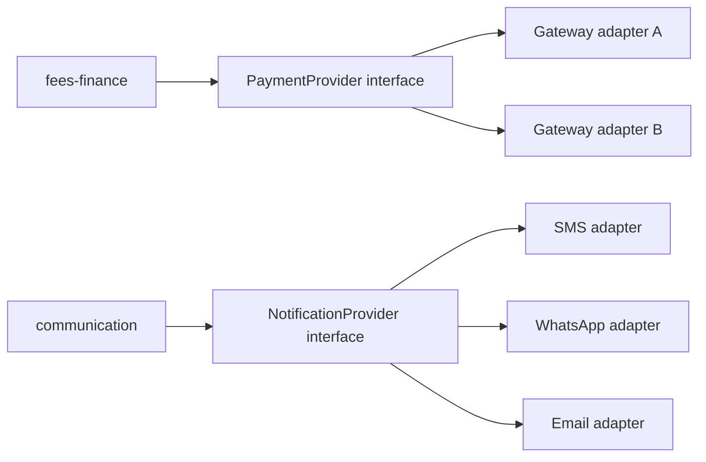

# Phase 4 — Third-Party Integrations

> **Agent Context**
> **Summary:** Covers lifecycle activity 9. Connects the platform to the outside world: payment gateways, SMS/WhatsApp/email providers, outbound webhooks for third parties, and legacy data import tooling (Excel/CSV). Everything is built on a provider-adapter pattern and proven in sandboxes before any production credential exists. Runs in parallel with Phase 3 (~4 weeks, a **recommendation**); Phase 5 gates both.
> **Co-load with:** [`phase-plan.md`](phase-plan.md) · [`../02-architecture/api-architecture.md`](../02-architecture/api-architecture.md) · [`../03-modules/fees-finance.md`](../03-modules/fees-finance.md) · [`../03-modules/communication.md`](../03-modules/communication.md)

## Objective

Make the platform operational in the real world: parents can pay fees online, notifications actually reach phones and inboxes with delivery accounting, third parties can subscribe to tenant events, and a school's existing records can be imported without hand-keying — all sandbox-verified and swappable per provider.

## Entry Criteria

- Phase 2 exit criteria met; fees-finance and communication modules stable (they own the domain logic these integrations serve).
- Provider selection shortlist from Phase 0 confirmed with the client (regional payment gateways, SMS aggregators, WhatsApp Business access, transactional email).
- Sandbox/test accounts and API credentials obtained for every shortlisted provider; secrets management in place per `hosting-deployment.md`.
- Pilot schools' legacy data samples collected (Phase 0 artifacts) for import-tooling design.

## Activities

### 1. Provider-adapter pattern (foundation for everything below)

Each integration category gets one internal interface with pluggable, per-tenant-configurable adapters:

- Domain modules call the interface only; no provider SDK types leak into module code.
- Adapter selection is tenant configuration (a school picks its gateway and sender identities); credentials are tenant-scoped secrets, encrypted at rest.
- Every adapter implements: health check, sandbox mode, structured error mapping, and delivery/settlement status normalization.

### 2. Payment gateways

- Integrate 1–2 gateways relevant to the pilot market (recommendation: one card/wallet gateway + one bank-transfer/local rails option).
- Flow: invoice → hosted checkout or payment intent → gateway callback → **signed webhook verification** → idempotent payment record → receipt PDF + notification. `Idempotency-Key` required on initiation per [`api-architecture.md`](../02-architecture/api-architecture.md) §2.5; duplicate callbacks must be replay-safe.
- Reconciliation job: daily settlement-report ingestion, mismatch flags surfaced to accountants ([`fees-finance.md`](../03-modules/fees-finance.md)).
- Refund flow wired through the approval workflow; partial payments and failure/timeout states modeled explicitly.

### 3. SMS / WhatsApp / Email providers

- Adapters behind the notification service ([`../02-architecture/notifications.md`](../02-architecture/notifications.md)): templates, per-tenant sender identity (SMS mask, WhatsApp Business number, email domain with SPF/DKIM guidance for custom domains).
- Delivery pipeline: queued fan-out via Celery → provider send → delivery-status callbacks → per-message status (`queued/sent/delivered/failed`) visible to school admins; retries with backoff; per-channel failure fallback rules (e.g. WhatsApp fail → SMS) as tenant configuration.
- Quota enforcement: SMS credits and channel limits from the tenant's plan ([`multi-tenancy.md`](../02-architecture/multi-tenancy.md) §6).
- WhatsApp template pre-approval workflow documented (provider-side template review has lead time — start week 1).

### 4. Outbound webhooks for third parties

- Implement the contract in [`api-architecture.md`](../02-architecture/api-architecture.md) §2.6: per-tenant endpoint registration, event subscription (e.g. `student.enrolled`, `fee.paid`, `result.published`), HMAC-SHA256 signatures, at-least-once delivery, exponential-backoff retries (max 8), dead-letter list in the tenant admin UI.
- Publish a webhook consumer guide (signature verification samples) as part of the public API docs.

### 5. Legacy data import tooling (Excel/CSV)

- Import wizard for the entities schools arrive with: students + guardians, staff, classes/sections, fee structures, opening balances, historical attendance/result summaries (recommendation: current-year detail only, prior years as summary records).
- Pipeline: template download → upload → column mapping (saved per tenant) → validation pass with row-level errors in a downloadable report → dry-run preview → committed import as a background job (202 + job resource) → rollback of a failed batch as one unit.
- All imports tenant-scoped, permission-guarded (`it_admin` / `school_admin`), audited, and idempotent on a batch key so re-uploads don't duplicate students.

### 6. Sandbox validation

Every integration passes a scripted sandbox scenario before any production credential is issued: test payments (success, failure, timeout, duplicate callback, refund), test messages across all channels with delivery-status verification, webhook delivery + retry + dead-letter, and a full pilot-school data import on staging. Results recorded as the phase's verification evidence.

## Deliverables

- Payment adapters (1–2 gateways) with reconciliation and refund flows, sandbox-verified end to end.
- SMS/WhatsApp/email adapters with delivery tracking, fallback rules, and plan-quota enforcement.
- Outbound webhook system + consumer documentation.
- Import wizard with saved mappings, dry-run, error reports, and batch rollback; pilot legacy data imported on staging.
- Sandbox validation evidence pack (scenario scripts + results) feeding Phase 5.

## Roles Involved

- **Backend engineers** (adapters, webhooks, import pipeline) · **Frontend engineer** (checkout handoff, import wizard, delivery dashboards) · **QA** (sandbox scenario scripts, chaos cases — duplicate callbacks, provider timeouts) · **Tech lead** (adapter interface design, security review of callback handling) · **PM/BA** (provider contracts, WhatsApp template approvals, pilot data collection) · **Pilot-school IT contacts** (data extracts, import validation).

## Exit Criteria

Matches [`phase-plan.md`](phase-plan.md) §3: **sandbox-verified payments + delivery reports**, specifically:

1. All sandbox scenarios in Activity 6 pass, including failure and duplicate-delivery cases.
2. One full pilot school's legacy data imported on staging with an error rate accepted by the school's champion.
3. Webhook signature verification confirmed by an external test consumer.
4. Security review passed on all callback/webhook endpoints (signature checks, replay windows, no tenant inference leaks).
5. Provider credentials, quotas, and fallback configuration manageable per tenant via platform-admin.

## Risks & Mitigations

| Risk | Impact | Mitigation |
| ---- | ------ | ---------- |
| Gateway callback handled non-idempotently | Double-posted payments | Idempotency keys + replay tests are mandatory sandbox scenarios |
| Provider approval lead times (WhatsApp templates, SMS masks) | Phase slips on paperwork, not code | Start all provider registrations in week 1; track as external dependencies |
| Legacy data dirtier than samples suggested | Import failures at onboarding | Dry-run + row-level error reports; pilot import happens in this phase, not at launch |
| Provider lock-in via leaked SDK types | Costly future swaps | Adapter interfaces enforced in code review; domain modules never import provider SDKs |
| Silent notification failure (provider accepts, never delivers) | Parents miss fee/exam notices | Delivery-status callbacks mandatory for adapter acceptance; failure dashboards + fallback channel |
| Webhook consumers can't verify signatures | Integration support burden | Published verification samples; dead-letter visibility to tenant admins |
