# Master Phase Plan

> **Agent Context**
> **Summary:** Maps all 18 lifecycle activities from the scope into 8 executable phases with deliverables, entry/exit criteria, and dependency order. Each phase has its own detailed doc (`phase-0-discovery.md` … `phase-7-operate.md`). Durations are **recommendations** for a small product team (3–5 engineers + 1 designer) and should be re-baselined at Phase 0 exit.
> **Co-load with:** the specific `phase-N-*.md` you are working in

## 1. Lifecycle → Phase Mapping

| # | Lifecycle activity (scope §1) | Phase |
| - | ----------------------------- | ----- |
| 1 | Requirement gathering & analysis | 0 — Discovery |
| 2 | Business & functional analysis | 0 — Discovery |
| 3 | UI/UX design | 1 — Design |
| 4 | System architecture & technical design | 1 — Design |
| 5 | Database architecture & design | 1 — Design |
| 6 | Backend/API development | 2 — Core Build |
| 7 | Frontend development | 2 — Core Build |
| 8 | AI feature development & integration | 3 — AI |
| 9 | Third-party integrations | 4 — Integrations |
| 10 | Testing & QA | 5 — Testing (continuous from 2, gated here) |
| 11 | Security testing | 5 — Testing |
| 12 | Performance testing | 5 — Testing |
| 13 | UAT | 5 — Testing |
| 14 | Deployment | 6 — Launch |
| 15 | Production configuration | 6 — Launch |
| 16 | Monitoring & logging | 6 — Launch (instrumented from 2) |
| 17 | Documentation & training | 7 — Operate (drafted throughout) |
| 18 | Maintenance & support / future scaling | 7 — Operate |

## 2. Phase Sequence

```mermaid
gantt
    dateFormat  W
    axisFormat  Wk %W
    section Plan
    P0 Discovery            :p0, 0, 3w
    P1 Design               :p1, after p0, 5w
    section Build
    P2 Core Build           :p2, after p1, 14w
    P3 AI Features          :p3, after p2, 6w
    P4 Integrations         :p4, after p2, 4w
    section Ship
    P5 Testing & UAT        :p5, after p3, 4w
    P6 Launch               :p6, after p5, 2w
    P7 Operate & Scale      :p7, after p6, 8w
```

P3 (AI) and P4 (Integrations) run **in parallel** after the core build; P5 gates both.

## 3. Phase Summaries

| Phase | Goal | Key deliverables | Exit criteria |
| ----- | ---- | ---------------- | ------------- |
| **0 — Discovery** (~3 wk) | Confirm requirements, priorities, pricing, pilot schools | Signed-off SRD (this doc set), prioritized module backlog, success metrics | Client sign-off on scope + stack recommendations |
| **1 — Design** (~5 wk) | Design before code | UX flows + hi-fi screens for core modules, system/DB architecture finalized, ERD, API contract skeleton, design system | Architecture review passed; ERD frozen for core modules |
| **2 — Core Build** (~14 wk) | Multi-tenant platform + core modules usable end-to-end | Tenancy/RBAC/auth foundation; modules: school-organization, student, staff, attendance, academics, timetable, examinations, fees, communication, parent portal; website builder v1; platform admin | A pilot school can run daily operations without spreadsheets |
| **3 — AI** (~6 wk) | The differentiator | AI gateway, assistants (admin/teacher/student/parent), NL search, content generation (lessons/quizzes/questions), risk analytics v1 | AI features pass governance checklist (`../04-ai/ai-governance.md`) |
| **4 — Integrations** (~4 wk) | Connect the outside world | Payment gateway(s), SMS/WhatsApp/email providers, webhooks, import/export from legacy systems | Sandbox-verified payments + delivery reports |
| **5 — Testing** (~4 wk) | Prove it | Full regression, security pen-test, load test (report + fee-day peaks), UAT with 2–3 pilot schools | Zero criticals; UAT sign-off |
| **6 — Launch** (~2 wk) | Go live | Production infra, runbooks, monitoring/alerting, backup/DR drill, tenant onboarding of pilots | Pilots live on production, on-call rota active |
| **7 — Operate** (ongoing) | Keep and grow | Training material, support process, maintenance cadence, roadmap execution (mobile, themes, marketplace — `../08-future/`) | N/A (steady state) |

## 4. Cross-Phase Rules

1. **Testing is continuous** — CI (unit/integration/E2E) runs from the first week of Phase 2; Phase 5 is the *gate*, not the start.
2. **Every module lands with:** migrations + seeds, RBAC rows (§4 of its module doc), tests including cross-tenant access tests, OpenAPI docs, and feature flag.
3. **Docs stay live** — each phase updates this doc set; the module doc is the source of truth reviewers check implementations against.
4. **Mobile-readiness reviews** at each phase exit: no web-only shortcut (cookie-bound auth, HTML-only flows) may block the future mobile phase (`../08-future/mobile-apps.md`).
