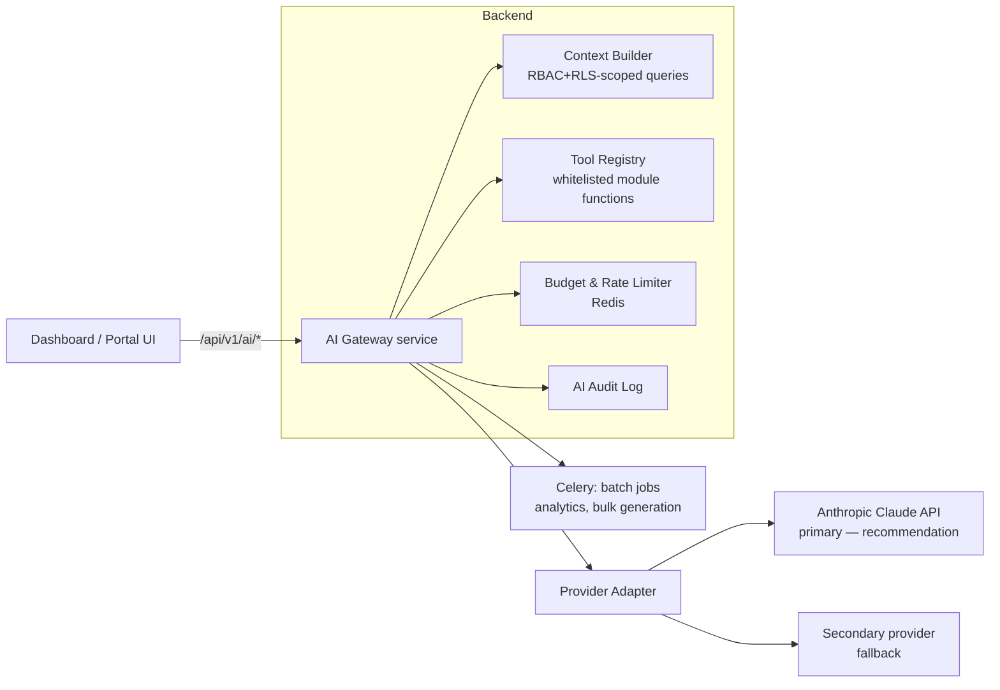

# AI Architecture

> **Agent Context**
> **Summary:** Defines how AI is built into the platform: a single server-side **AI Gateway** in the backend that all AI features call, provider selection and fallback, per-tenant token/cost budgets, permission-scoped data access, human-approval gates, and monitoring. Feature-level definitions live in [`../04-ai/ai-features.md`](../04-ai/ai-features.md); policy in [`../04-ai/ai-governance.md`](../04-ai/ai-governance.md).
> **Co-load with:** `../04-ai/ai-features.md` · `../04-ai/ai-governance.md` · `auth-and-rbac.md`

## 1. Principles

1. **AI is a layer, not a bolt-on** — every AI feature is a first-class module capability (documented in that module doc's §14) that routes through one shared gateway.
2. **Server-side only** — browsers and mobile apps never talk to an LLM provider directly; no provider keys leave the backend.
3. **The user's permissions bound the AI** — an AI request executes data access with the *initiating user's* RBAC context and the tenant's RLS. The assistant can never reveal data the user couldn't open in the UI.
4. **Human approval for anything outward or destructive** — AI drafts; humans publish (announcements, report-card remarks, notices, grades). Enforced by workflow, not convention.
5. **Predictable cost** — per-tenant budgets, per-feature model tiers, caching.

## 2. Components

- **AI Gateway:** one internal service (Django app `core/ai/`) exposing typed feature endpoints (`POST /api/v1/ai/assistant:ask`, `POST /api/v1/ai/lesson-plans:generate`, …). No free-form proxy endpoint.
- **Context Builder:** assembles the prompt context via scoped queries (never raw table dumps); applies PII redaction rules from `ai-governance.md`.
- **Tool Registry:** for agentic features (NL search, assistants), the model may call only whitelisted read functions; each tool re-checks the caller's permission key. Write-tools are draft-only.
- **Provider Adapter:** provider-agnostic interface (messages, tools, streaming). Primary: Anthropic Claude (recommendation — strongest tool-use + safety fit); a secondary provider configured for failover. Per-feature model tiers: cheap/fast model for classification & summarization, top model for assistants & generation.
- **Budgets:** per-tenant monthly token quota by plan + per-user daily caps; soft-warning at 80%, hard-stop with graceful UI message. Usage metered per feature for platform reporting.

## 3. Feature Execution Patterns

| Pattern | Used by | Behavior |
| ------- | ------- | -------- |
| **Synchronous ask** | assistants, NL search, summarization | Streamed response (SSE), 30 s cap |
| **Draft-for-approval** | announcements, notices, lesson plans, quizzes, exam questions, parent messages | Output saved as `draft` on the owning module's entity; publishing requires that module's `publish`/`approve` permission |
| **Batch analytics** | at-risk detection, attendance anomalies, fee-payment prediction, performance insights | Nightly Celery jobs writing *scored suggestions* tables; surfaced in dashboards with explanations; never auto-acts |
| **Document intake** | OCR/extraction (admissions documents, imports) | Async job + human verification screen before data is committed |

## 4. Reliability & Fallback

- Provider timeout → one retry → secondary provider → feature-specific graceful degradation (assistant apologizes; batch job reschedules; UI hides AI panel if the flag is off).
- All AI features sit behind feature flags (per plan and per tenant kill-switch) — see [`multi-tenancy.md`](multi-tenancy.md) §5.
- Prompt templates are versioned in the repo; every response logs `feature, prompt_version, model, tokens, latency, tenant, user` to the AI audit log (no raw student PII in logs).

## 5. Quality & Monitoring

- **Evaluation harness:** golden-set prompts per feature run in CI on prompt/model changes (regression scoring).
- **Runtime monitoring:** error rate, latency, token spend per tenant/feature, refusal rate; alerting on spend anomalies.
- **Feedback loop:** thumbs up/down + comment on every AI output, reviewed for prompt iteration.

## 6. Data Protection Summary (detail in `ai-governance.md`)

- Minimum-necessary context; identifiers pseudonymized where the feature allows.
- Provider contracts must guarantee no training on submitted data (API-tier terms).
- Children's data: assistants for students use age-appropriate system prompts and hard topic guardrails; parent/student assistants can only access `own`-scoped records.
