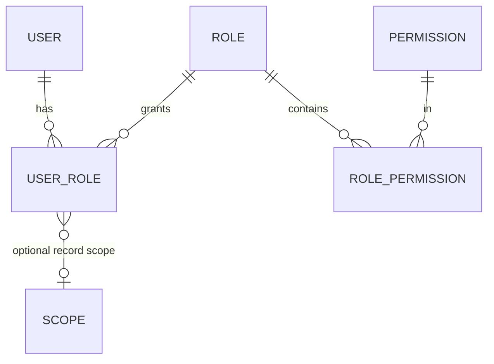

# Authentication & RBAC

> **Agent Context**
> **Summary:** Defines authentication (JWT, sessions, MFA-readiness) and the full RBAC model: permission keys (`module.resource.action`), roles as permission sets, module/feature/record-level checks, approval permissions, tenant isolation interplay, and audit logging. Module docs' §4 tables use the permission-key format defined here.
> **Co-load with:** `../00-overview/users-and-roles.md` · `multi-tenancy.md` · `../05-database/entities/tenancy.md`

## 1. Authentication

- **Credentials:** email or phone + password (Argon2id hashing). Student accounts may alternatively use school-issued usernames (`{tenant-slug}\{admission-no}` style) since young students often lack email.
- **Tokens:** JWT access (15 min) + rotating refresh (30 days) with server-side revocation list; refresh rotation invalidates the family on reuse (theft detection). Web keeps refresh in an HttpOnly SameSite cookie; future mobile uses secure storage — same endpoints, mobile-ready by design.
- **Sessions:** users can list and revoke active sessions/devices. Admin-forced logout supported.
- **Password policy:** min 10 chars + breach-list check; rate-limited login (per-account and per-IP); lockout with exponential backoff; secure reset via one-time token (email/SMS).
- **MFA/2FA-ready:** TOTP enrollment shipped for platform roles and tenant owners/admins at launch; optional per-tenant enforcement policy for all staff. Architecture keeps a `second_factor` step in the login state machine so SMS-OTP/WebAuthn can be added without contract changes.
- **Impersonation:** platform support may impersonate a tenant user only with an elevation grant — time-boxed (≤ 1 h), reason required, banner shown, every action audit-tagged `impersonated_by`.

## 2. RBAC Model

### 2.1 Permissions
- A **permission** is a static, code-defined key: **`module.resource.action`** — e.g. `attendance.student-attendance.mark`, `fees.invoice.create`, `exams.result.approve`, `library.book.issue`.
- **Actions vocabulary (locked):** `view`, `create`, `update`, `delete`, `export`, `import`, `approve`, `publish`, plus rare module-specific verbs (`mark`, `issue`, `collect`, `refund`) declared in that module doc §4.
- Permissions ship with the code (migration-seeded); tenants can never invent permission keys — only combine them into roles.

### 2.2 Roles
- A **role** = named set of permissions, either **default** (platform-seeded per `users-and-roles.md`, updatable by releases) or **custom** (tenant-created, tenant-scoped).
- Users get roles via `user_role` rows; effective permissions = union of all roles. No direct user→permission grants. No role inheritance hierarchy — composition over inheritance (a custom role is built by cloning + editing; simpler to audit than inheritance chains). *This is a deliberate simplification recommendation.*

### 2.3 Check Levels
1. **Module-level:** is the module enabled for the tenant (plan/feature flag) — checked before any permission.
2. **Feature-level (endpoint):** does the user hold the endpoint's permission key.
3. **Record-level (scope):** optional constraint attached to a `user_role`, evaluated as queryset filters:
   - `own` — only records the user owns (student → self, guardian → own children, driver → own route);
   - `assigned` — teacher → assigned classes/sections/subjects;
   - `campus:<id>` — staff restricted to one campus;
   - `all` — whole tenant (default for admin-type roles).
4. **Tenant-level:** RLS underneath everything (see `multi-tenancy.md`) — RBAC narrows *within* a tenant, never across.

### 2.4 Approval & Financial Permissions
- Approval steps in configurable workflows (leave, result publishing, refunds, certificate issuance, admission acceptance) each name a required permission (e.g. `hr.leave-request.approve`) and optionally a role; a user cannot approve a step they initiated (segregation of duties).
- Financial mutations (`fees.*.collect|refund|waive`, `payroll.*.approve`) are always audited with before/after amounts and require `record-level ≠ own`.

## 3. Enforcement Points

| Layer | Mechanism |
| ----- | --------- |
| API | Permission decorator per endpoint (declared, not ad-hoc) — the OpenAPI spec publishes each endpoint's required key |
| Query | Scope filters applied in the base queryset, not in view code |
| Frontend | UI hides/disables by permission, but this is UX only — server checks are authoritative |
| Jobs/AI | Background jobs and AI tools run with the *initiating user's* permission context, never a superuser context |

## 4. Audit Logging

- Every mutation writes an `audit_log` row: `tenant_id, actor_id, impersonated_by, action, resource_type, resource_id, before/after (JSONB, PII-minimized), request_id, ip, user_agent, created_at`.
- Security events additionally logged: logins (success/fail), password/MFA changes, role/permission changes, exports, impersonation grants.
- Immutable (append-only table, no update/delete grants for the app role), tenant-visible to `school_owner`/`it_admin` with filters, retained per data-retention policy (`../07-quality/non-functional.md`).

## 5. Seed Matrix

The default role→permission matrix ships as versioned seed data; each module doc §4 defines its module's rows. Release upgrades may add permissions to default roles but never silently remove tenant-granted ones (migration reports required).
