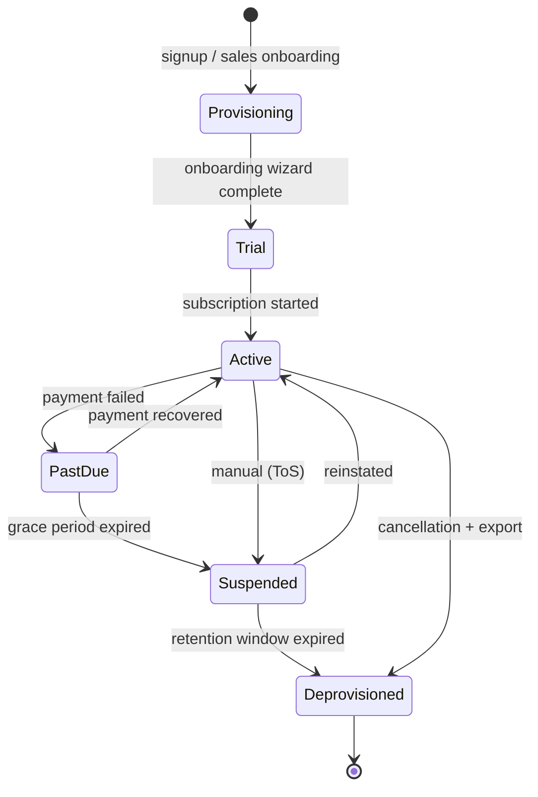

# Multi-Tenant Architecture

> **Agent Context**
> **Summary:** Every school is a **tenant**. Compares isolation models and selects **shared database + shared schema + PostgreSQL Row-Level Security (RLS)**, with the tenant resolved from the authenticated session (dashboard) or the domain (public websites). Defines tenant lifecycle: onboarding, provisioning, configuration, branding, custom domains, plans/feature flags, deactivation, export, deletion.
> **Co-load with:** `database-architecture.md` · `auth-and-rbac.md` · the `platform-admin.md` module doc

## 1. Vocabulary (locked)

| Term | Meaning |
| ---- | ------- |
| **Tenant** | One school organization (may contain multiple campuses/branches) |
| **Platform** | The SaaS operator layer above all tenants (Super Admin) |
| **Tenant member** | Any user account belonging to a tenant (staff, student, parent) |
| **Plan** | Subscription tier controlling feature flags and usage limits |

A user account belongs to exactly one tenant; platform staff live in a special platform scope. (Cross-tenant identities — e.g. a parent with children in two schools — are handled as separate accounts with the same email; a linking layer is a future enhancement.)

## 2. Isolation Model Comparison

| Model | Isolation | Cost/Ops | Migrations | Fit |
| ----- | --------- | -------- | ---------- | --- |
| Database-per-tenant | Strongest | One DB per school → expensive at 100s of tenants; fleet migrations painful | Hard | Poor for this price point |
| Schema-per-tenant | Strong | Postgres catalogs bloat past ~100 schemas; per-schema migrations slow | Hard | Moderate |
| **Shared schema + `tenant_id` + RLS** | Strong when enforced in the DB, not just the app | One database; cheapest; single migration run | Easy | **Recommended** |

**Decision (recommendation): shared schema with a `tenant_id` column on every tenant-owned table, enforced by PostgreSQL Row-Level Security.**

## 3. How Isolation Is Enforced (defense in depth)

1. **Database (authoritative):** every tenant-owned table has `tenant_id UUID NOT NULL REFERENCES tenants(id)` and an RLS policy `USING (tenant_id = current_setting('app.tenant_id')::uuid)`. The application role is **not** `BYPASSRLS`. A request middleware sets `app.tenant_id` per connection/transaction from the authenticated context.
2. **Application:** the ORM default manager auto-filters by the request tenant; writing a query that skips the tenant filter requires an explicitly-named unsafe manager reserved for platform-admin code paths.
3. **API:** cross-tenant object references in payloads are re-validated against the request tenant; violations return `404` (never `403`, to avoid existence leaks) — per [`api-architecture.md`](api-architecture.md) §2.3.
4. **Files & search:** object-storage keys are prefixed `tenants/{tenant_id}/…` and served only via tenant-checked signed URLs; search indexes carry `tenant_id` filters.
5. **Testing:** the CI suite includes cross-tenant access tests for every module (attempt to read/write another tenant's records through every endpoint class).

## 4. Tenant Resolution

| Surface | Resolution |
| ------- | ---------- |
| Admin dashboard (`app.<platform-domain>`) | From the JWT — the user's account is bound to one tenant |
| Public school website | From the domain: `<slug>.<platform-domain>` wildcard subdomain, or the school's verified **custom domain** (CNAME + automated TLS via the hosting edge) |
| Platform console | Platform-scope JWTs; may impersonate a tenant with an audited, time-boxed elevation |

## 5. Tenant Configuration & Branding

Stored per tenant (JSONB `settings` + typed tables where structure matters):
- **Identity/branding:** name, logo, colors, fonts, favicon — consumed by both dashboard theming and the website theme (see [`website-builder.md`](website-builder.md)).
- **Academic configuration:** sessions, terms, grading scales, weekday/holiday calendar, timezone, locale(s).
- **Workflows:** approval chains (leave, results, refunds) configurable per tenant — see module docs §7.
- **Feature flags:** per-plan defaults + per-tenant overrides (kill-switch capable); every module checks its flag server-side.
- **Custom roles:** tenants can define roles beyond the defaults — see [`auth-and-rbac.md`](auth-and-rbac.md).

## 6. Plans & Subscription

- Plans (e.g. Basic / Standard / Premium) define: enabled modules, usage limits (students, staff, storage, SMS credits, AI tokens), and support tier. Managed in the `platform-admin` module; enforcement is server-side at the feature-flag and quota layer.
- Billing integration (invoicing the schools themselves) is platform-level, not tenant-level, and is documented in [`../03-modules/platform-admin.md`](../03-modules/platform-admin.md).

## 7. Tenant Lifecycle

- **Provisioning:** creating a tenant row + seed data (default roles, permission sets, notification templates, one website theme instance, sample academic structure) is a single idempotent transaction — no per-tenant infrastructure.
- **Onboarding wizard:** guided setup (school profile → campuses → academic session → classes/sections → fee structures → staff invites → student import). Documented as part of `platform-admin.md`.
- **Suspension:** logins blocked (except owner read-only billing view), public website replaced with a neutral notice, data untouched.
- **Export:** tenant admins can request a full export (CSV per entity + uploaded files archive) as a background job; also used before deletion.
- **Deletion:** soft-deactivate → 90-day retention → hard purge (rows by `tenant_id`, storage prefix, search entries, backups age out per policy). Auditable certificate of deletion produced.

## 8. Reporting Boundaries

- **Tenant-level reporting** runs under RLS like any request.
- **Platform-level reporting** (aggregate usage, revenue, adoption) runs through a separate read path that aggregates *metrics*, never row-level school data, and is restricted to platform roles. See [`../03-modules/reporting-analytics.md`](../03-modules/reporting-analytics.md).
