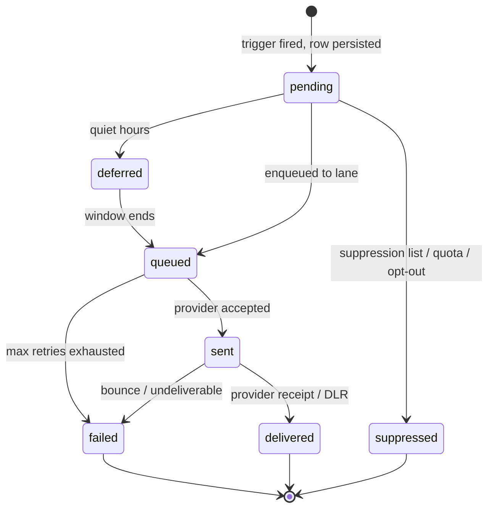

# Notification Architecture

> **Agent Context**
> **Summary:** Platform-wide notification design (scope §19): five channels (email, SMS, push, in-app, WhatsApp) behind a provider-adapter interface; per-tenant templates with locale variants and merge fields; an event-driven trigger catalog (modules emit domain events, the notification service maps events → templates → recipients per preferences); quiet hours; prioritized Celery queues; delivery tracking, retries, provider failover, suppression lists, and per-tenant SMS quotas.
> **Co-load with:** [`system-architecture.md`](system-architecture.md) · [`api-architecture.md`](api-architecture.md) · [`multi-tenancy.md`](multi-tenancy.md)

## 1. Channel Architecture

| Channel | Initial provider (recommendation) | Notes |
| ------- | --------------------------------- | ----- |
| Email | Amazon SES or Postmark | Transactional + bulk streams separated |
| SMS | Twilio, plus a regional aggregator per market | Costed per segment; quota-controlled |
| Push | Firebase Cloud Messaging | Web push at launch; same tokens serve future mobile |
| In-app | Internal (`notifications` table + SSE badge stream) | Always-on; the fallback channel of record |
| WhatsApp | WhatsApp Business API (via Twilio/Meta BSP) | Template-message rules apply; optional per tenant |

All providers sit behind a single **adapter interface** in `core/notifications/`:

```python
class ChannelAdapter(Protocol):
    channel: Channel                      # email | sms | push | in_app | whatsapp
    def send(self, message: RenderedMessage) -> ProviderReceipt: ...
    def parse_status_webhook(self, payload: dict) -> DeliveryUpdate: ...
```

Adapters own provider-specific formatting, credentials, and status-webhook parsing. Business code never imports a provider SDK directly, so providers can be swapped or regionalized per tenant without touching modules. Provider credentials are platform-level; per-tenant sender identities (email from-address, SMS sender ID, WhatsApp number) are tenant configuration.

## 2. Template System

- Every notification type has a **platform default template** per channel; tenants may **override** any template (subject/body) from the dashboard without code changes.
- Template **codes** are dotted `module.event-name` identifiers (e.g. `attendance.absence-alert`, `fees.due-reminder`, `exams.result-published`) — the canonical format used by every module doc's §12 table; the same code is reused across channels.
- Templates support **locale variants** (initially English + Urdu, per [`tech-stack.md`](tech-stack.md)); the variant is chosen by the recipient's preferred locale, falling back to the tenant default locale, then English.
- Bodies use a sandboxed merge-field syntax (`{{ student.first_name }}`, `{{ invoice.amount_due }}`, `{{ school.name }}`) with a **whitelisted variable set declared per notification type** — tenant editors cannot reference arbitrary data. Rendering escapes per channel (HTML for email, plain text for SMS/WhatsApp).
- Channel constraints validated at save time: SMS length/segment estimate, WhatsApp pre-approved template mapping, push title/body limits.
- Templates are versioned; a sent message records the template version used (audit + debugging).

## 3. Trigger Catalog Pattern

Modules never send notifications directly. Instead:

1. A module emits a **domain event** at a service-layer commit point — e.g. `attendance.student_absent`, `fees.invoice_issued`, `fees.payment_received`, `exams.result_published`, `admissions.application_received`, `hr.leave_approved`, `communication.announcement_published`, `transport.route_changed`.
2. The **notification service** owns the **trigger catalog**: a registry mapping each event to notification type(s), default channels, recipient resolution rule, priority lane, and required template variables. Each module doc's §Notifications section defines its rows in this catalog.
3. **Recipient resolution** runs per rule (e.g. `student_absent` → the student's active guardians; `result_published` → students + guardians of the affected class), then filters through per-user preferences, quiet hours, and suppression lists.
4. One **`notification` row per recipient per channel** is persisted first, then enqueued — the database is the source of truth; queues are just transport.

Tenant admins can enable/disable triggers and adjust default channels per trigger within plan limits; emergency triggers (see §6) cannot be disabled below in-app.

## 4. User Preferences & Quiet Hours

- Per-user preference matrix: notification **category** (attendance, fees, academics, announcements, emergencies) × **channel** → on/off. Defaults are seeded per role by the tenant; users adjust from their profile.
- **Mandatory floor:** emergency notifications and legally/financially significant messages (fee invoices, exam results) always deliver at least in-app; users cannot fully opt out of those categories.
- **Quiet hours:** per-user window (default 21:00–07:00 tenant time, recommendation); non-urgent messages arriving inside the window are **deferred** to the window end, not dropped. Emergency lane ignores quiet hours. All evaluation uses the tenant timezone ([`database-architecture.md`](database-architecture.md) §2).

## 5. Queue Topology (Celery)

| Lane (queue) | Examples | Target latency | Workers |
| ------------ | -------- | -------------- | ------- |
| `notify.emergency` | School emergency broadcast, security alerts | Seconds | Dedicated, always-warm |
| `notify.transactional` | OTPs, password resets, payment receipts, absence alerts | < 1 min | Shared pool, high priority |
| `notify.bulk` | Announcements, fee-reminder batches, result publishing fan-out | Minutes; rate-shaped | Throttled per provider + per tenant |

- Fan-out jobs (one announcement → thousands of recipients) chunk recipients (batches of ~500) so a single tenant's blast cannot starve the lane; per-tenant rate shaping keeps one school from consuming the whole SMS pipe.
- Celery Beat drives scheduled notifications (fee due reminders, report deliveries) by emitting the same domain events.
- Workers set the tenant context (`SET LOCAL app.tenant_id`) from the job payload before any data access, per [`database-architecture.md`](database-architecture.md) §1.1.

## 6. Delivery Status, Retries & Failure Handling

Each `notification` row tracks a status machine:



- **Provider receipts and status webhooks** (bounces, SMS DLRs, WhatsApp read receipts) update rows asynchronously via the adapter's `parse_status_webhook`.
- **Retries:** transient failures retry with exponential backoff + jitter (recommendation: 1 m, 5 m, 30 m, 2 h, 6 h; max 5 attempts), idempotent per notification ID so a retry can never double-send.
- **Provider failover:** each channel may configure a secondary provider; after `N` consecutive provider-level failures or a health-check trip, the circuit breaker routes new sends to the fallback and alerts operations. Messages already with the failed provider finish their retry schedule there.
- **Suppression lists:** hard email bounces, spam complaints, SMS opt-out keywords (STOP), and invalid numbers are written to a per-tenant suppression list checked before every enqueue; suppressed sends are recorded with reason, never silently dropped. Clearing an entry requires an admin action (audited).
- **Dead-lettering:** permanently failed notifications land in a dead-letter state visible to tenant admins (delivery dashboard: sent/delivered/failed counts per trigger and channel).

## 7. Quotas & Cost Control

- **Per-tenant SMS credit quotas** come from the subscription plan ([`multi-tenancy.md`](multi-tenancy.md) §6); every SMS/WhatsApp segment decrements the tenant balance atomically at enqueue time. At zero balance, SMS sends are skipped with status `suppressed(quota)` and the message falls back to in-app + email; tenant admins get a low-balance alert at 20% (recommendation).
- Email and push are unmetered but rate-shaped; platform-level anomaly alerts fire on unusual per-tenant volume (abuse prevention, see [`../06-security/security.md`](../06-security/security.md)).
- Usage reporting per tenant (messages by channel/trigger/month) feeds platform billing and the tenant's own dashboard.

## 8. In-App Channel Detail

The in-app channel is internal and always available, so it carries the reliability floor:

- Rows land in the recipient's `notifications` inbox immediately at persist time (no provider hop); the SSE stream (`GET /api/v1/events/stream`, see [`api-architecture.md`](api-architecture.md) §3) pushes badge-count updates to open dashboard sessions.
- Read/unread state is per recipient; bulk mark-as-read supported; inbox entries link to the originating record (invoice, result, announcement) via a typed deep-link payload.
- In-app entries follow the communications retention class ([`database-architecture.md`](database-architecture.md) §5): purged after 12 months.

## 9. Testing & Observability

- Every trigger has contract tests: event emitted → correct recipients resolved → correct template variables rendered → row persisted in the right lane. Adapters are tested against provider sandboxes in staging; production sends are never exercised from CI.
- Metrics per channel/provider/tenant: enqueue rate, send latency, delivery rate, failure rate, retry depth, quota consumption — alerting on delivery-rate drops and circuit-breaker trips ([`system-architecture.md`](system-architecture.md) §2.10).
- Every notification row carries the originating `request_id`/job ID so a "parent says they never got the absence SMS" support case is traceable end to end: trigger → row → attempts → provider receipt.

## 10. Interfaces to the Rest of the System

- **API:** in-app notification list/read endpoints and the SSE badge stream are defined under [`api-architecture.md`](api-architecture.md) §3; notification sends triggered by API actions return immediately — delivery is always asynchronous.
- **Module docs:** each module's §Notifications table enumerates its triggers, recipients, and default channels — those tables are the authoritative trigger catalog content; this document defines the machinery.
- **Entity specs:** `notifications`, `notification_templates`, `notification_preferences`, and `suppression_list` table definitions live in [`../05-database/entities/`](../05-database/entities/).
