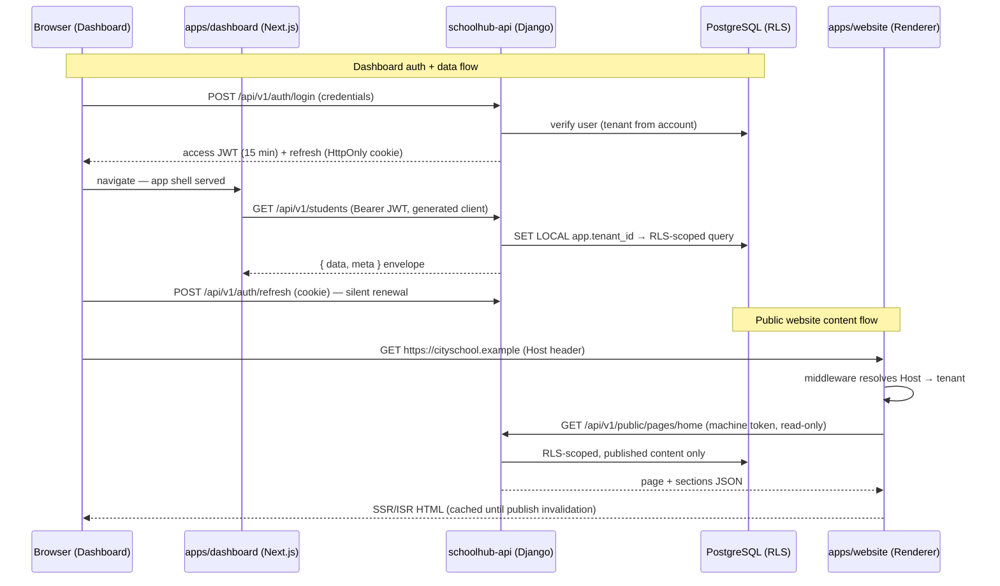

# Repository & Folder Structure

> **Agent Context**
> **Summary:** Recommended repository layout (scope §14–§15): `schoolhub-api` (Django modular monolith, one app per doc module + `core/`), `schoolhub-frontend` (Turborepo: dashboard + website apps, shared `ui`/`api-client`/`types` packages), `schoolhub-infra` (IaC + compose), `schoolhub-docs` (this doc set). Covers naming conventions, env/config management, shared-code policy, testing structure, and repo-to-repo integration flows (auth, public content, OpenAPI contract, future mobile).
> **Co-load with:** [`system-architecture.md`](system-architecture.md) · [`api-architecture.md`](api-architecture.md) · [`hosting-deployment.md`](hosting-deployment.md)

All structure in this document is a **recommendation**. Four repositories (one per deployable concern plus docs) balance independent deploy cadence against cross-repo overhead.

## 1. `schoolhub-api` — Backend (Django)

```
schoolhub-api/
├── config/                  # Django project: settings/ (base, dev, staging, prod), urls, asgi, celery app
├── core/                    # Cross-cutting platform code (no domain logic)
│   ├── tenancy/             #   tenant middleware, app.tenant_id GUC, tenant-aware managers
│   ├── rbac/                #   permission registry, decorators, scope filters
│   ├── notifications/       #   channel adapters, template engine, trigger catalog
│   ├── ai/                  #   AI gateway, budgets, prompt templates, audit
│   ├── api/                 #   envelope renderer, exceptions, pagination, idempotency
│   └── files/               #   presigned uploads, signed downloads, AV hooks
├── apps/                    # One Django app per module doc (19)
│   ├── school_org/  students/  staff/  attendance/  academics/
│   ├── timetable/  exams/  fees_finance/  hr_leave/  admissions/
│   ├── parents/  communication/  library/  transport/  inventory/
│   ├── certificates/  website_cms/  reporting_analytics/  platform_admin/
│   └── <module>/            # models.py · serializers.py · views.py · services.py
│                            # permissions.py · tasks.py · events.py · urls.py · tests/
├── requirements/ or pyproject.toml
├── scripts/                 # manage-wrappers: seed, export-openapi, restore-drill
└── Dockerfile · .env.example · Makefile
```

| Folder | Purpose |
| ------ | ------- |
| `config/` | Settings split per environment; only env vars differ between deploys |
| `core/` | Tenancy, RBAC, notifications, AI gateway — imported by apps, imports no app |
| `apps/<module>/` | Mirrors the 19 module docs in [`../03-modules/`](../03-modules/) one-to-one |
| `apps/<module>/services.py` | The only module-to-module surface; views never call another app's models |
| `apps/<module>/tests/` | `test_models.py`, `test_services.py`, `test_api.py`, `test_tenancy.py` (mandatory cross-tenant tests) |

**Conventions:** `snake_case` Python modules; app names plural where the domain is (`students`), singular for concepts (`timetable`); permission keys and event names declared in `permissions.py`/`events.py` so they are grep-able and seed-able.

## 2. `schoolhub-frontend` — Turborepo Monorepo

```
schoolhub-frontend/
├── apps/
│   ├── dashboard/           # Next.js 15 admin app (app/ per module: students/, fees/, …)
│   └── website/             # Next.js 15 multi-tenant public renderer (themes/default/…)
├── packages/
│   ├── ui/                  # shadcn-based shared components, theme tokens
│   ├── api-client/          # GENERATED from OpenAPI — never hand-edited
│   ├── types/               # Shared TS types & Zod schemas (mirrors API contracts)
│   └── config/              # eslint, tsconfig, tailwind presets
├── turbo.json · package.json (workspaces) · .env.example
```

| Folder | Purpose |
| ------ | ------- |
| `apps/dashboard/app/(modules)/` | One route group per module, mirroring the module docs |
| `apps/dashboard/features/<module>/` | Components, hooks, TanStack Query definitions per module |
| `apps/website/themes/<theme>/` | Section components + token contract per theme ([`website-builder.md`](website-builder.md)) |
| `packages/api-client/` | Regenerated in CI from the API's published OpenAPI spec |
| `packages/ui/` | Only components used by ≥ 2 apps graduate here (shared-code policy) |

**Conventions:** `kebab-case` file names, `PascalCase` components, `use*` hooks; tests co-located as `*.test.tsx` (Jest + React Testing Library via `next/jest`).

## 3. `schoolhub-infra` and `schoolhub-docs`

```
schoolhub-infra/
├── compose/                 # docker-compose.dev.yml (postgres, redis, mailpit, minio)
├── terraform/ (or platform IaC)  # envs/{staging,prod}/ · modules/{db,cache,storage,dns}/
├── github-actions/          # Reusable workflow templates
└── runbooks/                # Deploy, restore, incident procedures
```

`schoolhub-docs/` is this documentation set (`docs/00-overview` … `08-future`), plus ADRs in `docs/adr/`.

## 4. Configuration & Environment Management

- **12-factor:** all config via environment variables; code contains no environment conditionals beyond the settings module selector.
- Each repo ships a committed `.env.example` (every variable, dummy values, one-line comment); real `.env` files are git-ignored and **secrets are never committed** — enforced by gitleaks pre-commit + CI scan.
- Runtime secrets come from the platform secret store (see [`hosting-deployment.md`](hosting-deployment.md) §Secrets); local dev uses `.env` + compose defaults.
- Frontend build-time variables are limited to public values (`NEXT_PUBLIC_*`); anything sensitive stays server-side.

## 5. Shared-Code Policy

- **Across repos, the only shared artifact is the API contract** (OpenAPI → generated client). No shared runtime libraries between backend and frontend — prevents lockstep deploys.
- Within the frontend monorepo, sharing goes through `packages/*` with semver-free workspace versions; within the backend, through `core/` only. Copy-paste twice before extracting a third use (rule of three).

## 6. Repository-to-Repository Integration



### 6.1 Contract Artifacts
- The API publishes **OpenAPI 3.1** (generated by drf-spectacular) as a CI artifact per environment.
- Frontend CI regenerates `packages/api-client` + `packages/types` from that spec; a contract change that breaks the dashboard fails frontend CI **before** deploy — the spec is the inter-repo interface, reviewed like code.
- Versioning: additive API changes regenerate silently; breaking changes require a `v2` path per [`api-architecture.md`](api-architecture.md) §2.1.

### 6.2 Other Integration Points
| Link | Mechanism |
| ---- | --------- |
| API → AI provider | Server-side only, via `core/ai` gateway ([`ai-architecture.md`](ai-architecture.md)) |
| API → notification providers | `core/notifications` adapters + Celery lanes ([`notifications.md`](notifications.md)) |
| API ↔ payment gateway | Redirect/intent + signed webhooks, idempotency-keyed |
| Renderer ← publish events | API webhook → on-demand ISR revalidation ([`website-builder.md`](website-builder.md) §3) |
| Infra → all | IaC provisions DBs, DNS, secrets; app repos consume via env vars |

### 6.3 Future Mobile Applications
Mobile apps (Flutter, future phase — scope §20) plug into the **same** REST API and auth endpoints: identical JWT flow with refresh tokens in secure storage instead of cookies, the same OpenAPI spec generating a Dart client, and FCM push tokens registered through the existing notification device endpoints. No backend rework is required — this is why the API is versioned, cookie-optional, and documented contract-first.
