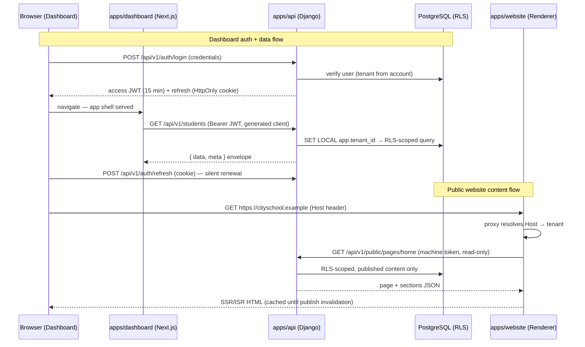

# Repository & Folder Structure

> **Agent Context**
> **Summary:** The as-built layout of the SchoolHub monorepo and the rules for where new code goes: a "where does this belong?" table, what may import what (and what enforces it), configuration and environment policy, the shared-code rule of three, the API-contract flow between backend and frontends, and naming conventions. The reasons behind each rule live in [`../decisions/`](../decisions/README.md).
> **Co-load with:** [`system-architecture.md`](system-architecture.md) · [`api-architecture.md`](api-architecture.md) · [`hosting-deployment.md`](hosting-deployment.md) · [`../decisions/README.md`](../decisions/README.md)

This document describes the repository **as built**. The original specification
recommended four repositories. That was replaced by one monorepo; see
[ADR-0002](../decisions/0002-single-monorepo.md).

## 1. Layout

```
schoolhub/
├── AGENTS.md  CLAUDE.md          # agent instructions
├── docs/                         # the specification — the requirement, not commentary
│   ├── 00-overview … 08-future/  #   see docs/AGENTS.md for the map
│   ├── decisions/                #   architecture decision records (why)
│   ├── context/context-map.md    #   task type → the 3–6 docs to load
│   ├── project-status.md         #   what exists / start here next session
│   └── deferred-work.md          #   what is deliberately not done yet, and why
├── apps/
│   ├── api/                      # Django 6.1 + DRF, uv-managed (not a pnpm package)
│   │   ├── config/               #   settings/{base,dev,prod,test}.py · api_v1.py · urls · celery · asgi/wsgi
│   │   ├── core/                 #   cross-cutting platform code — imports no app
│   │   │   ├── tenancy/ rbac/ audit/ api/     # RLS binding, permissions, audit log, envelope/pagination/exceptions
│   │   │   ├── files/ documents/ exports/     # signed uploads/downloads, generated documents, tabular exports
│   │   │   ├── jobs/ idempotency/ money/      # 202 + job resources, Idempotency-Key, money primitives
│   │   │   └── notifications/ common/         # notify() + delivery, shared helpers
│   │   ├── apps/<module>/        #   one Django app per module doc (layout: ADR-0010)
│   │   ├── tests/                #   repo-wide contract tests (RLS coverage, endpoint contracts, API contract)
│   │   ├── scripts/              #   generate-openapi.sh, …
│   │   └── openapi.yaml          #   GENERATED, committed (ADR-0005)
│   ├── dashboard/                # Next.js 16 admin app
│   │   ├── messages/{en,ur}.json #   every user-facing string
│   │   └── src/
│   │       ├── app/              #   routes only: (auth)/… unauthenticated, (app)/… authenticated
│   │       │   └── (app)/shell/  #   the app shell (header, sidebar, nav), ported from Metronic Demo1
│   │       ├── features/<module>/#   components + hooks per module
│   │       ├── services/         #   endpoints.ts · modules/<domain>/ · index.ts (Services) — ADR-0011
│   │       ├── lib/              #   auth, env, permissions, query-client (queryKeys), constants, host
│   │       ├── components/ hooks/ i18n/
│   │       └── proxy.ts          #   Next 16's rename of middleware: auth guard (routing only)
│   └── website/                  # Next.js 16 multi-tenant public renderer (read-only)
│       └── src/{app,components,lib,themes/<theme>/{chrome,sections}}/ proxy.ts
├── packages/
│   ├── ui/                       # shared primitives (ADR-0009), theme tokens, styles/metronic (vendored CSS)
│   ├── api-client/               # transport core (hand-written) + schema.d.ts (GENERATED)
│   ├── types/                    # shared envelope, pagination, auth, tenant, website types
│   └── config/                   # shared ESLint flat configs
├── e2e/                          # Playwright: dashboard, website (mocked) and live lanes
├── infra/                        # compose stack, postgres roles, terraform, runbooks
├── .github/workflows/            # api, frontend, repo-hygiene, e2e-live, infra-compose, infra-terraform
├── .githooks/                    # pre-commit, pre-push (ADR-0007)
└── .claude/                      # agent settings, hooks, skills
```

## 2. Where does new code go?

| You are adding | It goes in | Rule / record |
| -------------- | ---------- | ------------- |
| A backend resource (model + endpoints) | `apps/api/apps/<module>/` — model in `models.py`, the rest in `<resource>/{serializers,viewset,urls,filters,services}.py` + `tests/` | [ADR-0010](../decisions/0010-backend-module-layout.md) |
| Logic shared by two or more backend apps | `apps/api/core/<area>/` (never in one app for another to import) | [ADR-0013](../decisions/0013-cross-app-dependencies.md), §5 |
| A permission key | The module's `permissions.py` registration, from the module doc's §4 | [`auth-and-rbac.md`](auth-and-rbac.md) |
| A new tenant-owned table | `TenantOwnedModel` + `rls_operations(...)` in its first migration | [ADR-0003](../decisions/0003-tenant-isolation-rls.md) |
| A dashboard screen | A thin `src/app/(app)/<module>/page.tsx` rendering components from `src/features/<module>/` | this doc |
| A dashboard API call | `src/services/endpoints.ts` + `src/services/modules/<module>/<module>-service.ts`, registered in `Services` | [ADR-0011](../decisions/0011-dashboard-services-layer.md) |
| A query key | The `queryKeys` factory in `apps/dashboard/src/lib/query-client.ts` | [ADR-0014](../decisions/0014-no-hardcoded-values.md) |
| User-facing dashboard text | `apps/dashboard/messages/en.json` **and** `ur.json` | [ADR-0014](../decisions/0014-no-hardcoded-values.md) |
| A UI primitive | `packages/ui/src/components/`, ported from vendor source | [ADR-0009](../decisions/0009-ported-ui-primitives.md) |
| A component used by only one app | That app (`src/features/…` or `src/components/`) until a second app needs it | §5 |
| A shared TypeScript type | `packages/types/src/` | §5 |
| An environment variable | The runtime's typed env module, the matching `.env.example`, and `turbo.json`'s env list if it's needed at build time | §4 |
| A named constant (timeout, page size, limit) | `apps/dashboard/src/lib/constants.ts`, `core/api/pagination.py`, or a module-level `UPPER_SNAKE` name | [ADR-0014](../decisions/0014-no-hardcoded-values.md) |
| A frontend test | A sibling `__tests__/` folder next to the source | [ADR-0012](../decisions/0012-tests-in-dunder-tests.md) |
| A backend test | `apps/<module>/tests/` or `<resource>/tests/`; repo-wide contracts in `apps/api/tests/` | [`testing-strategy.md`](../07-quality/testing-strategy.md) |
| A browser journey | `e2e/tests/` — the `live` lane if it needs a real database | [`e2e/AGENTS.md`](../../e2e/AGENTS.md) |
| A decision between real alternatives | `docs/decisions/NNNN-*.md` | [ADR-0001](../decisions/0001-record-decisions.md) |

## 3. Dependency rules

| Rule | Enforced by |
| ---- | ----------- |
| Backend apps may import other apps' `models`; writes and business rules go through the owning app's `services`; no app imports another's `views`/`viewset`/`urls`/`reports`/`tasks` | review only (planned: import-linter) — [ADR-0013](../decisions/0013-cross-app-dependencies.md) |
| `core/` imports no app | review only (planned: import-linter) — [ADR-0013](../decisions/0013-cross-app-dependencies.md) |
| UI layers (`src/app`, `src/features`, `src/components`, `src/hooks`) never import `@schoolhub/api-client`; only the transport layer (`src/services/**`, `src/lib/**`) does | ESLint `no-restricted-imports` — [ADR-0011](../decisions/0011-dashboard-services-layer.md) |
| No `../` parent-relative imports; use the `@/` alias | ESLint `no-restricted-imports` in `apps/dashboard` and `apps/website` (`PARENT_RELATIVE` in `packages/config/eslint.boundaries.mjs`); tests exempt |
| Apps never import each other; packages never import apps | Workspace boundaries (neither is a dependency of the other), plus the `../` ban in the apps and the `INTO_APPS` ban in `packages/*` |
| Route files stay thin; feature code lives in `src/features/<module>/` | review only |

## 4. Configuration & Environment Management

- **12-factor:** all configuration comes from environment variables. Code has no environment
  conditionals beyond the Django settings-module selector (`config/settings/{dev,prod,test}.py`).
- **One typed owner per runtime** ([ADR-0014](../decisions/0014-no-hardcoded-values.md)):
  `apps/dashboard/src/lib/env.ts` and `apps/website/src/lib/env.ts` (zod-validated, fail at
  load), `e2e/src/env.ts`, and django-environ in `apps/api/config/settings/base.py`. Nothing
  else may read `process.env` or `os.environ`; the known bypasses are listed in ADR-0014 and
  scheduled for removal.
- **Public vs server:** build-time public values are `NEXT_PUBLIC_*` only. Secrets
  (`WEBSITE_MACHINE_TOKEN`, `REVALIDATE_WEBHOOK_SECRET`) stay server-side and must never be
  imported by a client component.
- Every variable is listed with a dummy value in a committed `.env.example`: the root one
  covers both frontends, and `apps/api`, `e2e` and `infra/compose` have their own. Real `.env`
  files are git-ignored. Secrets are never committed; gitleaks scans in CI
  (`repo-hygiene.yml`, `infra-compose.yml`).
- Runtime secrets in deployed environments come from the platform secret store
  ([`hosting-deployment.md`](hosting-deployment.md)).

## 5. Shared-Code Policy

- **Between backend and frontend, the only shared artefact is the API contract** (§6.1). No
  runtime code is shared.
- **Frontend sharing goes through `packages/*`**, with workspace versions. A component
  graduates to `packages/ui` only when a second app uses it.
- **Backend sharing goes through `core/`.**
- **Rule of three:** tolerate a second copy, and extract on the third. Beyond three copies
  is debt to record in [`../deferred-work.md`](../deferred-work.md), not a pattern to follow. The known cases
  today are `_fk` serializer helpers in six apps and the staff and student import/document
  pipelines.

## 6. Integration Between the Apps



### 6.1 Contract Artefacts

- `apps/api/scripts/generate-openapi.sh` emits **OpenAPI 3.1** from drf-spectacular into
  `apps/api/openapi.yaml`.
- `pnpm --filter @schoolhub/api-client generate` turns it into
  `packages/api-client/src/schema.d.ts`.
- Both are committed and change **in the same commit** as the backend change that caused
  them. CI regenerates each and fails on any diff (`api.yml`, `frontend.yml`); see
  [ADR-0005](../decisions/0005-generated-api-contract.md).
- **Versioning:** additive changes regenerate silently. Breaking changes need a `v2` path
  per [`api-architecture.md`](api-architecture.md) §2.1.

### 6.2 Other Integration Points

| Link | Mechanism |
| ---- | --------- |
| API → AI provider | Server-side only, through a `core/ai` gateway (planned; [`ai-architecture.md`](ai-architecture.md)) |
| API → notification providers | `core/notifications` adapters + Celery lanes ([`notifications.md`](notifications.md)) |
| API ↔ payment gateway | Redirect/intent + signed webhooks, idempotency-keyed |
| Renderer ← publish events | HMAC-signed webhook → on-demand ISR revalidation (`apps/website/src/app/api/revalidate/`) |
| Infra → all | Compose/Terraform provision databases, DNS and secrets; the apps consume them through env vars |

### 6.3 Future Mobile Applications

Mobile apps (Flutter, a future phase) plug into the **same** REST API and auth endpoints. They
use the same JWT flow, with refresh tokens in secure storage instead of cookies, a Dart client
generated from the same OpenAPI spec, and FCM push tokens registered through the existing
notification device endpoints. No backend rework is required; this is why the API is
versioned, cookie-optional and contract-first.

## 7. Naming Conventions

| Area | Convention |
| ---- | ---------- |
| Python | `snake_case` modules and functions, `PascalCase` classes, `UPPER_SNAKE` constants, `_leading_underscore` module-private. App names are plural where the domain is (`students`) and singular for concepts (`timetable`) |
| TypeScript files | `kebab-case.ts(x)`; `PascalCase` components; `use*` hooks |
| Permission keys | `module.resource.action`, declared in `permissions.py` |
| Notification template codes | `module.event-name`, declared in the emitting app's `notifications.py` |
| Tables | Plural `snake_case`, specified column by column in `docs/05-database/entities/` |
| API | `/api/v1/…`, plural kebab-case resources, colon-actions (`:publish`) |
| Branches | `feat/…`, `fix/…`, `chore/…`, `refactor/…` |
| Commits | Conventional Commits: `type(scope): subject` |
