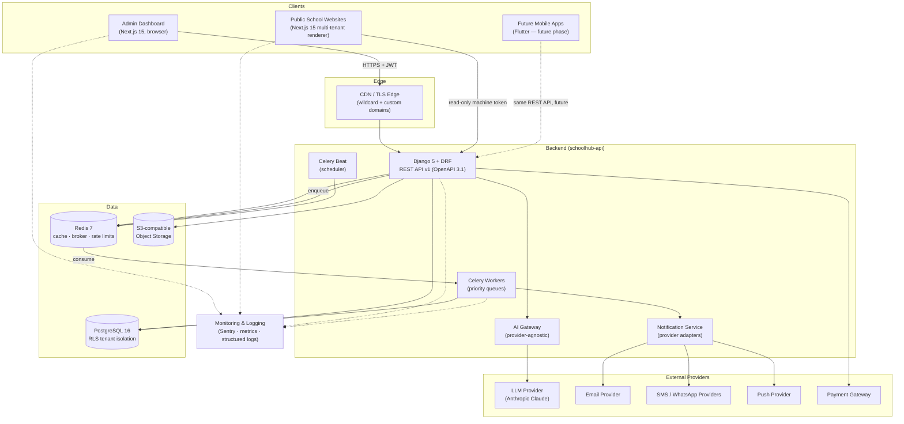

# System Architecture

> **Agent Context**
> **Summary:** The master architecture picture (scope §13). One Django/DRF API serves two Next.js frontends (admin dashboard, multi-tenant public school websites) on top of PostgreSQL 16 with Row-Level Security, Redis, Celery workers, S3-compatible object storage, and an internal AI gateway to the LLM provider. Each architecture concern below is summarized in a few lines and linked to its dedicated document.
> **Co-load with:** [`tech-stack.md`](tech-stack.md) · [`multi-tenancy.md`](multi-tenancy.md) · [`repo-structure.md`](repo-structure.md) · [`hosting-deployment.md`](hosting-deployment.md)

## 1. High-Level Component Diagram

Trust boundaries: browsers and tenant websites are untrusted; the API is the sole gatekeeper to data. The website renderer holds a read-only machine token and can never write. External providers are reached only from the backend — never from the browser.

## 2. Architecture Concerns

### 2.1 Application Architecture
A modular monolith (recommendation): one Django project with one app per functional module (students, fees, exams, …) plus a `core` layer for tenancy, RBAC, notifications, and the AI gateway. Layering is strict — views → services → ORM — so modules interact through service functions, not each other's models, keeping a later service extraction possible without a day-one microservice tax. See [`repo-structure.md`](repo-structure.md).

### 2.2 Frontend Architecture
Two Next.js 15 apps in one Turborepo monorepo: `dashboard` (authenticated SPA-style admin, TanStack Query over the generated API client) and `website` (multi-tenant public renderer, SSR/ISR). Shared `ui`, `types`, and `api-client` packages prevent drift. See [`repo-structure.md`](repo-structure.md) and [`website-builder.md`](website-builder.md).

### 2.3 Backend Architecture
Django 5 + DRF exposing versioned REST (`/api/v1`), documented via OpenAPI 3.1 (drf-spectacular). Conventions — envelope, errors, pagination, idempotency, webhooks, uploads — are locked in [`api-architecture.md`](api-architecture.md). Celery + Redis handle everything long-running.

### 2.4 Authentication & Authorization Architecture
JWT access (15 min) + rotating refresh tokens, MFA-ready login state machine, and a permission-key RBAC model (`module.resource.action`) with module-, feature-, and record-level checks — all beneath RLS tenant isolation. See [`auth-and-rbac.md`](auth-and-rbac.md).

### 2.5 AI Architecture
All AI features call an internal, provider-agnostic AI gateway inside the backend; the browser never talks to the LLM provider directly. The gateway enforces per-tenant token budgets, prompt templates, PII minimization, audit logging, and model fallback. See [`ai-architecture.md`](ai-architecture.md).

### 2.6 Notification Architecture
Modules emit domain events; the notification service maps events → templates → recipients per user preferences, and dispatches through provider adapters (email, SMS, push, in-app, WhatsApp) on prioritized Celery queues with delivery tracking and failover. See [`notifications.md`](notifications.md).

### 2.7 File-Storage Architecture
S3-compatible object storage with tenant-prefixed keys (`tenants/{tenant_id}/…`), presigned-URL direct uploads, server-side validation and AV scanning, and short-lived signed download URLs. Upload flow is defined in [`api-architecture.md`](api-architecture.md) §2.8.

### 2.8 Background-Job Architecture
Celery workers consume Redis-backed queues split into priority lanes (emergency → transactional → bulk, see [`notifications.md`](notifications.md) §6); Celery Beat drives schedules (report generation, fee reminders, retention jobs). Long API operations return `202` + a pollable `job` resource. Jobs run with the initiating user's permission context.

### 2.9 Caching Architecture
Redis 7 serves four roles: hot tenant configuration and permission sets (short TTL, invalidated on write), API rate-limit token buckets, Celery broker/result backend, and idempotency-key storage. HTTP/ISR caching for the public websites is handled at the Next.js/CDN layer ([`website-builder.md`](website-builder.md)).

### 2.10 Monitoring Architecture
Sentry for error tracking (frontend, backend, Celery); structured JSON logs with request IDs shipped to a log store; metrics + dashboards + alerting per the hosting tier chosen in [`hosting-deployment.md`](hosting-deployment.md). Every response carries `X-Request-ID` for cross-component correlation.

### 2.11 Deployment Architecture
Containerized services (API, workers, beat, two Next.js apps) deployed through GitHub Actions to dev/staging/prod, with managed PostgreSQL and Redis. Platform comparison, CI/CD pipeline, DNS/TLS automation, rollback, and DR are defined in [`hosting-deployment.md`](hosting-deployment.md).

### 2.12 Multi-Tenant Architecture
Shared schema + `tenant_id` + PostgreSQL RLS as the authoritative isolation layer, tenant resolution from JWT (dashboard) or domain (websites), tenant lifecycle from provisioning to certified deletion. See [`multi-tenancy.md`](multi-tenancy.md) and [`database-architecture.md`](database-architecture.md).

## 3. Request Paths at a Glance

| Path | Flow |
| ---- | ---- |
| Dashboard read/write | Browser → CDN → API (JWT, RBAC, RLS) → Postgres/Redis |
| Public page view | Browser → website renderer (ISR cache) → API (machine token, public content only) |
| Long operation | API `202` → Redis queue → Celery worker → job status endpoint / webhook |
| AI request | API → AI gateway (budget + audit) → LLM provider → response persisted + returned |
| Notification | Domain event → notification service → Celery lane → provider adapter → delivery status |
| Fee payment | Dashboard/website → API → payment gateway → webhook back → invoice settled (idempotent) |

## 4. Non-Goals (initial release)

- No microservices, no service mesh, no per-tenant infrastructure — the modular monolith plus RLS meets the isolation and scale targets at far lower operational cost (recommendation).
- No GraphQL gateway, no WebSockets (SSE only), and no mobile apps at launch — all three have documented, low-rework upgrade paths ([`api-architecture.md`](api-architecture.md), scope §20–§21).
