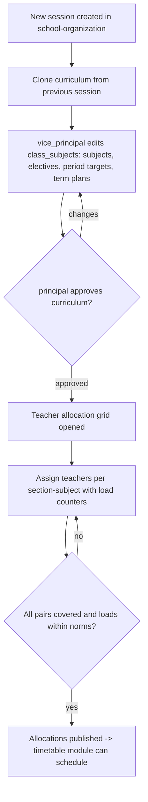
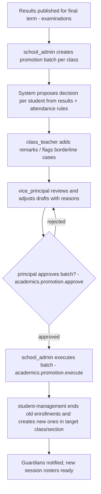

# Module: Academic Management

> **Agent Context** — Load this block first.
> **Summary:** Operates the academic engine on top of the structure owned by school-organization: curriculum mapping (which subjects each class studies per session), subject and teacher allocation to sections, term-wise academic planning, and the student promotion workflow (decide/approve here, execute in student-management). Primary users: principal, vice principal, school admin, teachers.
> **Co-load with:** `../02-architecture/auth-and-rbac.md` · `../05-database/entities/academics.md` · `school-organization.md` · `student-management.md`
> **Owns entities:** class_subjects, teacher_subject_allocations, student_promotions
> **Depends on modules:** school-organization (classes/sections/subjects/sessions), staff-management (teachers), student-management (enrollments), examinations (results for promotion), timetable (scheduling of allocations)

## 1. Purpose

Academic Management turns static structure into a running academic program. For each academic session it defines the **curriculum** — the class↔subject map with electives, weekly period targets, syllabus references, and term-wise plans; assigns **teachers** to (section, subject) pairs with load visibility; and runs the **promotion workflow** at session end — proposing, reviewing, approving, and handing over promotion/retention decisions for every enrolled student.

Classes, sections, subjects, and sessions are owned structurally by [`school-organization.md`](school-organization.md); students and enrollments by [`student-management.md`](student-management.md). This module owns the *relationships and decisions* between them, so that timetable, attendance, and examinations always know which teacher teaches which subject to which section, and what each class is supposed to cover when.

## 2. Business Objective

- Every section fully covered: 100% of curriculum (section, subject) pairs have an allocated teacher before the session starts — the gating metric for timetable generation.
- Transparent, defensible promotions: promotion decisions backed by result data and an approval trail, executed in bulk in minutes instead of days of manual register work.
- Balanced teaching loads (reduce burnout/attrition): allocation screens expose per-teacher weekly load against tenant-configured norms.
- Curriculum consistency across campuses of the same tenant, with per-campus flexibility where configured.

## 3. Target Users

| Role | How they use this module |
| ---- | ------------------------ |
| `principal` | Owns curriculum sign-off, approves promotions, monitors coverage/load dashboards |
| `vice_principal` | Drafts allocations, resolves load conflicts, prepares promotion proposals |
| `school_admin` | Maintains curriculum records, runs bulk allocation and promotion execution handoff |
| `teacher` | Views own allocations and syllabus/term plans; class teachers input promotion remarks |
| `class_teacher` | Provides per-student promotion inputs (remarks, borderline recommendations) |
| `exam_staff` | Consumes curriculum (exam subjects) and supplies result aggregates to promotion |
| `student` / `guardian` | Read-only view of class curriculum and (once executed) promotion outcome via parent-portal |

## 4. Permissions

Permissions follow the RBAC model in [`auth-and-rbac.md`](../02-architecture/auth-and-rbac.md). Permission keys use `<module>.<resource>.<action>`. Module-specific verb declared here: `execute` (promotion batches).

| Permission key | Description | Default roles |
| -------------- | ----------- | ------------- |
| `academics.curriculum.view` | View class↔subject curriculum & plans | all staff; `student`/`guardian` (own class subset) |
| `academics.curriculum.create` / `.update` / `.delete` | Maintain curriculum mappings, electives, period targets, term plans | `school_admin`, `principal`, `vice_principal` |
| `academics.curriculum.approve` | Sign off session curriculum before activation *(recommendation)* | `principal` |
| `academics.teacher-allocation.view` | View allocations (scope `own` for teachers) | all staff |
| `academics.teacher-allocation.create` / `.update` / `.delete` | Assign/reassign teachers to (section, subject) | `school_admin`, `vice_principal`, `principal` |
| `academics.promotion.view` | View promotion batches & decisions | `principal`, `vice_principal`, `school_admin`, `class_teacher` (own section) |
| `academics.promotion.create` / `.update` | Create batches, edit draft decisions | `school_admin`, `vice_principal` |
| `academics.promotion.approve` | Approve a promotion batch (approver ≠ preparer) | `principal`, `school_owner` |
| `academics.promotion.execute` | Execute approved batch (creates enrollments via student-management) | `school_admin` |
| `academics.curriculum.export` / `.import` | Bulk curriculum/allocation import & export | `school_admin`, `it_admin` |

## 5. Main Features

1. **Curriculum management** — per session, map each class to its subjects (`class_subjects`): core vs. elective, weekly period targets, syllabus document, term-wise plan (topics per term). Cloneable from the previous session.
2. **Subject allocation** — maintain which subjects are actually offered per class/campus per session, including elective pools and minimum/maximum elective counts per student *(recommendation: elective choice capture at enrollment)*.
3. **Teacher allocation** — assign teachers to (session, section, subject) with co-teacher support, load counters (allocated weekly periods vs. norm), qualification hints from staff-management, and conflict warnings.
4. **Academic planning** — term plans per class-subject (topics, sequence, planned assessment points) giving teachers and the principal a shared coverage view; feeds AI lesson planning.
5. **Student promotion workflow** — session-end batches per class: propose (auto-suggest from results + attendance thresholds), review with class-teacher input, approve (gated), then execute — handing enrollment transitions to student-management. Supports promoted / retained / promoted-on-trial / graduated outcomes.
6. **Coverage & load dashboards** — unallocated (section, subject) pairs, per-teacher load, curriculum completeness per campus.

## 6. Sub-features

- **Curriculum:** per-campus overrides of the class curriculum where tenant-enabled; syllabus file attachment per class-subject; change history via audit log; lock on session activation with controlled amendments.
- **Electives:** elective groups within a class ("choose 1 of 3"); student elective selections recorded against enrollment *(recommendation)*.
- **Teacher allocation:** bulk allocation grid (class × subject × section); copy-from-previous-session; substitute/temporary reallocation deferred to [`timetable.md`](timetable.md) (`teacher_substitutions`); reassignment mid-session preserves history (old allocation end-dated, not deleted).
- **Promotion:** rule template per tenant (pass criteria referencing grading scales in [`examinations.md`](examinations.md), attendance minimum); per-student override with mandatory reason; graduating class handled as `graduated` (no target class); retained students re-enroll in the same class next session; batch revert allowed before any downstream activity exists (audited).
- **Planning:** term-plan progress ticks by teachers (topic covered) enabling coverage reports *(recommendation)*.

## 7. Workflows

### 7.1 Session curriculum & allocation setup

### 7.2 Student promotion

Batch states: `draft → pending_approval → approved → executed` (plus `reverted` before downstream data exists). Approver must differ from preparer (RBAC §2.4). Execution is idempotent and runs as a background job with a per-student result report.

## 8. User Journeys

- **`vice_principal` (pre-session):** clones last year's curriculum → adds Computer Science to Grades 7–8 → opens the allocation grid → drags teachers onto sections, watching load counters → resolves two over-load warnings → publishes.
- **`principal`:** reviews the curriculum diff vs. last session → approves → at session end, opens the Grade 8 promotion batch, scans 12 borderline cases with class-teacher remarks and AI summaries → retains 2 with reasons → approves.
- **`class_teacher`:** receives the promotion-input task → enters remarks for 30 students → flags one student for retention discussion → later sees final outcomes.
- **`teacher`:** checks "My Allocations" → opens the Grade 6 Science term plan → ticks covered topics → uses the AI lesson-plan generator seeded from the plan.

## 9. Inputs

- Forms: curriculum editor (class-subject grid), elective-group editor, term-plan editor, teacher-allocation grid, promotion batch review screens.
- Bulk import: curriculum and allocations CSV/Excel (background jobs with row-level errors).
- Cross-module data in: result aggregates and grading outcomes (examinations), attendance percentages (attendance), teacher qualifications/load (staff-management, timetable), enrollments (student-management).
- Syllabus file uploads (two-step flow per [`api-architecture.md`](../02-architecture/api-architecture.md) §2.8).

## 10. Outputs

- `class_subjects` and `teacher_subject_allocations` records consumed by timetable (scheduling), attendance (subject-wise marking), examinations (exam subjects), and dashboards.
- Approved `student_promotions` batches handed to student-management for enrollment execution.
- Events emitted: `curriculum.updated`, `allocation.published`, `promotion.approved`, `promotion.executed` (webhooks per API doc §2.6).
- Exports: curriculum book (PDF), allocation matrix (Excel), promotion outcome report (PDF/CSV).

## 11. Validations

- `class_subjects` unique per (session, class, subject) — per campus where overrides are enabled; subjects/classes must be active tenant records.
- Weekly period targets ≥ 1; elective groups require ≥ 2 options; term plans must reference terms of the same session.
- Teacher allocation: teacher must be active teaching staff; duplicate (session, section, subject, teacher) rejected; load warnings at tenant-configured norm, hard cap optional; allocation to a section requires the subject to exist in that class's curriculum.
- Promotion: batch only for the active session with published final results (cross-check with examinations); one decision per enrolled student per batch; target class must be the next `level` (override with reason for skips *(recommendation)*); execution only from `approved`; approver ≠ preparer; re-execution attempts are no-ops (idempotent).
- Session lock: curriculum and allocations in closed sessions are read-only.

## 12. Notifications

| Event | Recipients | Channels | Template ref |
| ----- | ---------- | -------- | ------------ |
| Allocation assigned/changed | Affected teacher; department head | in-app, email | `academics.allocation-changed` |
| Curriculum approved for session | All teaching staff | in-app | `academics.curriculum-approved` |
| Promotion input requested | `class_teacher` of each section | in-app, email | `academics.promotion-input-request` |
| Promotion batch pending approval | `principal` | in-app, email | `academics.promotion-pending` |
| Promotion executed (per student outcome) | Guardians; student (if account) | email, SMS, in-app | `academics.promotion-outcome` |
| Coverage gap (unallocated pairs at T-7 before session start) | `vice_principal`, `school_admin` | in-app | `academics.coverage-gap` |

Channels and delivery behavior follow [`notifications.md`](../02-architecture/notifications.md).

## 13. Reports

- **Curriculum coverage:** class × subject matrix per session/campus, with syllabus/plan completeness (export PDF/Excel).
- **Teacher load report:** weekly periods per teacher vs. norm, by department/campus (visibility: `principal`, `vice_principal`, `hr_staff`).
- **Allocation matrix:** section × subject → teacher, gaps highlighted.
- **Promotion outcome report:** per class — promoted/retained/on-trial/graduated counts, override reasons, approver trail (visibility: `principal`, `school_owner`, `school_admin`).
- **Syllabus progress:** topic coverage per class-subject per term *(recommendation, depends on progress ticks)*.

## 14. AI Capabilities

Cross-referenced to [`ai-features.md`](../04-ai/ai-features.md). All generation is draft-only; a named human approves before anything reaches students or records.

- `AI-ACA-01` **Lesson & term-plan generation** — drafts lesson plans and term topic sequences from the class-subject curriculum, session calendar, and grading scheme; teacher edits/approves. Also seeds assignment and quiz drafts (delivery of quizzes/questions lives in examinations, `AI-EXM-*`).
- `AI-ACA-02` **Promotion recommendations** — explains each auto-proposed promotion decision (results, attendance, trend) and flags borderline students with reasoning for the review meeting; never auto-approves.
- `AI-ACA-03` **Teacher allocation recommendations** — proposes an allocation plan optimizing qualification match, load balance, and continuity with prior years; presented as a diff the `vice_principal` can apply per row.
- `AI-ACA-04` **Academic performance insights** — natural-language Q&A and narrative insights over class/subject performance ("which Grade 7 subjects declined vs. last term?"), permission-scoped to the caller.

## 15. Database Entities

Full column-level specs live in [`../05-database/entities/academics.md`](../05-database/entities/academics.md). All tenant-scoped under RLS.

| Table | Purpose |
| ----- | ------- |
| `class_subjects` | Session-scoped class↔subject curriculum with electives, period targets, term plans |
| `teacher_subject_allocations` | Teacher assignment to (session, section, subject) with load data |
| `student_promotions` | Per-student promotion decisions in approvable batches |

Referenced (owned elsewhere): `classes`, `sections`, `subjects`, `academic_sessions`, `terms` (school-organization); `student_enrollments`, `students` (student-management); `staff` (staff-management).

## 16. API Requirements

Conventions per [`api-architecture.md`](../02-architecture/api-architecture.md).

> **Implementation notes** (as shipped — read alongside the contract below).
>
> - **`class_subjects` is owned by this module's API but its model lives in
>   `apps/school_organization`.** That app shipped the table first and its
>   session-clone wizard writes it directly; moving a model between apps is
>   migration risk with no runtime payoff, since the table name is unchanged.
>   The endpoint previously sat there too, borrowing `school.subject.*` keys
>   because §4 declared none for it — it now serves from `apps/academics` under
>   `academics.curriculum.*` and `module.academics`, which is what
>   [`school-organization.md`](school-organization.md) §6 ("curriculum mapping
>   to classes lives in academics.md") always intended. Creation delegates to
>   `school_organization.services.map_subject_to_class`, so the API, the wizard
>   and the importer share one set of rules.
> - **`:clone` is synchronous, not a background job.** A clone is one
>   `bulk_create` over a single session's rows — hundreds, not thousands. It
>   honours `Idempotency-Key`, and the service skips rows the target already
>   has, so it converges on a retry either way.
> - **`:execute` returns `202` + a job**, as the contract below always said.
>   It shipped synchronous on the argument that a class-sized batch completes
>   inline; what that missed is that `execute_batch` commits each student
>   separately on purpose, and `ATOMIC_REQUESTS` turns each of those commits
>   into a savepoint — so an inline run held every row lock it took for the
>   whole request and showed the caller nothing until it finished. The work is
>   `apps.academics.tasks.execute_promotion_batch_task`; whether the batch is
>   executable at all is still decided synchronously, so a draft batch is a
>   `409` rather than a job that fails out of band. `Idempotency-Key` replays
>   the job id, and re-execution stays a per-row no-op beyond the 24h window.
> - **Not built yet:** `POST /curriculum-imports`.
> - **The promotion proposal is level-based only.** §7.2 has it read published
>   final results and attendance percentages; neither module exists yet, so
>   `decision_basis` records `results_available: false` and
>   `attendance_available: false` rather than implying a judgement that was
>   never made. Reviewers adjusting drafts is the step the workflow gates on, so
>   the flow is usable — but the rule engine is a genuine gap, not a shortcut.
> - **Two §12 notifications are deferred**, and say so in
>   `apps/academics/notifications.py`: `promotion-input-request` needs a
>   task/inbox surface for class teachers, and `coverage-gap` is a scheduled T-7
>   sweep that belongs with the coverage report.

- `GET/POST /api/v1/class-subjects` · `GET/PATCH/DELETE /api/v1/class-subjects/{id}` — filters: `academic_session_id`, `class_id`, `campus_id`, `subject_id`, `is_elective`.
- `POST /api/v1/class-subjects:clone` — clone curriculum between sessions (background job).
- `GET/POST /api/v1/teacher-subject-allocations` · `PATCH/DELETE /api/v1/teacher-subject-allocations/{id}` — filters: `academic_session_id`, `section_id`, `subject_id`, `staff_id`; `GET /api/v1/teacher-subject-allocations/load-summary` (per-teacher aggregates).
- `GET/POST /api/v1/student-promotions` (batches) · `GET /api/v1/student-promotions/{id}` (batch with per-student decisions) · `PATCH /api/v1/student-promotions/{id}/decisions/{student_id}`.
- `POST /api/v1/student-promotions/{id}:submit` · `:approve` · `:reject` · `:execute` (colon-actions; execute returns `202` + job, `Idempotency-Key` supported) · `:revert`.
- `POST /api/v1/curriculum-imports` → `202` + job.

## 17. Integration Requirements

- **Internal:** background jobs (clone, batch execution, imports), file storage (syllabus documents), notification service, audit log, AI gateway (`AI-ACA-*`), feature flags (elective support, per-campus curriculum are plan-gated).
- **External:** none required; curriculum-standard imports (e.g. national curriculum templates) are a future marketplace integration per scope §21.

## 18. Dependencies on Other Modules

| Module | Direction | What is shared |
| ------ | --------- | -------------- |
| school-organization | inbound | Sessions, terms, classes (level ladder), sections, subjects — the structure this module maps |
| staff-management | inbound | Teacher identity, qualifications, employment status for allocation |
| student-management | both | Enrollments consumed for promotion proposals; approved batches executed there |
| examinations | both | Result aggregates & grading scales feed promotion rules; curriculum defines exam subjects |
| attendance | inbound | Attendance percentages feed promotion criteria; allocations define subject-wise marking rights |
| timetable | outbound | Published allocations are the scheduling input; period targets constrain slot counts |
| parent-portal / communication | outbound | Curriculum views and promotion outcome notifications |

## 19. Open Questions / Recommendations

- *(recommendation)* Ship a default promotion rule template (pass all core subjects + ≥ 75% attendance) that tenants adjust; never hard-code pass criteria.
- *(recommendation)* Curriculum sign-off (`academics.curriculum.approve`) is proposed, not client-confirmed — small schools may prefer to skip the gate via workflow configuration.
- **Open:** are per-campus curriculum differences a real requirement for target schools, or is tenant-wide curriculum sufficient? Modeled as optional override, default off.
- **Open:** where student elective choices are stored — proposed as a small extension on `student_enrollments` (JSONB `elective_subject_ids`) rather than a new table; to be settled in the consistency pass.
