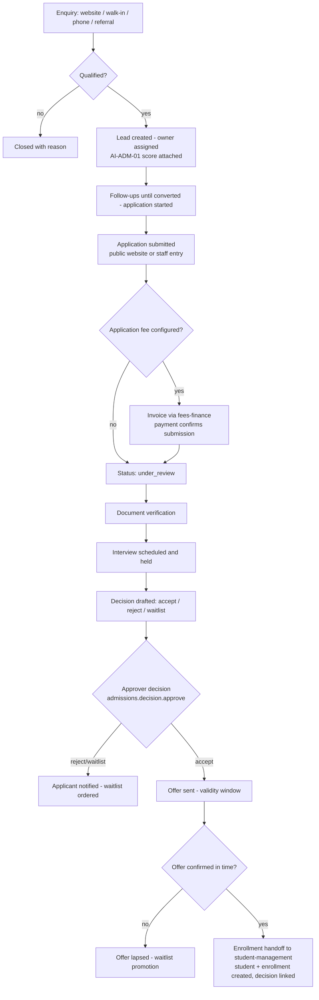
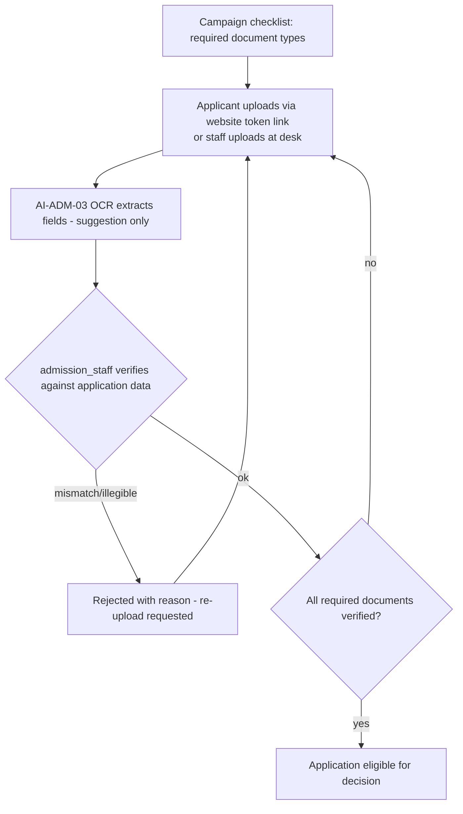

# Module: Admissions & Lead Management

> **Agent Context** — Load this block first.
> **Summary:** Full admissions funnel for a tenant school: campaigns, enquiries, lead management with AI scoring, application forms (submitted publicly via the school website or entered at the front desk), review, interview scheduling, document verification, an approval workflow for admission decisions, and enrollment handoff to student-management. Used by `admission_staff` and `reception` daily, with `principal`/`school_admin` as decision approvers. Business value: higher enquiry-to-enrollment conversion and zero lost applicants.
> **Co-load with:** `../02-architecture/auth-and-rbac.md` · `../05-database/entities/admissions.md` · `website-cms.md` · `student-management.md`
> **Owns entities:** `admission_campaigns`, `enquiries`, `leads`, `applications`, `application_documents`, `interviews`, `admission_decisions`
> **Depends on modules:** website-cms, student-management, academics, fees-finance, communication

## 1. Purpose

The Admissions module manages the pipeline from first contact to enrolled student. Schools run admission campaigns per academic session; enquiries arrive from the public website, walk-ins, phone calls, and referrals; promising enquiries become tracked leads; leads submit applications (online through the tenant's public website or captured by staff); staff review applications, verify uploaded documents, schedule interviews, and record decisions through an approval workflow. Accepted applicants are handed off to student-management for enrollment, closing the loop with full funnel analytics.

## 2. Business Objective

- Convert more enquiries: every contact has an owner, a stage, and a next follow-up date — no lead is lost to a notebook or inbox.
- Shorten decision time: applications, documents, interview results, and approvals live in one queue instead of paper files.
- Measure marketing: per-campaign funnel metrics show which campaigns and sources pay off; AI lead scoring focuses staff effort where conversion likelihood is highest.

## 3. Target Users

| Role | How they use this module |
| ---- | ------------------------ |
| `admission_staff` | Owns the funnel: leads, applications, document verification, interviews, decision drafting, enrollment handoff |
| `reception` | Captures walk-in/phone enquiries; first-touch follow-ups |
| `school_admin` | Configures campaigns and form fields; monitors funnel dashboards; approver where configured |
| `principal` | Interviews applicants; approves admission decisions |
| `school_owner` | Campaign performance and seat-fill reports |
| Applicant guardians (no account) | Submit and track applications via the public website (token link — not a tenant user account) |

## 4. Permissions

Permissions follow the RBAC model in [`auth-and-rbac.md`](../02-architecture/auth-and-rbac.md). Permission keys use `<module>.<resource>.<action>` in the `admissions.*` namespace; this module declares the module-specific verbs `convert` (lead → application) and `verify` (documents).

| Permission key | Description | Default roles |
| -------------- | ----------- | ------------- |
| `admissions.campaign.create` / `.update` / `.publish` | Manage campaigns; publish to the public website | `school_admin`, `admission_staff` |
| `admissions.enquiry.create` / `.view` / `.update` | Capture and work enquiries | `reception`, `admission_staff` |
| `admissions.lead.create` / `.view` / `.update` | Manage leads, stages, follow-ups | `admission_staff`, `reception` (view/create) |
| `admissions.lead.convert` | Convert a lead to an application | `admission_staff` |
| `admissions.application.create` / `.view` / `.update` | Enter/manage applications (public submissions arrive unauthenticated via the website channel) | `admission_staff` |
| `admissions.application-document.verify` | Verify or reject applicant documents | `admission_staff` |
| `admissions.interview.create` / `.update` | Schedule and record interviews | `admission_staff` |
| `admissions.decision.create` | Draft an admission decision | `admission_staff` |
| `admissions.decision.approve` | Approve accept/reject/waitlist decisions | `principal`, `school_admin` (per tenant chain) |
| `admissions.report.view` / `.export` | Funnel and campaign reports | `admission_staff`, `school_admin`, `school_owner`, `principal` |

## 5. Main Features

1. **Admission campaigns** — per session/campus with dates, target classes, seat targets, optional application fee, and website publishing.
2. **Enquiry management** — multi-source capture (website form, walk-in, phone, referral, event) with owner assignment and status tracking.
3. **Lead management** — enquiries promoted to leads with stage pipeline, follow-up scheduling, activity notes, and AI lead scoring (`AI-ADM-01`).
4. **Applicant management & application forms** — configurable application form per campaign; public submission through the school website (see [`website-cms.md`](website-cms.md)) or staff entry; application-fee invoicing via fees-finance where configured.
5. **Application review** — review queue with statuses, completeness checks, and reviewer notes.
6. **Interview scheduling** — slots, interviewer assignment, reschedule/no-show handling, scoring and recommendations.
7. **Document verification** — required-document checklist per campaign; upload, verify/reject with reasons; OCR-assisted extraction (`AI-ADM-03`).
8. **Admission approval workflow** — drafted decisions (accept/reject/waitlist) approved by the configured authority; offer validity windows; waitlist ordering.
9. **Enrollment handoff** — accepted + offer-confirmed applicants pushed to student-management, which creates the `students` record and enrollment; the admission record links back to the created student.

## 6. Sub-features

- **Campaigns:** clone from a previous session; seat-fill progress vs. target; UTM/source tagging on website enquiries (recommendation).
- **Leads:** duplicate detection by phone/email; lost-reason taxonomy; ownership reassignment; bulk CSV import from prior systems.
- **Applications:** save-as-draft with resumable token link; per-tenant application numbering; withdrawal on request; public status-tracking page via token.
- **Interviews:** calendar view; automated reminders; single accountable interviewer recorded, panel noted in remarks.
- **Decisions:** offer-expiry lapse with waitlist promotion; decision letters generated via the documents module (recommendation).

## 7. Workflows

### 7.1 Funnel: enquiry to enrollment

Public submissions are unauthenticated but tenant-resolved by domain, rate-limited, CAPTCHA-protected, and idempotent via `Idempotency-Key` (api-architecture §2.5). The decision approver cannot be the drafter (segregation of duties).

### 7.2 Document verification

## 8. User Journeys

- **Admission staff:** works the lead queue sorted by AI score and follow-up date → logs call outcomes → converts a warm lead to an application → verifies an uploaded birth certificate against OCR-extracted fields → schedules interviews → drafts an accept decision for the principal.
- **Reception:** captures a walk-in enquiry with the child's target class in under a minute → hands the parent a link/QR to the online application.
- **Principal:** reviews the decision queue with interview scores and document status → approves four accepts, waitlists one with a comment.
- **Applicant guardian (public):** opens the school website's admissions page → completes the form, uploads documents, pays the fee online → tracks status via the tokenized link → confirms the offer → receives enrollment instructions.

## 9. Inputs

- Campaign configuration (dates, classes, seats, fee, form fields, document checklist).
- Enquiry forms (staff-entered and public website); lead notes and follow-up schedules; CSV lead imports.
- Application submissions (public or staff), document uploads (presigned per api-architecture §2.8), interview scores/remarks, decision drafts and approvals.

## 10. Outputs

- Funnel records with full status history; verified document sets; interview results.
- Offers and decision notifications; enrollment handoff to student-management (`students` + `student_enrollments` creation is owned there), linked back from `admission_decisions`.
- Events `admission.application.submitted`, `admission.decision.made`, `admission.enrolled`; funnel report exports.

## 11. Validations

- Campaign dates within the target `academic_sessions` window; applications accepted only while the campaign is open (late exceptions by permission, audited).
- Duplicate protection: same applicant (name + DOB + guardian phone) flagged per campaign; duplicate enquiry merge by phone/email.
- Application completeness (required fields + verified required documents) and application-fee payment (where configured) before a decision can be drafted.
- Decision drafter ≠ approver; one active decision per application; offer confirmation only within the validity window; accepts beyond the seat target require a warned, permissioned override (recommendation).
- Public endpoints: tenant resolved from domain, rate-limited, CAPTCHA, `Idempotency-Key` required on submission.

## 12. Notifications

| Event | Recipients | Channels | Template ref |
| ----- | ---------- | -------- | ------------ |
| Enquiry received (website) | assigned `admission_staff`/`reception` | in-app, email | `admissions.enquiry-received` |
| Follow-up due | lead owner | in-app, push | `admissions.followup-due` |
| Application submitted / fee paid | applicant contact; `admission_staff` | email, SMS | `admissions.application-submitted` |
| Document rejected — re-upload needed | applicant contact | email, SMS | `admissions.document-rejected` |
| Interview scheduled / reminder | applicant contact; interviewer | email, SMS, in-app | `admissions.interview-scheduled` |
| Decision pending approval | approver | in-app, email | `admissions.decision-pending` |
| Decision outcome (offer/reject/waitlist) and offer-expiry reminders (T-3, T-1) | applicant contact | email, SMS | `admissions.decision-outcome` |

Channels and delivery behavior follow [`notifications.md`](../02-architecture/notifications.md). Applicant contacts are external recipients (email/phone on the application), not tenant user accounts.

## 13. Reports

Filters: campaign, session, campus, class, source, stage, date range; exports CSV/XLSX/PDF; visibility per RBAC.

1. **Funnel report** — enquiry → lead → application → interviewed → accepted → enrolled, with stage conversion rates.
2. **Campaign performance** — per campaign/source: volumes, conversion, seat fill vs. target, application-fee income (via fees-finance).
3. **Lead pipeline** — by owner, stage, score band, overdue follow-ups.
4. **Application status register** — document/interview/decision state per application; **interview schedule & outcomes** per interviewer and date.
5. **Waitlist report** — ordered waitlist per class with offer-lapse history.

## 14. AI Capabilities

Cross-referenced to [`ai-features.md`](../04-ai/ai-features.md). All AI outputs are advisory; admission decisions always require human approval.

- **`AI-ADM-01` Admission lead scoring** — conversion-likelihood score per lead from source, engagement (response times, follow-up outcomes), campaign, and historical cohort patterns; refreshed on each interaction; score factors shown for transparency. Never auto-rejects a lead.
- **`AI-ADM-02` AI admission assistant** — assistant for applicants on the public website (campaign FAQs, requirements, status guidance from the tokenized application) and for staff (drafting follow-up messages, summarizing an application file before interview). Public assistant is scoped to published campaign content only.
- **`AI-ADM-03` OCR / document extraction** — extracts fields (name, DOB, prior school, grades) from uploaded documents into `application_documents.extracted_data` and diffs them against form data; verification remains a human action.
- **`AI-ADM-04` Enrollment demand forecasting** — per-class applicant demand and seat-fill projection from funnel velocity (recommendation).

## 15. Database Entities

All tables tenant-scoped with the implicit audit/soft-delete columns; full column specs in [`../05-database/entities/admissions.md`](../05-database/entities/admissions.md).

| Table | Purpose |
| ----- | ------- |
| `admission_campaigns` | Campaign definitions per session/campus with seats and fee |
| `enquiries` | Raw multi-source enquiries |
| `leads` | Qualified prospects with stage, owner, and AI score |
| `applications` | Application records with configurable form data and status |
| `application_documents` | Uploaded documents with verification state and OCR extraction |
| `interviews` | Interview slots, scores, and recommendations |
| `admission_decisions` | Approved decisions, offers, waitlist, and enrollment linkage |

Referenced (owned elsewhere, never redefined here): `academic_sessions`, `classes`, `campuses`, `student_enrollments` ([`academics.md`](../05-database/entities/academics.md)); `students` ([`people.md`](../05-database/entities/people.md)); `fee_invoices` ([`finance.md`](../05-database/entities/finance.md)); `files`, `users` ([`tenancy.md`](../05-database/entities/tenancy.md)).

## 16. API Requirements

Conventions per [`api-architecture.md`](../02-architecture/api-architecture.md).

- `GET/POST/PATCH /api/v1/admission-campaigns` · `POST /api/v1/admission-campaigns/{id}:publish`
- `GET/POST/PATCH /api/v1/enquiries?source=&status=` · `POST /api/v1/enquiries/{id}:convert-to-lead`
- `GET/POST/PATCH /api/v1/leads?stage=&owner=&score__gte=` · `POST /api/v1/leads/{id}:convert` · `POST /api/v1/leads:import` (202 + job)
- `GET/POST/PATCH /api/v1/applications?campaign=&status=` · `POST /api/v1/applications/{id}:submit` · `POST /api/v1/applications/{id}:withdraw`
- `GET/POST /api/v1/application-documents?application=` · `POST /api/v1/application-documents/{id}:verify` / `:reject`
- `GET/POST/PATCH /api/v1/interviews?date=&interviewer=` · `POST /api/v1/interviews/{id}:record-result`
- `POST /api/v1/admission-decisions` · `POST /api/v1/admission-decisions/{id}:approve` · `POST /api/v1/admission-decisions/{id}:enroll` — triggers student-management handoff
- **Public (unauthenticated, domain-resolved tenant, rate-limited, CAPTCHA):** `GET /api/v1/public/admission-campaigns` · `POST /api/v1/public/enquiries` · `POST /api/v1/public/applications` (`Idempotency-Key` required) · `GET /api/v1/public/applications/{token}` (status tracking)

## 17. Integration Requirements

- **website-cms** — renders the admissions page, campaign listings, and application form on the tenant's public site; sees only published campaign content through the website's read-only machine token (api-architecture §2.2).
- **fees-finance** — application-fee invoicing and payment confirmation (gateway via integrations layer); **student-management** — enrollment handoff under the acting user's permission context.
- **communication** — all applicant/staff notifications per [`notifications.md`](../02-architecture/notifications.md), including SMS/email to external applicant contacts; **object storage** — presigned, tenant-prefixed, AV-scanned document uploads.

## 18. Dependencies on Other Modules

| Module | Direction | What is shared |
| ------ | --------- | -------------- |
| website-cms | inbound | public form submissions, enquiry capture, campaign display |
| academics | inbound | `academic_sessions`, `classes`, `campuses` for targeting |
| fees-finance | bidirectional | application-fee invoices out; payment confirmation in |
| student-management | outbound | accepted applicants → `students` + enrollment creation |
| communication | outbound | applicant/staff notifications |
| documents / reporting-analytics | outbound | offer-letter generation (recommendation); funnel KPIs for dashboards |

## 19. Open Questions / Recommendations

- **Applicant portal accounts** vs. tokenized status links: tokenized links recommended for launch (no account burden); confirm with client.
- **Seat overbooking policy** (hard block vs. warned override) needs client confirmation; warned override recommended.
- **Entrance tests** beyond interviews are not in the scope list; if needed, model as an interview mode in a later phase.
- Lead-source attribution depth (UTM capture, marketing ROI) and sibling-priority/staff-ward rules are recommendations pending client confirmation; the latter as decision-support flags, not automated rules.
