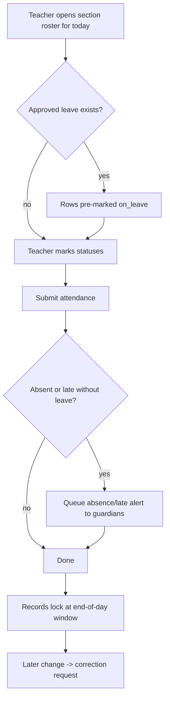
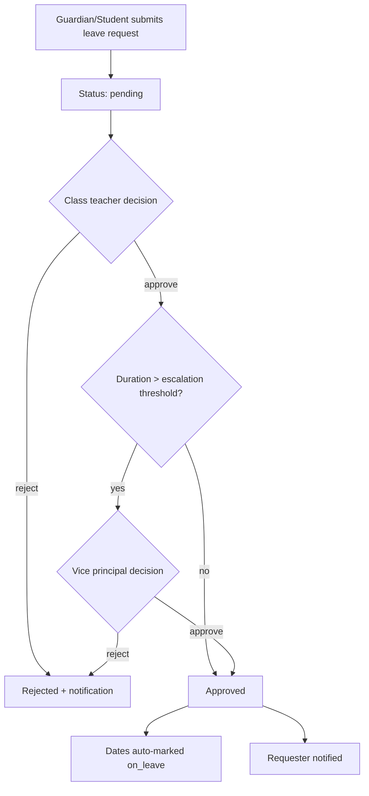

# Module: Attendance Management

> **Agent Context** — Load this block first.
> **Summary:** Daily and period-wise attendance for students, teachers, and all staff, including late-arrival/early-departure capture, post-hoc corrections with approval, the student leave request/approval flow, attendance reporting, and automatic parent absence alerts. Reduces manual registers to a two-minute daily task per section and gives leadership real-time visibility.
> **Co-load with:** `../02-architecture/auth-and-rbac.md` · `../05-database/entities/attendance.md` · `./hr-leave.md` · `./student-management.md`
> **Owns entities:** student_attendance, staff_attendance, attendance_corrections, leave_types, leave_policies, leave_balances, leave_requests, leave_approvals
> **Depends on modules:** student-management, staff-management, school-organization, timetable, hr-leave, communication

## 1. Purpose

Records who is present, absent, late, or on leave — for students (per day, optionally per period) and for teachers/staff (per day with check-in/check-out times). It also owns the correction workflow (fixing a wrongly marked record requires an approval) and the **student** leave request/approval flow. Staff leave *policy* detail (quotas, balances, payroll integration) is specified in [`hr-leave.md`](hr-leave.md); the underlying leave tables are shared and defined in this module's entity doc.

The module feeds parent notifications (absence alerts), the timetable module (substitutions triggered by absent teachers), payroll (staff attendance/leave inputs), and reporting/AI (anomaly and at-risk detection).

## 2. Business Objective

- Cut daily attendance capture to under 2 minutes per section and eliminate paper registers.
- Notify guardians of unexplained absences the same morning, improving safeguarding and reducing front-desk call volume.
- Provide auditable, correction-controlled attendance data trusted for report cards, exams eligibility, payroll, and compliance reporting.

## 3. Target Users

| Role | How they use this module |
| ---- | ------------------------ |
| `teacher` | Marks student attendance for assigned sections/periods; views own staff attendance |
| `class_teacher` | Marks homeroom attendance, requests corrections, first-level approver for student leave |
| `principal` / `vice_principal` | Approves corrections and student leave escalations; oversight dashboards |
| `school_admin` | Configures leave types/policies, marks staff attendance, manages defaults |
| `hr_staff` | Records staff attendance, late arrivals, early departures; manages staff leave data (detail in hr-leave) |
| `student` | Views own attendance; submits own leave requests (where tenant allows) |
| `guardian` | Views children's attendance; submits leave requests on a child's behalf; receives absence alerts |

## 4. Permissions

Permissions follow the RBAC model in [`auth-and-rbac.md`](../02-architecture/auth-and-rbac.md). Permission keys use `<module>.<resource>.<action>`. Module-specific verb declared here: `mark`.

| Permission key | Description | Default roles |
| -------------- | ----------- | ------------- |
| `attendance.student-attendance.view` | View student attendance (record-scoped: `own`, `assigned`, `all`) | `teacher`, `class_teacher`, `principal`, `vice_principal`, `school_admin`, `student` (own), `guardian` (own children) |
| `attendance.student-attendance.mark` | Mark/edit same-day student attendance | `teacher`, `class_teacher` |
| `attendance.staff-attendance.view` | View staff attendance (own for all staff; `all` for admin roles) | `hr_staff`, `school_admin`, `principal`; every staff role (own) |
| `attendance.staff-attendance.mark` | Record staff check-in/out, late arrival, early departure | `hr_staff`, `school_admin` |
| `attendance.correction.create` | Request a correction to a locked attendance record | `teacher`, `class_teacher`, `hr_staff` |
| `attendance.correction.approve` | Approve/reject correction requests | `principal`, `vice_principal`, `school_admin` |
| `attendance.leave-request.create` | Submit a student leave request | `student` (own), `guardian` (own children) |
| `attendance.leave-request.view` | View leave requests (scoped) | requesters (own), `class_teacher` (assigned), `principal`, `vice_principal`, `school_admin` |
| `attendance.leave-request.approve` | Approve/reject student leave | `class_teacher`, `vice_principal`, `principal` |
| `attendance.report.view` / `attendance.report.export` | Run and export attendance reports | `principal`, `vice_principal`, `school_admin`, `hr_staff`; `class_teacher` (assigned) |

Staff leave approval uses `hr.leave-request.approve` and is specified in [`hr-leave.md`](hr-leave.md). Approvers cannot approve requests they initiated (segregation of duties per RBAC doc §2.4).

## 5. Main Features

1. **Student attendance marking** — per section per day (default) or per period (tenant-configurable), statuses: present, absent, late, half-day, excused, on-leave. Bulk "all present" then exceptions.
2. **Teacher & staff attendance** — daily status plus check-in/check-out times; teachers are staff, so one mechanism covers both.
3. **Late arrival & early departure** — captured as times against the tenant's configured school-day window; minutes late/early computed and reportable.
4. **Student leave requests & approvals** — guardian/student submits with reason and optional attachment; configurable approval chain (default: class teacher, escalation to vice principal for long leaves). Approved leave auto-marks the dates as `on_leave`.
5. **Attendance corrections with approval** — past records are locked after a tenant-configurable window (default: end of day); changes go through a correction request reviewed by an approver, preserving before/after values.
6. **Attendance reports** — registers, summaries, defaulter lists, staff punctuality (§13).
7. **Parent notifications** — automatic absence alerts and late-arrival notices per tenant preference (§12).

## 6. Sub-features

- **Marking:** roster auto-loaded from `student_enrollments`; pre-filled from approved leave; duplicate-mark protection; offline-tolerant re-submission (idempotent per student+date+period).
- **Late/early:** grace-period minutes per tenant; repeated-lateness thresholds trigger reports and (optionally) guardian notices.
- **Student leave:** leave types configured per tenant (`applies_to = student|both`); attachment (e.g. medical note) required per leave type; cancellation allowed until start date; overlapping-request rejection.
- **Corrections:** reason mandatory; approver sees before/after diff; approved corrections update the record and keep the correction row as audit trail; all correction traffic also lands in `audit_logs`.
- **Reports/exports:** CSV/Excel/PDF; scheduled monthly register export (background job). The `source` field reserves biometric/RFID ingestion (scope §21) without schema change.

## 7. Workflows

### 7.1 Daily student attendance & absence alert

Steps: teacher (actor) loads roster → marks → submits; system fans out guardian alerts via communication module; records lock after the tenant window; subsequent changes require the correction flow (7.2 gate: `attendance.correction.approve`).

### 7.2 Student leave request

Approval chain is tenant-configurable (multi-tenancy doc §5); each step writes a `leave_approvals` row. The correction flow is analogous: requester → single approver → applied/rejected.

## 8. User Journeys

- **Teacher:** first period each day, opens "My Sections", taps through exceptions, submits in under two minutes; sees a confirmation of alerts queued.
- **Guardian:** receives an 09:30 absence alert; if the child is sick, submits a leave request with a note from the portal; sees approval and the calendar update.
- **Class teacher:** reviews pending leave requests each morning; approves routine ones; a two-week request escalates automatically to the vice principal.
- **HR staff:** records staff check-ins (or reviews self check-ins), flags late arrivals, and exports the monthly punctuality report for payroll (hr-leave/payroll integration).
- **Principal:** watches the attendance dashboard — today's absence rate per class, chronic absentees, staff punctuality — and reviews AI anomaly flags (§14).

## 9. Inputs

- Marking form / bulk grid per section (statuses, times, remarks).
- Staff check-in/out entries (manual now; device feed later).
- Leave request form: leave type, date range, part-day flag, reason, optional file (via platform file upload flow).
- Correction request form: target record, new values, reason.
- CSV import of historical attendance during tenant onboarding (`attendance.student-attendance.import` granted to `it_admin` during migration — recommendation).

## 10. Outputs

- Attendance records (student & staff), correction audit trail, leave request/approval records.
- Guardian notifications (§12); webhook events `attendance.absent-marked`, `leave.approved` (recommendation).
- Report exports (CSV/Excel/PDF); attendance summaries consumed by report cards (examinations module) and payroll (hr-leave).

## 11. Validations

- One attendance row per student per date (per period when period mode is on); enforced by unique constraints.
- Marking date cannot be in the future; cannot mark on tenant-configured holidays/weekends (academic calendar from school-organization).
- Marker must hold `assigned` scope for the section (teacher) unless `all`-scoped.
- Leave: `start_date ≤ end_date`; no overlap with an existing approved/pending request for the same person; attachment required if the leave type demands it; requester must be the student or a linked guardian.
- Corrections: only against locked records; new value must differ; approver ≠ requester.
- Staff check-out must be after check-in; late/early minutes computed server-side, never client-supplied.

## 12. Notifications

| Event | Recipients | Channels | Template ref |
| ----- | ---------- | -------- | ------------ |
| Student marked absent (no approved leave) | Guardians of the student | Push, SMS, email (tenant preference) | `attendance.absence-alert` |
| Student late arrival | Guardians | Push, in-app | `attendance.late-alert` |
| Leave request submitted | Approver(s) at current step | In-app, email | `attendance.leave-submitted` |
| Leave approved / rejected | Requester (guardian/student) | Push, in-app, email | `attendance.leave-decision` |
| Correction approved / rejected | Correction requester | In-app | `attendance.correction-decision` |
| Chronic absence threshold crossed | Class teacher, principal | In-app, email | `attendance.chronic-absence` |

Channels and delivery behavior follow [`notifications.md`](../02-architecture/notifications.md).

## 13. Reports

- **Daily attendance register** — per section/date; filters: campus, class, section, status; export CSV/PDF.
- **Student attendance summary** — percentage per student over session/term; grouping by class/section; feeds report cards.
- **Defaulter / chronic-absence report** — students below a configurable attendance threshold.
- **Late-arrival report** — students and staff, count and total minutes, per period range.
- **Staff attendance & punctuality report** — per department/designation; export for payroll.
- **Leave report** — requests by type/status/date range (student leave here; staff leave in hr-leave).

All reports respect record scopes (a class teacher sees assigned sections only) and role visibility per RBAC.

## 14. AI Capabilities

Cross-referenced to [`ai-features.md`](../04-ai/ai-features.md); all AI outputs are advisory and require human review before any action.

- **AI-ATT-01 — Attendance anomaly detection:** flags unusual patterns (e.g. absences clustered on specific weekdays/periods, sudden drops, section-level outliers) for class teacher/principal review.
- **AI-ATT-02 — At-risk / dropout-risk indicator (attendance signal):** combines attendance trend with academic signals to surface students needing intervention; visible to `principal`/`class_teacher` only.
- **AI-ATT-03 — Parent communication suggestions:** drafts absence follow-up messages for guardians; a staff member must approve/edit before sending (human-approval mandatory).
- **AI-ATT-04 — Natural-language attendance queries:** e.g. "Which Grade 6 students were absent more than 3 days this month?" answered within the querying user's permission scope.

## 15. Database Entities

All tables are tenant-scoped per [`multi-tenancy.md`](../02-architecture/multi-tenancy.md). Full column-level specs: [`../05-database/entities/attendance.md`](../05-database/entities/attendance.md).

- `student_attendance` — one row per student per date (optionally per period).
- `staff_attendance` — one row per staff member per date with times.
- `attendance_corrections` — requested changes to locked records + approval outcome.
- `leave_types` — tenant-configured leave categories for students and staff.
- `leave_policies` — quota/accrual rules per leave type (staff detail governed by hr-leave).
- `leave_balances` — per-staff entitlement/usage per period (consumed by hr-leave/payroll).
- `leave_requests` — student and staff leave requests.
- `leave_approvals` — per-step approval records for leave requests.

## 16. API Requirements

Conventions per [`api-architecture.md`](../02-architecture/api-architecture.md).

- `GET /api/v1/student-attendance` — filters: `date`, `date__gte/lte`, `section_id`, `student_id`, `status`; cursor pagination.
- `POST /api/v1/student-attendance:bulk-mark` — idempotent bulk upsert for one section+date(+period).
- `GET/POST /api/v1/staff-attendance` · `POST /api/v1/staff-attendance/{id}:check-out`
- `GET/POST /api/v1/attendance-corrections` · `POST /api/v1/attendance-corrections/{id}:approve` · `:reject`
- `GET/POST /api/v1/leave-requests` · `POST /api/v1/leave-requests/{id}:approve` · `:reject` · `:cancel`
- `GET/POST/PATCH /api/v1/leave-types` · `/api/v1/leave-policies` · `GET /api/v1/leave-balances`
- `GET /api/v1/reports/attendance-summary` — heavy exports return `202` + job resource per API doc §2.7.

## 17. Integration Requirements

- **Internal:** communication module (alert fan-out via Celery), files service (leave attachments), academic calendar (school-organization), timetable (absent-teacher feed for substitutions), hr-leave/payroll (staff attendance & balances), AI gateway (§14).
- **External:** SMS/email/push providers via the notification adapter layer; future biometric/RFID device ingestion via a signed device-token endpoint (recommendation, scope §21).

## 18. Dependencies on Other Modules

| Module | Direction | What is shared |
| ------ | --------- | -------------- |
| student-management | inbound | Student rosters, guardian links for alerts |
| staff-management | inbound | Staff records, designations for staff attendance |
| school-organization | inbound | Academic calendar, sessions, sections, holidays |
| timetable | outbound | Absent-teacher signal triggers substitution flow |
| hr-leave | bidirectional | Staff leave policies/balances (detail there); staff attendance feeds payroll |
| examinations | outbound | Attendance summaries printed on report cards |
| communication | outbound | All notifications in §12 |
| reporting-analytics | outbound | Attendance datasets for dashboards |

## 19. Open Questions / Recommendations

- Period-wise vs daily student attendance default: **daily**, with period mode as a tenant setting (recommendation).
- Lock window for corrections: end of marking day (recommendation; tenant-configurable 0–7 days).
- Whether students may self-submit leave (vs guardian-only) should be a tenant policy toggle (recommendation). Biometric attendance is out of initial scope; the schema reserves `source` for it (recommendation).

## 20. Implementation status

Built as three stacked PRs; this section is updated by each. **Marking (PR 1 of 3)
has landed.**

### Built

| Area | State |
| ---- | ----- |
| Entities | `student_attendance`, `attendance_corrections` — both tenant-owned with RLS policies (`0002_rls_policies.py`) |
| §16 endpoints | `GET /student-attendance` (filters: `date`, `date__gte`, `date__lte`, `section_id`, `student_id`, `period_id`, `status`; cursor paginated), `POST /student-attendance:bulk-mark` (accepts `Idempotency-Key`), `GET/POST /attendance-corrections`, `POST /attendance-corrections/{id}:approve` · `:reject` |
| §4 permissions | All ten keys registered. `mark` was already in `core/rbac/registry.py`'s `EXTRA_ACTIONS` |
| §11 validations | Not future-dated · not a weekend or holiday (via `school_organization.calendar`) · one row per student per date/period, enforced by two partial unique indexes · marker holds `assigned` scope for the section unless `all`-scoped · `late_minutes` computed server-side and a client value discarded · corrections need a locked target, a changed value, and an approver who is not the requester |
| §12 notifications | `attendance.absence-alert` and `attendance.late-alert`, fanned out on commit to guardians holding a live, portal-enabled link |
| §5.5 lock window | `tenant_settings.academic.attendance_lock_window_days`, clamped to §19's 0–7. Persisted nightly by `apps.attendance.tasks.lock_expired_attendance`; the service recomputes from the date and never trusts the column alone |
| Feature flag | `module.attendance`, `default_enabled=False` |
| Tests | Django: models, marking, API, cross-tenant, notifications. E2E: `e2e/tests/live/api/attendance-marking.spec.ts` (live lane) |

### Corrected in review

Ten findings, worth recording because three of them describe rules the module now
depends on:

- **`:bulk-mark` keeps `DenyRestrictedPrincipals`; the reads drop it.** A
  viewset-wide portal exemption covered the write action too. Marking writes a
  whole section's register, and `assert_marker_may_mark_section` returns early
  for `all`/`campus` scope — correctly, since many admin users have no `Staff`
  row — so the principal check has to sit in front of it, not inside it.
- **A correction cannot set `on_leave`,** and its times are validated when the
  correction is *raised* rather than when approved days later. Approving a
  correction now **recomputes `late_minutes`**, which is not a correctable field
  and was previously carried over stale — a row corrected from absent to late
  reported zero minutes late and §13's punctuality report summed those zeros.
- **Alerts fire on a status *transition*, not on current status.** §6 requires
  retries to be safe, so alerting on current status meant the module's own
  idempotency promise re-sent every guardian the same message on every retry.
- A re-mark after a mid-session section change now moves the row's
  `section`/`academic_session` to the section it was marked in; a soft-deleted
  student is no longer markable; a genuinely simultaneous first insert is merged
  rather than 409'd; and `is_locked` on the wire is the *effective* lock the
  write path enforces, not the nightly-swept column.

### Two design decisions worth carrying forward

- **Marking is an upsert, not an insert.** §6 requires idempotency per (student,
  date, period), so `POST :bulk-mark` updates rows that already exist rather than
  failing on the unique index. A rejected row rejects the *whole* submission and
  is reported through `error.meta.rows` — partial commit is never the outcome.
- **`student` and `guardian` hold real permission keys here**, which makes this
  the first module whose viewsets are not uniformly behind
  `DenyRestrictedPrincipals`. The *record scope*, not the key, keeps a guardian to
  their own children: `StudentAttendance.filter_owned_by_user` delegates to
  `Student.filter_owned_by_user` rather than restating the portal-enabled
  guardian join.

### Deliberately not built (marking PR)

- **The leave system** — §15's five leave tables, §16's `/leave-requests`,
  `/leave-types`, `/leave-policies`, `/leave-balances`, and §7.2's approval chain.
  PR 2 of 3. Approved leave auto-marking `on_leave` lands with it, which is why
  `on_leave` is refused at the register today (a status meaning "there is an
  approved leave request" must not be settable without one) and why
  `student_attendance.leave_request_id` is still a plain UUID rather than an FK.
- **Staff attendance** — §5.2, `staff_attendance`, `POST /staff-attendance` and
  `:check-out`. PR 3 of 3. `attendance_corrections` therefore has no
  `staff_attendance_id` column yet and its CHECK asserts the one target that
  exists; the staff PR widens both.
- **§13's six reports and their exports**, and `GET /reports/attendance-summary`.
  PR 3 of 3. `attendance.chronic-absence` (§12) waits on the same threshold query
  — a trigger with no way to detect its own condition is a catalog row, not a
  notification.
- **`attendance.correction-decision`** (§12). The correction flow ships here, but
  its recipient is a member of staff working inside the dashboard, with no
  off-platform channel to reach; it waits on the in-app inbox surface rather than
  on any backend piece. Persisting rows nothing renders would be worse than the
  omission.
- **§9's historical-attendance CSV import.** §9 names
  `attendance.student-attendance.import` as a *recommendation* and §4's table does
  not declare it, and §16 declares no endpoint — building it means inventing both.
  `AttendanceSource.IMPORT` is reserved for it.
- **`AttendanceSource.DEVICE`** — §6 and §21 reserve it for biometric/RFID so it
  arrives without a schema change. Nothing writes it.
- **§14's four AI capabilities.** `core/ai` does not exist, and AGENTS.md hard
  rule 6 forbids reaching a provider SDK directly. Phase 3 work, the same shape as
  `timetable`'s `:generate-draft`.
- **Period mode is supported by the schema but has no tenant switch.** §19 makes
  daily the default with period mode "a tenant setting"; `period_id` is accepted
  per submission and the two indexes make both shapes coexist, but nothing yet
  *decides* which a school runs. That decision belongs with the section-level UI,
  not the API.
