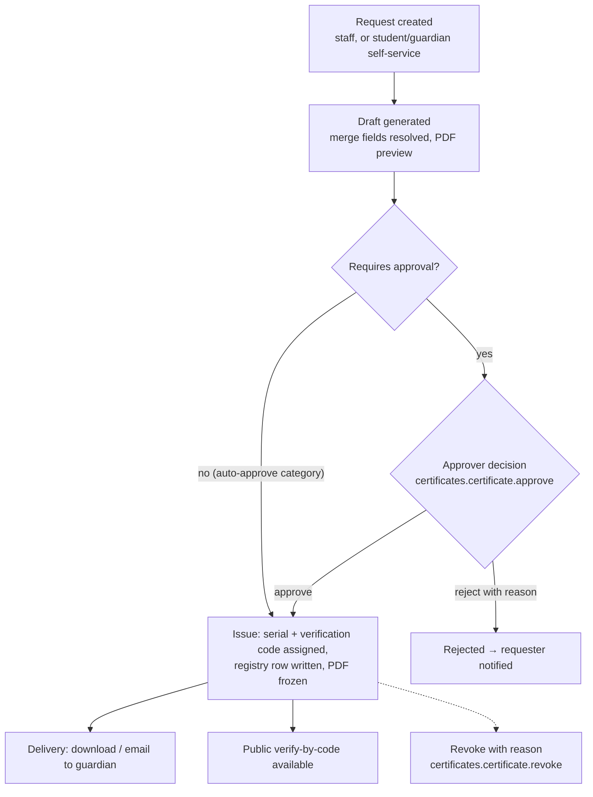

# Module: Certificates & Documents

> **Agent Context** — Load this block first.
> **Summary:** Template-driven generation, approval, issuance, and verification of official school documents — student certificates (bonafide, transfer, character), staff letters, and other merge-field documents rendered to PDF (WeasyPrint). Used by school admins, principals (approval), HR, and class teachers; students/guardians can request certificates. Business value: replaces manual letter-typing with an auditable digital registry of every document the school has ever issued.
> **Co-load with:** `../02-architecture/auth-and-rbac.md` · `../05-database/entities/documents.md` · `../02-architecture/api-architecture.md`
> **Owns entities:** `document_templates`, `generated_documents`, `issued_certificates`
> **Depends on modules:** student-management, staff-management, examinations, communication

## 1. Purpose

Every school regularly issues official documents: bonafide certificates for bank/visa purposes, transfer certificates when a student leaves, character certificates, staff experience and appointment letters. Today these are typed by hand, inconsistently formatted, and unrecorded. This module provides tenant-configurable **document templates** with merge fields, renders them to PDF, routes them through an approval workflow, and keeps a permanent, tamper-evident **issuance registry** with unique serial numbers.

Report cards and admit cards are rendered by the examinations module using its own entities; this module owns the general-purpose template engine and the certificate registry. Fee receipts are owned by fees-finance.

## 2. Business Objective

- Reduce certificate turnaround from days to minutes; measurable via request→issue time.
- Eliminate forged/backdated certificates through serialized issuance and public verification.
- Give schools a complete digital record (scope §5 "Certificates & Documents": digital records) usable during audits, board inspections, and student transfers.

## 3. Target Users

| Role | How they use this module |
| ---- | ------------------------ |
| `school_admin` | Manages templates, generates and issues documents, runs the registry |
| `principal` | Approves certificate issuance (approval gate); signs off on transfer certificates |
| `class_teacher` | Initiates certificate requests for students in their section |
| `hr_staff` | Generates staff letters (experience, appointment, NOC) |
| `it_admin` | Configures template branding, verification page settings |
| `student` / `guardian` | Requests certificates for self/child; downloads issued PDFs (recommendation) |

## 4. Permissions

Permissions follow the RBAC model in [`auth-and-rbac.md`](../02-architecture/auth-and-rbac.md). Permission keys use `<module>.<resource>.<action>`. Module-specific verbs declared here: `generate`, `issue`, `revoke`, `request`.

| Permission key | Description | Default roles |
| -------------- | ----------- | ------------- |
| `certificates.template.view` | View document templates | `school_admin`, `hr_staff`, `principal`, `class_teacher` |
| `certificates.template.create` | Create templates | `school_admin`, `it_admin` |
| `certificates.template.update` | Edit templates (creates a new version) | `school_admin`, `it_admin` |
| `certificates.template.delete` | Deactivate templates (soft delete) | `school_admin` |
| `certificates.document.generate` | Render a document draft from a template | `school_admin`, `hr_staff`, `class_teacher` |
| `certificates.document.view` | View generated documents (record-level scope applies) | `school_admin`, `hr_staff`, `principal`, `class_teacher` |
| `certificates.certificate.request` | Request a certificate (scope `own`) | `student`, `guardian` |
| `certificates.certificate.approve` | Approve/reject pending issuance | `principal`, `school_admin` |
| `certificates.certificate.issue` | Issue an approved certificate (assign serial) | `school_admin` |
| `certificates.certificate.revoke` | Revoke an issued certificate | `principal`, `school_admin` |
| `certificates.certificate.export` | Export the issuance register | `school_admin`, `principal` |

Approvers cannot approve documents they generated (segregation of duties, RBAC §2.4).

## 5. Main Features

1. **Document template management** — tenant-scoped, versioned HTML templates with declared merge fields, per-category (student certificate, staff letter, custom), with school branding (logo, header/footer, signatory block) pulled from tenant settings.
2. **Merge-field document generation** — pick template + subject (student/staff); the system resolves merge fields from live records, shows a preview, and renders a PDF via WeasyPrint ([`tech-stack.md`](../02-architecture/tech-stack.md) §2).
3. **Issuance approval workflow** — configurable approval gate (default: principal) before a certificate becomes official; approval chain configurable per tenant per [`multi-tenancy.md`](../02-architecture/multi-tenancy.md) §5.
4. **Certificate registry** — every issued certificate gets a tenant-unique serial number and an immutable registry entry with the rendered PDF snapshot.
5. **Public verification** — verify-by-code page: anyone holding a certificate can confirm authenticity via a unique verification code/QR without logging in *(recommendation — not explicit in scope, industry standard)*.
6. **Digital records** — searchable archive of all generated/issued documents per student and staff member, surfaced on their profiles.

## 6. Sub-features

- **Templates:** merge-field catalog per subject type (e.g. `{{student.full_name}}`, `{{student.admission_no}}`, `{{session.name}}`, `{{tenant.name}}`); versioning (issued documents keep the version they were rendered with); preview with sample data; paper size/orientation; multiple language templates per tenant locale.
- **Generation:** single and bulk generation (e.g. bonafide for a whole section) via background job (api-architecture §2.7); merge-data snapshot stored so re-rendering is reproducible.
- **Approval:** request queue with filters; reject with reason; auto-approval configurable for low-risk categories (bonafide) *(recommendation)*.
- **Issuance:** serial number format configurable (`{prefix}/{session}/{seq}`); QR code embedding the verification URL; duplicate-copy issuance marked "DUPLICATE" and cross-referenced.
- **Verification:** rate-limited public endpoint returning issue date, type, holder name (minimal PII), and validity status only.
- **Revocation:** revoke with reason; verification page reflects revoked status; original PDF retained.

## 7. Workflows

### 7.1 Certificate issuance

Steps: (1) requester (staff with `document.generate`, or student/guardian with `certificate.request`) selects template + subject; (2) system resolves merge fields, blocks generation on validation failures (§11); (3) draft enters `pending_approval` unless the template's category is auto-approved; (4) approver approves/rejects — approver ≠ generator; (5) issuance assigns serial + verification code, writes `issued_certificates`, freezes the PDF file; (6) notification to requester/guardian; (7) optional later revocation, always with reason and audit entry.

### 7.2 Template lifecycle

Draft → active → superseded (new version) → deactivated. Only `active` templates can generate; existing issued documents always reference their frozen version and file.

## 8. User Journeys

- **Guardian:** opens child's profile → "Request certificate" → picks Bonafide → sees fee (if tenant charges, cross-ref fees-finance) → submits → gets notified on issue → downloads PDF with QR.
- **School admin:** reviews the pending queue each morning → bulk-generates transfer certificates for departing students flagged by student-management → sends to principal for approval → issues and prints.
- **HR staff:** generates an experience letter for a resigning teacher from the staff-letter template → principal approves → letter emailed to the staff member.
- **External verifier (embassy/bank):** scans the QR / enters the code on the public verify page → sees "Valid · Bonafide Certificate · issued 2026-05-02".

## 9. Inputs

- Template editor content (HTML body, merge-field selection, signatory config).
- Generation requests: template id, subject (student/staff id), optional overrides for free-text fields (e.g. "purpose: visa application").
- Bulk-generation selections (class/section/staff filters) — background job.
- Approval decisions with optional reason.
- Verification code (public, unauthenticated).

## 10. Outputs

- Rendered PDF files (tenant-scoped object storage via `files`, api-architecture §2.8).
- `generated_documents` and `issued_certificates` records; issuance register export (CSV/Excel).
- Events emitted: `certificate.requested`, `certificate.issued`, `certificate.revoked` (webhooks, api-architecture §2.6).
- Public verification responses (minimal-PII JSON/HTML).

## 11. Validations

- Template merge fields must all resolve; unresolved required fields block generation with a field-level error.
- Transfer certificate: student must have no outstanding fee dues (cross-module check against fees-finance) and enrollment status must be `withdrawn`/`transferred` per student-management *(dues check configurable per tenant)*.
- One active (non-revoked) certificate per (student, type, session) for uniqueness-sensitive types like transfer certificates; duplicates must be issued as marked duplicate copies.
- Serial numbers are tenant-unique and gapless per sequence; verification codes globally unique and unguessable (≥ 128-bit random).
- Approver ≠ generator; revocation requires a non-empty reason.

## 12. Notifications

| Event | Recipients | Channels | Template ref |
| ----- | ---------- | -------- | ------------ |
| Certificate request submitted | Approvers (pending queue) | In-app, email | `crt-request-submitted` |
| Request approved & issued | Requester; guardian/student subject | In-app, email, SMS | `crt-issued` |
| Request rejected | Requester | In-app, email | `crt-rejected` |
| Certificate revoked | Subject (student/guardian or staff) | In-app, email | `crt-revoked` |

Channels and delivery behavior follow [`notifications.md`](../02-architecture/notifications.md).

## 13. Reports

- **Issuance register** — all issued certificates; filters: type, date range, class/section, issued-by; export CSV/Excel/PDF. Visible to `school_admin`, `principal`.
- **Pending approvals aging** — requests by status and age; visible to approvers.
- **Revocation log** — revoked certificates with reasons; visible to `school_owner`, `principal`.
- **Template usage** — generations per template/version; visible to `school_admin`.

## 14. AI Capabilities

Cross-referenced to [`ai-features.md`](../04-ai/ai-features.md). All AI outputs here are drafts — **human approval is mandatory before anything is issued**.

- **`AI-CRT-01` — AI document summarization** (scope §6): summarize uploaded student/staff documents (previous school records, medical notes) into profile-ready abstracts; summary stored as a draft annotation, never replaces the source file.
- **`AI-CRT-02` — AI template drafting assistant** *(recommendation)*: draft certificate/letter wording from a prompt ("formal character certificate, British English"), emitting valid merge-field placeholders; admin reviews and saves as a draft template version.
- **`AI-CRT-03` — OCR/document extraction** (scope §6 "OCR/document extraction"): extract structured fields (name, dates, marks) from scanned legacy certificates during data migration; extracted values flagged for human confirmation.

## 15. Database Entities

Owned tables (full column specs in [`../05-database/entities/documents.md`](../05-database/entities/documents.md)); all tenant-scoped:

- `document_templates` — versioned merge-field templates per category.
- `generated_documents` — every rendered document with merge-data snapshot and workflow status.
- `issued_certificates` — the immutable issuance registry (serial, verification code, revocation state).

Referenced (not owned): `students`, `staff` ([`people.md`](../05-database/entities/people.md)), `files` ([`tenancy.md`](../05-database/entities/tenancy.md)).

## 16. API Requirements

Conventions per [`api-architecture.md`](../02-architecture/api-architecture.md) (envelope, cursor pagination, filtering whitelists, colon-actions).

- `GET/POST /api/v1/document-templates` · `GET/PATCH/DELETE /api/v1/document-templates/{id}` · `POST /api/v1/document-templates/{id}:preview`
- `GET/POST /api/v1/generated-documents` (POST = generate; bulk generation returns `202` + job) · `GET /api/v1/generated-documents/{id}`
- `POST /api/v1/generated-documents/{id}:submit-for-approval` · `POST /api/v1/generated-documents/{id}:approve` · `POST /api/v1/generated-documents/{id}:reject`
- `GET /api/v1/issued-certificates` (filters: `type`, `student`, `staff`, `issued_at__gte`) · `POST /api/v1/generated-documents/{id}:issue` · `POST /api/v1/issued-certificates/{id}:revoke`
- `GET /api/v1/public/certificates:verify?code=…` — unauthenticated, rate-limited, minimal-PII response.
- Issuance and revocation accept `Idempotency-Key` (api-architecture §2.5).

## 17. Integration Requirements

- **WeasyPrint** rendering service (internal, per tech-stack) with tenant branding assets from object storage.
- **Object storage** (S3-compatible) for frozen PDFs via the platform `files` service.
- **Notification service** for issuance/rejection messages; **communication module** templates.
- QR code generation (server-side library, no external service).

## 18. Dependencies on Other Modules

| Module | Direction | What is shared |
| ------ | --------- | -------------- |
| student-management | inbound | Student merge-field data; withdrawal status for transfer certificates |
| staff-management | inbound | Staff merge-field data for letters |
| fees-finance | inbound | Dues check before transfer certificate; optional certificate fee invoicing |
| examinations | outbound | Examinations consumes the template engine style guide but owns report cards/admit cards |
| communication | outbound | Issuance notifications delivered through its channels |
| platform-admin | inbound | Module feature flag; storage quota enforcement |

## 19. Open Questions / Recommendations

- Public verify-by-code page, auto-approval per category, and duplicate-copy handling are **recommendations** — confirm with client.
- Digital signatures (cryptographic PDF signing) are proposed as a future enhancement, not initial scope *(recommendation)*.
- Whether certificate requests may carry a configurable fee (invoiced via fees-finance) needs client confirmation.
