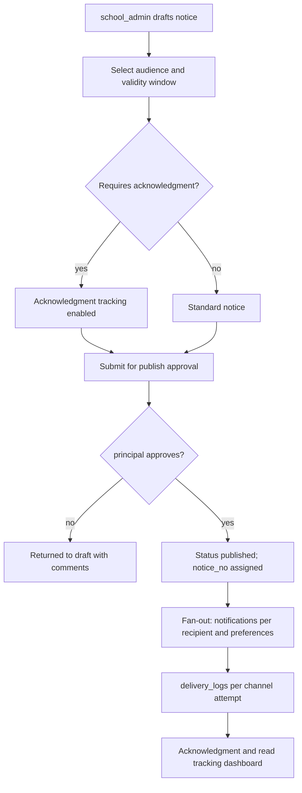

# Module: Communication Management

> **Agent Context** — Load this block first.
> **Summary:** All school-to-audience and person-to-person messaging: announcements, formal notices, guardian/teacher/internal message threads, emergency broadcasts, notification templates, per-user channel preferences, and delivery-status tracking across email/SMS/push/in-app. Business value: one governed channel replaces ad-hoc WhatsApp groups and paper circulars, with proof of delivery.
> **Co-load with:** `../02-architecture/notifications.md` · `../02-architecture/auth-and-rbac.md` · `../05-database/entities/communication.md` · `parent-portal.md`
> **Owns entities:** announcements, notices, message_threads, messages, notification_templates, notifications, notification_preferences, delivery_logs
> **Depends on modules:** school-organization, student-management, staff-management, parent-portal

## 1. Purpose

This module is the tenant's messaging hub. Staff publish **announcements** (informal, feed-style) and **notices** (formal, numbered, optionally acknowledgment-tracked); guardians, teachers, and staff exchange **message threads**; and every other module's events (attendance, fees, exams, library, transport) fan out to users as **notifications** rendered from tenant-manageable **templates** and delivered per user **preferences**, with per-attempt **delivery logs**.

Channel adapters, queues, retries, and provider failover are infrastructure and live in [`notifications.md`](../02-architecture/notifications.md) — this doc defines the functional surface only.

## 2. Business Objective

- Guarantee reach: measurable delivery rates per channel instead of "we posted it on the board."
- Cut emergency-response time to minutes via one-click multi-channel broadcast; raise parent engagement — read/acknowledgment metrics feed scope §18 analytics.
- Control cost: SMS/WhatsApp credits are plan-limited per tenant ([`multi-tenancy.md`](../02-architecture/multi-tenancy.md) §6); templates and preferences prevent redundant sends.

## 3. Target Users

| Role | How they use this module |
| ---- | ------------------------ |
| `school_admin` | Publishes announcements/notices, manages templates, runs emergency broadcasts, monitors delivery |
| `principal` / `vice_principal` | Approves/publishes formal notices; emergency broadcast authority |
| `teacher` / `class_teacher` | Class/section announcements; threads with guardians; internal threads |
| `reception` | Front-desk enquiry threads; enquiry follow-up messages |
| `guardian` / `student` | Receive notices/notifications; participate in threads; manage own preferences |
| `it_admin` | Channel provider configuration status, delivery failure triage |

## 4. Permissions

Permissions follow the RBAC model in [`auth-and-rbac.md`](../02-architecture/auth-and-rbac.md). Module-specific action verbs declared here: `send`, `broadcast`, `acknowledge`.

| Permission key | Description | Default roles |
| -------------- | ----------- | ------------- |
| `communication.announcement.create/update/delete` | Draft and manage announcements | `school_admin`, `teacher` (scope `assigned`) |
| `communication.announcement.publish` | Publish/schedule an announcement | `school_admin`, `principal` |
| `communication.notice.create/update` | Draft formal notices | `school_admin` |
| `communication.notice.publish` | Publish a notice (approval gate) | `principal`, `school_owner` |
| `communication.notice.acknowledge` | Acknowledge a notice requiring it | `guardian`, `student`, staff roles |
| `communication.broadcast.send` | Emergency multi-channel broadcast (audited, MFA-recommended) | `school_owner`, `principal`, `school_admin` |
| `communication.thread.create` / `communication.message.create` | Start/reply to threads | all tenant roles (guardian/student scope `own`) |
| `communication.template.view/update` | Manage tenant notification templates | `school_admin`, `it_admin` |
| `communication.notification-preference.update` | Own channel preferences | all roles (scope `own`) |
| `communication.delivery-log.view/export` | Delivery status dashboards | `school_admin`, `it_admin` |

## 5. Main Features

1. **Announcements** — feed-style posts targeted at the whole school, staff, a class/section, or a custom audience; draft → scheduled → published lifecycle; optional website mirror.
2. **Notices** — formal, per-tenant-numbered documents (circulars, event notices) with publish approval, validity window, optional acknowledgment requirement, and PDF rendering.
3. **Message threads** — two-way conversations: guardian ↔ school (child-contextual), teacher ↔ teacher/staff (internal), and group threads; the parent-portal and dashboard both surface them.
4. **Multi-channel notifications** — every platform event renders a template and fans out over email/SMS/push/in-app (WhatsApp where enabled) per audience preferences.
5. **Emergency broadcast** — bypasses preferences and quiet hours, hits all channels simultaneously for a chosen audience, with delivery tracking and mandatory audit.
6. **Template management** — tenant-editable templates per event/channel/locale with typed placeholders; system templates seeded at provisioning.
7. **Delivery status** — per-recipient, per-channel logs (`queued/sent/delivered/failed/bounced`), failure dashboards, resend tools.

## 6. Sub-features

- **Targeting:** audience builder — roles, campuses, classes/sections, houses, individual users; saved audiences (recommendation).
- **Announcements:** attachments (via `files`), expiry, pinning, publish-to-website flag consumed by the website builder.
- **Notices:** auto sequence number per tenant, acknowledgment progress bar, escalation reminder to non-acknowledgers.
- **Threads:** child context binding (`student_id`), staff routing rules (class teacher default), close/reopen, internal-note visibility for staff (recommendation).
- **Templates:** placeholder validation against the event's variable set; per-locale variants; preview with sample data; SMS segment counter.
- **Preferences & delivery:** category × channel matrix per user (emergency locked on); tenant channel defaults; bounce/invalid-number flagging back onto the user profile; per-tenant SMS credit meter.

## 7. Workflows

**Notice publication with acknowledgment:**

Actors: `school_admin` (draft), `principal` (approval gate — approver cannot be the initiator, per RBAC §2.4). States: `draft → pending_approval → published → archived`.

**Emergency broadcast:** authorized user opens Emergency Broadcast → picks audience (default: everyone) → types message (or selects `AI-COM-03` draft) → confirmation step restates audience size and channels → send is immediate on all channels, ignoring preferences/quiet hours → live delivery board → full audit entry. No approval gate by design (speed); mitigated by narrow permission and audit.

**Guardian thread:** see [`parent-portal.md`](parent-portal.md) §7 — thread creation, routing, reply notifications.

## 8. User Journeys

- **School admin:** Monday — drafts the exam-week circular with `AI-COM-02`, targets classes 6–10 guardians, routes to principal, watches acknowledgments climb; resends via SMS to the 12% who didn't open email.
- **Teacher:** posts a section field-trip announcement; answers three guardian threads during a free period; internal thread with the coordinator.
- **Guardian:** receives push + SMS for a fee reminder (her chosen channels), acknowledges the medical-form notice, messages the class teacher.
- **Principal:** approves two notices; at 11:40 triggers an emergency early-closure broadcast and watches delivery hit 97% in four minutes.

## 9. Inputs

- Announcement/notice composer content, attachments, audience selections, schedules.
- Thread messages and attachments (upload flow per [`api-architecture.md`](../02-architecture/api-architecture.md) §2.8).
- Template bodies with placeholders; locale variants.
- Preference matrix updates; acknowledgment taps.
- Cross-module events (attendance marked, invoice issued, result published, book overdue, route changed) consumed as notification triggers.

## 10. Outputs

- Records: `announcements`, `notices`, `message_threads`/`messages`, `notifications`, `delivery_logs`.
- Rendered artifacts: notice PDFs, per-channel message payloads.
- Events emitted: `notice.published`, `announcement.published`, `broadcast.sent`, `message.created` (webhook-eligible per [`api-architecture.md`](../02-architecture/api-architecture.md) §2.6).
- Website feed: published items flagged `show_on_website` are exposed read-only to the website renderer.

## 11. Validations

- Audience resolution must yield ≥ 1 recipient; targeting rows are re-validated against the tenant (cross-tenant refs → `404`).
- `notice_no` unique per tenant; publish requires approval permission held by a non-initiator.
- Template placeholders must belong to the event's declared variable set; SMS templates warn past segment limits.
- Emergency sends require `communication.broadcast.send` and a typed confirmation phrase (recommendation); always audited.
- Guardians/students can only open threads about themselves/linked children (`own` scope); only thread participants may post.
- Preference changes cannot disable the `emergency` category; sends respect per-tenant SMS/WhatsApp credit quotas (hard stop plus admin alert).

## 12. Notifications

This module *is* the notification surface; its own lifecycle events:

| Event | Recipients | Channels | Template ref |
| ----- | ---------- | -------- | ------------ |
| Notice published | Resolved audience | per preferences (email, SMS, push, in-app) | `communication.notice-published` |
| Announcement published | Resolved audience | in-app, push | `communication.announcement-published` |
| Acknowledgment reminder | Non-acknowledgers | push, SMS | `communication.notice-ack-reminder` |
| Thread reply | Thread participants | push, in-app | `communication.thread-reply` |
| Emergency broadcast | Audience (preferences bypassed) | all channels | `communication.emergency-broadcast` |
| Delivery failure spike | `school_admin`, `it_admin` | in-app, email | `communication.delivery-failure-alert` |

Channels and delivery behavior follow [`notifications.md`](../02-architecture/notifications.md).

## 13. Reports

- **Delivery report:** sends by channel/status/provider; filters: date range, event category, channel; export CSV.
- **Engagement report:** notice read/acknowledgment rates by class/campus; announcement reach.
- **Thread SLA report:** staff first-response and resolution times (recommendation).
- **Credit usage:** SMS/WhatsApp consumption vs. plan quota, trend and forecast.
- Visibility: `communication.delivery-log.view`; owner/principal see all, teachers see own threads' stats only.

## 14. AI Capabilities

Cross-referenced to [`ai-features.md`](../04-ai/ai-features.md); all drafts require human review before send.

- **`AI-COM-01` Automated parent communication suggestions** — proposes targeted messages from cross-module signals (attendance dips, overdue fees, upcoming exams); staff review, edit, and approve every suggestion before sending. Never auto-sends.
- **`AI-COM-02` AI-generated announcements & notices** — drafts from a short prompt in the tenant's tone and locale(s); mandatory human edit/approval; publish gates unchanged.
- **`AI-COM-03` Tone, translation & emergency drafting assistant** — rewrites for clarity/formality, produces locale variants (e.g. English + Urdu), and offers pre-structured emergency drafts; the emergency confirmation step is never bypassed.

## 15. Database Entities

Owned tables (all tenant-scoped, RLS-enforced; column specs in [`entities/communication.md`](../05-database/entities/communication.md)):

- `announcements` — feed-style posts with audience targeting and publish lifecycle.
- `notices` — formal numbered notices with approval, validity, acknowledgment tracking.
- `message_threads` — conversation containers (guardian↔school, internal, group) with optional student context.
- `messages` — individual posts within a thread.
- `notification_templates` — per event/channel/locale render templates.
- `notifications` — per-user notification records (in-app source of truth, fan-out parent).
- `notification_preferences` — user × category × channel opt-ins.
- `delivery_logs` — per-channel delivery attempts and provider status.

## 16. API Requirements

Conventions per [`api-architecture.md`](../02-architecture/api-architecture.md); notification sends accept `Idempotency-Key`.

- `GET/POST /api/v1/announcements` · `PATCH/DELETE /api/v1/announcements/{id}` · `POST /api/v1/announcements/{id}:publish`
- `GET/POST /api/v1/notices` · `POST /api/v1/notices/{id}:submit` · `POST /api/v1/notices/{id}:publish` · `POST /api/v1/notices/{id}:acknowledge`
- `POST /api/v1/broadcasts:emergency` — 202 + job resource (fan-out is a background job per §2.7)
- `GET/POST /api/v1/message-threads` · `POST /api/v1/message-threads/{id}/messages` · `POST /api/v1/message-threads/{id}:close`
- `GET/POST/PATCH /api/v1/notification-templates` · `POST /api/v1/notification-templates/{id}:preview`
- `GET /api/v1/notifications?read=false` · `POST /api/v1/notifications/{id}:mark-read` (SSE badge stream per api-architecture §3) · `GET/PATCH /api/v1/notification-preferences`
- `GET /api/v1/delivery-logs?channel=sms&status=failed&created_at__gte=…` — filters whitelisted: `channel`, `status`, `notification_id`, date range

## 17. Integration Requirements

- Email/SMS/push/WhatsApp providers via the provider-agnostic adapter layer in [`notifications.md`](../02-architecture/notifications.md) (provider webhooks update `delivery_logs`).
- Object storage for attachments; WeasyPrint for notice PDFs; AI gateway for `AI-COM-*`; website renderer reads published, website-flagged items via scoped machine token.

## 18. Dependencies on Other Modules

| Module | Direction | What is shared |
| ------ | --------- | -------------- |
| school-organization | reads | campuses, classes, sections, houses for audience targeting |
| student-management / staff-management | reads | recipients, guardian links, contact data |
| all event-emitting modules | consumes | notification triggers (attendance, fees, exams, library, transport, admissions) |
| parent-portal / website-builder | serves | notices, threads, notifications, preferences UI; published website-flagged items |
| platform-admin | governed by | channel provider config, plan SMS/AI quotas |

## 19. Open Questions / Recommendations

- WhatsApp Business API as a first-class channel: **recommendation — phase 2**, gated per tenant (cost + template pre-approval overhead).
- Thread participants stored as JSONB on `message_threads` initially; promote to a `message_participants` join table if group messaging grows (flagged for the database consistency pass).
- Notice approval chain fixed at one step (principal) initially; configurable multi-step chains follow the workflow engine (scope §22). Read receipts on staff↔guardian threads: on by default, tenant-disableable (recommendation).
