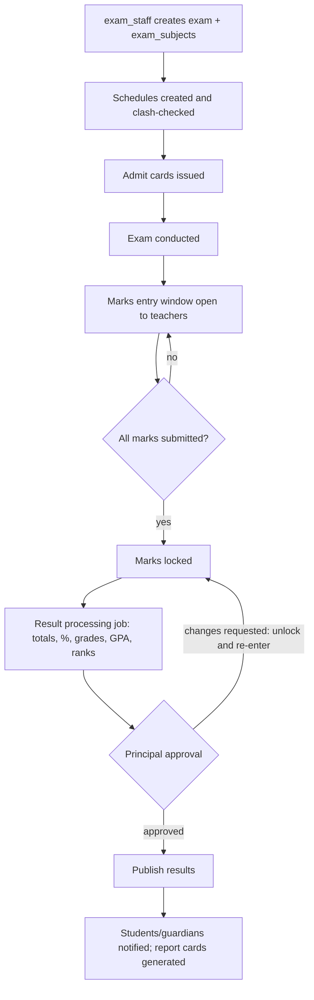
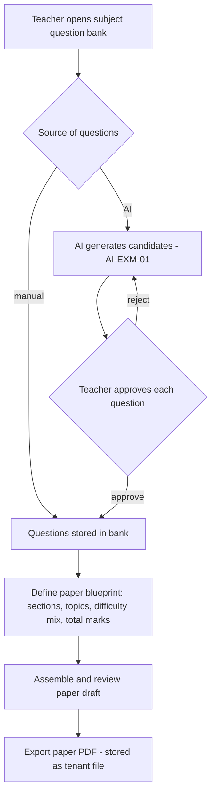

# Module: Examination & Assessment

> **Agent Context** — Load this block first.
> **Summary:** End-to-end examination lifecycle: exam setup, subject-wise configuration, schedules, admit cards, marks entry, grade/GPA/percentage calculation against tenant grading scales, result processing with approval and controlled publishing, report cards, exam-paper generation, and question-bank management. Transcripts and certificates are issued through the certificates-documents module.
> **Co-load with:** `../02-architecture/auth-and-rbac.md` · `../05-database/entities/examinations.md` · `./academics.md` · `./certificates-documents.md`
> **Owns entities:** exams, exam_schedules, exam_subjects, grading_scales, grade_bands, marks, results, report_cards, admit_cards, question_banks, questions
> **Depends on modules:** academics, student-management, timetable, attendance, certificates-documents, communication

## 1. Purpose

Manages every assessment a school runs — unit tests, midterms, finals, practicals — from configuration through published results. Exam staff define exams and subject-wise settings (max/pass marks, weightage), schedule papers into dates/rooms, issue admit cards, and open marks entry to teachers. The system computes totals, percentages, GPA, and grades from the tenant's grading scales, processes results through an approval gate (principal), and publishes them to students and guardians. Report cards are generated per student; question banks feed both AI-assisted exam-paper creation and quizzes.

Grading structure is fully tenant-configurable (scales, bands, weightages) — no country-specific grading model is assumed.

## 2. Business Objective

- Compress the result cycle (last paper → published results) from weeks to days with automated calculation and a single approval gate.
- Eliminate manual calculation errors: 100% of grades/GPA computed server-side from configured scales.
- Reduce teacher paper-setting time via question banks and AI generation (§14) while keeping teachers in control.

## 3. Target Users

| Role | How they use this module |
| ---- | ------------------------ |
| `exam_staff` | Creates exams, schedules, subject configs, admit cards; runs result processing (not approval) |
| `teacher` | Enters marks for assigned class-subjects; builds question banks and exam papers |
| `class_teacher` | Adds report-card remarks for the homeroom section; reviews section results |
| `principal` / `vice_principal` | Approves and publishes results (delegated review to vice principal); exam-day oversight; performance analytics |
| `school_admin` | Configures grading scales/bands; manages exam calendar conflicts |
| `student` / `guardian` | Views admit cards, exam schedules, published results, and report cards (own / own children) |

## 4. Permissions

Permissions follow the RBAC model in [`auth-and-rbac.md`](../02-architecture/auth-and-rbac.md). Permission keys use `<module>.<resource>.<action>`. Module-specific verbs declared here: `issue` (admit cards), `lock` (marks).

| Permission key | Description | Default roles |
| -------------- | ----------- | ------------- |
| `exams.exam.view` / `create` / `update` / `delete` | Manage exam definitions | `exam_staff`, `school_admin`; view also `principal`, `vice_principal`, `teacher` |
| `exams.schedule.create` / `update` | Manage exam schedules | `exam_staff` |
| `exams.grading-scale.create` / `update` | Manage grading scales and bands | `school_admin`, `principal` |
| `exams.marks.create` / `update` | Enter/edit marks (record scope `assigned` for teachers) | `teacher`, `exam_staff` |
| `exams.marks.import` / `exams.marks.lock` | Bulk marks import (Excel); lock/unlock after entry window | `exam_staff`; lock also `school_admin` |
| `exams.result.view` | View processed results (scoped: `own` for student/guardian, `assigned` for teachers) | all tenant roles per scope |
| `exams.result.approve` | Approve processed results | `principal` (delegable to `vice_principal`) |
| `exams.result.publish` | Publish approved results | `principal`, `school_admin` |
| `exams.report-card.create` / `view` / `publish` | Generate/view/publish report cards | `exam_staff` (create), `class_teacher` (remarks + view), `principal` (publish) |
| `exams.admit-card.issue` | Generate and issue admit cards | `exam_staff` |
| `exams.question-bank.create` / `update` / `delete` | Manage question banks and questions | `teacher`, `exam_staff` |
| `exams.question.approve` | Approve AI-generated questions into a bank | `teacher` (assigned subject), `vice_principal` |
| `exams.result.export` | Export result data | `exam_staff`, `principal`, `school_admin` |
| `exams.grading-scale.view` | Read grading scales and bands (needed to render any grade) | all staff |
| `exams.schedule.view` | View exam schedules | all staff, `student`, `guardian` |
| `exams.admit-card.view` | View issued admit cards | `exam_staff`, leadership, `student`, `guardian` |
| `exams.result.create` | Run result processing (not approval) | `exam_staff`, `school_admin` |
| `exams.question-bank.view` | Read question banks and questions | `teacher`, `exam_staff`, leadership |

The approver of a result cannot be the user who ran processing (segregation of duties, RBAC doc §2.4).

The last five rows were added during implementation. Each names a capability this
document already granted in prose while the table omitted the key, so the capability
was documented and unreachable: §3 says a `student`/`guardian` "views admit cards,
exam schedules, published results, and report cards" and §12 notifies both about a
published schedule and an issued admit card; §5.5 computes every grade from a scale a
client has to be able to read; §13 reports on question-bank usage; and §3 says
`exam_staff` "runs result processing (not approval)" while the table listed only
approve, publish, view and export. This is the same correction
`attendance.student-attendance.import` needed, and the same resolution: register the
key and add the row, rather than invent a key the document never mentions.

Result processing takes the standard `create` verb rather than a new `process` one —
processing is precisely what creates `results` rows, and `core/rbac/registry.py` asks
that a new verb be declared in a module doc §4 before being added.

## 5. Main Features

1. **Examination setup** — exams per academic session/term with type, weightage toward the final result, and grading scale; subject-wise exam configuration (`exam_subjects`): max/pass marks, theory/practical split, per-class applicability.
2. **Exam scheduling** — date/time/room/invigilator per exam-subject per section; clash checks against rooms, invigilators, and other exams.
3. **Admit cards** — batch-generated per exam per section from a tenant template, delivered as PDFs to student/guardian portals; revocable (e.g. fee-clearance policy, tenant-configurable).
4. **Marks entry** — per exam-subject grids for teachers (theory/practical columns, absent/exempt flags), Excel import, submit → lock lifecycle.
5. **Grade calculation & result processing** — totals, percentage, grade band, grade points, and GPA computed from the exam's grading scale; optional section/class ranks; batch processing as a background job.
6. **Result approval & publishing** — processed results go to the principal for approval; publishing releases them to students/guardians and fires notifications; withheld results supported per student.
7. **Report cards** — per student per exam (or term consolidation), combining results, attendance summary (attendance module), and class-teacher/principal remarks; PDF via the platform document pipeline.
8. **Exam papers & question banks** — subject/class question banks (manual, imported, or AI-generated with approval); papers assembled from banks by difficulty/topic blueprint and exported as PDFs.
9. **Transcripts & certificates** — cumulative transcripts and exam-related certificates are issued via [`certificates-documents.md`](certificates-documents.md), consuming this module's `results` data (cross-module read, no duplication).

## 6. Sub-features

- **Setup & scheduling:** clone an exam from a previous term; per-section applicability; grace-marks policy per exam (tenant-configurable, recommendation); clash list (room double-booked, invigilator clash, student sitting two papers at once); schedule publish to portals.
- **Marks entry:** entry window dates; out-of-range rejection; missing-entries dashboard per exam; re-open (unlock) requires `exams.marks.lock` and is audited.
- **Processing & report cards:** recompute is idempotent and re-runnable until approval; pass/fail per subject and overall; best-of/weighted aggregation across exams for term results; tenant report-card templates, locale-aware rendering, regeneration versioning.
- **Question banks:** tagging by topic/difficulty/type; usage tracking (which paper used which question); duplicate detection (recommendation).

## 7. Workflows

### 7.1 Exam lifecycle

States on `exams`: draft → scheduled → ongoing → marks_entry → processing → approved → published. Approval gate: `exams.result.approve`; publish gate: `exams.result.publish`; both audited.

### 7.2 Question bank → exam paper

AI-generated questions never enter a bank without explicit approval (`exams.question.approve`).

## 8. User Journeys

- **Exam staff:** sets up "Term 1 Midterm" by cloning last year's, adjusts dates, resolves the two room clashes the checker flags, issues admit cards in one batch, and after marks lock runs processing and sends results for approval.
- **Teacher:** gets a "marks entry open" notice, enters Grade 8 Math marks in the grid (2 absentees flagged), submits; later uses the question bank to assemble the Grade 8 final paper from an AI-drafted set she prunes.
- **Principal:** reviews the result summary (pass rates per section, outliers flagged by AI-EXM-04), sends one section back for a data-entry fix, approves, and publishes.
- **Guardian:** receives the publish notification, opens the child's result and report card PDF, and compares the trend across terms.

## 9. Inputs

- Exam/subject/schedule configuration forms; grading scale and band definitions.
- Marks: grid entry, Excel import (`exams.marks.import`), absent/exempt flags.
- Report-card remarks (class teacher, principal); question authoring/import forms; paper blueprints; AI prompts for question generation (subject, class, topic, difficulty, count).

## 10. Outputs

- Processed result records; published results in portals; report card, admit card, and exam paper PDFs (all stored via the tenant `files` pipeline).
- Notifications (§12); webhook event `result.published` (per [`api-architecture.md`](../02-architecture/api-architecture.md) §2.6); exports (marks sheets, result registers — CSV/Excel/PDF); result data consumed by certificates-documents for transcripts.

## 11. Validations

- Unique: exam name per session; one `exam_subjects` row per (exam, class, subject); one marks row per (exam_subject, student); one result per (exam, student).
- Marks: `0 ≤ obtained ≤ max_marks` per component; pass marks ≤ max marks; entries rejected outside the entry window unless unlocked; absent flag and marks are mutually exclusive.
- Scheduling: no student may have two papers at overlapping times; room and invigilator single-booked; exam dates within the session/term.
- Processing: blocked while any assigned exam-subject has unsubmitted marks (override with an audited waiver — recommendation); grading bands must be contiguous, non-overlapping, and fully cover 0–100%.
- Publishing: only approved results; report cards only from published results; approver ≠ processor.

## 12. Notifications

| Event | Recipients | Channels | Template ref |
| ----- | ---------- | -------- | ------------ |
| Exam schedule published / admit card issued | Students, guardians (schedule also to teachers of affected sections) | Push, in-app, email | `exams.schedule-published` / `exams.admit-card-issued` |
| Marks entry window open / closing reminder | Teachers with pending entries | In-app, email | `exams.marks-entry-reminder` |
| Results submitted for approval | `principal` | In-app | `exams.result-approval-pending` |
| Results published / report card available | Students, guardians | Push, SMS, email (tenant preference) | `exams.result-published` / `exams.report-card-ready` |

Channels and delivery behavior follow [`notifications.md`](../02-architecture/notifications.md).

## 13. Reports

- **Result register** — per exam per section: marks, grades, GPA, rank; export Excel/PDF.
- **Pass/fail analysis** — per class/subject/section; trend across exams and sessions.
- **Subject performance report** — averages, distribution histograms, hardest questions (where paper metadata exists).
- **Marks-entry status** — pending/submitted/locked per exam-subject (operational chase list).
- **Grade distribution & question-bank usage** — band counts per exam per class; questions by topic/difficulty and reuse frequency.

Role visibility per RBAC: teachers see assigned sections; students/guardians see own; leadership sees all.

## 14. AI Capabilities

Cross-referenced to [`ai-features.md`](../04-ai/ai-features.md). All AI outputs require human approval before becoming records visible to students or guardians.

- **AI-EXM-01 — Exam-question & question-bank generation:** drafts questions (MCQ, short/long answer) from subject, class level, topic, and difficulty; each question individually approved by a teacher before entering the bank (§7.2).
- **AI-EXM-02 — AI grading assistance:** suggests scores and feedback for short/long-answer responses supplied by the teacher; the teacher confirms or adjusts every suggestion — AI never writes to `marks` directly.
- **AI-EXM-03 — Student performance analysis:** per-student and per-section insight summaries after publishing (strengths, declining subjects, comparison to prior exams); feeds the at-risk indicator shared with attendance (AI-ATT-02).
- **AI-EXM-04 — Result anomaly screening:** pre-approval screen for entry errors (impossible jumps, uniform values, outlier sections) surfaced to the approver as advisory flags.

## 15. Database Entities

All tables are tenant-scoped per [`multi-tenancy.md`](../02-architecture/multi-tenancy.md). Full column-level specs: [`../05-database/entities/examinations.md`](../05-database/entities/examinations.md).

- `exams` — an examination event within a session/term, with type, weightage, status.
- `exam_subjects` — per-class subject configuration for an exam (max/pass marks, splits).
- `exam_schedules` — date/time/room/invigilator per exam-subject per section.
- `grading_scales` — tenant grading models (percentage, letter, GPA).
- `grade_bands` — bands within a scale (label, range, grade points).
- `marks` — per-student per-exam-subject marks with entry lifecycle.
- `results` — processed per-student per-exam outcome (%, grade, GPA, rank, approval state).
- `report_cards` — generated report-card records + remarks + document link.
- `admit_cards` — issued admit-card records + document link.
- `question_banks` — question collections per subject/class.
- `questions` — individual questions with type, difficulty, source (manual/AI), approval flag.

Exam papers are generated documents (assembled from `questions`, stored via the platform `files` pipeline and templated per [`certificates-documents.md`](certificates-documents.md)); they have no dedicated table (recommendation).

## 16. API Requirements

Conventions per [`api-architecture.md`](../02-architecture/api-architecture.md).

- `GET/POST/PATCH /api/v1/exams` · `/api/v1/exam-subjects` · `/api/v1/exam-schedules` · `/api/v1/grading-scales` (bands nested: `/api/v1/grading-scales/{id}/grade-bands`)
- `GET /api/v1/marks` — filters: `exam_subject_id`, `student_id`, `status`; `POST /api/v1/marks:bulk-entry` (idempotent grid submit) · `POST /api/v1/exam-subjects/{id}:lock-marks` · `:unlock-marks`
- `POST /api/v1/exams/{id}:process-results` — `202` + job resource (API doc §2.7)
- `POST /api/v1/exams/{id}:approve-results` · `:publish-results` — colon-actions, permission-guarded, audited
- `GET /api/v1/results` (scoped) · `GET /api/v1/report-cards` · `GET /api/v1/admit-cards` · `POST /api/v1/exams/{id}:generate-report-cards` · `:issue-admit-cards` (jobs)
- `GET/POST/PATCH /api/v1/question-banks` · `/api/v1/questions` · `POST /api/v1/questions/{id}:approve` · `POST /api/v1/question-banks/{id}:generate-questions` (AI, job) · `:assemble-paper` (job → paper PDF file)

## 17. Integration Requirements

- **Internal:** academics (classes/sections/subjects/enrollments), attendance (report-card attendance summary), timetable (rooms + clash checks for schedules), certificates-documents (transcripts, templates, PDF pipeline via WeasyPrint per [`tech-stack.md`](../02-architecture/tech-stack.md)), files service (PDFs), communication (notifications), AI gateway (§14), background jobs (processing, batch generation). **External:** none mandatory; SMS/email for result notifications via the notification adapter layer.

## 18. Dependencies on Other Modules

| Module | Direction | What is shared |
| ------ | --------- | -------------- |
| academics | inbound | Classes, sections, subjects, enrollments, sessions/terms |
| student-management | inbound | Student records for marks, results, admit cards |
| attendance | inbound | Attendance summaries for report cards; exam-day attendance |
| timetable | inbound | Rooms, clash checking with regular periods |
| certificates-documents | outbound | Result data for transcripts/certificates; templates for PDFs |
| fees-finance | inbound (optional) | Fee-clearance check before admit-card issue (tenant policy) |
| communication | outbound | All notifications in §12 |
| parent-portal | outbound | Result/report-card/admit-card views |
| reporting-analytics | outbound | Performance datasets and dashboards |

## 19. Open Questions / Recommendations

- Fee-clearance gating of admit cards: supported as an optional tenant policy, default off (recommendation).
- Grace marks / moderation policy: schema supports a per-exam adjustment recorded on `results`; policy details need client confirmation (recommendation).
- Term-consolidated report cards (weighted across exams) recommended as the default output; per-exam cards remain available.
- Re-evaluation/rechecking requests by guardians and online exam delivery (students answering in-app) are future enhancements, not initial scope; question banks are designed so online delivery can be added later (recommendation).

## 20. Implementation status

Built as five stacked PRs. This section is updated by each.

**PR A — setup.** Grading scales with validated bands, exams, and per-class
subject configuration.
**PR B — scheduling and admit cards.** Sittings with a clash engine, schedule
publish, and the admit-card batch.
**PR C — marks entry (this PR).** The grid, the four entry gates, the lock
lifecycle, the sheet import and the missing-entries dashboard.

### Built

| Area | State |
| ---- | ----- |
| Entities | 7 of §15's 11 tables — `grading_scales`, `grade_bands`, `exams`, `exam_subjects`, `exam_schedules`, `admit_cards`, `marks` — tenant-owned with RLS policies |
| §16 endpoints | `GET/POST/PATCH/DELETE /grading-scales`, `POST /grading-scales/{id}:set-default`, `GET/POST/PATCH/DELETE /grading-scales/{id}/grade-bands`, `GET/POST/PATCH/DELETE /exams`, `GET/POST/PATCH/DELETE /exam-subjects`, `GET/POST/PATCH/DELETE /exam-schedules` (every write returns `meta.conflicts`), `POST /exams/{id}:publish-schedule`, `GET /admit-cards`, `POST /exams/{id}:issue-admit-cards` (202 + job, accepts `Idempotency-Key`), `POST /admit-cards/{id}:revoke`, `GET /marks` (filters `exam_subject_id`, `exam_id`, `student_id`, `status`, `is_absent`, `is_exempt`), `POST /marks:bulk-entry` (accepts `Idempotency-Key`), `POST /exam-subjects/{id}:lock-marks` · `:unlock-marks`, `GET /exams/{id}/marks-progress`, `POST /marks-imports` (202 + job) |
| §4 permissions | `exams.exam.{view,create,update,delete}`, `exams.grading-scale.{view,create,update}`, `exams.schedule.{view,create,update}`, `exams.admit-card.{view,issue}`, `exams.marks.{create,update,import,lock}`. The remaining keys arrive with the PR that ships an endpoint for them, so `tests/test_endpoint_contracts.py` never sees a registered key with nothing behind it |
| §11 validations | Exam name unique per session · exam dates set together and ordered · dates within the named term, or the session where no term is named · a term must belong to the exam's session · the session must be writable · one `exam_subjects` row per (exam, class, subject) · `pass_marks ≤ max_marks` · a practical component requires a practical maximum · the subject must be in the class's curriculum for the session · grading bands contiguous, non-overlapping and covering 0–100% before an exam may use the scale |
| §11 marks | One row per (exam-subject, student) · nothing negative and absent-excludes-a-mark at the **database**; `0 ≤ mark ≤ max_marks` in `services`, because a CHECK cannot read `exam_subjects.max_marks` · absent and exempt are mutually exclusive · a practical mark on a theory-only subject is refused · only students with an active enrolment in a class the exam-subject covers |
| §5.4 lifecycle | `draft → submitted → locked` on the row, plus `exam_subjects.marks_locked_at` on the *window*. Four gates on every write, each with its own message because each has a different remedy: the exam's status (§7.1), the entry window (§6), the subject lock, and the teacher's allocation (§4). An **unset** window means always open |
| §6 dashboard | `GET /exams/{id}/marks-progress` — expected / entered / submitted per exam-subject, in a bounded number of queries whatever the size of the exam |
| §11 scheduling | One sitting per (exam-subject, section) · `end_time > start_time` · a section must belong to the exam-subject's class · a completed or cancelled sitting cannot be rescheduled · admit cards need a published schedule · a revocation needs a reason (CHECK, not only a service rule) |
| §5.2 clash engine | `conflicts.py` — hard: room double-booked, invigilator double-booked, a student sitting two papers at once, a sitting outside the exam's own dates, a sitting on a non-working day or holiday. Soft: an over-capacity room, a sitting on a weekday the sections have published lessons. Every write returns the whole list; only hard findings block `:publish-schedule` |
| §12 notifications | Two of six wired — `exams.schedule-published` (one `notify()` for the whole exam, on commit) and `exams.admit-card-issued` (one per card, because §12's template names the card number, with guardians fetched once and grouped rather than queried per card). The admit-card one fires after the **render**, not at issue: it says the card is ready to download, which is only true once a document exists. PR C adds `exams.marks-entry-reminder`, to the *allocated subject teachers* of any exam-subject whose window closes within two days with marks still outstanding — §12 says "teachers with pending entries", and a broadcast to all staff is the kind of notification people learn to ignore. The other three wait on `results` and `report_cards` |
| §5.5 grading | `grading.py` — `percentage_for` (ROUND_HALF_UP, one decimal place), `assert_scale_is_complete`, `band_for` (boundary resolves to the upper band), `gpa_for` (None unless the scale type is `gpa` or `hybrid`) |
| §7.1 lifecycle | `exams.status` starts at `draft` and is **read-only on the wire**. Configuration is frozen past `scheduled`; only a draft exam may be deleted |
| Feature flag | `module.examinations`, `default_enabled=False` |
| Tests | Models (constraints), grading (the maths and every band-rule refusal), API (endpoints, permissions, the feature gate), cross-tenant (one case per endpoint, all asserting 404) |

### Decisions worth carrying forward

- **§11's band rule cannot be a constraint, and the split is deliberate.**
  "Contiguous, non-overlapping, covering 0–100%" is a statement about a *set* of
  rows — a band is only wrong relative to its neighbours — so no CHECK can hold
  it, and enforcing coverage per row would make a scale impossible to build,
  since the first band inserted would violate it. The database holds each band's
  own range and label uniqueness; `grading.assert_scale_is_complete` holds the
  rest, and is called **when an exam attaches a scale**, not on every band write.
  That placement is the whole point: early enough that an admin fixes it on a
  form, rather than at result processing, where the same problem is a failed job
  over a whole school's marks.
- **A band's ends are both inclusive, so `band_for` resolves a boundary upward.**
  A student on exactly 80.0 gets the better grade. Decided and tested here rather
  than left to emerge from row ordering, because it is the kind of thing a school
  has to be able to explain to a parent.
- **`is_default` moves through `:set-default`, not a PATCH.** The partial unique
  `grading_scales_one_default` refuses two live defaults, so making a scale the
  default is two writes in one transaction. A `PATCH {"is_default": true}` would
  409 against whichever scale currently holds it — describing the constraint
  rather than the caller's intent.

- **The clash engine shares no code with `timetable/conflicts.py`, on purpose.**
  A timetable slot is a cell in a weekly grid (`day_of_week` + `period_id`) and
  takes its times from the period it names, so a clash there is an equality
  test on a key tuple. An exam sitting is a wall-clock interval on a calendar
  date, so a clash is an *overlap* test and two sittings can conflict without
  sharing any key. Every detector in that file reads `TimetableSlot`
  attributes, and its own header records that its duplication with the database
  constraints is load-bearing — bending it to serve two row shapes would risk
  that to save a file. What is copied is the **pattern**: a frozen `Conflict`
  carrying severity and every row involved, one prefetching `collect_scope`,
  pure detectors with no query inside any of them, and hard findings blocking
  publish while soft ones warn.
- **Overlap is half-open** (`a.start < b.end and b.start < a.end`). A paper
  ending at 11:00 and one starting at 11:00 do not clash: back-to-back sittings
  are the normal shape of an exam day, and the closed reading reports a false
  conflict on every one of them.
- **A sitting on a holiday is a *hard* finding, not a soft one.** The
  alternative is a hall of students arriving at a locked school. A school that
  genuinely opens for an exam edits its working week or removes the holiday,
  which is a real change rather than an override — and it reads the same
  calendar `attendance` refuses to mark against.
- **A student collision is computed through section *rosters*, not section
  ids.** A student enrolled across two sections (an elective cohort, a resit
  group) is exactly the case an identity comparison would miss while appearing
  to check it.
- **The admit-card batch is idempotent, and a revoked card is never
  reinstated.** §8's journey is "issues admit cards in one batch", which in
  practice means pressing the button again after the roll changes — so a re-run
  tops up and reports both counts. But revocation is a decision someone made
  (§5.3's fee-clearance case), and a top-up silently undoing it would reverse
  that decision without anyone asking.
- **Rows are created synchronously; only the PDFs are deferred.** The caller
  learns immediately how many cards the run added, and the job renders whatever
  has no `file_id` — which is what makes it re-runnable after a partial failure
  rather than something that has to be unpicked.
- **`cancelled` is a status, not a soft delete.** A cancelled sitting stays
  visible to a student who already saw it, and — the load-bearing half — is
  excluded from every clash check and from the occupancy constraints, because a
  room freed by a cancellation is free.

- **A rejected row rejects the whole grid; a rejected row in an *import* does
  not.** The two paths are in the same module and behave oppositely on purpose.
  A grid is one act of judgement over one class, so partial commit is never the
  outcome — a teacher who believes they saved forty marks and saved thirty-nine
  is worse off than one told which cell is wrong, and the refusal carries
  `error.meta.rows` with each bad cell's index. An import is a file a school is
  migrating or transcribing, where §6 asks to "re-import failed rows only" —
  which needs a per-row verdict a whole-file rejection cannot give.
- **Unlike `attendance`'s import, this one applies the same rules as its grid.**
  That contrast is worth stating because a reader who has met that importer will
  expect the exemptions. Attendance's rows are historical *by construction*, so
  its calendar and lock gates would reject the entire file. These rows are this
  exam's marks arriving by a different door, and the window is exactly as
  relevant as it is to a teacher typing them.
- **Unlocking returns rows to `submitted`, not `draft`.** They *were*
  submitted. Sending them back to draft would lose the distinction §6's
  missing-entries dashboard depends on and make every reopened subject look
  unfinished.
- **A blank cell in an imported sheet is the absence of a mark, not a zero.**
  The distinction the whole import turns on: a school leaves a cell empty for a
  student who did not sit, and reading it as zero would fail them rather than
  mark them absent.
- **Entering marks is what moves an exam into `marks_entry`.** Done in the
  service rather than by a separate call, so the status cannot lag behind the
  data — a school looking at a `scheduled` exam that already holds marks has no
  way to tell which is true.
- **`marks_entry_progress` carries `class_id` and `subject_id`, not only their
  names.** So a caller acting on a row — the reminder sweep resolving which
  teachers to notify — does not re-fetch the exam-subject per row. That is the
  N+1 shape PR B's review caught twice, and the fix belongs in the query rather
  than at each call site.

### Corrected in review

Seven findings. Three describe rules the module now depends on:

- **`:publish-schedule` had no restricted-principal guard.** `publish` was
  missing from `required_permission_map`, so it inherited `required_permission`
  — the bare *view* key every portal user holds — and from
  `STAFF_ONLY_ACTIONS`, so `DenyRestrictedPrincipals` never applied. This is the
  same class as PR #42's `:bulk-mark`, in the module whose own docstring warns
  about it, which is the argument for the structural half of the fix: both
  portal-readable viewsets now name their **readable** actions
  (`PORTAL_READABLE_ACTIONS`) and everything else is staff-only. A list of
  writes must be updated whenever one is added and forgetting is silent;
  forgetting to add a read is a 403 someone reports the same day.
- **The clash engine's null guard never fired.** `_pairs_by_key` checked
  `if group is not None`, but every detector returns a *tuple* — `(room_id,
  exam_date)` — which is never itself None. So an unroomed sitting grouped
  under `(None, date)`, and every pair of not-yet-roomed sittings on one day was
  reported as a **hard** room clash. A school builds a schedule before it
  assigns halls, so publish was unreachable on the ordinary case. The detectors
  now return None explicitly when the dimension they group by is unset.
- **One exam's clash list reported other exams' clashes.** `scope.schedules`
  includes other exams deliberately — a room clash is by definition with some
  other exam — but pairs were formed over the whole merged list, so a clash
  purely *between two others* blocked this exam's publish over something its
  caller could not fix. At least one side of every pair must now belong to the
  exam under check.

And four smaller ones: `DELETE` on a sitting fell through to the mixin's soft
delete with no `assert_schedule_is_editable`, making it the way around a rule
`PATCH` enforced; `exams.admit-card-issued` was registered with templates and
documented as wired while nothing called `notify()` for it; `issue_admit_cards`
reported `len(created)` rather than the change in row count, which overstates
under exactly the race `ignore_conflicts=True` exists to absorb; and the render
job called the single-card `student_sittings` inside its loop — two queries per
card, so three hundred cards was six hundred round trips, the shape
`conflicts.collect_scope`'s own docstring warns against. `services.sittings_by_student`
answers the whole batch in two queries, and a test asserts it agrees with the
single form.

### Deliberately not built in this PR

§15's remaining four tables: `results` and `report_cards` (PR D),
`question_banks` and `questions` plus §13's reports (PR E).

**§14's AI-EXM-02 (AI grading assistance) is out of scope, and the schema says
so.** `marks` has no `source` column, because there is only one source — a
person. AI-EXM-02 suggests a score to a teacher who confirms or adjusts it, and
the confirmed value is what reaches the table; AGENTS.md invariant 5 requires
exactly that, and `core/ai` does not exist in any case.

**§11's processing waiver is not built.** §11 calls it a recommendation —
"blocked while any assigned exam-subject has unsubmitted marks (override with an
audited waiver)" — and PR D is where the block itself lands. A waiver with no
processing to waive would be a permission key guarding nothing.

**§19's fee-clearance gate on admit-card issue is not built.** `fees-finance`
does not exist, §19 makes the policy "optional, default off" and leaves its
details to client confirmation, and a policy hook with no policy behind it is a
lie in the code. The place it would go is
`services.assert_exam_is_issuable`, and `admit_cards.revoked_reason` already
records the outcome when a school applies the rule by hand.

§14's four AI capabilities (AI-EXM-01 to 04) and §16's
`POST /question-banks/{id}:generate-questions` are **out of scope for this
module**: `core/ai` does not exist and AGENTS.md hard rule 6 forbids reaching a
provider SDK directly. The `questions.source = ai_generated` /
`is_approved = false` shape will ship with PR E precisely so the generator drops
in later without a migration, and AGENTS.md invariant 5 ("AI drafts, humans
publish") is already satisfied by the `:approve` gate §7.2 describes.
