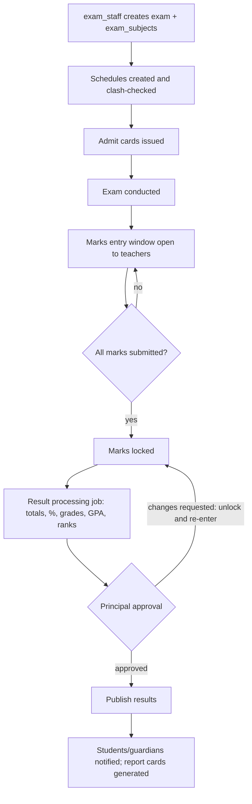
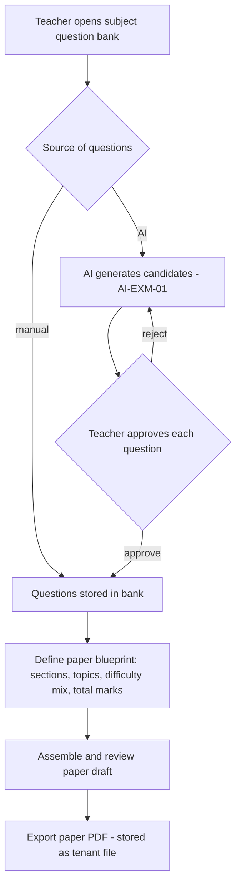

# Module: Examination & Assessment

> **Agent Context** — Load this block first.
> **Summary:** End-to-end examination lifecycle: exam setup, subject-wise configuration, schedules, admit cards, marks entry, grade/GPA/percentage calculation against tenant grading scales, result processing with approval and controlled publishing, report cards, exam-paper generation, and question-bank management. Transcripts and certificates are issued through the certificates-documents module.
> **Co-load with:** `../02-architecture/auth-and-rbac.md` · `../05-database/entities/examinations.md` · `./academics.md` · `./certificates-documents.md`
> **Owns entities:** exams, exam_schedules, exam_subjects, grading_scales, grade_bands, marks, results, report_cards, admit_cards, question_banks, questions
> **Depends on modules:** academics, student-management, timetable, attendance, certificates-documents, communication

## 1. Purpose

Manages every assessment a school runs — unit tests, midterms, finals, practicals — from configuration through published results. Exam staff define exams and subject-wise settings (max/pass marks, weightage), schedule papers into dates/rooms, issue admit cards, and open marks entry to teachers. The system computes totals, percentages, GPA, and grades from the tenant's grading scales, processes results through an approval gate (principal), and publishes them to students and guardians. Report cards are generated per student; question banks feed both AI-assisted exam-paper creation and quizzes.

Grading structure is fully tenant-configurable (scales, bands, weightages) — no country-specific grading model is assumed.

## 2. Business Objective

- Compress the result cycle (last paper → published results) from weeks to days with automated calculation and a single approval gate.
- Eliminate manual calculation errors: 100% of grades/GPA computed server-side from configured scales.
- Reduce teacher paper-setting time via question banks and AI generation (§14) while keeping teachers in control.

## 3. Target Users

| Role | How they use this module |
| ---- | ------------------------ |
| `exam_staff` | Creates exams, schedules, subject configs, admit cards; runs result processing (not approval) |
| `teacher` | Enters marks for assigned class-subjects; builds question banks and exam papers |
| `class_teacher` | Adds report-card remarks for the homeroom section; reviews section results |
| `principal` / `vice_principal` | Approves and publishes results (delegated review to vice principal); exam-day oversight; performance analytics |
| `school_admin` | Configures grading scales/bands; manages exam calendar conflicts |
| `student` / `guardian` | Views admit cards, exam schedules, published results, and report cards (own / own children) |

## 4. Permissions

Permissions follow the RBAC model in [`auth-and-rbac.md`](../02-architecture/auth-and-rbac.md). Permission keys use `<module>.<resource>.<action>`. Module-specific verbs declared here: `issue` (admit cards), `lock` (marks).

| Permission key | Description | Default roles |
| -------------- | ----------- | ------------- |
| `exams.exam.view` / `create` / `update` / `delete` | Manage exam definitions | `exam_staff`, `school_admin`; view also `principal`, `vice_principal`, `teacher` |
| `exams.schedule.create` / `update` | Manage exam schedules | `exam_staff` |
| `exams.grading-scale.create` / `update` | Manage grading scales and bands | `school_admin`, `principal` |
| `exams.marks.create` / `update` | Enter/edit marks (record scope `assigned` for teachers) | `teacher`, `exam_staff` |
| `exams.marks.import` / `exams.marks.lock` | Bulk marks import (Excel); lock/unlock after entry window | `exam_staff`; lock also `school_admin` |
| `exams.result.view` | View processed results (scoped: `own` for student/guardian, `assigned` for teachers) | all tenant roles per scope |
| `exams.result.approve` | Approve processed results | `principal` (delegable to `vice_principal`) |
| `exams.result.publish` | Publish approved results | `principal`, `school_admin` |
| `exams.report-card.create` / `view` / `publish` | Generate/view/publish report cards | `exam_staff` (create), `class_teacher` (remarks + view), `principal` (publish) |
| `exams.admit-card.issue` | Generate and issue admit cards | `exam_staff` |
| `exams.question-bank.create` / `update` / `delete` | Manage question banks and questions | `teacher`, `exam_staff` |
| `exams.question.approve` | Approve AI-generated questions into a bank | `teacher` (assigned subject), `vice_principal` |
| `exams.result.export` | Export result data | `exam_staff`, `principal`, `school_admin` |

The approver of a result cannot be the user who ran processing (segregation of duties, RBAC doc §2.4).

## 5. Main Features

1. **Examination setup** — exams per academic session/term with type, weightage toward the final result, and grading scale; subject-wise exam configuration (`exam_subjects`): max/pass marks, theory/practical split, per-class applicability.
2. **Exam scheduling** — date/time/room/invigilator per exam-subject per section; clash checks against rooms, invigilators, and other exams.
3. **Admit cards** — batch-generated per exam per section from a tenant template, delivered as PDFs to student/guardian portals; revocable (e.g. fee-clearance policy, tenant-configurable).
4. **Marks entry** — per exam-subject grids for teachers (theory/practical columns, absent/exempt flags), Excel import, submit → lock lifecycle.
5. **Grade calculation & result processing** — totals, percentage, grade band, grade points, and GPA computed from the exam's grading scale; optional section/class ranks; batch processing as a background job.
6. **Result approval & publishing** — processed results go to the principal for approval; publishing releases them to students/guardians and fires notifications; withheld results supported per student.
7. **Report cards** — per student per exam (or term consolidation), combining results, attendance summary (attendance module), and class-teacher/principal remarks; PDF via the platform document pipeline.
8. **Exam papers & question banks** — subject/class question banks (manual, imported, or AI-generated with approval); papers assembled from banks by difficulty/topic blueprint and exported as PDFs.
9. **Transcripts & certificates** — cumulative transcripts and exam-related certificates are issued via [`certificates-documents.md`](certificates-documents.md), consuming this module's `results` data (cross-module read, no duplication).

## 6. Sub-features

- **Setup & scheduling:** clone an exam from a previous term; per-section applicability; grace-marks policy per exam (tenant-configurable, recommendation); clash list (room double-booked, invigilator clash, student sitting two papers at once); schedule publish to portals.
- **Marks entry:** entry window dates; out-of-range rejection; missing-entries dashboard per exam; re-open (unlock) requires `exams.marks.lock` and is audited.
- **Processing & report cards:** recompute is idempotent and re-runnable until approval; pass/fail per subject and overall; best-of/weighted aggregation across exams for term results; tenant report-card templates, locale-aware rendering, regeneration versioning.
- **Question banks:** tagging by topic/difficulty/type; usage tracking (which paper used which question); duplicate detection (recommendation).

## 7. Workflows

### 7.1 Exam lifecycle

States on `exams`: draft → scheduled → ongoing → marks_entry → processing → approved → published. Approval gate: `exams.result.approve`; publish gate: `exams.result.publish`; both audited.

### 7.2 Question bank → exam paper

AI-generated questions never enter a bank without explicit approval (`exams.question.approve`).

## 8. User Journeys

- **Exam staff:** sets up "Term 1 Midterm" by cloning last year's, adjusts dates, resolves the two room clashes the checker flags, issues admit cards in one batch, and after marks lock runs processing and sends results for approval.
- **Teacher:** gets a "marks entry open" notice, enters Grade 8 Math marks in the grid (2 absentees flagged), submits; later uses the question bank to assemble the Grade 8 final paper from an AI-drafted set she prunes.
- **Principal:** reviews the result summary (pass rates per section, outliers flagged by AI-EXM-04), sends one section back for a data-entry fix, approves, and publishes.
- **Guardian:** receives the publish notification, opens the child's result and report card PDF, and compares the trend across terms.

## 9. Inputs

- Exam/subject/schedule configuration forms; grading scale and band definitions.
- Marks: grid entry, Excel import (`exams.marks.import`), absent/exempt flags.
- Report-card remarks (class teacher, principal); question authoring/import forms; paper blueprints; AI prompts for question generation (subject, class, topic, difficulty, count).

## 10. Outputs

- Processed result records; published results in portals; report card, admit card, and exam paper PDFs (all stored via the tenant `files` pipeline).
- Notifications (§12); webhook event `result.published` (per [`api-architecture.md`](../02-architecture/api-architecture.md) §2.6); exports (marks sheets, result registers — CSV/Excel/PDF); result data consumed by certificates-documents for transcripts.

## 11. Validations

- Unique: exam name per session; one `exam_subjects` row per (exam, class, subject); one marks row per (exam_subject, student); one result per (exam, student).
- Marks: `0 ≤ obtained ≤ max_marks` per component; pass marks ≤ max marks; entries rejected outside the entry window unless unlocked; absent flag and marks are mutually exclusive.
- Scheduling: no student may have two papers at overlapping times; room and invigilator single-booked; exam dates within the session/term.
- Processing: blocked while any assigned exam-subject has unsubmitted marks (override with an audited waiver — recommendation); grading bands must be contiguous, non-overlapping, and fully cover 0–100%.
- Publishing: only approved results; report cards only from published results; approver ≠ processor.

## 12. Notifications

| Event | Recipients | Channels | Template ref |
| ----- | ---------- | -------- | ------------ |
| Exam schedule published / admit card issued | Students, guardians (schedule also to teachers of affected sections) | Push, in-app, email | `exams.schedule-published` / `exams.admit-card-issued` |
| Marks entry window open / closing reminder | Teachers with pending entries | In-app, email | `exams.marks-entry-reminder` |
| Results submitted for approval | `principal` | In-app | `exams.result-approval-pending` |
| Results published / report card available | Students, guardians | Push, SMS, email (tenant preference) | `exams.result-published` / `exams.report-card-ready` |

Channels and delivery behavior follow [`notifications.md`](../02-architecture/notifications.md).

## 13. Reports

- **Result register** — per exam per section: marks, grades, GPA, rank; export Excel/PDF.
- **Pass/fail analysis** — per class/subject/section; trend across exams and sessions.
- **Subject performance report** — averages, distribution histograms, hardest questions (where paper metadata exists).
- **Marks-entry status** — pending/submitted/locked per exam-subject (operational chase list).
- **Grade distribution & question-bank usage** — band counts per exam per class; questions by topic/difficulty and reuse frequency.

Role visibility per RBAC: teachers see assigned sections; students/guardians see own; leadership sees all.

## 14. AI Capabilities

Cross-referenced to [`ai-features.md`](../04-ai/ai-features.md). All AI outputs require human approval before becoming records visible to students or guardians.

- **AI-EXM-01 — Exam-question & question-bank generation:** drafts questions (MCQ, short/long answer) from subject, class level, topic, and difficulty; each question individually approved by a teacher before entering the bank (§7.2).
- **AI-EXM-02 — AI grading assistance:** suggests scores and feedback for short/long-answer responses supplied by the teacher; the teacher confirms or adjusts every suggestion — AI never writes to `marks` directly.
- **AI-EXM-03 — Student performance analysis:** per-student and per-section insight summaries after publishing (strengths, declining subjects, comparison to prior exams); feeds the at-risk indicator shared with attendance (AI-ATT-02).
- **AI-EXM-04 — Result anomaly screening:** pre-approval screen for entry errors (impossible jumps, uniform values, outlier sections) surfaced to the approver as advisory flags.

## 15. Database Entities

All tables are tenant-scoped per [`multi-tenancy.md`](../02-architecture/multi-tenancy.md). Full column-level specs: [`../05-database/entities/examinations.md`](../05-database/entities/examinations.md).

- `exams` — an examination event within a session/term, with type, weightage, status.
- `exam_subjects` — per-class subject configuration for an exam (max/pass marks, splits).
- `exam_schedules` — date/time/room/invigilator per exam-subject per section.
- `grading_scales` — tenant grading models (percentage, letter, GPA).
- `grade_bands` — bands within a scale (label, range, grade points).
- `marks` — per-student per-exam-subject marks with entry lifecycle.
- `results` — processed per-student per-exam outcome (%, grade, GPA, rank, approval state).
- `report_cards` — generated report-card records + remarks + document link.
- `admit_cards` — issued admit-card records + document link.
- `question_banks` — question collections per subject/class.
- `questions` — individual questions with type, difficulty, source (manual/AI), approval flag.

Exam papers are generated documents (assembled from `questions`, stored via the platform `files` pipeline and templated per [`certificates-documents.md`](certificates-documents.md)); they have no dedicated table (recommendation).

## 16. API Requirements

Conventions per [`api-architecture.md`](../02-architecture/api-architecture.md).

- `GET/POST/PATCH /api/v1/exams` · `/api/v1/exam-subjects` · `/api/v1/exam-schedules` · `/api/v1/grading-scales` (bands nested: `/api/v1/grading-scales/{id}/grade-bands`)
- `GET /api/v1/marks` — filters: `exam_subject_id`, `student_id`, `status`; `POST /api/v1/marks:bulk-entry` (idempotent grid submit) · `POST /api/v1/exam-subjects/{id}:lock-marks` · `:unlock-marks`
- `POST /api/v1/exams/{id}:process-results` — `202` + job resource (API doc §2.7)
- `POST /api/v1/exams/{id}:approve-results` · `:publish-results` — colon-actions, permission-guarded, audited
- `GET /api/v1/results` (scoped) · `GET /api/v1/report-cards` · `GET /api/v1/admit-cards` · `POST /api/v1/exams/{id}:generate-report-cards` · `:issue-admit-cards` (jobs)
- `GET/POST/PATCH /api/v1/question-banks` · `/api/v1/questions` · `POST /api/v1/questions/{id}:approve` · `POST /api/v1/question-banks/{id}:generate-questions` (AI, job) · `:assemble-paper` (job → paper PDF file)

## 17. Integration Requirements

- **Internal:** academics (classes/sections/subjects/enrollments), attendance (report-card attendance summary), timetable (rooms + clash checks for schedules), certificates-documents (transcripts, templates, PDF pipeline via WeasyPrint per [`tech-stack.md`](../02-architecture/tech-stack.md)), files service (PDFs), communication (notifications), AI gateway (§14), background jobs (processing, batch generation). **External:** none mandatory; SMS/email for result notifications via the notification adapter layer.

## 18. Dependencies on Other Modules

| Module | Direction | What is shared |
| ------ | --------- | -------------- |
| academics | inbound | Classes, sections, subjects, enrollments, sessions/terms |
| student-management | inbound | Student records for marks, results, admit cards |
| attendance | inbound | Attendance summaries for report cards; exam-day attendance |
| timetable | inbound | Rooms, clash checking with regular periods |
| certificates-documents | outbound | Result data for transcripts/certificates; templates for PDFs |
| fees-finance | inbound (optional) | Fee-clearance check before admit-card issue (tenant policy) |
| communication | outbound | All notifications in §12 |
| parent-portal | outbound | Result/report-card/admit-card views |
| reporting-analytics | outbound | Performance datasets and dashboards |

## 19. Open Questions / Recommendations

- Fee-clearance gating of admit cards: supported as an optional tenant policy, default off (recommendation).
- Grace marks / moderation policy: schema supports a per-exam adjustment recorded on `results`; policy details need client confirmation (recommendation).
- Term-consolidated report cards (weighted across exams) recommended as the default output; per-exam cards remain available.
- Re-evaluation/rechecking requests by guardians and online exam delivery (students answering in-app) are future enhancements, not initial scope; question banks are designed so online delivery can be added later (recommendation).
