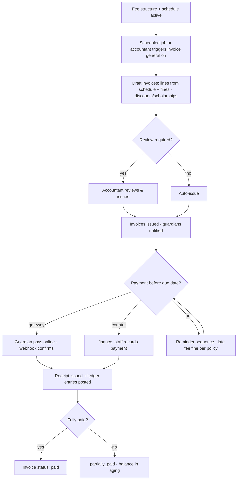
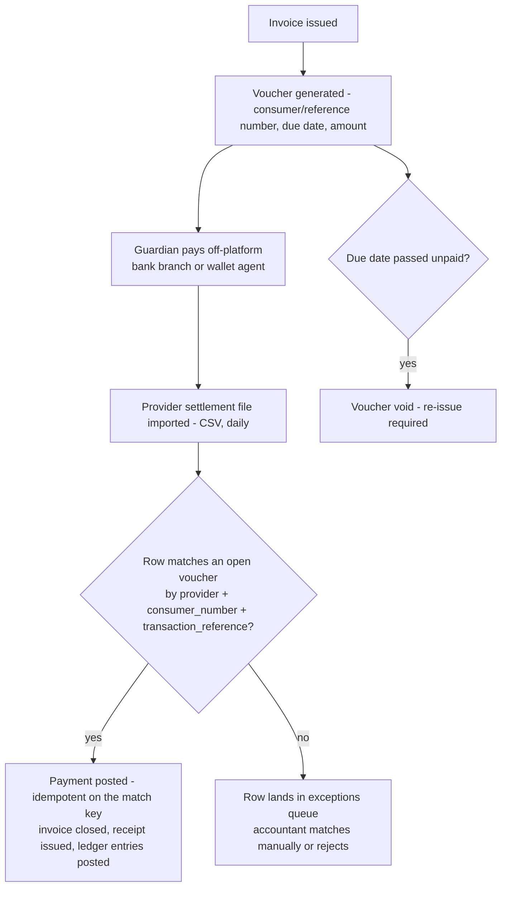
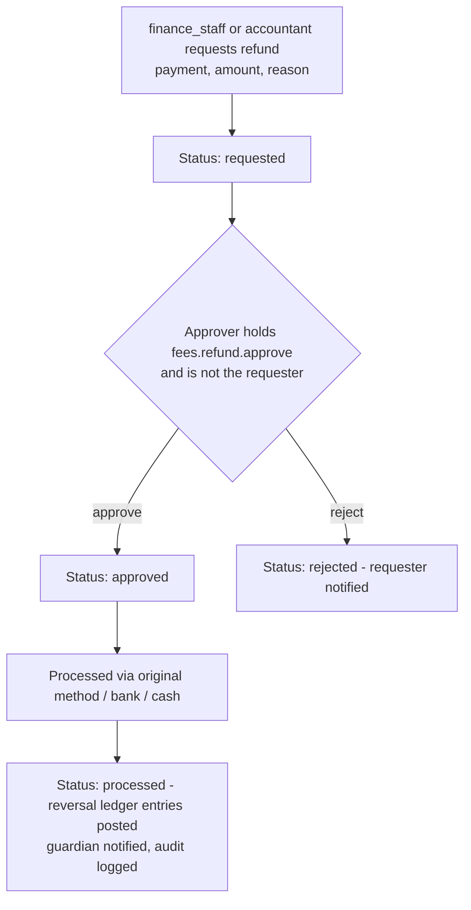
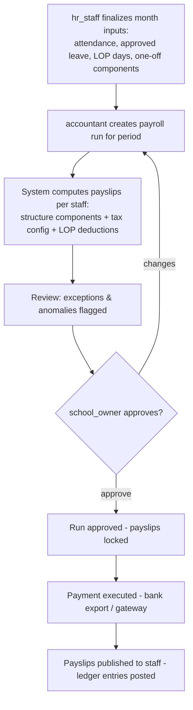

# Module: Fees & Finance

> **Agent Context** — Load this block first.
> **Summary:** Complete money module for a tenant school: fee configuration (heads, structures, schedules), invoice generation, collection with receipts, discounts/scholarships/fines, refunds with approval, outstanding/aging and student ledger, double-entry general ledger, expenses/income, budgeting, financial reporting, and payroll (salary structures, allowances/deductions, tax-configurable processing, payslips). Used daily by `accountant`/`finance_staff`, monthly by `hr_staff` (payroll inputs), and by `guardian`/`student` for fee visibility and payment. Business value: predictable cash flow and auditable school finances in one place.
> **Co-load with:** `../02-architecture/auth-and-rbac.md` · `../05-database/entities/finance.md` · `../02-architecture/api-architecture.md` · `student-management.md` · `hr-leave.md`
> **Owns entities:** `fee_heads`, `fee_structures`, `fee_schedules`, `fee_invoices`, `fee_invoice_lines`, `discounts`, `scholarships`, `fines`, `payments`, `receipts`, `refunds`, `fee_vouchers`, `voucher_collection_imports`, `ledger_accounts`, `ledger_entries`, `expenses`, `expense_categories`, `budgets`, `salary_structures`, `salary_components`, `payroll_runs`, `payslips`
> **Depends on modules:** student-management, academics, staff-management, hr-leave, admissions, parent-portal, communication, library, transport, platform-admin (plans/flags)

## 1. Purpose

The Fees & Finance module manages every monetary flow of a tenant school. On the income side it defines what students are charged (fee heads, structures, and installment schedules), generates invoices, records collections through cash, bank, and online gateway channels, issues receipts, applies discounts/scholarships/fines, and processes refunds through an approval workflow. On the accounting side it maintains a double-entry general ledger, tracks expenses against categories and budgets, and produces financial reports. It also runs payroll: salary structures composed of allowances and deductions, tax-configurable processing, and payslip generation.

All monetary amounts are stored as `numeric(12,2)` in the tenant's configured currency; currency symbol, tax rules, and fiscal-year boundaries come from tenant settings (see [`../02-architecture/multi-tenancy.md`](../02-architecture/multi-tenancy.md)) — no country or tax regime is assumed.

## 2. Business Objective

- Reduce fee leakage and manual reconciliation: every rupee/dollar collected maps to an invoice line and a ledger entry.
- Improve on-time collection through scheduled invoicing, automated reminders, and aging visibility (target: measurable reduction in >30-day outstanding).
- Give owners real-time financial health (income vs. expense, budget variance) without exporting to spreadsheets.
- Replace standalone payroll tooling: one system for salary structures, processing, and payslips, fed by attendance/leave data.

## 3. Target Users

| Role | How they use this module |
| ---- | ------------------------ |
| `accountant` | Full fee cycle: structures, invoicing, collection, refund approvals, ledgers, closing, financial reports |
| `finance_staff` | Data entry: record payments, issue receipts, enter expenses; cannot approve refunds or waivers |
| `school_owner` | Approves budgets and payroll runs; consumes all financial reports |
| `school_admin` | Configures fee heads/structures and approval chains; monitors collection dashboards |
| `hr_staff` | Maintains salary structures and payroll inputs (allowances, deductions, leave data) |
| `guardian` | Views children's invoices, outstanding balance, and payment history; pays online; downloads receipts |
| `student` | Views own fee status and receipts (read-only) |
| `principal` | Views collection and defaulter summaries for oversight |

## 4. Permissions

Permissions follow the RBAC model in [`auth-and-rbac.md`](../02-architecture/auth-and-rbac.md). Permission keys use `<module>.<resource>.<action>`. This module declares two namespaces — `fees.*` and `payroll.*` — and the module-specific verbs `collect`, `refund`, and `waive`. Financial mutations require record-level scope ≠ `own` and are always audited with before/after amounts.

| Permission key | Description | Default roles |
| -------------- | ----------- | ------------- |
| `fees.fee-structure.create` / `.update` / `.delete` | Manage fee heads, structures, schedules | `school_admin`, `accountant` |
| `fees.invoice.create` | Generate invoices (single or bulk) | `accountant`, `finance_staff` |
| `fees.invoice.view` | View invoices (guardians/students scoped `own`) | `accountant`, `finance_staff`, `school_owner`, `principal`, `guardian`, `student` |
| `fees.invoice.update` | Cancel/adjust draft or issued invoices | `accountant` |
| `fees.payment.collect` | Record payments and issue receipts | `accountant`, `finance_staff` |
| `fees.payment.refund` | Request a refund | `accountant`, `finance_staff` |
| `fees.refund.approve` | Approve/reject refund requests | `accountant`, `school_owner` |
| `fees.discount.create` / `fees.scholarship.create` | Grant discounts/scholarships | `accountant`, `school_admin` |
| `fees.discount.waive` / `fees.fine.waive` | Waive fines or invoice lines | `accountant`, `school_owner` |
| `fees.fee-structure.view` † | View fee heads, structures and schedules | `school_admin`, `accountant`, `finance_staff`, `principal`, `school_owner` |
| `fees.ledger.view` | View general ledger and student ledgers | `accountant`, `school_owner` |
| `fees.ledger.create` † | Create ledger accounts and post a manual journal entry | `accountant` |
| `fees.expense.create` / `.update` | Record expenses | `accountant`, `finance_staff` |
| `fees.expense.approve` | Approve submitted expenses | `accountant`, `school_owner` |
| `fees.budget.create` / `fees.budget.approve` | Define / approve budgets | `accountant` / `school_owner` |
| `fees.report.view` / `fees.report.export` | Financial reports and exports | `accountant`, `school_owner`, `principal` |
| `payroll.salary-structure.create` / `.update` | Manage salary structures and components | `hr_staff`, `accountant` |
| `payroll.run.create` | Prepare/process a payroll run | `accountant`, `hr_staff` |
| `payroll.run.approve` | Approve a payroll run for payment | `school_owner`, `school_admin` |
| `payroll.payslip.view` | View payslips (staff scoped `own`) | `hr_staff`, `accountant`, all staff roles (`own`) |
| `payroll.payslip.publish` | Publish payslips to staff | `hr_staff`, `accountant` |

Segregation of duties: the user who processed a payroll run or requested a refund cannot approve it (see auth-and-rbac §2.4).

† Added during implementation. This table granted create/update/delete on fee
configuration with no way to *read* it, and §5.8's automatic postings plus §8's
accountant journal with no key for either — capabilities the doc grants in prose
above and the table had no row for. Registered with the row added in the same
PR, which is how `attendance.student-attendance.import` and examinations' five
gap keys were resolved. `fees.ledger.create` is `accountant`-only and
deliberately excludes `finance_staff`: §3 makes them a data-entry role, and a
manual journal is the one operation that moves money between accounts with no
invoice or payment behind it.

## 5. Main Features

1. **Fee configuration** — define fee heads (tuition, transport, exam, admission, etc.), per-class/per-session fee structures, and installment schedules (monthly, per-term, annual, one-time).
2. **Invoice generation** — scheduled or on-demand bulk generation of student invoices from structures; per-student ad-hoc invoices; automatic application of discounts, scholarships, and pending fines.
3. **Discounts, scholarships & fines** — student-level grants (percent or fixed, optionally per fee head), scholarship lifecycle, and fines raised manually or by other modules (library, transport, late payment).
4. **Payment collection & receipts** — record cash/cheque/bank/card/gateway payments against invoices; auto-numbered receipts with PDF; gateway payments via the integrations layer with idempotent confirmation.
5. **Fee vouchers & bank/wallet collection** *(recommendation)* — printable voucher per invoice carrying a tenant-configurable consumer/reference number, payable off-platform at a bank branch or via a mobile-wallet agent (e.g. Easypaisa, JazzCash); daily settlement-file import matches paid vouchers back to invoices (§7.2).
6. **Refunds with approval workflow** — request → approve/reject → process, with reason, method, and full audit trail.
7. **Outstanding & aging + student ledger** — real-time balance per student, aging buckets (0–30/31–60/61–90/90+), defaulter lists, and a chronological student ledger (invoices, payments, refunds, adjustments).
8. **General ledger** — double-entry, immutable `ledger_entries` posted automatically from payments, refunds, expenses, and payroll; chart of accounts per tenant; corrections by reversal only.
9. **Expenses & income** — categorized expense entry with approval, receipt attachments; income beyond fees recorded via ledger accounts.
10. **Budgeting** — per-category/per-account budgets by fiscal period with variance tracking.
11. **Financial reporting** — collection, outstanding, income vs. expense, budget variance, trial balance, payroll register (see §13).
12. **Payroll** — salary structures per staff member composed of earning/deduction components (allowances, statutory deductions, tax lines configured per tenant), monthly runs with attendance/leave inputs, approval, payslip generation and publishing.

## 6. Sub-features

- **Fee configuration:** clone structure across sessions; campus-specific structures; effective-dating; sibling-aware structures via discounts.
- **Invoicing:** invoice numbering sequence per tenant; proration on mid-term enrollment; cancellation with reason; regeneration guard (no duplicate invoice per student/schedule/period).
- **Collection:** partial payments; advance payment held against next invoice (recommendation); daily collection register per cashier; gateway checkout links delivered via notifications.
- **Fee vouchers:** per-provider numbering pattern for the consumer/reference number; PDF and thermal (80mm) print layouts from the same voucher data (§10); voided automatically once the underlying invoice is settled by any other channel.
- **Fines:** auto late fee per schedule policy; waiver with permission + reason; cross-module fines land as invoice lines on the next invoice.
- **Refunds:** partial or full; refund against a specific payment; processed via original method where the gateway supports it.
- **Payroll:** components fixed or percent-of-basic; taxable/statutory flags; loss-of-pay days from hr-leave; off-cycle runs (recommendation); payslip PDF per staff member; bank-transfer export file (CSV).
- **Ledger:** system accounts seeded at tenant provisioning; account mapping per fee head and expense category; period lock after closing (recommendation).

## 7. Workflows

### 7.1 Fee billing & collection cycle

Steps: (1) generation runs as a background job (`202 Accepted` + job resource); (2) each invoice is atomic — lines, discount application, totals; (3) every confirmed payment posts balanced debit/credit `ledger_entries`; (4) overdue invoices feed the reminder schedule and aging report.

### 7.2 Voucher collection & reconciliation *(recommendation)*

Vouchers are never edited once issued: a correction voids the voucher and issues a new one (mirrors BR-03's append-only money rule). A settlement-file row can never post twice — the match key is `(provider, consumer_number, transaction_reference)`.

### 7.3 Refund approval

### 7.4 Payroll run

## 8. User Journeys

- **Accountant:** starts the month by generating invoices for all active enrollments → monitors the collection dashboard → approves two refund requests → enters vendor expenses → at month end processes payroll, reviews flagged anomalies, sends the run to the owner for approval → closes with the collection and budget-variance reports.
- **Finance staff:** works the fee counter — searches student, records payment, prints receipt; enters expense bills with attachments; cannot approve anything.
- **Guardian:** receives an invoice notification → opens the parent portal → sees the consolidated balance across children → pays by gateway → receipt lands in-app and by email.
- **HR staff:** before payroll cutoff, updates a teacher's salary structure (new allowance), confirms leave-without-pay days synced from hr-leave, and publishes payslips after approval.
- **School owner:** reviews income vs. expense and aging each week; approves the payroll run and the annual budget.

## 9. Inputs

- Fee head/structure/schedule forms; discount, scholarship, and fine entries with reasons.
- Bulk invoice-generation parameters (session, classes, schedule period); CSV import of opening student balances and opening ledger balances (migration).
- Payment forms (method, reference no., amount) and gateway webhooks; refund requests.
- Expense forms with receipt file uploads (per api-architecture §2.8); budget definitions.
- Salary structures/components; payroll-period inputs (LOP days from hr-leave, one-off adjustments); tenant tax configuration tables.

## 10. Outputs

- Issued invoices and receipt PDFs (WeasyPrint); fee vouchers (bank/wallet collection) and receipts in both A4/letter PDF and 80mm thermal layouts, generated from the same template data so content never diverges between the two *(recommendation)*; refund vouchers; payslip PDFs; bank-transfer export files.
- Immutable ledger entries; aging snapshots; report exports (CSV/XLSX/PDF).
- Events for webhooks/notifications: `fee.invoice.issued`, `fee.paid`, `fee.overdue`, `fee.refund.processed`, `payroll.payslip.published`.

## 11. Validations

- No duplicate invoice for the same student + fee schedule + period; invoice totals must equal the sum of lines minus discounts plus fines.
- Payment amount ≤ invoice balance (unless advance-payment feature enabled); refund amount ≤ refundable paid amount of the referenced payment.
- A settlement-file row can post at most once, keyed on `(provider, consumer_number, transaction_reference)`; a voucher past its due date is void and must be re-issued, never edited (mirrors BR-03's append-only money rule).
- Discounts/scholarships cannot reduce a line below zero; percent values 0–100.
- Ledger postings must balance (Σ debit = Σ credit per transaction); posting to archived accounts rejected; entries are append-only.
- Payroll: one payslip per staff per run; run periods cannot overlap for the same campus scope; structures must have exactly one active version per staff member at a time.
- Cross-tenant references re-validated per [`multi-tenancy.md`](../02-architecture/multi-tenancy.md) §3; money mutations require an `Idempotency-Key`.

## 12. Notifications

| Event | Recipients | Channels | Template ref |
| ----- | ---------- | -------- | ------------ |
| Invoice issued | `guardian` (and `student` where enabled) | email, push, in-app | `fees.invoice-issued` |
| Payment received / receipt | `guardian`, cashier | email, in-app | `fees.payment-receipt` |
| Due-date reminder (T-7/T-1, configurable) | `guardian` | email, SMS, push | `fees.due-reminder` |
| Overdue + late fee applied | `guardian`; summary to `accountant` | email, SMS, in-app | `fees.overdue` |
| Refund requested / decided / processed | requester, approver, `guardian` | in-app, email | `fees.refund-status` |
| Expense pending approval | approver | in-app | `fees.expense-approval` |
| Payroll run pending approval | `school_owner` | in-app, email | `payroll.run-approval` |
| Payslip published | each staff member | email, in-app | `payroll.payslip-published` |

Channels and delivery behavior follow [`notifications.md`](../02-architecture/notifications.md).

## 13. Reports

Role visibility per RBAC (`fees.report.view`); all reports filterable by campus, session, class/section, date range; exports CSV/XLSX/PDF; scheduled delivery supported.

1. **Collection report** — by day/cashier/method/fee head.
2. **Outstanding & aging** — buckets 0–30/31–60/61–90/90+, defaulter list with guardian contacts.
3. **Student ledger statement** — chronological per student, printable.
4. **Discount/scholarship/fine registers** — grants and waivers with approvers.
5. **Income vs. expense** — by period and category; **budget variance** per account/category.
6. **Trial balance / general ledger extract** — by account and period.
7. **Payroll register** — gross/deductions/net per staff, component breakdown, period comparison; **tax/statutory deduction summary** per tenant configuration.

## 14. AI Capabilities

Cross-referenced to [`ai-features.md`](../04-ai/ai-features.md); all outputs advisory — no AI decision mutates money without human action.

- **`AI-FEE-01` Fee/payment prediction** — per-student late/default likelihood from payment history, invoice size, and engagement signals; surfaces a prioritized follow-up list on the accountant dashboard. Human approval required before any communication is sent.
- **`AI-FEE-02` Natural-language finance queries & report summaries** — "collection this term vs last, by campus" answered from report data; AI-generated narrative summaries attached to scheduled reports. Read-only.
- **`AI-FEE-03` Smart reminder suggestions** — recommended reminder timing/wording per guardian (ties to automated parent-communication suggestions); drafts require staff approval before sending.
- **`AI-FEE-04` Payroll & expense anomaly detection** — flags outlier payslip deltas and unusual expense patterns during review (recommendation).

## 15. Database Entities

All tables tenant-scoped with the implicit audit/soft-delete columns; full column specs in [`../05-database/entities/finance.md`](../05-database/entities/finance.md).

| Table | Purpose |
| ----- | ------- |
| `fee_heads` | Chargeable fee categories mapped to ledger accounts |
| `fee_structures` | Named fee set per session/class/campus |
| `fee_schedules` | Structure lines: fee head, amount, frequency, due rule |
| `fee_invoices` | Student invoice header with status and totals |
| `fee_invoice_lines` | Invoice line items (schedule, fine, adjustment origins) |
| `discounts` | Student-level discount grants |
| `scholarships` | Scholarship awards and lifecycle |
| `fines` | Fines raised manually or by other modules |
| `payments` | Payments received against invoices |
| `receipts` | Numbered receipts (1:1 with confirmed payments) |
| `refunds` | Refund requests and approval state |
| `fee_vouchers` | Printable bank/wallet collection vouchers per invoice: consumer/reference number, provider, due date, status (`issued`/`paid`/`void`/`expired`) |
| `voucher_collection_imports` | Imported provider settlement files: provider, imported by, row/match counts, exceptions |
| `ledger_accounts` | Tenant chart of accounts |
| `ledger_entries` | Immutable double-entry journal lines |
| `expenses` | Expense records with approval state |
| `expense_categories` | Expense taxonomy mapped to ledger accounts |
| `budgets` | Budget amounts per account/category and period |
| `salary_structures` | Per-staff salary structure versions |
| `salary_components` | Earning/deduction components of a structure |
| `payroll_runs` | Payroll processing batches per period |
| `payslips` | Computed per-staff payslips with snapshots |

## 16. API Requirements

Conventions per [`api-architecture.md`](../02-architecture/api-architecture.md): cursor pagination, whitelisted filters, RFC 9457 errors. Money mutations (marked ⚿) require the `Idempotency-Key` header.

- `GET/POST /api/v1/fee-heads` · `GET/POST/PATCH /api/v1/fee-structures` · `GET/POST /api/v1/fee-schedules`
- `POST /api/v1/fee-invoices:generate` — bulk generation (202 + job); `GET /api/v1/fee-invoices?student=&status=&due_date__lte=` · `POST /api/v1/fee-invoices` (ad-hoc) · `POST /api/v1/fee-invoices/{id}:cancel`
- ⚿ `POST /api/v1/payments` · `GET /api/v1/payments?invoice=&method=` · `GET /api/v1/receipts/{id}` (PDF or thermal via signed URL, `?format=pdf|thermal`)
- `POST /api/v1/fee-invoices/{id}/vouchers` — generate a voucher; `GET /api/v1/vouchers/{id}` (PDF or thermal via signed URL); ⚿ `POST /api/v1/voucher-collection-imports` — upload a provider settlement file (202 + job; matched/exception counts on completion)
- ⚿ `POST /api/v1/refunds` · `POST /api/v1/refunds/{id}:approve` · `POST /api/v1/refunds/{id}:reject` · ⚿ `POST /api/v1/refunds/{id}:process`
- `GET/POST /api/v1/discounts` · `GET/POST /api/v1/scholarships` · `GET/POST /api/v1/fines` · `POST /api/v1/fines/{id}:waive`
- `GET /api/v1/students/{id}/ledger` — student ledger statement
- `GET/POST /api/v1/ledger-accounts` · `GET /api/v1/ledger-entries?account=&date__gte=`
- `GET/POST /api/v1/expenses` · `POST /api/v1/expenses/{id}:approve` · `GET/POST /api/v1/expense-categories` · `GET/POST /api/v1/budgets` · `POST /api/v1/budgets/{id}:approve`
- `GET/POST /api/v1/salary-structures` · `GET/POST /api/v1/salary-components`
- `POST /api/v1/payroll-runs` · `POST /api/v1/payroll-runs/{id}:process` (202 + job) · `POST /api/v1/payroll-runs/{id}:approve` · `GET /api/v1/payslips?run=&staff=` · `POST /api/v1/payroll-runs/{id}:publish-payslips`
- Gateway webhooks land on the integrations layer and are verified (HMAC) before confirming payments — see api-architecture §2.6.

## 17. Integration Requirements

- **Payment gateways** — via the platform integrations layer (provider-agnostic adapter; tenant selects/configures provider). Checkout initiation from the parent portal; asynchronous confirmation via signed webhooks; reconciliation report for gateway settlements. No gateway credentials in tenant-visible config beyond masked identifiers.
- **Bank/wallet voucher collection** *(recommendation)* — a batch file-import adapter, not a live callback: each provider (bank branch network, Easypaisa, JazzCash) delivers a daily settlement file in its own format; a per-provider adapter normalizes rows before matching (§7.2). Distinct from the gateway-adapter's initiate/callback pattern in `08-future/extensibility.md` §3, though it follows the same adapter-interface principle — a new provider is a new adapter, never a fees-module change.
- **Notifications** — reminders, receipts, payslip delivery via [`notifications.md`](../02-architecture/notifications.md) (email/SMS/push/in-app; delivery per webhook conventions in api-architecture).
- **Object storage** — receipt/payslip/expense-attachment PDFs via presigned uploads and signed download URLs.
- **Internal** — hr-leave (LOP days), attendance (staff attendance for payroll), library/transport (fines and transport fees as invoice lines), admissions (application fees), platform-admin (plan limits, feature flags).

## 18. Dependencies on Other Modules

| Module | Direction | What is shared |
| ------ | --------- | -------------- |
| student-management | inbound | `students`, `student_guardians`, enrollments to bill |
| academics | inbound | `academic_sessions`, `terms`, `classes`, `sections`, `campuses` for structure scoping |
| staff-management | inbound | `staff`, `designations` for payroll |
| hr-leave | inbound | approved leave / LOP days → payroll deductions |
| admissions | inbound | application-fee invoices raised on submission |
| library / transport | inbound | fines and transport fees as invoice lines |
| parent-portal | outbound | fee visibility and online payment for guardians |
| communication | outbound | reminder/receipt/payslip notifications |
| reporting-analytics | outbound | financial KPIs for dashboards |

## 19. Open Questions / Recommendations

- **Advance payments/wallet** per student is a recommendation, not client-confirmed; default is payment ≤ balance.
- **Accounting period locking** and fiscal-year close procedure recommended; confirm the tenant's audit expectations.
- **Payroll statutory templates** (per-country tax/pension presets) are recommended as configurable tenant templates rather than hardcoded regimes; only the generic engine is in scope initially.
- **Gateway settlement reconciliation** granularity (per transaction vs. per settlement batch) needs client confirmation.
- **Bank/wallet voucher file formats** are a recommendation, not client-confirmed: exact per-provider settlement-file layout (Easypaisa, JazzCash, and any partnered bank) needs confirmation with the chosen providers at Phase 4.
- Multi-currency per tenant is out of scope (single tenant currency); flagged for future phases.

## 20. Implementation status

Building as four stacked PRs. This section is updated by each.

**PR A — ledger and fee configuration (this PR).** The chart of accounts, the
append-only double-entry ledger and its posting engine, fee heads, structures
and installment schedules.
**PR B — invoicing.** Bulk generation, discounts, scholarships, fines.
**PR C — collection.** Payments, receipts, refunds, vouchers and the settlement
import.
**PR D — spend and reports.** Expenses, categories, budgets, and §13's reports
with the export lane.

### Built (PR A)

| Area | State |
| ---- | ----- |
| Entities | 5 of §15's 22 tables — `ledger_accounts`, `ledger_entries`, `fee_heads`, `fee_structures`, `fee_schedules` — tenant-owned with RLS policies |
| Ledger | Double-entry postings through one write path (`ledger.post_transaction`), balance asserted per transaction, archived accounts refused, corrections as reversals, one-query trial balance |
| Append-only | `ledger_entries` enforced at three levels: model `save`/`delete`, queryset `update`/`delete`, and `REVOKE UPDATE, DELETE` from `schoolhub_app` — with a column-level `GRANT UPDATE (reversed_by_transaction_id)` as the single exception |
| Fee configuration | Fee heads mapped to income accounts, structures scoped by session/class/campus with a draft→active→archived lifecycle, and installment schedules whose due rule must match their frequency |
| Endpoints | §16's `/ledger-accounts`, `/ledger-entries` (read-only), `/fee-heads`, `/fee-structures` (+ `:activate`, `:archive`), `/fee-schedules`, plus `/ledger-entries:post-journal` |
| Seeding | `manage.py seed_finance_accounts` — idempotent system accounts per tenant |

### Decisions worth carrying forward

**Invariant 4 needed a new base class, not a convention.** `ledger_entries` is
the platform's first append-only *tenant-owned* table. `core/audit` had
established the shape — Python guards plus `REVOKE UPDATE, DELETE`, with the
argument in its own migration docstring — but `AuditLog` is platform-scoped,
with a nullable tenant and no RLS policy, so a ledger could not reuse it. And
`TenantOwnedModel` could not be used either: it inherits `deleted_at`, and
**soft delete is an UPDATE**, which is exactly the grant append-only revokes.

The resolution is `core.tenancy.models.AppendOnlyTenantModel`, a sibling of
`TenantOwnedModel` sharing a new abstract `TenantScopedModel`. That shared base
is what `tenant_owned_tables()` now enumerates, so an append-only table is
caught by `tests/test_rls_coverage.py` exactly like any other — narrowing the
predicate to the soft-deletable base would have let the money tables out of the
isolation check. `tests/test_append_only_coverage.py` is the matching guard for
the grants, and it also asserts the model's `MUTABLE_FIELDS` and the migration's
`mutable_columns` name the same columns, because two declarations of one rule
drift.

**The single mutable column is a database fact, not a comment.**
`reversed_by_transaction_id` is stamped on the original lines when a reversal
supersedes them, and it is allowed by a PostgreSQL *column-level* `GRANT UPDATE`
rather than by convention. An ordinary `save()` writes every column and is still
refused; only `save(update_fields=["reversed_by_transaction_id"])` gets through.
The alternative considered was dropping the column and deriving reversal from
`reference_type='reversal'` + `reference_id`; that is purer but contradicts the
entities doc's column list, and the grant states the intent more strongly than
its absence would.

**Balance is a service rule and says so.** Σ debit = Σ credit is a property of
the *set* of lines sharing a `transaction_id`, and a CHECK cannot see a sibling
row — the same shape examinations' grade-band contiguity rule has, resolved the
same way. The database holds what it can (exactly one side positive, neither
negative) and `core.money.assert_balanced` holds the rest, naming both sums when
it refuses. A negative debit is arithmetically a credit, so allowing one would
let a posting balance while every account balance computed from it came out
wrong — the worst available failure, because it is silent.

**One write path, asserted rather than hoped for.**
`ledger.post_transaction` refuses to run outside the caller's transaction, the
same way `core.tenancy.sequences.allocate_number` does and for the same class of
reason: a confirmed payment whose posting rolled back separately is
unreconcilable, and by then the receipt is in a parent's hand.

**`fee_structures`' uniqueness deliberately cannot express the real rule.** Its
index is `(tenant, session, class, campus, name)`, and PostgreSQL treats NULLs
as distinct — so two session-wide structures at the same scope are
database-legal as long as their names differ. That is why `name` is in the key
at all, and why `services.activate_fee_structure` holds the narrower rule: no
*two active* structures may cover one scope. An index cannot say that, and
invoice generation would otherwise have to guess which price applies.

**`ledger_entries.reference_type` is NOT NULL, narrowing the entities doc.**
Every posting has an origin: the enum carries `manual` for an accountant's
journal with no platform record behind it and `reversal` for a correction, so
there is no state a NULL would describe. It also keeps a `NullEnum` union — for
a case that cannot arise — out of the generated TypeScript client, which is
where the dead nullability first became visible.

**`due_day` is capped at 28.** Day 29-31 is not a rule February can honour. The
generator clamps to the month's last day, and the constraint keeps that clamp a
rare path rather than the normal one.

### Deliberately not built

**Payroll is deferred with hr-leave.** §15's `salary_structures`,
`salary_components`, `payroll_runs` and `payslips`, §5.12, §7.4, §13's payroll
register and §12's two payroll notification rows are all out of scope for this
module. `payslips.lop_days` is spec'd as coming from hr-leave's
`leave_requests` outcomes, and hr-leave is Tier 6 and unbuilt — the five leave
tables exist in `attendance`, so the input has a home, but staff leave policy and
accrual do not exist yet. §19 also calls per-country statutory templates a
recommendation with no confirmed shape. Building a tax engine against an
unconfirmed spec is how a money module acquires rules nobody can justify later.

**Payment gateways are out of scope.** §17 routes them through "the platform
integrations layer", and there is no `core/integrations` — the same situation
`core/ai` is in, and AGENTS.md hard rule 6's reasoning applies. `payments.method
= online_gateway` and the `gateway_provider` / `gateway_payload` columns will
ship with PR C precisely so a confirmation lands without a migration, and the
webhook verifier's call site will be named there rather than half-built.

**§14's four AI capabilities (AI-FEE-01 to 04) are out of scope.** `core/ai`
does not exist. All four are advisory by §14's own framing, and invariant 5
would require a human-approval gate in any case.

**No receivable posting on invoice issue.** §5.8 lists the posting origins as
"payments, refunds, expenses, and payroll" — invoices are not among them, so an
issued invoice creates no ledger entry. A receivable posting is defensible
accounting and several charts of accounts do it, but inventing one here would
make §13's reports disagree with the spec they are written against. The
`1100 Fees receivable` system account is seeded so the choice can be revisited
without a migration.

**§19's open recommendations are all left open**, each because it is
unconfirmed rather than difficult: advance payments/wallet per student (default
stays payment ≤ balance), accounting-period locking and the fiscal-year close
procedure, gateway settlement reconciliation granularity, the per-provider
voucher settlement-file layouts, and multi-currency per tenant.
