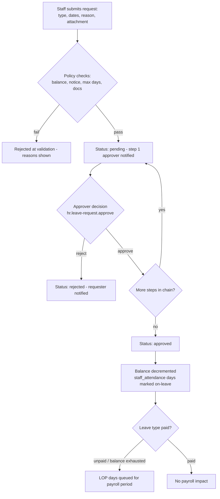
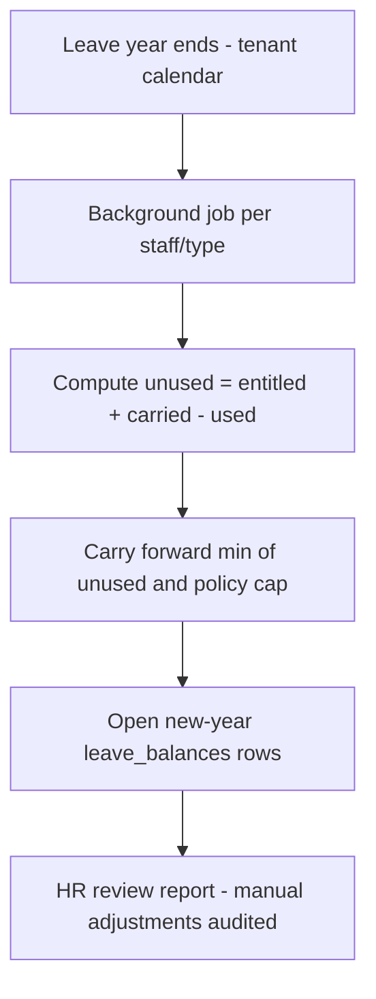

# Module: HR & Leave Management

> **Agent Context** — Load this block first.
> **Summary:** HR operations for tenant staff: the employee-record view over staff data, configurable leave types/policies, leave balances with accrual and carry-forward, leave requests with multi-step approval workflows, integration with staff attendance, payroll integration (approved leave → loss-of-pay deductions), and staff history. Used by `hr_staff` daily, by every staff member for self-service leave, and by approvers (`principal`, `school_admin`). Business value: policy-driven, auditable leave management that feeds payroll without manual reconciliation.
> **Co-load with:** `../02-architecture/auth-and-rbac.md` · `../05-database/entities/attendance.md` · `staff-management.md` · `fees-finance.md`
> **Owns entities:** `leave_types`, `leave_policies`, `leave_balances`, `leave_requests`, `leave_approvals` (column specs live in `../05-database/entities/attendance.md`)
> **Depends on modules:** staff-management, attendance, fees-finance (payroll), communication

## 1. Purpose

HR & Leave Management gives the school a policy engine for staff time off and the HR view of employee records. It defines leave types (casual, sick, earned, unpaid, and tenant-defined others), attaches policies (entitlement, accrual, carry-forward, approval chain) per staff group, tracks balances, and routes leave requests through configurable approval workflows. It consumes staff attendance data (late arrivals, early departures, absences) to keep leave and attendance consistent, and hands approved unpaid leave / loss-of-pay (LOP) days to payroll so deductions are automatic. It also assembles a staff history timeline (designation changes, documents, leave and attendance summaries) from records owned by staff-management.

## 2. Business Objective

- Eliminate paper leave applications and untracked balances; every day off is policy-checked and approved in-system.
- Cut payroll errors: LOP deductions computed from approved data, not manual lists.
- Give leadership absence visibility (who is out, coverage risk) and HR a defensible audit trail for disputes.
- Support tenant-specific policies without code changes — leave types, entitlements, and approval chains are configuration.

## 3. Target Users

| Role | How they use this module |
| ---- | ------------------------ |
| `hr_staff` | Configures leave types/policies, manages balances and adjustments, monitors requests, prepares payroll inputs, maintains staff history |
| `school_admin` | Configures approval chains; second-line approver; oversees HR dashboards |
| `principal` / `vice_principal` | Approve/reject leave for academic staff; view absence calendar |
| `teacher` and all other staff roles | Self-service: view balances, submit leave requests, track status (record scope `own`) |
| `school_owner` | Views HR reports; final approver where the tenant's chain requires it |
| `accountant` | Consumes LOP output during payroll runs (read-only here) |

## 4. Permissions

Permissions follow the RBAC model in [`auth-and-rbac.md`](../02-architecture/auth-and-rbac.md). Permission keys use `<module>.<resource>.<action>` in the `hr.*` namespace. Approvers cannot approve their own requests (segregation of duties, auth-and-rbac §2.4).

| Permission key | Description | Default roles |
| -------------- | ----------- | ------------- |
| `hr.leave-type.create` / `.update` / `.delete` | Manage leave types | `hr_staff`, `school_admin` |
| `hr.leave-policy.create` / `.update` | Manage policies (entitlement, accrual, carry-forward, approval chain) | `hr_staff`, `school_admin` |
| `hr.leave-balance.view` | View balances (staff scoped `own`) | `hr_staff`, `school_admin`, all staff roles (`own`) |
| `hr.leave-balance.update` | Manual balance adjustment with reason | `hr_staff` |
| `hr.leave-request.create` | Submit a leave request (scoped `own`; HR may file on behalf) | all staff roles, `hr_staff` |
| `hr.leave-request.view` | View requests (approvers scoped to their chain/campus) | `hr_staff`, `school_admin`, `principal`, `vice_principal`, requesters (`own`) |
| `hr.leave-request.update` | Cancel/edit a pending request | requester (`own`), `hr_staff` |
| `hr.leave-request.approve` | Approve/reject a step in the workflow | `principal`, `vice_principal`, `school_admin`, `school_owner` (per configured chain) |
| `hr.staff-history.view` | View staff history timeline | `hr_staff`, `school_admin`, `principal` |
| `hr.report.view` / `hr.report.export` | HR/leave reports | `hr_staff`, `school_admin`, `school_owner`, `principal` |

## 5. Main Features

1. **Employee records (HR view)** — consolidated per-staff profile drawing on `staff`, `designations`, `staff_qualifications`, and `staff_documents` (owned by staff-management; referenced, never duplicated), extended with leave balances and attendance summary.
2. **Leave types & policies** — tenant-defined types; policies bind a type to a staff group (designation, department, campus, or all) with annual entitlement, accrual rule, carry-forward cap, notice period, max consecutive days, documentation requirements (e.g. medical certificate), and the approval chain.
3. **Leave balances** — per staff, per type, per academic/fiscal year: entitled, accrued, used, pending, carried forward; manual adjustments audited.
4. **Leave requests & approval workflows** — self-service submission with date range, half-day support, reason, and attachments; configurable single- or multi-step approval; delegation when an approver is absent (recommendation).
5. **Attendance integration** — approved leave writes the corresponding `staff_attendance` days as on-leave; unexplained absences, late arrivals, and early departures (from the attendance module) surface in HR dashboards and can be converted into leave requests or LOP.
6. **Payroll integration** — unpaid leave and exhausted-balance days computed as LOP for the payroll period, exposed to fees-finance payroll runs.
7. **Staff history** — chronological timeline per employee: joining, designation/department changes, qualification additions, documents, leave and attendance summaries, exits (assembled from audit records and referenced tables).

## 6. Sub-features

- **Policies:** effective-dated policy versions; probation rules (no earned leave during probation — recommendation); holiday/weekend exclusion from leave-day counting using the tenant academic calendar.
- **Requests:** overlapping-request detection; cancellation before start date; partial approval (date-range trim) with requester consent; on-behalf filing by HR with audit tag.
- **Balances:** year-open accrual job; monthly accrual where configured; carry-forward at year close with caps; encashment flagged as a future enhancement.
- **Approvals:** per-step permission + optional role; escalation reminder after N days pending (configurable); bulk approval list for approvers.

## 7. Workflows

### 7.1 Leave request & approval

Each decision writes a `leave_approvals` row (step, approver, decision, comment). Requester cancellation is allowed while pending; approved leave can be cancelled before its start date, restoring balance and attendance marks.

### 7.2 Year close & carry-forward

### 7.3 Payroll integration (leave → deductions)

For each payroll period, fees-finance requests the LOP summary: approved unpaid-leave days + absence days HR has marked as LOP, per staff member. The figure is frozen when the payroll run is processed; later corrections flow into the next period as adjustments. See [`fees-finance.md`](fees-finance.md) §7.4.

## 8. User Journeys

- **Teacher:** checks casual-leave balance → submits a 2-day request with reason → sees it pending with the principal → gets an approval notification → the timetable module is informed for substitution (via attendance marking).
- **HR staff:** morning review of yesterday's attendance exceptions → converts an uninformed absence to LOP after contacting the staff member → adjusts a balance for a joining-date proration with a reason note → before payroll cutoff, exports the LOP summary and confirms it to the accountant.
- **Principal:** opens the approvals queue → sees three requests with balance and coverage context → approves two, rejects one with a comment.
- **School admin:** configures a new "Exam Duty Compensatory Leave" type with a one-step approval chain, scoped to `exam_staff`.

## 9. Inputs

- Leave type and policy configuration forms; approval-chain configuration.
- Leave requests (dates, half-day flags, reason, attachment uploads); approver decisions with comments.
- Manual balance adjustments (reason mandatory); opening balances via CSV import at onboarding.
- Attendance exception data from the attendance module (`staff_attendance`, `attendance_corrections`).

## 10. Outputs

- Approved/rejected leave records; updated `leave_balances`; on-leave marks in `staff_attendance`.
- LOP summary per payroll period (consumed by fees-finance); absence calendar feed for dashboards and timetable substitution planning.
- Staff history timeline; report exports (CSV/XLSX/PDF); events: `leave.requested`, `leave.approved`, `leave.rejected`.

## 11. Validations

- Request dates within the active leave year; no overlap with existing approved/pending requests; date range respects notice period and max-consecutive-days policy.
- Balance sufficiency for paid types (unless policy allows negative up to a cap — configuration); required documents present (e.g. medical certificate beyond N sick days).
- Approver ≠ requester at every step; approver holds the step's permission and scope (e.g. campus).
- Balance adjustments require a reason and are audit-logged with before/after values.
- Leave days counted excluding tenant holidays/weekends per academic calendar configuration.

## 12. Notifications

| Event | Recipients | Channels | Template ref |
| ----- | ---------- | -------- | ------------ |
| Leave request submitted | current-step approver | in-app, email | `hr.leave-submitted` |
| Approval step decided / final decision | requester (+ HR on final) | in-app, email, push | `hr.leave-decided` |
| Request pending > N days (escalation) | approver, `hr_staff` | in-app, email | `hr.leave-escalation` |
| Leave starting today (coverage notice) | reporting head, `school_admin` | in-app | `hr.leave-coverage` |
| LOP applied for period | affected staff, `hr_staff` | in-app, email | `hr.lop-notice` |
| Balance carry-forward completed | `hr_staff` | in-app | `hr.year-close` |

Channels and delivery behavior follow [`notifications.md`](../02-architecture/notifications.md).

## 13. Reports

Filters: campus, department, designation, leave type, period; exports CSV/XLSX/PDF; visibility per RBAC.

1. **Leave balance report** — entitled/used/remaining per staff and type.
2. **Leave register** — all requests with status, approvers, and durations.
3. **Absence calendar / who-is-out** — daily and weekly views.
4. **Attendance exception report** — late arrivals, early departures, uninformed absences (data from the attendance module).
5. **LOP / payroll input report** — per payroll period, reconciled against payslips.
6. **Staff history extract** — per employee timeline for audits and references.

## 14. AI Capabilities

Cross-referenced to [`ai-features.md`](../04-ai/ai-features.md); advisory only — no AI output approves leave or alters pay without human action.

- **`AI-HRL-01` Staff attendance & leave anomaly detection** — flags patterns (recurring Monday/Friday sick leave, clustered absences before holidays, outlier lateness) for HR review.
- **`AI-HRL-02` Absence forecasting & coverage risk** — predicts high-absence days from historical patterns and the academic calendar; warns approvers when approving a request would drop coverage below threshold in a department.
- **`AI-HRL-03` AI-generated HR report summaries** — natural-language summaries of leave utilization and exception reports for leadership.

## 15. Database Entities

This module owns the leave tables; their full column specs live with the attendance domain in [`../05-database/entities/attendance.md`](../05-database/entities/attendance.md) (all tenant-scoped, implicit audit/soft-delete columns).

| Table | Purpose |
| ----- | ------- |
| `leave_types` | Tenant-defined leave categories (paid/unpaid flags) |
| `leave_policies` | Entitlement, accrual, carry-forward, and approval-chain rules per staff group |
| `leave_balances` | Per staff/type/year balance ledger |
| `leave_requests` | Leave applications with dates and status |
| `leave_approvals` | Per-step approval decisions |

Referenced (owned elsewhere, never redefined here): `staff`, `designations`, `staff_qualifications`, `staff_documents` ([`people.md`](../05-database/entities/people.md), staff-management module); `staff_attendance`, `attendance_corrections` (attendance module); `payroll_runs`, `payslips` ([`finance.md`](../05-database/entities/finance.md), fees-finance module).

## 16. API Requirements

Conventions per [`api-architecture.md`](../02-architecture/api-architecture.md).

- `GET/POST/PATCH /api/v1/leave-types` · `GET/POST/PATCH /api/v1/leave-policies`
- `GET /api/v1/leave-balances?staff=&leave_type=&year=` · `POST /api/v1/leave-balances/{id}:adjust` (reason required, audited)
- `GET/POST /api/v1/leave-requests?status=&staff=&date__gte=` · `POST /api/v1/leave-requests/{id}:approve` · `POST /api/v1/leave-requests/{id}:reject` · `POST /api/v1/leave-requests/{id}:cancel`
- `GET /api/v1/leave-requests/{id}/approvals` — step history
- `GET /api/v1/payroll-periods/{period}/lop-summary` — payroll input (read by fees-finance; permission `hr.report.view`)
- `GET /api/v1/staff/{id}/history` — staff history timeline
- Year-close accrual runs as a background job (202 + job resource).

## 17. Integration Requirements

- **Internal:** attendance module (staff attendance days, corrections), staff-management (employee master data), fees-finance (LOP → payroll deductions), communication ([`notifications.md`](../02-architecture/notifications.md)) for all notices, timetable (absence feed for substitutions).
- **External:** none required at launch. Biometric-attendance ingestion affects this module only indirectly through the attendance module (future phase).

## 18. Dependencies on Other Modules

| Module | Direction | What is shared |
| ------ | --------- | -------------- |
| staff-management | inbound | `staff`, `designations`, qualifications, documents (employee master) |
| attendance | bidirectional | exceptions in; approved-leave attendance marks out |
| fees-finance | outbound | LOP days per payroll period |
| timetable | outbound | absence feed for substitute planning |
| communication | outbound | leave and LOP notifications |
| reporting-analytics | outbound | HR KPIs for dashboards |

## 19. Open Questions / Recommendations

- **Leave encashment** and compensatory-off automation are recommendations for a later phase; only manual balance adjustment covers them initially.
- **Approver delegation** (out-of-office routing) is recommended; confirm whether tenants need it at launch.
- Whether the leave year follows the **academic session or the fiscal year** must be tenant-configurable (recommendation: default to academic session).
- Negative-balance allowance (borrowing against future accrual) is off by default; enable per policy only if the client confirms.
