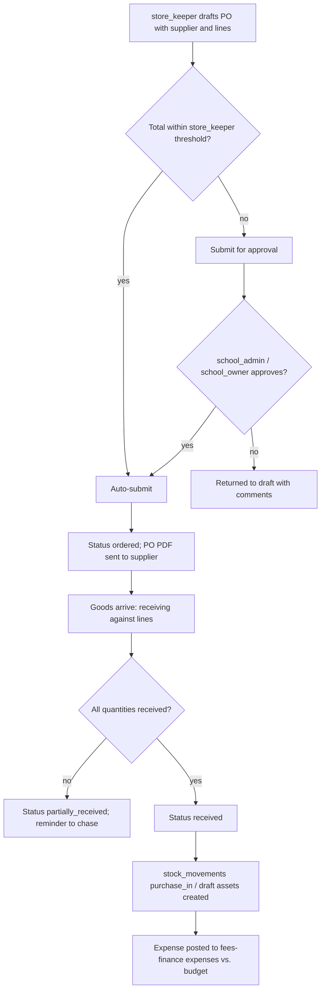

# Module: Inventory & Asset Management

> **Agent Context** — Load this block first.
> **Summary:** Tracks everything the school owns and consumes: fixed **assets** (tagged equipment with assignment and maintenance history), consumable **stock** (quantities via an auditable movement ledger), **suppliers**, and **purchase orders** with approval and receiving. Assets can be assigned to staff or rooms; purchases and maintenance costs post into finance expenses/budgets. Business value: no untracked school property, no stock-outs, and procurement with a paper trail.
> **Co-load with:** `../02-architecture/auth-and-rbac.md` · `../05-database/entities/library-transport-inventory.md` · `fees-finance.md`
> **Owns entities:** suppliers, asset_categories, assets, asset_assignments, asset_maintenance, stock_items, stock_movements, purchase_orders, purchase_order_items
> **Depends on modules:** fees-finance, staff-management, school-organization, communication

## 1. Purpose

This module gives the school a single register of physical property and consumables. **Assets** are individually tagged items (projectors, lab equipment, furniture, IT hardware) with lifecycle status, custody (assigned to a staff member or a room), and maintenance history. **Stock items** are quantity-tracked consumables (stationery, cleaning supplies, lab chemicals, spare parts) whose balance is derived from an append-style `stock_movements` ledger. **Suppliers** and **purchase orders** cover procurement: request → approval → order → receiving into stock/assets, with costs handed to fees-finance.

## 2. Business Objective

- Eliminate asset loss: every item has a tag, a custodian, and an audit trail.
- Prevent stock-outs and over-purchasing via reorder levels and consumption history.
- Enforce procurement discipline (no unapproved POs; ordered vs. received reconciliation) and feed accurate expense/budget data to finance (scope §18 inventory reporting).

## 3. Target Users

| Role | How they use this module |
| ---- | ------------------------ |
| `store_keeper` | Daily operator: assets, stock issue/receive, POs, receiving, audits |
| `school_admin` | PO approvals (per threshold), category/policy setup, oversight |
| `school_owner` | High-value PO approval, asset register reports |
| `accountant` | Expense/budget posting review in fees-finance |
| `teacher` / staff roles | Request consumables; hold assigned assets; report faults |
| `it_admin` | IT asset subset management; import/export |

## 4. Permissions

Permissions follow the RBAC model in [`auth-and-rbac.md`](../02-architecture/auth-and-rbac.md). Module-specific action verbs declared here: `assign`, `receive`, `adjust`, `dispose`.

| Permission key | Description | Default roles |
| -------------- | ----------- | ------------- |
| `inventory.asset.view/create/update` | Asset register management | `store_keeper` (view also `school_admin`, `it_admin`) |
| `inventory.asset.assign` | Assign/return assets to staff/rooms | `store_keeper` |
| `inventory.asset.dispose` | Dispose/write off an asset (audited) | `school_admin` |
| `inventory.maintenance.view/create/update` | Asset maintenance records | `store_keeper` |
| `inventory.stock-item.view/create/update` | Stock catalog & reorder levels | `store_keeper` |
| `inventory.stock-movement.create` | Issue/receive/transfer stock | `store_keeper` |
| `inventory.stock-movement.adjust` | Adjustment/write-off movements (audited, reason required) | `store_keeper` + approval by `school_admin` |
| `inventory.supplier.view/create/update` | Supplier register | `store_keeper`, `school_admin` |
| `inventory.purchase-order.view/create/update` | Draft and manage POs | `store_keeper` |
| `inventory.purchase-order.approve` | Approve POs (threshold-tiered) | `school_admin`, `school_owner` |
| `inventory.purchase-order.receive` | Record goods receipt against a PO | `store_keeper` |
| `inventory.report.view/export` · `inventory.asset.import` | Reports; bulk import | `store_keeper`, `school_admin`, `it_admin` |

## 5. Main Features

1. **Asset register** — tagged assets with category, serial number, campus/location, purchase data, warranty, condition, and status (`in_store/assigned/under_maintenance/disposed/lost`).
2. **Asset assignment** — custody handover to a staff member **or** a room; dated assign/return records with condition checks; current holder always queryable.
3. **Asset & equipment maintenance** — scheduled and reactive maintenance with costs, supplier/workshop, downtime, and next-due dates.
4. **Stock management** — consumable catalog with units, reorder levels, locations; balances derived from the movement ledger and denormalized for reads.
5. **Stock movements** — typed ledger: `purchase_in`, `issue_out`, `return_in`, `adjustment`, `transfer_in/out`, `write_off`; every quantity change is a row.
6. **Suppliers** — vendor register shared with transport (workshops) and library (book vendors).
7. **Purchases** — purchase orders with line items (stock or asset lines), threshold-based approval, partial receiving, and expense/budget posting to fees-finance.
8. **Stock audit** — periodic physical count sessions producing reconciliation adjustments (approved, audited).

## 6. Sub-features

- **Assets:** auto asset-tag sequences; QR/barcode label printing (PDF); photo/document attachments via `files`; warranty-expiry alerts; depreciation rate per category (financial depreciation computation is a fees-finance concern — recommendation, phase 2).
- **Assignments:** bulk assign (e.g. 30 tablets to a lab room); overdue-return chase list; fault report by holder flips asset to `under_maintenance` request.
- **Stock:** minimum/reorder level alerts; consumption trends per item; expiry dates for perishables (recommendation).
- **POs:** request-to-PO conversion from staff consumable requests (recommendation); supplier price history; PO PDF for the vendor; three-way check (ordered vs. received vs. billed).
- **Receiving:** partial receipts advance PO status `ordered → partially_received → received`; asset lines spawn draft `assets` rows on receipt.

## 7. Workflows

**Purchase order lifecycle:**

Actors: `store_keeper` (draft/receive), `school_admin`/`school_owner` (approval gates by amount tier; approver ≠ initiator per RBAC §2.4). States: `draft → pending_approval → approved → ordered → partially_received → received` (or `canceled`).

**Asset assignment/return:** staff/room selected → open `asset_assignments` row, asset `assigned` → on return: condition check → damaged items branch to maintenance or write-off approval → asset `in_store`.

**Stock issue:** requester (any staff role) submits request → `store_keeper` issues → `issue_out` movement with recipient reference → balance decremented → reorder alert when balance ≤ reorder level.

## 8. User Journeys

- **Store keeper (daily):** morning reorder digest shows chalk and A4 paper below level → drafts one PO for the stationery supplier (auto-approved under threshold) → issues lab supplies against a teacher request → receives last week's furniture PO partially (8 of 10 desks) → prints asset tags for the 8 desks.
- **School admin:** approves a projector PO above threshold; reviews the quarterly audit variance report; approves one write-off with reason.
- **Teacher:** requests markers via the portal form; reports the classroom projector faulty — asset flips to maintenance queue and she sees status updates.

## 9. Inputs

- Asset registrations (manual or spawned from PO receipts); bulk CSV import for the opening register.
- Stock catalog entries, reorder levels; movement entries (issue/receive/transfer/adjust) with references.
- Supplier records; purchase orders and receiving confirmations; vendor invoices (amount + file upload).
- Audit count sheets; fault reports; assignment/return forms.

## 10. Outputs

- Records: `assets`, `asset_assignments`, `asset_maintenance`, `stock_items`, `stock_movements`, `suppliers`, `purchase_orders`, `purchase_order_items` (+ posted `expenses` in finance).
- Documents: PO PDFs, asset tag labels, handover/receipt slips, audit variance reports, register exports (CSV/XLSX).
- Events emitted: `inventory.stock.low`, `inventory.po.approved`, `inventory.asset.assigned` (webhook-eligible).

## 11. Validations

- `asset_tag` and `po_no` unique per tenant; `stock_items.sku` unique per tenant where set; supplier name unique per tenant.
- An asset has at most one **active** assignment; assignment must target exactly one of staff/room; disposed/lost assets cannot be assigned.
- Stock issue cannot drive balance negative (hard block); adjustments/write-offs require reason + approval; every movement row is immutable once posted (corrections are counter-movements).
- PO approval tiers by amount are tenant-configured; receiving quantity per line ≤ ordered quantity; expense posting per PO is idempotent.
- Amounts are in the tenant's configured currency ([`multi-tenancy.md`](../02-architecture/multi-tenancy.md) §5); no currency assumed.
- Cross-module references (staff, rooms, budgets) re-validated against the tenant.

## 12. Notifications

| Event | Recipients | Channels | Template ref |
| ----- | ---------- | -------- | ------------ |
| Stock at/below reorder level | `store_keeper`, `school_admin` | in-app, email | `inventory.stock-reorder-alert` |
| PO pending approval / approved / rejected | Approver / `store_keeper` | in-app, email | `inventory.po-approval-request`, `inventory.po-decision` |
| Asset assigned / return due / returned | Holder, `store_keeper` | in-app, push | `inventory.asset-assignment` |
| Maintenance due / completed | `store_keeper` | in-app | `inventory.asset-maintenance-due` |
| Warranty expiring (T-30) | `store_keeper`, `it_admin` | in-app, email | `inventory.asset-warranty-expiry` |

Channels and delivery behavior follow [`notifications.md`](../02-architecture/notifications.md).

## 13. Reports

- **Asset register:** by category/campus/status/holder; valuation at cost; export XLSX/PDF.
- **Stock ledger & valuation:** movement history per item, current balances, consumption by department/period.
- **Procurement report:** POs by supplier/status, spend by category, ordered-vs-received variance, supplier lead times.
- **Audit variance** (counted vs. system, shrinkage trend) and **maintenance cost** (cost/downtime per asset/category) reports.
- Visibility per RBAC (`inventory.report.view`); finance figures reconcile with fees-finance expense reports.

## 14. AI Capabilities

Cross-referenced to [`ai-features.md`](../04-ai/ai-features.md).

- **`AI-INV-01` Reorder & demand prediction** — forecasts consumable demand from movement history and the academic calendar (e.g. exam-season paper spikes); proposes reorder quantities; `store_keeper` confirms every PO (human approval required).
- **`AI-INV-02` Document extraction for procurement** — OCR extraction of supplier invoices/quotes into PO/receiving fields; all extracted values reviewed before save.
- **`AI-INV-03` Asset anomaly insights** — flags assets with outlier maintenance cost/frequency and suggests repair-vs-replace based on cost history; advisory only.

## 15. Database Entities

Owned tables (tenant-scoped, RLS; column specs in [`entities/library-transport-inventory.md`](../05-database/entities/library-transport-inventory.md)):

- `suppliers` — vendor register (shared consumer: transport workshops, library vendors).
- `asset_categories` — hierarchical category tree (also used to classify stock items).
- `assets` — tagged fixed assets with lifecycle status and purchase data.
- `asset_assignments` — dated custody records (staff or room).
- `asset_maintenance` — maintenance events with cost posting to finance `expenses`.
- `stock_items` — consumable catalog with reorder levels and denormalized balance.
- `stock_movements` — immutable quantity ledger (all movement types).
- `purchase_orders` / `purchase_order_items` — procurement headers and lines (stock or asset lines).

Related but not owned: `expenses`, `expense_categories`, `budgets` ([`entities/finance.md`](../05-database/entities/finance.md)); `rooms` ([`entities/academics.md`](../05-database/entities/academics.md)); `staff` ([`entities/people.md`](../05-database/entities/people.md)).

## 16. API Requirements

Conventions per [`api-architecture.md`](../02-architecture/api-architecture.md).

- `GET/POST/PATCH /api/v1/assets` · `POST /api/v1/assets/{id}:assign` · `POST /api/v1/asset-assignments/{id}:return` · `POST /api/v1/assets/{id}:dispose` — filters: `status`, `asset_category_id`, `campus_id`, `holder`
- `GET/POST/PATCH /api/v1/asset-maintenance` · `POST /api/v1/asset-maintenance/{id}:complete` (`Idempotency-Key` for expense posting)
- `GET/POST/PATCH /api/v1/stock-items` — filters: `below_reorder=true`, `asset_category_id`, `campus_id`
- `GET/POST /api/v1/stock-movements` — immutable; filters: `stock_item_id`, `movement_type`, date range
- `GET/POST/PATCH /api/v1/suppliers`
- `GET/POST/PATCH /api/v1/purchase-orders` · `POST /api/v1/purchase-orders/{id}:submit` · `POST /api/v1/purchase-orders/{id}:approve` · `POST /api/v1/purchase-orders/{id}:receive` · sub-resource `GET/POST/PATCH /api/v1/purchase-orders/{id}/purchase-order-items`
- `POST /api/v1/assets:import` — 202 + job resource (bulk CSV per api-architecture §2.7)

## 17. Integration Requirements

- **fees-finance** (internal): expense and budget posting for POs and maintenance; expense-category mapping.
- **Notification service** for alerts; **object storage** for photos/invoices; **WeasyPrint** for PO PDFs and labels; AI gateway for `AI-INV-*` per [`ai-architecture.md`](../02-architecture/ai-architecture.md).
- Barcode/QR scanners as keyboard-wedge input; no vendor EDI in v1 (future enhancement, scope §21).

## 18. Dependencies on Other Modules

| Module | Direction | What is shared |
| ------ | --------- | -------------- |
| fees-finance | writes/reads | `expenses`, `expense_categories`, `budgets` postings and reconciliation |
| staff-management | reads | `staff` as asset holders and requesters |
| school-organization | reads | campuses, `rooms` as assignment targets |
| transport | serves | shared `suppliers`; vehicle spares as stock items |
| library | serves | shared `suppliers` for book vendors |
| communication | uses | all alerts/notifications |

## 19. Open Questions / Recommendations

- Financial depreciation schedules: category `depreciation_rate` is captured now; computation/ledger posting deferred to fees-finance phase 2 (recommendation).
- Valuation method for stock: **moving average cost** proposed (recommendation); FIFO configurable later.
- Whether staff consumable requests need a lightweight approval before issue: default no (store keeper's discretion); tenant-configurable (recommendation).
- Multi-store support (separate stores per campus) is modeled via `campus_id` + locations; formal store entities deferred until needed.
