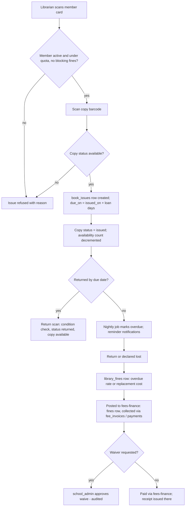

# Module: Library Management

> **Agent Context** — Load this block first.
> **Summary:** Full library operations: catalog of titles vs. physical copies, authors/categories, member management (students and staff), issue/return/renew with due dates, overdue and loss fines (posted into the finance ledger), and real-time availability tracking. Used daily by the `librarian`; students and guardians see own loans via the portal. Business value: zero lost-book ambiguity and automated fine collection through the existing fee rails.
> **Co-load with:** `../02-architecture/auth-and-rbac.md` · `../05-database/entities/library-transport-inventory.md` · `fees-finance.md`
> **Owns entities:** book_titles, book_copies, book_categories, library_members, book_issues, library_fines
> **Depends on modules:** student-management, staff-management, fees-finance, communication, school-organization

## 1. Purpose

Manages the school library end-to-end: a bibliographic catalog where a **title** (one ISBN/work) is distinct from its **physical copies** (accession-numbered, barcoded items), a hierarchical category tree, memberships for students and staff, circulation (issue → renew → return) with due-date and quota policies, and fines for overdue/lost/damaged items. Availability is tracked per copy so search results always show how many copies are on the shelf.

## 2. Business Objective

- Cut book loss and shelf-audit effort with per-copy accession/barcode tracking.
- Automate fine assessment and collect it through fees-finance instead of cash-in-drawer.
- Raise catalog utilization (issues per student per term) — measurable via §13 reports.
- Keep circulation fast: barcode-scan issue/return in under 10 seconds per transaction.

## 3. Target Users

| Role | How they use this module |
| ---- | ------------------------ |
| `librarian` | Catalog CRUD, member management, issue/return/renew, fines, stock audits, reports |
| `school_admin` | Library policy configuration (quotas, loan days, fine rates), oversight reports |
| `teacher` | Searches catalog, borrows as a staff member, recommends titles (recommendation) |
| `student` | Searches catalog, views availability and own loans/fines via the portal |
| `guardian` | Sees child's loans, due dates, and fines in the parent portal |
| `accountant` | Sees posted library fines inside fees-finance (collection handled there) |

## 4. Permissions

Permissions follow the RBAC model in [`auth-and-rbac.md`](../02-architecture/auth-and-rbac.md). Module-specific action verbs declared here: `issue`, `return`, `renew`, `waive`.

| Permission key | Description | Default roles |
| -------------- | ----------- | ------------- |
| `library.book.view` | Search catalog & availability | all tenant roles |
| `library.book.create/update/delete` | Manage titles, copies, categories | `librarian` |
| `library.book.import/export` | Bulk catalog import/export (CSV) | `librarian`, `it_admin` |
| `library.member.view/create/update` | Manage library members | `librarian` |
| `library.book.issue` / `library.book.return` / `library.book.renew` | Circulation desk actions | `librarian` |
| `library.fine.view` | See fines (guardian/student scope `own`) | `librarian`, `accountant`, `guardian`, `student` |
| `library.fine.create/update` | Assess/adjust fines pre-posting | `librarian` |
| `library.fine.waive` | Waive a fine (audited, segregation of duties) | `school_admin`, `principal` |

## 5. Main Features

1. **Catalog management** — titles with authors, ISBN, publisher, edition, language, category; physical copies with accession number, barcode, shelf location, condition, and per-copy status.
2. **Categories & authors** — hierarchical `book_categories`; authors captured on the title (see §19).
3. **Membership** — student and staff members with per-type quotas (max concurrent books, loan days) from tenant library policy.
4. **Circulation** — barcode-driven issue with computed due date, renew (limit-checked), return with condition check; reservation queue (recommendation, phase 2).
5. **Fines** — auto-assessed overdue fines (per-day rate, cap), lost/damage charges (cost-based); posted into fees-finance `fines` for collection; waivable with approval.
6. **Availability tracking** — live available/total counts per title; copy states `available/issued/reserved/lost/damaged/withdrawn`.
7. **Inventory / stock audit** — periodic shelf audit by barcode scan; discrepancy list drives `lost`/`withdrawn` updates.

## 6. Sub-features

- **Catalog:** ISBN lookup autofill (via `AI-LIB-03`/external ISBN API), cover images via `files`, duplicate-ISBN merge tool, bulk CSV import with per-row error report.
- **Copies:** accession-number sequences per tenant, printable barcode/spine labels (PDF), campus-level location.
- **Circulation desk:** member lookup by card/ID scan; block issue when member is at quota, suspended, or holds unpaid fines above a threshold (tenant-configurable); due-date override with reason (audited).
- **Fines:** grace days, per-member-type rates, automatic stop at cap; replacement-cost charge for `lost`.
- **Member self-service:** loan history, due dates, renew-online where allowed (recommendation).

## 7. Workflows

**Issue → return → fine posting:**

Actors: `librarian` (issue/return/assess), nightly Celery job (overdue detection), `school_admin`/`principal` (waiver approval gate — approver ≠ initiator). Fine **collection** always happens in fees-finance; the library only originates the charge.

**Stock audit:** librarian starts audit session → scans shelves → system diffs scans vs. expected copies → discrepancy report → librarian marks copies `lost`/`withdrawn` (bulk, audited) → summary report to `school_admin`.

## 8. User Journeys

- **Librarian (daily):** morning return bin — scan-in 30 books, two flagged overdue and fined automatically; issues books over lunch break; afternoon: imports 40 new titles from the vendor CSV and prints barcode labels.
- **Student:** searches "physics grade 9" in the portal, sees 2 of 5 copies available, visits the desk, borrows one; gets a push reminder two days before due date; renews once online.
- **Guardian:** sees a PKR-equivalent fine (tenant currency) on the child's portal fee card — pays it together with the monthly invoice.
- **School admin:** reviews the utilization report at term end; approves three fine waivers with reasons.

## 9. Inputs

- Title/copy forms; bulk catalog CSV imports; cover-image uploads.
- Barcode/member-card scans at the circulation desk.
- Library policy configuration: quotas, loan days, fine rates, grace days, caps, blocking threshold.
- Audit scan sessions; waiver requests with reasons.

## 10. Outputs

- Records: `book_titles`, `book_copies`, `book_issues`, `library_fines` (+ posted `fines` in finance).
- Documents: barcode/spine labels (PDF), issue slips (optional), audit discrepancy reports, catalog exports (CSV/XLSX).
- Events emitted: `library.book.issued`, `library.book.overdue`, `library.fine.posted` (webhook-eligible).
- Availability data consumed by portal search.

## 11. Validations

- `isbn` unique per tenant on titles (nullable for legacy/local books); `accession_no` unique per tenant on copies.
- A copy can be in at most one open `book_issues` row (partial unique on open status).
- Issue blocked: member inactive/suspended, quota reached, copy not `available`, blocking unpaid fines over threshold.
- Renewals ≤ policy limit and refused when a reservation queue exists (phase 2).
- Returns require condition selection; `damaged` triggers a fine draft, never an automatic post without librarian confirmation.
- Fine waivers require `library.fine.waive`, a reason, and approver ≠ assessor; already-posted fines are waived through the fees-finance waiver flow (cross-module consistency).
- Members map 1:1 to a tenant `users` account; student members auto-suspended on student transfer/withdrawal (event from student-management).

## 12. Notifications

| Event | Recipients | Channels | Template ref |
| ----- | ---------- | -------- | ------------ |
| Book issued | Member (guardian if student) | in-app, push | `library.book-issued` |
| Due-date reminder (D-2, D0) | Member (guardian if student) | push, SMS | `library.due-reminder` |
| Overdue + fine assessed | Member + guardian | push, SMS, email | `library.overdue-fine` |
| Fine posted to invoice | Guardian | per preferences | `library.fine-posted` |
| Reservation available (phase 2) | Member | push | `library.reservation-ready` |

Channels and delivery behavior follow [`notifications.md`](../02-architecture/notifications.md).

## 13. Reports

- **Circulation report:** issues/returns/renewals by period, class, member type; filters: date range, category, campus; export CSV/XLSX.
- **Overdue & fines report:** outstanding items, aging, fine realization vs. waived (visibility: `librarian`, `accountant`, `school_admin`).
- **Utilization report:** most/least issued titles, idle stock, issues per student per term.
- **Stock audit report:** expected vs. scanned, loss rate trend.
- Role visibility per RBAC; guardian/student see only own history.

## 14. AI Capabilities

Cross-referenced to [`ai-features.md`](../04-ai/ai-features.md).

- **`AI-LIB-01` Reading recommendations** — suggests titles per student from grade level, borrow history, and curriculum subjects; shown in the portal; recommendations only, no auto-reservations.
- **`AI-LIB-02` Natural-language catalog search** — "story books in Urdu for class 3" resolved to catalog filters; falls back to standard full-text search on low confidence.
- **`AI-LIB-03` Catalog OCR/metadata extraction** — extracts title/author/ISBN/publisher from cover or copyright-page photos during cataloging; librarian confirms every field before save (human approval required).

## 15. Database Entities

Owned tables (tenant-scoped, RLS; column specs in [`entities/library-transport-inventory.md`](../05-database/entities/library-transport-inventory.md)):

- `book_titles` — bibliographic works (one row per title/edition).
- `book_copies` — physical accession-numbered items of a title.
- `book_categories` — hierarchical category tree.
- `library_members` — membership + quota state for students/staff.
- `book_issues` — circulation transactions (issue/renew/return lifecycle).
- `library_fines` — assessed fines; posting reference into finance's `fines` ([`entities/finance.md`](../05-database/entities/finance.md)); collection via `fee_invoices`/`payments`/`ledger_entries` there.

## 16. API Requirements

Conventions per [`api-architecture.md`](../02-architecture/api-architecture.md).

- `GET/POST /api/v1/book-titles` · `PATCH/DELETE /api/v1/book-titles/{id}` — filters: `search`, `category_id`, `language`, `available=true`
- `GET/POST /api/v1/book-copies` · `PATCH /api/v1/book-copies/{id}` — filters: `book_title_id`, `status`, `campus_id`
- `GET/POST/PATCH /api/v1/book-categories`
- `GET/POST/PATCH /api/v1/library-members` — filters: `member_type`, `status`, `search`
- `POST /api/v1/book-copies/{id}:issue` · `POST /api/v1/book-issues/{id}:return` · `POST /api/v1/book-issues/{id}:renew` — colon-actions, permission-guarded, audited
- `GET /api/v1/book-issues?member_id=…&status=overdue`
- `GET /api/v1/library-fines` · `POST /api/v1/library-fines/{id}:waive` · `POST /api/v1/library-fines/{id}:post` (creates the finance `fines` row; idempotent via `Idempotency-Key`)
- `POST /api/v1/book-titles:import` — 202 + job resource (bulk CSV, api-architecture §2.7)

## 17. Integration Requirements

- **fees-finance** (internal): fine posting and collection; waiver state sync.
- **Notification service** for reminders/overdues ([`notifications.md`](../02-architecture/notifications.md)).
- **Object storage** for cover images and label PDFs; **WeasyPrint** for labels/slips.
- External ISBN metadata lookup (e.g. OpenLibrary) — optional, flagged per tenant (recommendation).
- Barcode scanners are plain keyboard-wedge input — no special integration.

## 18. Dependencies on Other Modules

| Module | Direction | What is shared |
| ------ | --------- | -------------- |
| student-management / staff-management | reads | member identity (students, staff), withdrawal/transfer events |
| fees-finance | writes | posted `fines`; reads collection/waiver status |
| communication | uses | all reminder/overdue notifications |
| school-organization | reads | campuses (copy location), classes (recommendations, reports) |
| parent-portal | serves | own-loan and fine visibility, catalog search |

## 19. Open Questions / Recommendations

- **Authors as a field, not a table:** `book_titles.authors` holds author names (multi-value) — a normalized `authors` table is deferred until author-centric browsing is needed (recommendation; keeps the locked entity map intact).
- Reservations/holds queue: **phase 2 recommendation** (adds `reserved` state already present on copies).
- Blocking-fine threshold and whether staff members accrue fines at all: tenant-configurable, defaults proposed at Phase 0 sign-off.
- E-book/digital resource management is out of scope for v1 (future enhancement, scope §21).
