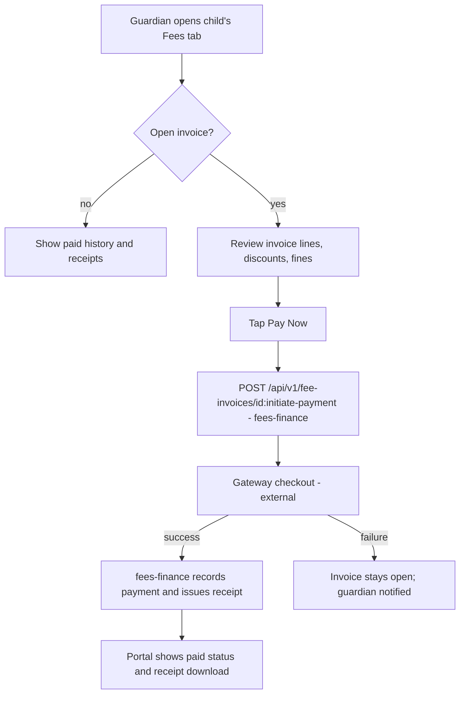

# Module: Parent Portal (incl. Student Self-Service View)

> **Agent Context** — Load this block first.
> **Summary:** Read-and-act portal for guardians across all of their linked children — attendance, fees, results, notices, school communication, and notification preferences — plus the equivalent self-service view for students (same read patterns, `own` scope). It owns no tables: it is a scoped presentation layer over other modules' data. Business value: it is the family-facing face of the school and the main driver of parent engagement and on-time fee payment.
> **Co-load with:** `../02-architecture/auth-and-rbac.md` · `../05-database/entities/people.md` · `fees-finance.md` · `communication.md` · `attendance.md` · `examinations.md`
> **Owns entities:** none (reads other modules' entities; see §15)
> **Depends on modules:** student-management, attendance, fees-finance, examinations, communication, timetable, library, transport

## 1. Purpose

The Parent Portal gives guardians a single place to see and act on everything concerning their children: daily attendance, fee invoices and payment initiation, published results and report cards, notices, and two-way communication with the school. One guardian account covers **multiple children** (one guardian ↔ many students via `student_guardians`), and one student can be visible to several guardians.

The same module also defines the **student self-service view**: an identically-scoped read experience where the principal is the student (own timetable, own attendance, own results, own fee status, own library loans), per the `student` role in [`users-and-roles.md`](../00-overview/users-and-roles.md).

## 2. Business Objective

- Reduce front-desk and phone load by making attendance, fees, and results self-serve.
- Improve fee-collection timeliness by pairing invoice visibility with in-portal payment initiation.
- Increase parent engagement (a scope §18 analytics area) with measurable portal-adoption and notice-read rates.
- Differentiate the product with the AI parent assistant (§14).

## 3. Target Users

| Role | How they use this module |
| ---- | ------------------------ |
| `guardian` | Views all linked children; pays fees; reads notices/results; messages the school; sets notification preferences |
| `student` | Student view: own timetable, attendance, results, fee status, library loans; AI study assistant |
| `school_admin` | Configures which portal panels are enabled per tenant; manages guardian account activation |
| `class_teacher` | Receives/answers guardian messages routed from the portal (via communication module) |

## 4. Permissions

Permissions follow the RBAC model in [`auth-and-rbac.md`](../02-architecture/auth-and-rbac.md). Permission keys use `<module>.<resource>.<action>`. The portal grants **no new data**: guardian/student roles hold other modules' `view` keys constrained to record-level scope `own` (guardian → own children; student → self). Guardian and student are restricted principals and can never hold staff keys.

| Permission key | Description | Default roles |
| -------------- | ----------- | ------------- |
| `parent-portal.dashboard.view` | Access the portal shell and per-child dashboard | `guardian`, `student` |
| `students.student.view` *(scope `own`)* | View linked children's / own profile | `guardian`, `student` |
| `attendance.student-attendance.view` *(scope `own`)* | View attendance records and summaries | `guardian`, `student` |
| `fees.invoice.view` *(scope `own`)* | View invoices, payment history, receipts | `guardian`, `student` |
| `fees.payment.create` *(scope `own`)* | Initiate online payment of an invoice (flow owned by fees-finance) | `guardian` |
| `exams.result.view` *(scope `own`)* | View published results and report cards only | `guardian`, `student` |
| `communication.thread.create` / `communication.message.create` *(scope `own`)* | Start/reply to a thread with the school about a linked child | `guardian`, `student` |
| `communication.notification-preference.update` *(scope `own`)* | Manage own channel preferences | `guardian`, `student` |

## 5. Main Features

1. **Multi-child dashboard** — one login, a switcher across all children linked via `student_guardians`; per-child summary cards (today's attendance, due fees, latest result, unread notices).
2. **Attendance visibility** — daily and monthly views, late/absent flags, absence reasons where recorded; read-only.
3. **Fee visibility & payment initiation** — open/paid invoices, line items, discounts/scholarships applied, downloadable receipts; "Pay now" hands off to the payment flow owned by [`fees-finance.md`](fees-finance.md).
4. **Results & report cards** — published results only (never draft/unapproved), downloadable report-card PDFs, term-over-term trend view.
5. **Notices & announcements** — tenant/class/section-targeted notices from [`communication.md`](communication.md), with read/acknowledgment tracking where required.
6. **Communication with school** — start message threads tied to a specific child; routed to the class teacher or configured office role.
7. **Notification preferences** — per-category, per-channel opt-in/out (emergency category not disableable).
8. **Student self-service view** — the student-role variant of the above, `own`-scoped, plus timetable, homework/assignment visibility, and library loans.

## 6. Sub-features

- **Dashboard:** child switcher; combined calendar (exams, holidays, fee due dates); profile view with guardian-visible fields only.
- **Attendance:** month grid; percentage vs. class threshold; absence-notification history.
- **Fees:** outstanding balance across all children; partial-payment display where the tenant allows it; receipt PDF download; payment-status tracking (`initiated → confirmed/failed`, states owned by fees-finance).
- **Results:** grade bands per tenant grading scale; teacher remarks; admit-card download during exam windows.
- **Communication:** thread history per child; attachment view; office-hours auto-notice (recommendation).
- **Preferences:** language/locale selection per user; quiet hours for push (recommendation).
- **Student view:** timetable by day/week; issued library books with due dates; transport route/stop info if assigned.

## 7. Workflows

**Guardian fee payment initiation** (payment execution itself is owned by fees-finance):

Steps: guardian (actor) selects invoice → portal calls the fees-finance initiation endpoint with an `Idempotency-Key` → gateway redirect → webhook confirmation updates `payments`/`receipts` (fees-finance tables) → portal reflects status and notification is sent. No approval gate; refunds/waivers are staff-side fees-finance workflows.

**Guardian messages the school:** guardian picks child → picks topic category → thread created (`message_threads`, communication module) → routed to class teacher / configured role → replies notify the guardian → thread closed by staff. Students follow the same flow scoped to self.

## 8. User Journeys

- **Guardian (daily):** push notification "Ayesha marked absent" → opens portal → checks attendance tab → messages class teacher with reason → later pays the month's invoice from the dashboard's due-fees card.
- **Guardian (term end):** result-published notification → views report card → downloads PDF → asks the AI parent assistant "how did she do compared to last term?"
- **Student (daily):** logs in with school-issued username → checks today's timetable → sees homework and library due date → asks the AI study assistant to explain a topic from the syllabus.

## 9. Inputs

- Guardian/student credentials and profile edits limited to contact fields (guardian phone/email — subject to school verification policy).
- Payment initiation requests (invoice id, amount context) — forwarded to fees-finance.
- Message thread posts and attachments (file-upload flow per [`api-architecture.md`](../02-architecture/api-architecture.md) §2.8).
- Notification-preference toggles; locale selection.
- Notice acknowledgments where a notice requires them.

## 10. Outputs

- No new domain records except communication artifacts (threads/messages, owned by communication) and payment initiations (owned by fees-finance).
- Downloaded documents: receipts, report cards, admit cards (PDFs generated by owning modules).
- Events consumed (not emitted): `attendance.marked`, `fee.invoice.issued`, `fee.paid`, `result.published`, `notice.published`.
- Portal-engagement telemetry (views, read receipts) feeding parent-engagement reports (§13).

## 11. Validations

- A guardian can only ever resolve students linked through an active `student_guardians` row; all queries carry scope `own` — violations return `404` per [`multi-tenancy.md`](../02-architecture/multi-tenancy.md) §3.
- Results are visible only when `results.status = published`; draft/withheld results are absent, not masked.
- Payment initiation re-validates invoice tenant/ownership/open balance server-side (fees-finance rules authoritative).
- Contact-field edits may require staff verification before taking effect (tenant-configurable, recommendation).
- Students cannot see sibling data or guardian financial history beyond their own invoices.

## 12. Notifications

| Event | Recipients | Channels | Template ref |
| ----- | ---------- | -------- | ------------ |
| Child marked absent/late | Linked guardians | push, SMS, in-app | `attendance.absence-alert` |
| Fee invoice issued / due reminder / payment confirmed | Linked guardians | email, SMS, push, in-app | `fees.invoice-issued`, `fees.due-reminder`, `fees.payment-receipt` |
| Result published | Guardians + student | push, in-app, email | `exams.result-published` |
| Notice targeting child's class | Guardians (+ students where addressed) | per preferences | `communication.notice-published` |
| New message reply | Thread participants | push, in-app | `communication.thread-reply` |

Channels and delivery behavior follow [`notifications.md`](../02-architecture/notifications.md); templates live in `notification_templates` ([`entities/communication.md`](../05-database/entities/communication.md)).

## 13. Reports

- **Parent engagement** (staff-facing, `reporting-analytics`): portal adoption %, active guardians, notice read rates, message response times — filters: campus, class, date range; export CSV/XLSX.
- **Guardian-facing summaries:** per-child attendance summary, fee statement (period-filtered), result history — export PDF.
- Role visibility per RBAC: staff reports require `reports.parent-engagement.view` (defined in reporting-analytics).

## 14. AI Capabilities

Cross-referenced to [`ai-features.md`](../04-ai/ai-features.md). All run server-side with the requesting user's permission context (`own` scope) per [`auth-and-rbac.md`](../02-architecture/auth-and-rbac.md) §3.

- **`AI-PAR-01` AI parent assistant** — natural-language Q&A over the guardian's own children only ("what fees are due?", "attendance this month?"). Read-only tool calls; never initiates payments; answers carry data citations.
- **`AI-PAR-02` Child performance digest** — periodic plain-language summary of attendance/results trends per child, generated on publish events. Sent only through normal notification channels; guardian can disable the category.
- **`AI-PAR-03` AI study assistant (student view)** — syllabus-aware explanations and practice questions for the student's own classes; age-appropriate content policy enforced; no access to other students' data.

Human-approval: none required for read-only Q&A; digest templates are tenant-approved before enablement (recommendation).

## 15. Database Entities

**This module owns no tables.** It reads, under RLS + `own` scope:
- `students`, `guardians`, `student_guardians`, `emergency_contacts` — [`entities/people.md`](../05-database/entities/people.md)
- `student_attendance` — [`entities/attendance.md`](../05-database/entities/attendance.md)
- `fee_invoices`, `fee_invoice_lines`, `payments`, `receipts` — [`entities/finance.md`](../05-database/entities/finance.md)
- `results`, `report_cards`, `admit_cards` — [`entities/examinations.md`](../05-database/entities/examinations.md)
- `notices`, `announcements`, `message_threads`, `messages`, `notifications`, `notification_preferences` — [`entities/communication.md`](../05-database/entities/communication.md)
- `timetable_slots`, `student_enrollments` — [`entities/academics.md`](../05-database/entities/academics.md); `book_issues`, `student_transport_assignments` — [`entities/library-transport-inventory.md`](../05-database/entities/library-transport-inventory.md)

## 16. API Requirements

Conventions per [`api-architecture.md`](../02-architecture/api-architecture.md). The portal consumes owning modules' endpoints under `own` scope, plus one aggregate:

- `GET /api/v1/parent-portal/dashboard` — per-child summary cards in one call (recommendation; avoids N calls on load).
- `GET /api/v1/students?scope=own` · `GET /api/v1/students/{id}/guardians` — child list/links.
- `GET /api/v1/student-attendance?student_id=…&month=…` — filters whitelisted: `student_id`, `date__gte/lte`, `status`.
- `GET /api/v1/fee-invoices?student_id=…&status=open` · `POST /api/v1/fee-invoices/{id}:initiate-payment` (fees-finance; `Idempotency-Key` required) · `GET /api/v1/receipts/{id}` (PDF).
- `GET /api/v1/results?student_id=…&status=published` · `GET /api/v1/report-cards/{id}` (PDF).
- `GET/POST /api/v1/message-threads`, `POST /api/v1/message-threads/{id}/messages` (communication).
- `GET/PATCH /api/v1/notification-preferences` (communication).

## 17. Integration Requirements

- **Payment gateways** — indirect only, via fees-finance; the portal never talks to gateways directly.
- **Notification providers** (email/SMS/push) — via the platform notification service ([`notifications.md`](../02-architecture/notifications.md)).
- **AI gateway** — for `AI-PAR-*` features per [`ai-architecture.md`](../02-architecture/ai-architecture.md).
- Future mobile apps consume these same endpoints unchanged (scope §20).

## 18. Dependencies on Other Modules

| Module | Direction | What is shared |
| ------ | --------- | -------------- |
| student-management | reads | students, guardian links, documents metadata |
| attendance | reads | student_attendance, absence notifications |
| fees-finance | reads + initiates | invoices, receipts; payment initiation (flow owned there) |
| examinations | reads | published results, report cards, admit cards |
| communication | reads + writes | notices, threads/messages, notifications, preferences |
| timetable / library / transport | reads | student's slots, loans, route assignment |

## 19. Open Questions / Recommendations

- Guardian self-registration vs. school-issued invitations: **recommendation — invitation-only** (school verifies guardianship before linking), self-registration deferred.
- Cross-school guardians (children in two tenant schools) are separate accounts per [`multi-tenancy.md`](../02-architecture/multi-tenancy.md) §1; account linking is a future enhancement.
- Whether guardians may edit emergency contacts directly or only request changes — default **request + staff approval** (recommendation).
- Portal panels (fees, results, transport, library) individually toggleable per tenant feature flags (recommendation).
