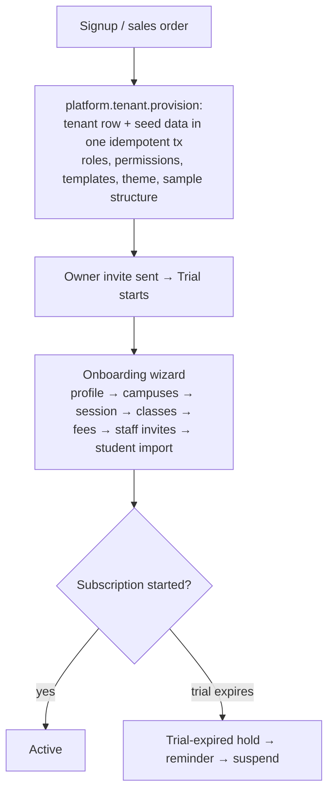
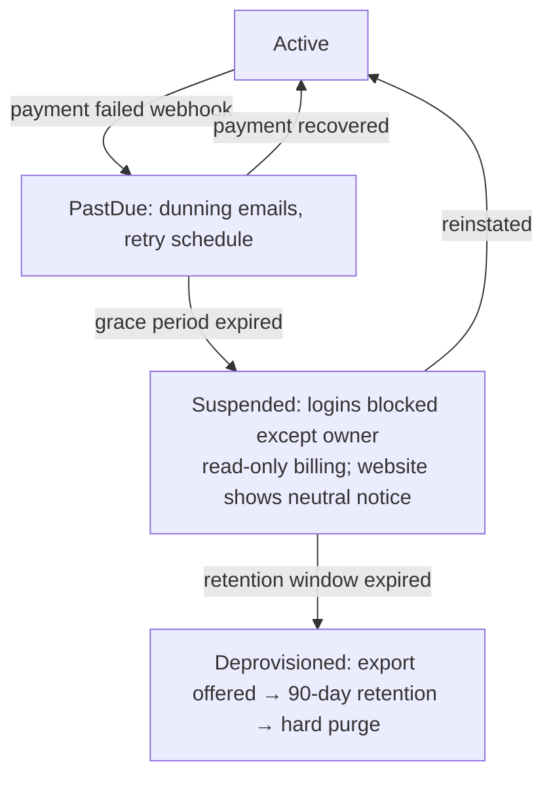

# Module: Platform Administration

> **Agent Context** — Load this block first.
> **Summary:** The platform (SaaS-operator) scope above all tenants: tenant lifecycle (provisioning → trial → active → suspension → deletion), plans/subscriptions and billing of schools, feature flags, usage tracking and quotas, the school onboarding wizard, legacy-data migration/import, platform-level aggregate reporting, and audited impersonation. Used only by platform roles — never by tenant users. Implements scope §10 and the platform items of §22.
> **Co-load with:** `../02-architecture/multi-tenancy.md` · `../02-architecture/auth-and-rbac.md` · `../05-database/entities/tenancy.md`
> **Owns entities:** `tenants`, `tenant_settings`, `plans`, `subscriptions`, `feature_flags`, `tenant_feature_overrides`, `custom_domains`
> **Depends on modules:** all tenant modules (flag/quota enforcement targets), reporting-analytics (boundary), website-cms (domain/suspension effects)

## 1. Purpose

The product is sold to many schools; someone has to operate the fleet. This module is the platform console where the SaaS operator provisions tenants, manages plans and subscriptions, bills schools, toggles feature flags, monitors usage against quotas, runs onboarding and legacy-data migrations, views aggregate platform reporting, and — under strict audit — impersonates tenant users for support.

Everything here runs in the **platform scope**: platform-scope JWTs, platform roles only ([`users-and-roles.md`](../00-overview/users-and-roles.md) §2), and a separate read path for reporting that never exposes row-level school data ([`multi-tenancy.md`](../02-architecture/multi-tenancy.md) §8).

## 2. Business Objective

- Make tenant acquisition cheap: provisioning is a single idempotent transaction, onboarding is self-guided — sales-to-live measured in hours, not weeks.
- Protect revenue: subscription states drive access (trial expiry, past-due dunning, suspension) automatically.
- Control margins: usage quotas (students, storage, SMS, AI tokens) enforce plan boundaries server-side.

## 3. Target Users

| Role | How they use this module |
| ---- | ------------------------ |
| `platform_super_admin` | Full platform control: tenants, plans, billing, flags, migrations, platform staff |
| `platform_support` | Tenant lookup, health/usage views, audited time-boxed impersonation; read-mostly |
| `school_owner` (touchpoint only) | Sees own subscription/billing state and the onboarding wizard inside the tenant dashboard — served by this module's tenant-facing endpoints, not the platform console |

## 4. Permissions

Permissions follow the RBAC model in [`auth-and-rbac.md`](../02-architecture/auth-and-rbac.md). Permission keys use `<module>.<resource>.<action>`. Module-specific verbs declared here: `provision`, `suspend`, `reinstate`, `impersonate`.

| Permission key | Description | Default roles |
| -------------- | ----------- | ------------- |
| `platform.tenant.view` | View tenant list, detail, health, usage | `platform_super_admin`, `platform_support` |
| `platform.tenant.provision` | Create/provision a tenant | `platform_super_admin` |
| `platform.tenant.update` | Edit tenant record, lifecycle metadata | `platform_super_admin` |
| `platform.tenant.suspend` / `platform.tenant.reinstate` | Suspend / reinstate a tenant | `platform_super_admin` |
| `platform.tenant.export` | Trigger full tenant data export | `platform_super_admin` |
| `platform.tenant.delete` | Start deprovision (retention → purge) | `platform_super_admin` |
| `platform.tenant.impersonate` | Time-boxed, reason-required impersonation | `platform_super_admin`, `platform_support` |
| `platform.plan.view` / `create` / `update` / `delete` | Manage plan catalog | `platform_super_admin` (view: + `platform_support`) |
| `platform.subscription.view` / `update` | Manage tenant subscriptions and billing state | `platform_super_admin` (view: + `platform_support`) |
| `platform.feature-flag.view` / `update` | Flag defaults and per-tenant overrides | `platform_super_admin` (view: + `platform_support`) |
| `platform.migration.import` | Run legacy-data imports into a tenant | `platform_super_admin` |
| `platform.report.view` | Platform aggregate reporting | `platform_super_admin`, `platform_support` |

Tenant users can never hold `platform.*` keys; the seed matrix forbids it structurally (platform permissions attach only to platform-scope roles).

## 5. Main Features

1. **Tenant lifecycle management** — create, provision (idempotent seed transaction), trial, activate, suspend, reinstate, export, and delete tenants per the state machine in multi-tenancy §7.
2. **Plans & subscriptions** — plan catalog (modules enabled, usage limits, price, trial length); per-tenant subscription with period tracking; plan upgrades/downgrades with proration rules *(recommendation)*.
3. **Billing of schools** — invoicing tenants for their subscription via a billing provider; dunning on failed payment → `past_due` → grace → suspension. (This bills *schools*; student fee billing is the tenant-side fees-finance module.)
4. **Feature flags** — platform flag registry with per-plan defaults and per-tenant overrides, kill-switch capable; every tenant module checks its flag server-side (multi-tenancy §5).
5. **Usage tracking & quotas** — metered counters per tenant (active students, staff, storage GB, SMS credits, AI tokens, API rate) vs. plan limits; soft-warn then hard-enforce.
6. **Onboarding wizard** — guided tenant setup: school profile → campuses → academic session → classes/sections → fee structures → staff invites → student import; resumable, with progress tracking.
7. **Data migration / legacy import** — Excel/CSV import pipelines (students, guardians, staff, fee balances, marks history) with mapping templates, dry-run validation, error reports, and rollback of a failed batch.
8. **Platform-level reporting** — aggregates only: tenant counts by state, MRR/ARR, usage/adoption per module, churn, support-load; never row-level school data.
9. **Impersonation with audit** — elevation grant (≤ 1 h, reason required, banner shown); every action tagged `impersonated_by` in `audit_logs` (RBAC §1).

## 6. Sub-features

- **Tenants:** slug management, lifecycle timestamps, suspension notice shown on the public website, deprovision retention countdown (90 days) with certificate of deletion.
- **Plans:** versioned plan changes never mutate existing subscriptions retroactively; grandfathering supported *(recommendation)*.
- **Billing:** billing-provider webhooks (payment succeeded/failed) drive subscription state; manual invoicing mode for bank-transfer markets *(recommendation — payment rails vary by country; currency per plan/tenant, none assumed)*.
- **Flags:** override expiry dates; flag audit trail; percentage rollouts for gradual feature releases *(recommendation)*.
- **Quotas:** per-quota grace thresholds (e.g. warn at 90%); AI token budgets enforced at the AI gateway; storage measured nightly.
- **Migration:** reusable mapping templates per source system; AI-assisted column mapping (`AI-PLA-01`); imports run as background jobs with per-row error files.

## 7. Workflows

### 7.1 Tenant provisioning & onboarding

### 7.2 Subscription dunning & suspension

### 7.3 Impersonation

Support agent requests elevation (tenant, target user, reason) → grant issued (≤ 1 h, auto-expiring) → agent operates the tenant dashboard with a persistent banner, target-user permissions apply (never superuser) → every mutation audit-tagged `impersonated_by` → grant expiry or manual release ends the session → tenant owner can view an impersonation log *(recommendation)*.

## 8. User Journeys

- **`platform_super_admin`:** morning console review → two trials expiring this week (nudge emails) → one past-due tenant recovered via dunning → provisions a new school from a sales order → creates a per-tenant flag override to pilot the new transport module.
- **`platform_support`:** ticket "parent can't see fee invoice" → looks up tenant → requests impersonation of the school admin with reason → reproduces, finds a role misconfiguration, fixes with the tenant's consent → releases the grant; everything is in the audit log.
- **`school_owner` (touchpoint):** completes the onboarding wizard over two evenings; the checklist shows student import pending; billing page shows the trial ending date and plan options.

## 9. Inputs

- Tenant creation data (name, slug, contact, plan, trial length); lifecycle actions with reasons.
- Plan definitions (modules, limits, price, currency, billing period); subscription changes; billing-provider webhook events.
- Flag definitions and overrides; quota configurations.
- Onboarding wizard step data (tenant-side); legacy import files (Excel/CSV) + mapping selections.
- Impersonation requests (tenant, user, reason, duration).

## 10. Outputs

- Provisioned, seeded tenants; subscription invoices to schools (via billing provider); export archives; certificates of deletion.
- Usage/quota counters and platform aggregate reports.
- Events: `tenant.provisioned`, `tenant.suspended`, `subscription.updated`, `quota.threshold-reached` (internal + operator alerting).
- Import result files (accepted/rejected rows with reasons).

## 11. Validations

- Tenant slug: globally unique, DNS-safe (it becomes the subdomain), immutable after provisioning *(recommendation: rename via support process only)*.
- Lifecycle transitions restricted to the state machine (multi-tenancy §7); suspension and deletion require a reason; deletion requires a completed or explicitly-waived export.
- Plan limits must not be lowered below a tenant's current usage without an explicit override acknowledgment.
- Flag overrides must reference registered flags; kill-switch flags cannot be overridden tenant-side.
- Imports: dry-run required before commit; per-row validation mirrors the owning module's rules (e.g. student rows validate like student-management creates); batch is transactional per entity type.
- Impersonation: duration ≤ 1 h, reason mandatory, cannot impersonate platform users, cannot chain grants.

## 12. Notifications

| Event | Recipients | Channels | Template ref |
| ----- | ---------- | -------- | ------------ |
| Tenant provisioned / owner invite | School owner | Email | `pla-owner-invite` |
| Trial expiring (7/3/1 days) | School owner | Email, in-app | `pla-trial-expiring` |
| Payment failed / dunning sequence | School owner, `platform_super_admin` | Email | `pla-payment-failed` |
| Tenant suspended / reinstated | School owner; platform ops | Email, in-app | `pla-tenant-suspended` |
| Quota threshold reached (90% / 100%) | School owner, `it_admin`; platform ops | Email, in-app | `pla-quota-threshold` |
| Import completed / failed | Initiating admin | In-app, email | `pla-import-result` |
| Impersonation grant issued/expired | Platform ops log; tenant owner *(recommendation)* | In-app | `pla-impersonation` |

Channels and delivery behavior follow [`notifications.md`](../02-architecture/notifications.md).

## 13. Reports

Platform aggregate reports (metrics only, never row-level tenant data — multi-tenancy §8), visible per `platform.report.view`:

- **Tenant overview** — counts by lifecycle state, signups/churn per month, time-to-active.
- **Revenue** — MRR/ARR by plan, dunning recovery rate, overdue subscriptions.
- **Usage & adoption** — module adoption per plan, storage/SMS/AI-token consumption distribution, quota-pressure list.
- **Support & health** — impersonation counts, error-rate and job-failure rates per tenant (operational metrics), onboarding funnel drop-off.

Exports CSV/Excel; scheduled variants via the same job infrastructure as [`reporting-analytics.md`](reporting-analytics.md) but on the platform read path.

## 14. AI Capabilities

Cross-referenced to [`ai-features.md`](../04-ai/ai-features.md). Platform AI features never read row-level tenant data without an explicit, audited operation (imports run inside the target tenant's scope).

- **`AI-PLA-01` — AI-assisted migration mapping** *(recommendation, scope §6 "OCR/document extraction" + §22 "data migration")*: propose column-to-field mappings and data-cleanup transforms from a sample of an uploaded legacy file; human confirms the mapping before any dry run.
- **`AI-PLA-02` — Churn & health insights** *(recommendation, scope §6 "predictive analytics")*: flag tenants with declining usage or quota/dunning stress for proactive outreach; advisory only, computed from aggregate metrics.
- **`AI-PLA-03` — Onboarding assistant** *(recommendation)*: conversational helper inside the wizard that turns a school's plain-language description ("we have 3 sections per grade from KG to 10") into draft academic structure for review.

## 15. Database Entities

Full column specs in [`../05-database/entities/tenancy.md`](../05-database/entities/tenancy.md).

- **Platform-scope (no `tenant_id`):** `tenants`, `plans`, `feature_flags`.
- **Tenant-scoped:** `tenant_settings` (1:1 with tenant), `subscriptions`, `tenant_feature_overrides`, `custom_domains` (bound via website-cms UI, owned here for lifecycle/TLS).
- **Shared platform primitives referenced, not owned by this module:** `users`, `roles`, `permissions`, `role_permissions`, `user_roles`, `audit_logs`, `files`, `webhooks`, `webhook_deliveries`, `background_jobs` (defined in the same entity file; owned by the auth/platform core).

## 16. API Requirements

Conventions per [`api-architecture.md`](../02-architecture/api-architecture.md). Platform-console resources are namespaced under `/api/v1/platform/...` and require platform-scope JWTs *(recommendation)*; tenant-facing touchpoints (billing view, onboarding) are normal tenant endpoints.

- `GET/POST /api/v1/platform/tenants` · `GET/PATCH /api/v1/platform/tenants/{id}` · `POST .../tenants/{id}:provision` / `:suspend` / `:reinstate` / `:export` / `:delete` (all with `Idempotency-Key`)
- `POST /api/v1/platform/tenants/{id}:impersonate` — returns a time-boxed elevated token; `DELETE /api/v1/platform/impersonation-grants/{id}` releases it
- `GET/POST/PATCH /api/v1/platform/plans` · `GET/PATCH /api/v1/platform/subscriptions/{id}` · billing webhooks at `POST /api/v1/platform/billing-events` (HMAC-verified)
- `GET/POST/PATCH /api/v1/platform/feature-flags` · `GET/POST/DELETE /api/v1/platform/tenants/{id}/feature-overrides`
- `GET /api/v1/platform/tenants/{id}/usage` · `GET /api/v1/platform/reports/{key}` (aggregate read path)
- `POST /api/v1/platform/tenants/{id}/imports` (`202` + job, dry-run flag) · `GET /api/v1/platform/imports/{id}`
- Tenant-facing: `GET /api/v1/subscription` (own billing state, `school_owner`) · `GET/PATCH /api/v1/onboarding` (wizard progress).

## 17. Integration Requirements

- **Billing provider** (e.g. Stripe or regional equivalent — *recommendation, gateway-agnostic adapter*): subscription invoicing, payment webhooks, dunning.
- **DNS/TLS edge** for subdomain wildcard + custom-domain issuance (shared with website-cms).
- **Email provider** for platform transactional mail; **object storage** for export archives and import files.
- **Observability stack** (metrics per tenant) feeding health reports; AI gateway for `AI-PLA-*` with platform-level budgets.

## 18. Dependencies on Other Modules

| Module | Direction | What is shared |
| ------ | --------- | -------------- |
| all tenant modules | outbound | Feature-flag and quota enforcement; module enablement per plan |
| website-cms | outbound | Suspension notice on public sites; custom-domain lifecycle |
| reporting-analytics | boundary | Tenant reporting stays tenant-side; platform aggregates stay here |
| fees-finance | none (namesake only) | School-side fee billing is unrelated to platform subscription billing |
| student-management / staff-management / examinations / fees-finance | outbound | Import pipelines write into these modules' entities under their validations |

## 19. Open Questions / Recommendations

- Billing provider choice, proration/grandfathering rules, manual-invoicing mode, and percentage flag rollouts are **recommendations** pending commercial decisions; pricing currency is per-plan configurable, no country assumed.
- Self-service signup vs. sales-assisted provisioning (or both) needs a client decision; the API supports both.
- Tenant-visible impersonation log and `AI-PLA-*` features are **recommendations**.
- Data residency/region pinning per tenant is out of initial scope; flagged for the compliance review (scope §22).
