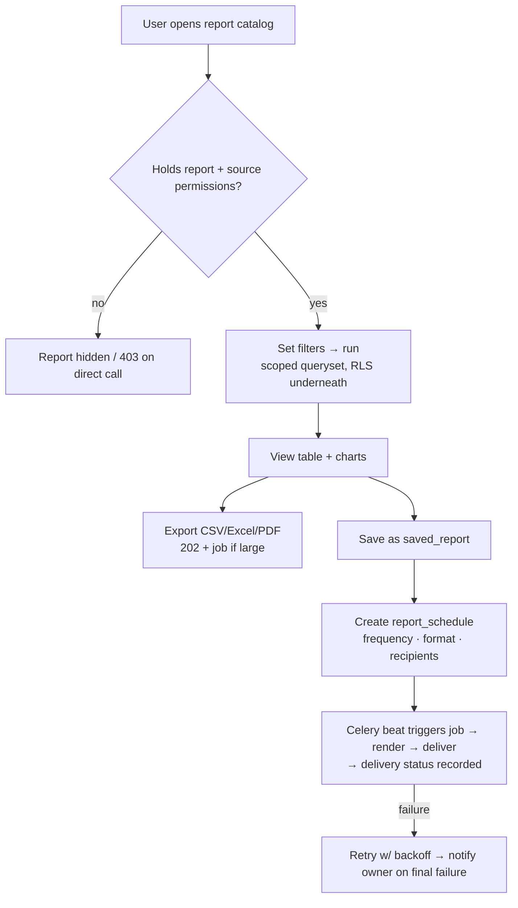
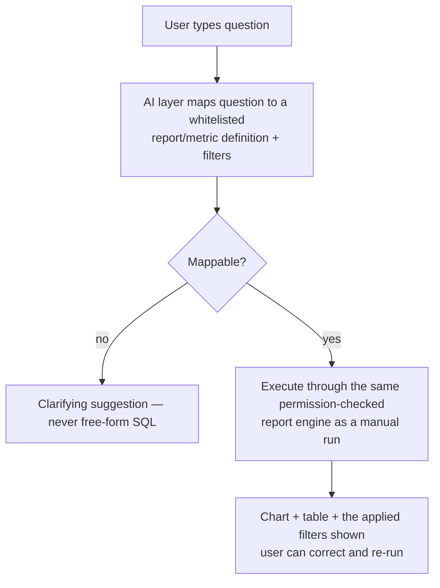

# Module: Reporting & Analytics

> **Agent Context** — Load this block first.
> **Summary:** Configurable reports and dashboards across every operational area (scope §18): student performance, attendance (student/teacher/staff), admissions, finance/fees, payroll, expenses, academic results, library, transport, inventory, parent engagement. Supports filters, charts, exports, scheduled reports, role-based visibility, and natural-language dashboard queries (`AI-RPT-01`). Owns almost no data — it reads other modules' entities under their permissions.
> **Co-load with:** `../02-architecture/auth-and-rbac.md` · `../02-architecture/api-architecture.md` · `../05-database/entities/tenancy.md`
> **Owns entities:** `saved_reports`, `report_schedules` *(recommendation — defined in [`../05-database/entities/tenancy.md`](../05-database/entities/tenancy.md))*
> **Depends on modules:** all data-producing modules (examinations, attendance, admissions, fees-finance, hr-leave, library, transport, inventory-assets, parent-portal, communication)

## 1. Purpose

Every module produces operational data; this module turns it into decisions. It provides a catalog of predefined, parameterized reports, role-appropriate dashboards, ad-hoc filtering and export, saved report configurations, and scheduled delivery. It is a **read layer**: it never mutates domain data and defines no domain tables of its own beyond saved configurations and schedules.

Platform-level (cross-tenant) reporting is explicitly *not* here — it aggregates metrics only and lives in [`platform-admin.md`](platform-admin.md) per [`multi-tenancy.md`](../02-architecture/multi-tenancy.md) §8.

## 2. Business Objective

- Replace spreadsheet-based board reporting: principals and owners get live dashboards instead of monthly manual compilation.
- Surface problems early — fee defaults, attendance drops, at-risk students — measurable via time-to-detection.
- A headline AI differentiator: staff ask questions in plain language instead of learning a report builder (`AI-RPT-01`).

## 3. Target Users

| Role | How they use this module |
| ---- | ------------------------ |
| `school_owner` | Whole-school dashboards: finance, admissions funnel, academics |
| `principal` / `vice_principal` | Academic performance, attendance, teacher-attendance dashboards; result analytics |
| `school_admin` | Operational reports across modules; schedules recurring reports |
| `accountant` / `finance_staff` | Fee collection, outstanding, expense, ledger reports |
| `hr_staff` | Payroll, leave, staff-attendance reports |
| `admission_staff` | Funnel and campaign conversion reports |
| `teacher` / `class_teacher` | Own-class performance and attendance views (scope `assigned`) |
| `librarian` / `transport_manager` / `store_keeper` | Their domain reports |

## 4. Permissions

Permissions follow the RBAC model in [`auth-and-rbac.md`](../02-architecture/auth-and-rbac.md). Permission keys use `<module>.<resource>.<action>`. Module-specific verbs declared here: `run`, `query`.

| Permission key | Description | Default roles |
| -------------- | ----------- | ------------- |
| `reports.report.run` | Run reports from the catalog | all staff roles (subject to the source-permission rule below) |
| `reports.report.export` | Export report output (CSV/Excel/PDF) | `school_owner`, `school_admin`, `principal`, `accountant`, `hr_staff` |
| `reports.dashboard.view` | View role dashboards | all staff roles |
| `reports.saved-report.view` / `create` / `update` / `delete` | Manage saved report configurations | any role with `reports.report.run` (own + shared) |
| `reports.report-schedule.create` / `update` / `delete` | Schedule recurring report delivery | `school_admin`, `school_owner`, `accountant`, `principal` |
| `reports.nl-query.query` | Natural-language dashboard queries (`AI-RPT-01`) | staff roles, per tenant AI policy |

**Source-permission rule (locked):** every catalog report declares the source-module permission keys it requires (e.g. the fee-collection report requires `fees.invoice.view`). Holding `reports.report.run` alone grants nothing — visibility is the *intersection* of the report permission and the source permissions, and record-level scopes (`own`/`assigned`/`campus`) filter rows exactly as in the source module. Exports are additionally audited (RBAC §4).

## 5. Main Features

1. **Report catalog** — predefined parameterized reports per area (§13), each with declared filters, groupings, columns, and required source permissions.
2. **Dashboards** — per-role dashboard layouts of KPI tiles and charts (enrollment, attendance today, fees collected vs. outstanding, admissions funnel…), filterable by session/term/campus/class.
3. **Filters, charts, exports** — every report supports its whitelisted filters, tabular + chart rendering, and CSV/Excel/PDF export.
4. **Saved reports** — save a report + filter configuration under a name; private, role-shared, or tenant-shared visibility.
5. **Scheduled reports** — deliver a saved report on a schedule (daily/weekly/monthly/term-end, tenant timezone) to chosen recipients via email/in-app, executed as background jobs (api-architecture §2.7).
6. **Natural-language queries** — ask "compare Grade 5 attendance this term vs last term" and get a chart + table (`AI-RPT-01`).

## 6. Sub-features

- **Catalog:** report metadata (area, description, required permissions) discoverable via API; per-tenant hiding of irrelevant reports (module disabled → reports hidden via feature flags).
- **Dashboards:** default layout per role, user-level tile arrangement *(recommendation)*; drill-through from a tile to the underlying report.
- **Exports:** long-running exports return `202` + job; files delivered via tenant-scoped signed URLs; PDF rendering via WeasyPrint.
- **Schedules:** per-schedule format and recipients (users/roles); failure retries and delivery-status visibility; pause/resume.
- **Comparatives:** period-over-period and session-over-session comparisons where the source data supports it.

## 7. Workflows

### 7.1 Run → save → schedule

### 7.2 Natural-language query (AI-RPT-01)

The AI **never generates raw SQL against tenant data**; it selects from the same declared report/metric definitions the user could run manually, so RBAC, record scopes, and RLS hold unchanged (enforcement per RBAC §3 — jobs/AI run with the initiating user's context).

## 8. User Journeys

- **Principal:** Monday dashboard glance → attendance tile shows a dip in Grade 7 → drills into the attendance report filtered to last two weeks → schedules it weekly to the vice principal.
- **Accountant:** month-end → runs fee collection vs. outstanding by class → exports Excel for the owner → saves the configuration as "Month-end collections" with a monthly schedule.
- **Teacher:** opens "My classes" dashboard (scope `assigned`) → views subject-wise result distribution after exams → no access to finance or other classes' data.
- **School owner:** types "how did admissions this campaign compare to last year" → NL query renders the funnel comparison → exports PDF for the board.

## 9. Inputs

- Report run parameters: report key + whitelisted filters (session, term, campus, class/section, date ranges, status enums).
- Saved-report definitions (name, report key, filter config, visibility); schedule definitions (frequency, timezone, format, recipients).
- Natural-language query text (`AI-RPT-01`).
- No domain data is entered here — all domain inputs belong to source modules.

## 10. Outputs

- Rendered report results (tabular JSON + chart series), export files (CSV/Excel/PDF) via signed URLs.
- Scheduled deliveries (email attachments/links, in-app notifications) with delivery status.
- Events emitted: `report.schedule.delivered`, `report.schedule.failed` (webhooks per api-architecture §2.6). Export actions written to `audit_logs`.

## 11. Validations

- Filters validated against each report's whitelist; date ranges bounded (max range per report) to protect the database.
- Saved report: name unique per owner; visibility ≥ role-shared requires the sharer to hold the report's source permissions at share time, and every viewer is re-checked at run time (no permission laundering through shared reports).
- Schedules: valid frequency, tenant-timezone aware, recipients must be active tenant members; a schedule is auto-paused when its owner loses the required permissions or is deactivated.
- Heavy reports forced through the async job path above a row/threshold budget; concurrent-run limits per tenant *(recommendation)*.

## 12. Notifications

| Event | Recipients | Channels | Template ref |
| ----- | ---------- | -------- | ------------ |
| Scheduled report delivered | Schedule recipients | Email, in-app | `rpt-schedule-delivered` |
| Scheduled report failed (final) | Schedule owner | In-app, email | `rpt-schedule-failed` |
| Large export ready | Requesting user | In-app | `rpt-export-ready` |

Channels and delivery behavior follow [`notifications.md`](../02-architecture/notifications.md).

## 13. Reports

The catalog itself (initial set; every area from scope §18 — each report lists filters/groupings/exports in its source module doc §13 where applicable):

| Area | Representative reports |
| ---- | ---------------------- |
| Student performance | Result distribution by class/subject, GPA trends, subject-difficulty comparison, at-risk list (see AI features in examinations) |
| Attendance | Student attendance by class/month, absentee list, teacher attendance, staff attendance, late-arrival/early-departure summaries |
| Admissions | Funnel (enquiry→application→interview→admitted), campaign conversion, source analysis |
| Finance & fees | Collection vs. outstanding, aging of dues, discount/scholarship totals, fine collections, income vs. expense, budget vs. actual, ledger summaries |
| Payroll | Payroll run summary, salary component breakdown, cost by department |
| Expenses | Expense by category/month, top vendors |
| Academic results | Pass-rate by class/term, grade-band distribution, session-over-session comparison |
| Library | Circulation, overdue list, fine collections, popular titles |
| Transport | Route occupancy, transport-fee collection, vehicle maintenance due |
| Inventory | Stock levels, movement history, asset assignment register |
| Parent engagement | Portal logins, notification read rates, fee-payment channel usage, meeting/communication response rates |

All reports: role-based visibility per §4, export CSV/Excel/PDF, chartable where meaningful.

## 14. AI Capabilities

Cross-referenced to [`ai-features.md`](../04-ai/ai-features.md).

- **`AI-RPT-01` — Natural-language dashboard queries** (scope §6): plain-language questions mapped to whitelisted report definitions and executed under the caller's permissions (workflow §7.2). No human approval needed — output is read-only — but every query and resolved definition is logged.
- **`AI-RPT-02` — AI-generated report narratives** (scope §6 "AI-generated reports"): attach a plain-language summary of findings/trends to any report output or scheduled delivery; clearly labeled as AI-generated.
- **`AI-RPT-03` — Predictive & anomaly insights** *(recommendation, scope §6 "predictive analytics")*: dashboard callouts for anomalies (attendance dips, fee-collection deviations) and simple forecasts (expected collections); advisory only, links to the underlying report. Domain-specific predictions (at-risk students, fee default) are owned by their modules and surfaced here.

## 15. Database Entities

This module owns **no domain tables** — it reads other modules' entities under their permissions. Owned configuration tables *(recommendation)*, tenant-scoped, defined in [`../05-database/entities/tenancy.md`](../05-database/entities/tenancy.md):

- `saved_reports` — named report + filter configurations with visibility.
- `report_schedules` — recurring delivery definitions with status/next-run tracking.

Report executions run as `background_jobs`; export files live in `files` (both in tenancy.md).

## 16. API Requirements

Conventions per [`api-architecture.md`](../02-architecture/api-architecture.md).

- `GET /api/v1/reports` — catalog (filtered to what the caller may run) · `GET /api/v1/reports/{key}` — metadata: filters, columns, required permissions
- `POST /api/v1/reports/{key}:run` — synchronous below threshold; `202` + job link above it · `POST /api/v1/reports/{key}:export` — always `202` + job (api-architecture §2.7)
- `GET/POST /api/v1/saved-reports` · `GET/PATCH/DELETE /api/v1/saved-reports/{id}`
- `GET/POST /api/v1/report-schedules` · `PATCH/DELETE /api/v1/report-schedules/{id}` · `POST /api/v1/report-schedules/{id}:pause` / `:resume`
- `GET /api/v1/dashboards/{role-or-key}` — tile definitions + data references
- `POST /api/v1/reports:query` — NL query (`AI-RPT-01`); response includes the resolved report key and applied filters for transparency.

## 17. Integration Requirements

- **Celery + Redis** for scheduled/async execution (tech-stack §2); Celery beat for schedules.
- **WeasyPrint** (PDF) and **openpyxl** (Excel) for exports; object storage + signed URLs for delivery.
- **AI gateway** ([`ai-architecture.md`](../02-architecture/ai-architecture.md)) for AI-RPT features, within per-tenant token budgets.
- Read-only access to source-module query services — via their service layer, never raw cross-module SQL *(recommendation: per-module "report provider" interfaces)*.

## 18. Dependencies on Other Modules

| Module | Direction | What is shared |
| ------ | --------- | -------------- |
| examinations, attendance, admissions, fees-finance, hr-leave, library, transport, inventory-assets, communication, parent-portal | inbound | Read-only report data under source permissions |
| platform-admin | inbound | Feature flags per plan (e.g. NL queries premium-gated); AI token quotas |
| communication | outbound | Scheduled-report delivery through notification channels |

## 19. Open Questions / Recommendations

- `saved_reports`/`report_schedules` as owned tables, per-user dashboard arrangement, concurrent-run limits, and AI-RPT-03 are **recommendations** — confirm with client.
- A drag-and-drop custom report *builder* (arbitrary fields/joins) is deliberately out of initial scope; the parameterized catalog + NL queries cover the need with far less security surface *(recommendation)*.
- Whether a read replica is warranted for reporting load is a Phase-2 hosting decision ([`hosting-deployment.md`](../02-architecture/hosting-deployment.md)).
