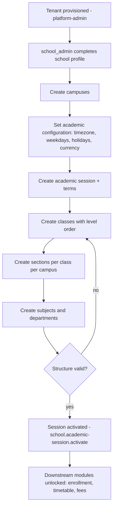
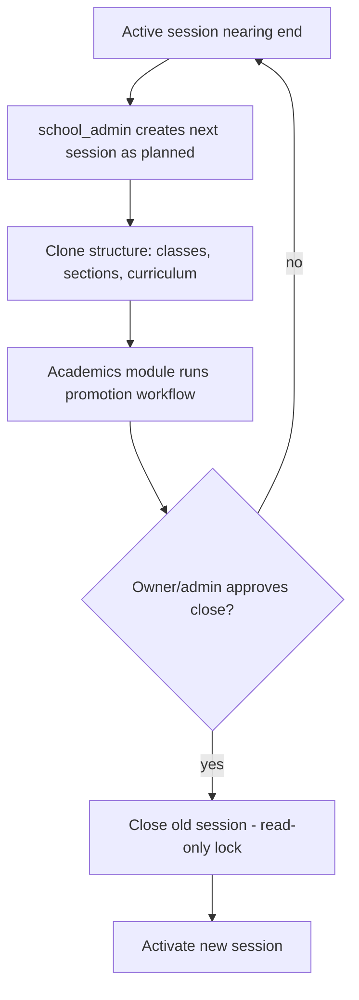

# Module: School & Organization Management

> **Agent Context** — Load this block first.
> **Summary:** Foundational module where a school defines its organizational and academic structure: school profile, campuses/branches, departments, academic sessions and terms, classes, sections, subjects, houses/groups, and academic configuration (calendar, weekdays/holidays, timezone, locale, currency). Every other module resolves classes, sections, subjects, and sessions from here. Business value: one correct structural source of truth per tenant.
> **Co-load with:** `../02-architecture/auth-and-rbac.md` · `../02-architecture/multi-tenancy.md` · `../05-database/entities/academics.md`
> **Owns entities:** campuses, departments, academic_sessions, terms, classes, sections, subjects, houses
> **Depends on modules:** platform-admin (tenant provisioning), staff-management (heads/class teachers), academics, timetable

## 1. Purpose

School & Organization Management captures the structural skeleton of a school as configurable data rather than code: where the school operates (campuses), how it is organized (departments), when it teaches (academic sessions, terms, calendar, timezone), and what it teaches to whom (classes, sections, subjects, houses). Because the platform is multi-tenant and "wildcard", two schools with very different structures (single campus vs. multi-branch, semester vs. trimester, houses vs. no houses) must both be representable without code changes.

It solves the classic SMS failure mode of hard-coded structure: here, the onboarding wizard and this module together let each tenant model its real organization, and all downstream modules (attendance, examinations, fees, timetable) reference these entities by ID.

## 2. Business Objective

- Enable a new school to be structurally operational within the onboarding session (target: < 1 day from signup to a usable class/section/subject tree) — a direct sales differentiator.
- Eliminate re-implementation cost per customer: 100% of organizational variation handled by configuration, 0 code forks per school.
- Guarantee referential correctness for every downstream module (no orphan sections, no attendance against a closed session).

## 3. Target Users

| Role | How they use this module |
| ---- | ------------------------ |
| `school_owner` | Approves top-level structure, currency/timezone, session close |
| `school_admin` | Primary operator: creates campuses, departments, sessions, classes, sections, subjects, houses; runs session rollover |
| `it_admin` | Academic configuration, locale/timezone, imports/exports of structure |
| `principal` / `vice_principal` | Reviews structure, assigns department heads and class teachers (via staff-management) |
| `teacher`, `exam_staff`, `accountant` | Read-only consumers (pickers/lookups) in their own modules |

## 4. Permissions

Permissions follow the RBAC model in [`auth-and-rbac.md`](../02-architecture/auth-and-rbac.md). Permission keys use `<module>.<resource>.<action>`. Module-specific verbs declared here: `activate`, `close` (academic sessions).

| Permission key | Description | Default roles |
| -------------- | ----------- | ------------- |
| `school.settings.view` / `school.settings.update` | View/edit school profile & academic configuration (calendar, timezone, locale, currency) | view: all staff; update: `school_owner`, `school_admin`, `it_admin` |
| `school.campus.view` / `.create` / `.update` / `.delete` | Manage campuses/branches | view: all staff; manage: `school_owner`, `school_admin` |
| `school.department.view` / `.create` / `.update` / `.delete` | Manage departments | view: all staff; manage: `school_admin`, `principal` |
| `school.academic-session.view` / `.create` / `.update` | Manage sessions & terms | view: all staff; manage: `school_admin` |
| `school.academic-session.activate` / `.close` | Session lifecycle transitions (audited) | `school_owner`, `school_admin` |
| `school.class.view` / `.create` / `.update` / `.delete` | Manage classes (grade levels) | view: all staff; manage: `school_admin`, `principal` |
| `school.section.view` / `.create` / `.update` / `.delete` | Manage sections | view: all staff; manage: `school_admin`, `principal` |
| `school.subject.view` / `.create` / `.update` / `.delete` | Manage subjects | view: all staff; manage: `school_admin`, `principal` |
| `school.house.view` / `.create` / `.update` / `.delete` | Manage houses/groups | view: all staff; manage: `school_admin` |
| `school.structure.import` / `.export` | Bulk import/export of structure (CSV/Excel) | `school_admin`, `it_admin` |

## 5. Main Features

1. **School profile & setup** — legal/display name, logo, contact details, registration numbers, address; feeds branding (see [`multi-tenancy.md`](../02-architecture/multi-tenancy.md) §5) and the public website.
2. **Campus/branch management** — one tenant, N campuses; each campus has its own address, rooms (timetable module), optional timezone override, and campus head. RBAC record scope `campus:<id>` restricts staff to a campus.
3. **Department management** — academic and administrative departments with heads; used by staff-management and the website.
4. **Academic sessions & terms** — session lifecycle (`planned → active → closed → archived`), term/semester breakdown, exactly one current session per tenant.
5. **Class & section management** — ordered grade levels (`classes.level` drives the promotion ladder) and per-campus sections with capacity and class teacher.
6. **Subject management** — subject catalog (core/elective/co-curricular) mapped to departments; curriculum mapping to classes lives in [`academics.md`](academics.md). The `class_subjects` *model* and `services.map_subject_to_class` still live in this app (the session-clone wizard writes them), but `/api/v1/class-subjects` is served by `apps/academics` under `academics.curriculum.*` — it used to sit here borrowing `school.subject.*` keys.
7. **Houses/groups** — configurable student groupings (houses, clubs modeled as houses with a type label) for sports, discipline, and points.
8. **Academic configuration** — working weekdays, holiday calendar, timezone, locale(s), currency, date formats, session naming pattern; all tenant-configurable with no country assumed. Grading scales are configured in [`examinations.md`](examinations.md).

## 6. Sub-features

- **School profile:** multiple contact points; social links; accreditation fields (custom fields JSONB); logo/favicon upload via the file service.
- **Campuses:** activate/deactivate; primary-campus flag; per-campus contact info; blocking delete when dependent records exist (soft delete only when empty).
- **Departments:** type (academic/administrative); optional campus scoping; head assignment from staff.
- **Sessions & terms:** clone next session from current (copies classes→sections mapping and curriculum via academics); term date validation inside the session window; archival lock (closed sessions become read-only for transactional modules).
- **Classes & sections:** ordering (`level`) for promotion; section capacity used by enrollment validation; section↔class-teacher assignment; merge/rename with history preserved via audit log.
- **Subjects:** unique code per tenant; elective pools flagged at curriculum level (academics module).
- **Houses:** color/motto/house master; student house assignment happens on the student profile (student-management).
- **Academic configuration:** holiday calendar (single dates + ranges, per-campus overrides); weekend definition; timezone per tenant with optional per-campus override; currency code used by fees-finance display. **Built.** The calendar is stored in `tenant_settings.academic` under three keys — `working_days` (weekday numbers, 0=Monday), `holidays` (a list of `{start_date, end_date, name, campus_id}`, where a null `campus_id` means every campus and a campus entry *adds to* the tenant-wide list; `start_date`/`end_date` rather than §16's filter names `from`/`to`, because `from` is a Python keyword) and `day_window` (`{start, end, grace_minutes}`) — rather than in its own table, because [`entities/tenancy.md`](../05-database/entities/tenancy.md) lists no `holiday_calendar` entity and a column per school that wants one more field is a migration per school. `apps/api/apps/school_organization/calendar.py` is the single reader; `attendance` marks against it (§11 there), and `examinations` and `hr-leave` will. Unconfigured tenants get Monday-Friday and an 08:00-14:00 day, so a school can mark attendance before anyone opens the settings screen.

## 7. Workflows

### 7.1 Initial structure setup (onboarding)

Steps: the onboarding wizard (platform-admin module) drives this module's APIs in order; activation runs a completeness check (≥1 campus, ≥1 class with ≥1 section, term dates covering the session) before flipping `is_current`.

### 7.2 Session rollover

Approval gate: `school.academic-session.close` is restricted and audited; closing is blocked while unexecuted promotion batches or unpublished results reference the session (cross-module check).

## 8. User Journeys

- **`school_admin` (setup):** signs in after provisioning → follows the wizard → creates 2 campuses, session "2026–27" with 3 terms, classes Grade 1–10 with sections A/B per campus, 14 subjects, 4 houses → activates the session → invites staff.
- **`school_admin` (yearly):** in the final term, clones next session → coordinates promotions with the principal (academics module) → closes the old session after results publish.
- **`it_admin`:** adjusts the holiday calendar mid-year for an unplanned closure; the attendance module immediately treats the date as a holiday.
- **`principal`:** reviews department structure, assigns heads, checks section capacities before admissions season.

## 9. Inputs

- Forms: school profile, campus, department, session/term, class, section, subject, house, academic-configuration editor (calendar grid).
- Bulk import: classes/sections/subjects via CSV/Excel templates (`school.structure.import`, background job per [`api-architecture.md`](../02-architecture/api-architecture.md) §2.7).
- API payloads from the onboarding wizard; logo/media uploads via the two-step file flow.

## 10. Outputs

- Structural records consumed tenant-wide (pickers, validation, RLS-scoped lookups).
- Exports: full structure CSV/Excel bundle; holiday calendar iCal export *(recommendation)*.
- Events emitted: `session.activated`, `session.closed`, `campus.created`, `section.created` (webhooks per §2.6 of the API doc); calendar changes notify attendance & timetable modules internally.
- Public-website data: departments, classes, campuses surfaced read-only to the website renderer via scoped machine tokens.

## 11. Validations

- Unique per tenant: campus code, department code, subject code, class name, session name; section name unique within (class, campus).
- Session dates must not overlap another session; term dates must nest inside their session; exactly one `is_current` session.
- `classes.level` unique per tenant (promotion ladder integrity).
- Deletion rules: entities with dependents (enrollments, timetable slots, marks, invoices) cannot be deleted — deactivate instead; soft delete allowed only when no references exist.
- Closed/archived sessions reject writes from transactional modules (enforced at service layer).
- Timezone must be a valid IANA identifier; currency a valid ISO 4217 code — both tenant-chosen, no default country assumed.

## 12. Notifications

| Event | Recipients | Channels | Template ref |
| ----- | ---------- | -------- | ------------ |
| Session activated | All staff | in-app, email | `school.session-activated` |
| Session closing soon (T-14 days) *(recommendation)* | `school_admin`, `principal` | in-app, email | `school.session-closing-reminder` |
| Holiday calendar changed | All staff; guardians (optional per tenant) | in-app, push | `school.calendar-updated` |
| Structure import completed/failed | Importing user | in-app, email | `school.import-result` |

Channels and delivery behavior follow [`notifications.md`](../02-architecture/notifications.md).

## 13. Reports

- **Structure summary:** campuses → classes → sections with capacity vs. enrolled count (filters: campus, session; export CSV/PDF).
- **Section utilization:** fill rate per section, over/under-capacity flags (filters: campus, class).
- **Subject catalog report:** subjects by department/type with class coverage (from academics curriculum data).
- **Academic calendar report:** working days, holidays, term boundaries per campus (export PDF/iCal).
Role visibility per RBAC; owners/admins see all campuses, campus-scoped staff see their campus only.

## 14. AI Capabilities

Cross-referenced to [`ai-features.md`](../04-ai/ai-features.md); all follow the AI security/approval rules there.

- `AI-SCH-01` **Setup copilot** — natural-language school setup ("We have two branches, Grades 1–8, three terms, Friday–Saturday weekend"): drafts campuses/sessions/classes/sections/subjects as a reviewable proposal. Human approval required before any record is created.
- `AI-SCH-02` **Natural-language structure search** — admins query configuration conversationally ("which sections in North Campus are over 90% capacity?"), executed under the caller's permission context.
- `AI-SCH-03` **Structure recommendations** — flags anomalies and suggests changes (unbalanced section sizes, missing curriculum coverage, calendar conflicts with exam schedules). Advisory only; no auto-apply.

## 15. Database Entities

Full column-level specs live in [`../05-database/entities/academics.md`](../05-database/entities/academics.md). All tables are tenant-scoped (implicit `tenant_id`, RLS).

| Table | Purpose |
| ----- | ------- |
| `campuses` | Physical branches of the school |
| `departments` | Academic/administrative departments |
| `academic_sessions` | School years with lifecycle status |
| `terms` | Term/semester breakdown of a session |
| `classes` | Grade levels with promotion ordering |
| `sections` | Class divisions per campus with capacity |
| `subjects` | Subject catalog |
| `houses` | Houses/groups for students |

## 16. API Requirements

Conventions per [`api-architecture.md`](../02-architecture/api-architecture.md) (pagination, filtering, envelope, errors).

- `GET/PATCH /api/v1/school-settings` — profile + academic configuration (singleton resource).
- `GET/POST /api/v1/campuses` · `GET/PATCH/DELETE /api/v1/campuses/{id}` — filters: `is_active`.
- `GET/POST /api/v1/departments`, `/api/v1/classes`, `/api/v1/sections`, `/api/v1/subjects`, `/api/v1/houses` + `{id}` detail routes — filters: `campus_id`, `class_id`, `is_active`, `search`.
- `GET/POST /api/v1/academic-sessions` · `PATCH /api/v1/academic-sessions/{id}` · `POST /api/v1/academic-sessions/{id}:activate` · `POST /api/v1/academic-sessions/{id}:close` · `POST /api/v1/academic-sessions/{id}:clone` (colon-actions, audited).
- `GET/POST /api/v1/terms` — filter: `academic_session_id`.
- `GET/PUT /api/v1/holiday-calendar` — calendar entries. **Built.** PUT replaces each list it names wholesale (merging entry by entry would leave no way to remove a holiday, which is what a cancelled closure needs); it takes the `school.settings.view`/`.update` keys, which §4 already describes as covering academic configuration. The `campus_id`/`from`/`to` *filters* are not built: the resource is a small singleton document, not a paginated list, so a client filters it client-side.
- `POST /api/v1/structure-imports` → `202` + job resource (bulk import).

## 17. Integration Requirements

- **Internal:** file service (logo/media), background jobs (imports, clone), audit logging, feature-flag service (module enablement per plan), website renderer (read-only structure via machine token).
- **External:** none required at launch; iCal feed export is outbound-only *(recommendation)*.

## 18. Dependencies on Other Modules

| Module | Direction | What is shared |
| ------ | --------- | -------------- |
| platform-admin | inbound | Tenant provisioning seeds default structure; onboarding wizard drives this module |
| staff-management | inbound/outbound | Department/campus heads and class teachers are `staff`; staff records reference departments/designations/campuses |
| academics | outbound | Classes/sections/subjects/sessions consumed for curriculum, allocation, promotion |
| student-management | outbound | Sections/houses/campuses consumed for enrollment and profiles |
| timetable | outbound | Sessions, sections, subjects; campus rooms/periods managed there |
| attendance / examinations / fees-finance | outbound | Calendar, sessions, class/section structure |
| website-builder | outbound | Departments, classes, campuses displayed publicly |

## 19. Open Questions / Recommendations

- *(recommendation)* Support mid-session structural changes (adding a section) with guided re-allocation rather than blocking them.
- *(recommendation)* Per-campus timezone override is modeled but should ship disabled unless a tenant genuinely spans timezones.
- **Open:** does any target school need class groupings above "class" (e.g. wings/streams as a first-class entity), or is the `houses` + custom-fields mechanism sufficient? Default: not a first-class entity.
- **Open:** whether closed sessions should permit late corrections (marks amendments) via a controlled exception workflow — proposed: yes, with `principal` approval and audit.
