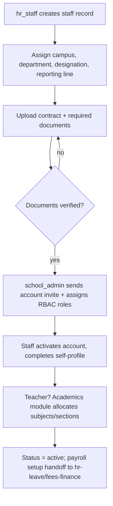
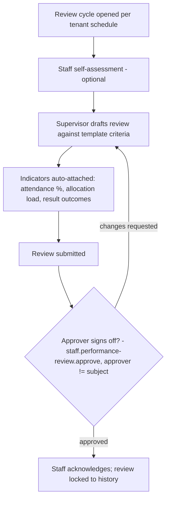

# Module: Teacher & Staff Management

> **Agent Context** — Load this block first.
> **Summary:** System of record for all school employees — teachers and non-teaching staff: profiles, department/designation placement, qualifications, verified documents, and performance tracking. Staff attendance lives in `attendance.md`; leave, approval workflows, and payroll inputs live in `hr-leave.md` — this module owns the *person and their employment record*.
> **Co-load with:** `../02-architecture/auth-and-rbac.md` · `../05-database/entities/people.md` · `hr-leave.md` · `school-organization.md`
> **Owns entities:** staff, designations, staff_qualifications, staff_documents
> **Depends on modules:** school-organization (departments, campuses), hr-leave (leave/payroll), attendance (staff attendance), academics (teaching allocations)

## 1. Purpose

Teacher & Staff Management maintains one authoritative employment record per staff member: identity, contact details, campus/department/designation placement, employment type and status, reporting line, qualifications, and a verified document vault (contracts, certificates, IDs). It links each staff record to a platform user account so RBAC roles (e.g. `teacher`, `accountant`) attach to a real employee, and it provides performance tracking — periodic reviews combining configurable criteria with observed indicators from other modules.

The module deliberately excludes day-to-day time and absence handling: staff attendance (including late arrival and early departure) is specified in [`attendance.md`](attendance.md), and leave policies/requests/approvals plus payroll integration are specified in [`hr-leave.md`](hr-leave.md). This module is those modules' source of truth for *who the employee is*.

## 2. Business Objective

- Single employee master shared by HR, payroll, timetable, and academics — no duplicate staff registries (target: 100% of payroll and allocation records resolvable to one `staff` row).
- Faster onboarding: invite-to-productive time for a new teacher under one day (account, role, department, documents).
- Auditable compliance: qualification and document verification status visible at a glance; expiring documents never silently lapse.
- Retention and quality: structured performance history supporting fair reviews and AI-assisted insights.

## 3. Target Users

| Role | How they use this module |
| ---- | ------------------------ |
| `hr_staff` | Primary operator: creates/maintains staff records, qualifications, documents; runs onboarding/exit |
| `school_admin` | Manages designations, department placement, account/role assignment |
| `principal` / `vice_principal` | Reviews teacher rosters, conducts/approves performance reviews |
| `school_owner` | Approves senior appointments and exits; views org-wide reports |
| `teacher` and all staff | View/update own profile subset (record scope `own`); upload own documents |
| `it_admin` | Bulk import/export; portal account troubleshooting |

## 4. Permissions

Permissions follow the RBAC model in [`auth-and-rbac.md`](../02-architecture/auth-and-rbac.md). Permission keys use `<module>.<resource>.<action>`. Module-specific verb declared here: `verify` (documents/qualifications).

| Permission key | Description | Default roles |
| -------------- | ----------- | ------------- |
| `staff.staff.view` | View staff profiles (scopes: `own`, `campus`, `all`; salary-adjacent fields masked without hr permissions) | all staff (own); `hr_staff`, `school_admin`, `principal` (all) |
| `staff.staff.create` / `.update` / `.delete` | Manage staff records (delete = soft; exit workflow preferred) | `hr_staff`, `school_admin` |
| `staff.staff.import` / `.export` | Bulk import/export (audited) | `hr_staff`, `it_admin` |
| `staff.designation.view` / `.create` / `.update` / `.delete` | Manage designation catalog | view: all staff; manage: `school_admin`, `hr_staff` |
| `staff.qualification.view` / `.create` / `.update` / `.verify` | Manage & verify qualifications | `hr_staff`; verify also `principal`; own-create: all staff |
| `staff.document.view` / `.create` / `.verify` / `.delete` | Manage & verify staff documents | `hr_staff`; own-view/create: all staff |
| `staff.performance-review.view` / `.create` / `.update` | Create and edit performance reviews | `principal`, `vice_principal`, `hr_staff` |
| `staff.performance-review.approve` | Finalize a review (reviewer ≠ subject) | `principal`, `school_owner` |

## 5. Main Features

1. **Staff profiles** — full employment record: identity, photo, contact, national ID, employment type (`full_time | part_time | contract | visiting`), status, joining/exit dates, reporting line, custom fields.
2. **Teacher profiles** — teaching staff carry additional teaching context surfaced from other modules: subjects qualified/allocated (academics), timetable load (timetable), homeroom section; a public-bio subset can be published to the school website.
3. **Department & campus placement** — staff assigned to a department and campus (structure owned by [`school-organization.md`](school-organization.md)); heads and reporting lines drive approval routing in other modules.
4. **Designations** — tenant-defined designation catalog (e.g. Senior Teacher, Coordinator) with optional seniority level; drives salary-structure mapping in fees-finance payroll.
5. **Qualifications** — degrees, diplomas, certifications, trainings, licenses with issuing institution, year, and verification status; document evidence attached.
6. **Staff documents** — typed vault (contract, ID, certificates, police clearance where applicable) with verification workflow and expiry tracking.
7. **Onboarding & exit** — guided onboarding (record → account invite → roles → documents) and exit workflow (clearance checks, access revocation, final settlement handoff to payroll).
8. **Performance tracking** — review cycles (configurable frequency and criteria per tenant) combining self-assessment, supervisor rating, and observed indicators (attendance regularity, result outcomes, parent feedback) with an approval gate. Attendance/leave day-to-day handling: see [`attendance.md`](attendance.md) and [`hr-leave.md`](hr-leave.md) — cross-referenced, not duplicated here.

## 6. Sub-features

- **Profiles:** employee-number auto-generation (tenant pattern); photo upload; status transitions (`active → on_leave → active`, `active → resigned/retired/terminated`) with effective dates; self-service edit of a whitelisted field subset with HR approval for the rest *(recommendation)*.
- **Account linkage:** creating a staff record can trigger a user-account invite; role assignment per RBAC (a staff row may exist before its user account, e.g. during onboarding).
- **Designations:** activate/deactivate; blocked deletion while assigned; mapping to payroll salary structures maintained in fees-finance.
- **Qualifications:** multiple per staff; verification with evidence; highest-qualification rollup for reports.
- **Documents:** expiry reminders (contracts, licenses); private-by-default visibility (subject + HR + principal).
- **Performance:** review templates (criteria + weightings) per tenant; review states `draft → submitted → acknowledged → approved`; staff member sees and acknowledges the finalized review; historic reviews immutable after approval.

## 7. Workflows

### 7.1 Staff onboarding

### 7.2 Performance review cycle

Exit workflow (summary): initiate with reason + last working day → clearance checks (handover of sections/subjects via academics & timetable, assets via inventory, advances via payroll) → approval (`school_owner`/`principal` for senior roles) → access revoked on effective date → record retained read-only.

## 8. User Journeys

- **`hr_staff`:** hires a science teacher → creates the record, uploads contract and degree certificates, marks them verified → triggers the account invite → tracks onboarding checklist to green.
- **`school_admin`:** restructures designations before the new session → adds "Coordinator" designation → reassigns three staff → reporting lines update approval routing automatically.
- **`teacher`:** updates own phone number and uploads a new certification → sees it pending HR verification → later reviews and acknowledges the annual performance review.
- **`principal`:** opens the review dashboard at term end → completes reviews for department heads with auto-attached indicators → approves department heads' reviews of their teams.

## 9. Inputs

- Forms: staff record, designation editor, qualification entry, document upload, performance review forms (template-driven), exit wizard.
- Bulk import: staff CSV/Excel (migration), with row-level error reporting via background job.
- File uploads: photos, contracts, certificates (two-step presigned flow per [`api-architecture.md`](../02-architecture/api-architecture.md) §2.8).
- Cross-module indicator feeds (read-only): attendance summary, allocation load, exam-result aggregates.

## 10. Outputs

- Staff master records consumed by hr-leave, payroll (fees-finance), timetable, academics, communication.
- Generated documents: staff ID cards (PDF), employment-verification letters (via certificates & documents module), roster exports (CSV/Excel).
- Events emitted: `staff.created`, `staff.activated`, `staff.exited`, `staff.designation-changed` (webhooks per API doc §2.6).
- Public website feed: opt-in teacher bios/photos per tenant configuration (website-builder).
- Finalized performance reviews (immutable records + PDF export).

## 11. Validations

- `employee_number` unique per tenant, immutable; national ID unique per tenant when provided.
- Designation and department must be active and belong to the tenant; campus required.
- Reporting line must be acyclic (no self/circular `reports_to`).
- Exit date ≥ joining date; status transitions restricted to the defined state machine; exit blocked while the staff member is the sole class teacher or has unhandled allocations (cross-module check with guided reassignment).
- Qualification year plausible (not in the future); verification requires attached evidence.
- Performance review approver ≠ review subject (segregation of duties per RBAC §2.4); reviews immutable after approval.
- Document type/size whitelist + AV scan; sensitive documents visible only to subject, `hr_staff`, `principal`, `school_owner`.

## 12. Notifications

| Event | Recipients | Channels | Template ref |
| ----- | ---------- | -------- | ------------ |
| Account invite | New staff member | email, SMS | `staff.portal-invite` |
| Onboarding checklist incomplete (T+7 days) | `hr_staff` | in-app | `staff.onboarding-reminder` |
| Document/qualification verified or rejected | Staff member | in-app, email | `staff.document-status` |
| Document expiring (T-30 days) | Staff member; `hr_staff` | in-app, email | `staff.document-expiry` |
| Performance review submitted / approved | Staff member; approver | in-app, email | `staff.review-status` |
| Exit approved | Staff member; `hr_staff`; `it_admin` (access revocation) | in-app, email | `staff.exit-approved` |

Channels and delivery behavior follow [`notifications.md`](../02-architecture/notifications.md).

## 13. Reports

- **Staff register:** roster with filters (campus, department, designation, staff type, employment type, status); export CSV/Excel/PDF.
- **Headcount & structure:** counts by department/designation/campus; joiners/leavers per period; vacancy view against sanctioned positions *(recommendation)*.
- **Qualification matrix:** teachers × qualifications/subjects, verification status (visibility: `hr_staff`, `principal`).
- **Document compliance:** missing/unverified/expiring documents by department.
- **Performance summary:** review completion rate, rating distributions by department (aggregate; individual reviews restricted to reviewer chain + HR).
- Staff attendance/leave reports live in [`attendance.md`](attendance.md) and [`hr-leave.md`](hr-leave.md).

## 14. AI Capabilities

Cross-referenced to [`ai-features.md`](../04-ai/ai-features.md); advisory outputs only, always with human decision-makers.

- `AI-STF-01` **Teacher performance insights** — synthesizes allocation load, attendance regularity, class results, and parent-communication signals into narrative insights for review preparation; shown only to users holding `staff.performance-review.create`; explicitly excluded from automated decisions.
- `AI-STF-02` **Document & credential extraction (OCR)** — extracts fields from uploaded degrees/IDs to pre-fill qualification records; human confirms every value before save.
- `AI-STF-03` **Natural-language staff search** — "science teachers at North Campus with M.Sc. and under 20 weekly periods" — executed strictly under the caller's permission scope.
- `AI-STF-04` **Workload balance recommendations** — flags over/under-allocated teachers ahead of allocation season (consumes academics/timetable data). Advisory only.

## 15. Database Entities

Full column-level specs live in [`../05-database/entities/people.md`](../05-database/entities/people.md). All tenant-scoped under RLS.

| Table | Purpose |
| ----- | ------- |
| `staff` | Employee master record (teaching & non-teaching) |
| `designations` | Tenant-defined designation catalog |
| `staff_qualifications` | Degrees/certifications with verification |
| `staff_documents` | Typed, verifiable staff document vault |

Performance reviews are stored as structured records; see §19 for the proposed `staff_performance_reviews` table *(recommendation — pending consistency pass, not in the locked entity map)*.

## 16. API Requirements

Conventions per [`api-architecture.md`](../02-architecture/api-architecture.md).

- `GET/POST /api/v1/staff` · `GET/PATCH/DELETE /api/v1/staff/{id}` — filters: `campus_id`, `department_id`, `designation_id`, `staff_type`, `employment_status`, `search`.
- `POST /api/v1/staff/{id}:invite` (account invite) · `POST /api/v1/staff/{id}:exit` (exit workflow, colon-actions, audited).
- `GET/POST /api/v1/designations` · `GET/PATCH/DELETE /api/v1/designations/{id}`.
- `GET/POST /api/v1/staff/{id}/qualifications` · `POST /api/v1/staff-qualifications/{id}:verify`.
- `GET/POST /api/v1/staff/{id}/documents` · `POST /api/v1/staff-documents/{id}:verify`.
- `GET/POST /api/v1/performance-reviews` · `POST /api/v1/performance-reviews/{id}:submit` · `:approve` — filters: `staff_id`, `cycle`, `status`.
- `POST /api/v1/staff-imports` → `202` + job resource.

## 17. Integration Requirements

- **Internal:** user/account service (invites, role assignment per RBAC), file storage (photos, documents), PDF generation (ID cards, letters), notification service, background jobs, audit log, AI gateway (`AI-STF-*`), website renderer (public teacher bios via machine token).
- **External:** email/SMS via the notification adapter layer; background-check providers out of scope at launch *(recommendation: manual document upload instead)*.

## 18. Dependencies on Other Modules

| Module | Direction | What is shared |
| ------ | --------- | -------------- |
| school-organization | inbound | Campuses, departments referenced by staff placement; heads assigned from staff |
| hr-leave | outbound | Employee master feeds leave policies/balances and payroll inputs |
| attendance | outbound | Staff identity for staff attendance, late arrival, early departure |
| academics / timetable | outbound | Teacher records for subject/teacher allocation, substitutions, load indicators |
| fees-finance | outbound | Designation & employment data feed salary structures and payroll runs |
| communication | outbound | Staff directory for internal messaging and announcements |
| website-builder | outbound | Published teacher/department profiles |

## 19. Open Questions / Recommendations

- *(recommendation)* Add `staff_performance_reviews` (review cycle, template snapshot, ratings JSONB, state, approved_by) as an owned table — flagged for the entity-map consistency pass since the locked map does not yet include it.
- *(recommendation)* Keep salary data entirely in fees-finance payroll tables; this module stores no compensation figures, simplifying its visibility model.
- **Open:** should visiting/contract staff bypass parts of onboarding (fewer mandatory documents)? Proposed: per-employment-type document requirement sets, tenant-configurable.
- **Open:** whether performance indicators should include AI-derived scores by default — proposed: off by default, tenant opt-in with staff disclosure.
