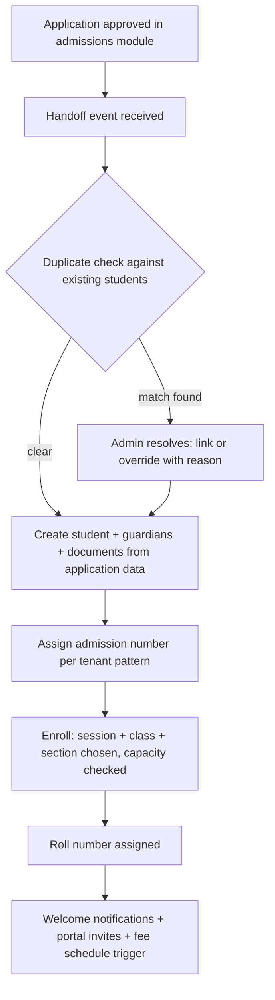
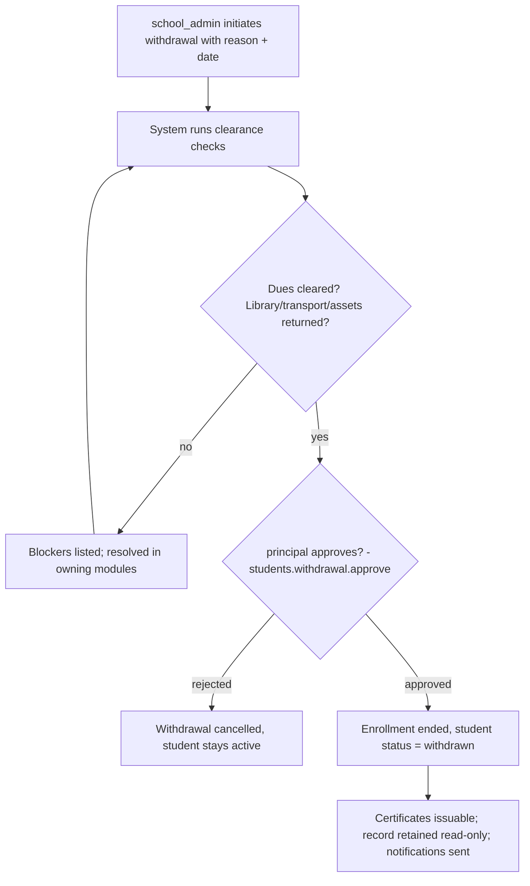

# Module: Student Management

> **Agent Context** — Load this block first.
> **Summary:** Master record of every student: registration and profiles, admission handoff and enrollment, ID generation, class/section allocation, transfers, promotion execution records, withdrawal, documents, guardians, emergency contacts, and full student history. Used daily by admins and class teachers; nearly every module (attendance, exams, fees, transport, library) references the student entity defined here.
> **Co-load with:** `../02-architecture/auth-and-rbac.md` · `../05-database/entities/people.md` · `admissions.md` · `academics.md`
> **Owns entities:** students, guardians, student_guardians, emergency_contacts, student_documents, student_transfers, student_enrollments
> **Depends on modules:** admissions (enrollment source), school-organization (structure), academics (promotion decisions), fees-finance (dues on exit)

## 1. Purpose

Student Management is the system of record for the people the school exists to serve. It maintains a single, versioned student profile per child — identity, demographics, photo, health notes, documents, guardians, and emergency contacts — plus the student's academic placement over time via session-scoped enrollments (class, section, roll number). It handles the lifecycle events that change that placement: enrollment (handed off from admissions), class/section allocation, inter-campus and outbound transfers, promotion execution (decided in the academics module), and withdrawal.

By separating the durable person (`students`) from the per-session placement (`student_enrollments`), the module gives every other module an unambiguous answer to both "who is this student?" and "where were they in session X?" — the basis for accurate attendance, results, fees, and history.

## 2. Business Objective

- One authoritative student record per child: zero duplicate admissions (target: duplicate rate < 0.5% via matching checks).
- Cut administrative time for lifecycle events (enrollment, transfer, withdrawal) from paper processes to guided digital workflows with approvals (target: same-day completion).
- Complete, exportable student history — a compliance and parent-trust asset, and the substrate for AI risk analytics.

## 3. Target Users

| Role | How they use this module |
| ---- | ------------------------ |
| `school_admin` | Full lifecycle: registration, allocation, transfers, withdrawal, corrections, imports |
| `admission_staff` | Creates students via admissions handoff; verifies documents |
| `class_teacher` | Views/updates own section's students (record scope `assigned`); maintains roll order; flags data issues |
| `principal` / `vice_principal` | Approves transfers and withdrawals; reviews history |
| `reception` | Looks up students for front-desk queries (read-only subset) |
| `teacher` | Read-only profile subset for assigned sections |
| `guardian` / `student` | View own profile data via parent-portal (record scope `own`); request corrections |
| `it_admin` | Bulk import/export, ID-card batch generation |

## 4. Permissions

Permissions follow the RBAC model in [`auth-and-rbac.md`](../02-architecture/auth-and-rbac.md). Permission keys use `<module>.<resource>.<action>`. Module-specific verbs declared here: `enroll`, `withdraw`, `generate` (ID cards), `verify` (documents).

| Permission key | Description | Default roles |
| -------------- | ----------- | ------------- |
| `students.student.view` | View student profiles (record scopes apply: `own`, `assigned`, `campus`, `all`) | all staff (scoped); `guardian`/`student` (own) |
| `students.student.create` / `.update` / `.delete` | Manage student records (delete = soft, admin-only) | `school_admin`; create also `admission_staff` |
| `students.student.import` / `.export` | Bulk CSV/Excel import & export (audited) | `school_admin`, `it_admin` |
| `students.enrollment.enroll` / `.update` | Enroll into session/class/section; change allocation | `school_admin`, `admission_staff` |
| `students.transfer.create` / `.approve` | Request / approve transfers (segregation of duties) | create: `school_admin`; approve: `principal` |
| `students.student.withdraw` | Initiate withdrawal | `school_admin` |
| `students.withdrawal.approve` | Approve withdrawal after clearance checks | `principal`, `school_owner` |
| `students.document.view` / `.create` / `.verify` / `.delete` | Manage & verify student documents | `school_admin`, `admission_staff`; verify also `principal` |
| `students.guardian.view` / `.create` / `.update` | Manage guardians & links | `school_admin`, `admission_staff`, `reception` (view) |
| `students.id-card.generate` | Generate student ID cards (single/batch) | `school_admin`, `it_admin` |

## 5. Main Features

1. **Student registration** — creation of the student master record: direct entry (walk-in/legacy), bulk import (migration from existing systems), or automatic handoff from an approved admission application.
2. **Student profiles** — demographics, photo, health/medical notes, address, house assignment, configurable custom fields (JSONB), portal account linkage.
3. **Admission handoff & enrollment** — an approved application in [`admissions.md`](admissions.md) triggers `student + enrollment` creation here; enrollment binds student → session → class → section → roll number.
4. **Student ID generation** — tenant-configurable admission-number pattern (e.g. `{campus}{year}-{seq}`) and printable ID cards (PDF, template-driven) with QR/barcode.
5. **Class/section allocation** — initial allocation at enrollment plus mid-session section changes with capacity checks and history.
6. **Transfers** — inter-campus transfers and outbound transfers to other schools (with transfer-certificate issuance via the certificates & documents module).
7. **Promotion execution** — applies approved promotion batches from [`academics.md`](academics.md): closes old enrollment, creates the new one; this module records, academics decides.
8. **Withdrawal** — guided exit with clearance checks (fees dues, library returns, transport), approval gate, and record retention.
9. **Documents, guardians & emergency contacts** — verified document vault per student; guardians as first-class persons linked N:M with per-link flags; ordered emergency contacts.
10. **Student history** — chronological timeline per student: enrollments, allocation changes, transfers, promotions, document events, and status changes.

## 6. Sub-features

- **Registration:** duplicate detection on create/import (name + DOB + guardian phone fuzzy match) with override + reason; photo upload with size/type validation; sensitive-field visibility rules (medical notes limited to admins + class teacher) *(recommendation)*.
- **Enrollment & ID:** one active enrollment per student per session; roll-number auto-assignment (alphabetical or manual) unique within section; admission-number sequence gaps never reused; batch ID-card generation as a background job producing a merged PDF.

**Implementation note (as shipped):** the ID-card template carries a QR code only (encoding `{tenant_id}:{admission_number}`), no barcode — there is no verification endpoint yet to resolve either against, and api-architecture.md §17 does not mandate both appear on one card. `POST /student-imports` requires the exact template column headers (`first_name`, `last_name`, `date_of_birth`, `gender`, `campus_code`, `admission_date`, plus the optional fields) — mapping arbitrary legacy headers is not built. `POST /student-exports` is not record-scope-narrowed (it exports every tenant student); `students.student.export` is admin-only in practice, so this has not needed a per-caller filter yet.
- **Transfers:** inter-campus keeps the student record, moves campus + section; outbound sets status `transferred` and feeds certificate issuance.
- **Withdrawal:** clearance checklist aggregated cross-module (outstanding invoices, un-returned books, transport/asset assignments); refund handling delegated to fees-finance.
- **Guardians:** one guardian may link to multiple children (and vice versa); per-link `relationship`, `is_primary`, `can_pick_up`, `is_fee_responsible`, `receives_communications`; guardian portal account optional; change-request flow via parent-portal.
- **Documents:** typed uploads (birth certificate, prior transfer certificate, immunization, etc. — tenant-extensible types), verification status, expiry tracking with reminders.

## 7. Workflows

### 7.1 Admission handoff → enrollment

Actors: `admission_staff` / `school_admin`. States on enrollment: `active` thereafter. The handoff is idempotent (application ID as idempotency key).

### 7.2 Withdrawal

Transfers follow the same shape (`requested → approved/rejected → completed`), with inter-campus transfers additionally re-allocating section and outbound transfers ending in status `transferred` plus certificate issuance.

**Implementation note (as shipped):** no `student_withdrawals` entity exists — withdrawal is a single audited `POST /api/v1/students/{id}:withdraw` (`students.student.withdraw`), not a separate initiate/approve pair. It is blocked while clearance blockers are non-empty; a caller who both passes `waive_clearance` and holds `students.withdrawal.approve` may override. Clearance checks (fees, library, transport) always return "clear" today, since none of those owning modules exist yet — this is a documented gap, not a false all-clear. `:cancel` is not implemented for transfers (only `:approve`/`:reject`/`:complete`), and `incoming` transfers have no defined execution workflow — completing one is a status-only change.

## 8. User Journeys

- **`admission_staff`:** approves an application → handoff screen pre-fills the student form → confirms section (sees live capacity) → student enrolled, guardian portal invite sent — under five minutes.
- **`school_admin` (migration):** downloads the import template → maps legacy columns → uploads 1,800 students + guardians → reviews the row-level error report, fixes, re-imports failed rows only → batch-generates ID cards.
- **`class_teacher`:** opens "My Section" → reviews profiles, updates an outdated guardian phone (scoped permission) → checks a new student's document verification status.
- **`guardian`:** views child's profile, enrollment history, and documents in the portal → submits an address-correction request → receives confirmation when applied.
- **`principal`:** reviews a pending withdrawal → sees clearance all-green and fee refund note → approves; transfer certificate becomes issuable.

## 9. Inputs

- Forms: registration, profile edit, guardian/emergency-contact editors, allocation change, transfer request, withdrawal wizard.
- Admissions handoff payload (application snapshot) — API-internal.
- Bulk imports: students, guardians, enrollments (CSV/Excel templates; background jobs with row-level error reports).
- File uploads: photos, documents (two-step presigned flow per [`api-architecture.md`](../02-architecture/api-architecture.md) §2.8); promotion batch execution payloads from the academics module.

## 10. Outputs

- Student master + enrollment records consumed tenant-wide; student history timeline (API-served, assembled from enrollments, transfers, promotions, audit log).
- Generated documents: ID cards (PDF), student profile summary (PDF), export bundles (CSV/Excel).
- Events emitted: `student.enrolled`, `student.updated`, `student.transferred`, `student.withdrawn`, `enrollment.section-changed` (webhooks per API doc §2.6).
- Handoffs: withdrawal/transfer events feed certificates & documents module (transfer/character certificates) and fees-finance (final settlement).

## 11. Validations

- `admission_number` unique per tenant; auto-generated per pattern; immutable after creation.
- One active enrollment per (student, academic_session); roll number unique within section; section capacity enforced (override requires `school_admin` + reason, audited); age-vs-class policy check (tenant-configurable) as a warning, hard block optional *(recommendation)*.
- At least one guardian link and one emergency contact required to complete enrollment; exactly one `is_primary` guardian per student.
- Transfers/withdrawals: only `active` students; effective date within the active session; approver ≠ initiator (RBAC §2.4); withdrawal blocked until cross-module clearance passes unless owner explicitly waives (audited).
- Document uploads: type/size whitelist, AV scan; verification only by users holding `students.document.verify`.
- Cross-tenant references (section, house, campus IDs) re-validated per [`multi-tenancy.md`](../02-architecture/multi-tenancy.md) §3.

## 12. Notifications

| Event | Recipients | Channels | Template ref |
| ----- | ---------- | -------- | ------------ |
| Enrollment completed | Primary guardian; student (if account) | email, SMS, in-app | `students.enrolled` |
| Portal invite | Guardian / student | email, SMS | `students.portal-invite` |
| Section/allocation changed | Guardians of student; class teachers (old/new) | in-app, email | `students.allocation-changed` |
| Transfer approved/completed | Guardians; `school_admin` | email, in-app | `students.transfer-status` |
| Withdrawal approved | Guardians; `accountant` | email, in-app | `students.withdrawn` |
| Document expiring (T-30 days) | `school_admin`; guardian | in-app, email | `students.document-expiry` |
| Import completed/failed | Importing user | in-app | `students.import-result` |

Channels and delivery behavior follow [`notifications.md`](../02-architecture/notifications.md).

## 13. Reports

- **Student register:** full roster (filters: session, campus, class, section, status, house; export CSV/Excel/PDF).
- **Enrollment summary:** counts by class/section/campus vs. capacity; new enrollments per period.
- **Movement report:** transfers, withdrawals, promotions per period with reasons (filters: type, date range).
- **Guardian directory:** per section, communication-consent flags (visibility: admins + class teachers).
- **Document compliance:** missing/unverified/expiring documents by class.
- **Demographics dashboard:** gender/age distributions (aggregate only for non-admin roles).
Role visibility per RBAC; scoped roles see only their sections/campus.

## 14. AI Capabilities

Cross-referenced to [`ai-features.md`](../04-ai/ai-features.md); all run under the caller's permission context with human approval before any action.

- `AI-STU-01` **At-risk student detection** — combines attendance, results, and fee signals to flag students needing intervention; surfaced on admin/principal dashboards with reason codes. Advisory only.
- `AI-STU-02` **Dropout-risk indicators** — longitudinal risk scoring across sessions (attendance decay, performance decline, fee stress); visible to `principal`/`school_admin`; never shown to students/guardians.
- `AI-STU-03` **Document OCR & extraction** — extracts fields from uploaded birth certificates/prior records to pre-fill registration; human confirms every extracted value before save.
- `AI-STU-04` **Student 360 summary** — natural-language summary of a student's history (enrollment, attendance, results, notes) for teacher–parent meetings; generated on demand, permission-scoped, marked as AI-generated.

## 15. Database Entities

Full column-level specs live in [`../05-database/entities/people.md`](../05-database/entities/people.md) (and `student_enrollments` in [`../05-database/entities/academics.md`](../05-database/entities/academics.md)). All tenant-scoped under RLS.

| Table | Purpose |
| ----- | ------- |
| `students` | Student master record |
| `guardians` | Guardian persons (N:M with students) |
| `student_guardians` | Student↔guardian links with per-link flags |
| `emergency_contacts` | Ordered emergency contacts per student |
| `student_documents` | Typed, verifiable document vault |
| `student_transfers` | Transfer requests & lifecycle |
| `student_enrollments` | Session-scoped placement (class/section/roll) |

## 16. API Requirements

Conventions per [`api-architecture.md`](../02-architecture/api-architecture.md).

- `GET/POST /api/v1/students` · `GET/PATCH/DELETE /api/v1/students/{id}` — filters: `academic_session_id`, `class_id`, `section_id`, `campus_id`, `status`, `house_id`, `search`; cursor pagination.
- `GET/POST /api/v1/students/{id}/guardians` · `GET/POST /api/v1/guardians` · `PATCH /api/v1/guardians/{id}` — guardian linking uses the sub-resource; link flags updatable via `PATCH /api/v1/student-guardians/{id}`.
- `GET/POST /api/v1/students/{id}/emergency-contacts` · `GET/POST /api/v1/students/{id}/documents` · `POST /api/v1/student-documents/{id}:verify`.
- `POST /api/v1/students/{id}:enroll` · `POST /api/v1/students/{id}:change-section` · `POST /api/v1/students/{id}:withdraw` (colon-actions; `Idempotency-Key` supported).
- `GET/POST /api/v1/student-transfers` · `POST /api/v1/student-transfers/{id}:approve` · `:reject` · `:complete`.
- `GET /api/v1/students/{id}/history` — assembled timeline.
- `POST /api/v1/student-imports` → `202` + job; `POST /api/v1/id-cards:generate` → `202` + job (batch PDF).

## 17. Integration Requirements

- **Internal:** file/object storage (photos, documents), PDF generation service (ID cards, profile PDFs — WeasyPrint per [`tech-stack.md`](../02-architecture/tech-stack.md)), notification service, background jobs, audit log, AI gateway (`AI-STU-*`).
- **External:** SMS/email providers via the notification adapter; QR/barcode generation is in-process (no external dependency).

## 18. Dependencies on Other Modules

| Module | Direction | What is shared |
| ------ | --------- | -------------- |
| admissions | inbound | Approved applications hand off applicant + guardian + document data for enrollment |
| school-organization | inbound | Sessions, classes, sections, campuses, houses referenced by profiles/enrollments |
| academics | inbound | Approved promotion batches executed as enrollment transitions |
| attendance / examinations | outbound | Student + enrollment identity for marking and results |
| fees-finance | both | Enrollment triggers fee schedules; dues checked at withdrawal |
| library / transport / inventory-assets | both | Membership/assignments; clearance checks at withdrawal |
| parent-portal / communication | outbound | Profile data, guardian links, consent flags |
| certificates & documents module | outbound | Transfer/character/bonafide certificate issuance from student data |

## 19. Open Questions / Recommendations

- *(recommendation)* Make duplicate-detection thresholds tenant-tunable with conservative defaults, and retain withdrawn/transferred student records read-only for the tenant's configured retention period rather than deleting.
- **Open:** whether siblings should be auto-linked into a family entity for fee discounts — currently modeled implicitly via shared guardians; fees-finance consumes that.
- **Open:** legal custody edge cases (blocked guardian access) — proposed per-link `access_revoked` handling via `student_guardians` flags, pending client confirmation.
