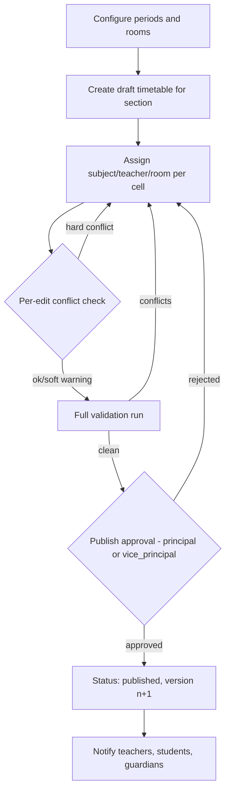
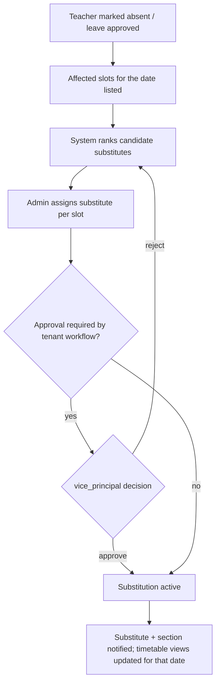

# Module: Timetable Management

> **Agent Context** — Load this block first.
> **Summary:** Builds and publishes class and teacher timetables: period structure, room allocation, subject scheduling against teacher allocations, hard/soft conflict detection, substitute-teacher management for absent teachers, and controlled publishing to staff, students, and guardians. Turns a multi-day manual scheduling exercise into a validated, conflict-free draft-and-publish workflow.
> **Co-load with:** `../02-architecture/auth-and-rbac.md` · `../05-database/entities/academics.md` · `./academics.md` · `./attendance.md`
> **Owns entities:** rooms, periods, timetable_slots, teacher_substitutions (structurally specified in `entities/academics.md` — see §15)
> **Depends on modules:** academics, school-organization, staff-management, attendance, communication

## 1. Purpose

Defines the school's period grid (working days, period times, breaks), assigns subjects/teachers/rooms into that grid per section, detects conflicts before they reach a classroom (teacher double-booked, room double-booked, section gap/overlap, workload breaches), and manages day-to-day substitutions when teachers are absent. Timetables are drafted privately, validated, then **published** — the published version is what students, guardians, and teachers see.

## 2. Business Objective

- Eliminate double-bookings and last-minute scrambles: zero hard conflicts in any published timetable.
- Cut timetable preparation from days to hours per academic session using validation and AI-assisted generation (§14).
- Give every teacher, student, and guardian an always-current personal timetable, including same-day substitutions.

## 3. Target Users

| Role | How they use this module |
| ---- | ------------------------ |
| `school_admin` | Configures periods/rooms, builds and edits timetables, arranges substitutions |
| `vice_principal` | Timetable oversight: reviews drafts, resolves conflicts, approves substitutions, publishes |
| `principal` | Final publish authority (tenant-configurable), workload oversight dashboards |
| `teacher` | Views own timetable and substitution assignments; flags availability constraints |
| `student` | Views own section's published timetable |
| `guardian` | Views children's published timetables |

## 4. Permissions

Permissions follow the RBAC model in [`auth-and-rbac.md`](../02-architecture/auth-and-rbac.md). Permission keys use `<module>.<resource>.<action>`.

| Permission key | Description | Default roles |
| -------------- | ----------- | ------------- |
| `timetable.timetable.view` | View published timetables (record-scoped: `own`/`assigned` for teacher, student, guardian; `all` for admin roles) | all tenant roles |
| `timetable.slot.view` | View draft slots (unpublished) | `school_admin`, `vice_principal`, `principal` |
| `timetable.slot.create` / `update` / `delete` | Edit draft timetable slots | `school_admin`, `vice_principal` |
| `timetable.timetable.publish` | Publish/republish a section's timetable | `principal`, `vice_principal`, `school_admin` |
| `timetable.period.create` / `update` / `delete` | Manage the period grid | `school_admin` |
| `timetable.room.create` / `update` / `delete` | Manage rooms and capacities | `school_admin` |
| `timetable.substitution.create` | Propose a substitution | `school_admin`, `vice_principal` |
| `timetable.substitution.approve` | Approve/reject substitutions | `vice_principal`, `principal` |
| `timetable.timetable.export` | Export/print timetables | `school_admin`, `vice_principal`, `principal`, `teacher` (own) |

## 5. Main Features

1. **Period management** — tenant-defined day templates: number of periods, start/end times, breaks/assembly, per-weekday variations (e.g. short day); all times in the tenant timezone.
2. **Class timetable building** — assign `class_subjects` + teacher (from `teacher_subject_allocations`) + room into period cells per section, per academic session/term; drag-and-drop grid UI.
3. **Teacher timetables** — auto-derived view of every teacher's week, with free periods and total load.
4. **Room allocation** — rooms with type (classroom, lab, hall) and capacity; assignment per slot; shared-room support.
5. **Conflict detection** — hard conflicts block save/publish (teacher, section, or room double-booked); soft conflicts warn (workload over threshold, >N consecutive periods, subject twice in one day) — thresholds tenant-configurable.
6. **Substitute teacher management** — for a teacher absence (fed by the attendance module), find qualified, free teachers per affected slot, assign, notify, and record.
7. **Timetable publishing** — versioned draft → validate → publish; republish supersedes with change notification; unpublished edits never leak to students/guardians.

## 6. Sub-features

- **Periods:** multiple day templates per session; effective-date changes without rewriting history.
- **Building:** copy timetable from a previous session/term or a sibling section as a starting draft; bulk-clear; per-cell notes (e.g. "double period lab").
- **Conflict engine:** runs on every slot mutation (fast, single-slot scope) and fully on `:validate`/`:publish`; returns machine-readable conflict list `{type, severity, slot_ids, message}`.
- **Substitutions:** candidate ranking by subject qualification, same-class familiarity, current-day free periods, and weekly substitution load; ad-hoc room change supported on the substitution.
- **Views/exports:** section grid, teacher grid, room-utilization grid; PDF/Excel export; personal iCal feed per user (recommendation).

## 7. Workflows

### 7.1 Build, validate, publish

Actors: `school_admin` builds (states: draft → validated → published); the publish gate requires `timetable.timetable.publish`. Republishing repeats validation and bumps the version.

### 7.2 Substitution for an absent teacher

The absence signal arrives from [`attendance.md`](attendance.md); a substitution overrides the published slot for specific dates only — the base timetable is untouched.

## 8. User Journeys

- **School admin:** at session start, copies last year's Grade 7-A timetable, adjusts for the new teacher allocations, clears the 12 conflicts the validator lists, and sends for publish.
- **Vice principal:** each morning reviews the absent-teacher list, accepts the top-ranked substitute suggestions, and approves; by 08:00 every affected class has cover.
- **Teacher:** checks "My Timetable" — sees today's periods, one substitution badge for period 5, and taps it for the section and room.
- **Student/guardian:** opens the timetable tab; sees the published week including today's substitution note; receives a push when the timetable is republished.

## 9. Inputs

- Period grid definitions (times, breaks, day templates); room records (name, type, capacity).
- Slot assignments (section, period, weekday, subject, teacher, room) via grid UI or bulk import (Excel) during onboarding.
- Teacher availability constraints (unavailable periods, max load) — recommendation.
- Absence events from attendance; substitution assignments and approvals.

## 10. Outputs

- Published, versioned class/teacher/room timetables; per-date effective views including substitutions.
- Notifications (§12); webhook event `timetable.published` (recommendation).
- Exports: PDF/Excel grids, room-utilization report, workload report; iCal feeds (recommendation).

## 11. Validations

- Slot uniqueness: one assignment per (section, weekday, period) per active timetable version; teacher and room not double-booked at the same (weekday, period) — hard conflicts.
- Teacher must hold a `teacher_subject_allocations` row for the slot's class/subject; room capacity ≥ section size (soft warning).
- Periods must not overlap within a day template; substitution slot must belong to the absent teacher on that date; substitute must be free at that (date, period).
- Publishing blocked while any hard conflict exists; publishing requires an active academic session/term.
- All checks are server-side; the grid UI's live checks are UX only (RBAC doc §3).

## 12. Notifications

| Event | Recipients | Channels | Template ref |
| ----- | ---------- | -------- | ------------ |
| Timetable published / republished | Teachers, students, guardians of affected sections | Push, in-app | `timetable.published` |
| Substitution assigned | Substitute teacher | Push, in-app, email | `timetable.substitution-assigned` |
| Substitution affecting a class | Students/guardians of the section | In-app (push optional per tenant) | `timetable.class-substitution` |
| Substitution approved / rejected | Proposing admin | In-app | `timetable.substitution-decision` |
| Draft validation failed at publish | Publisher | In-app | `timetable.validation-failed` |

Channels and delivery behavior follow [`notifications.md`](../02-architecture/notifications.md).

## 13. Reports

- **Teacher workload report** — periods/week per teacher vs threshold; filters: department, subject; export Excel/PDF.
- **Room utilization report** — occupancy percentage per room per week; identifies bottleneck labs.
- **Free-period matrix** — which teachers are free at each period (also powers substitution ranking).
- **Substitution report** — substitutions per teacher/reason/date range; feeds staff performance review (staff-management).
- **Conflict audit** — soft conflicts accepted at publish time, per timetable version.

Visibility: admin/leadership roles per RBAC; teachers see their own workload only.

## 14. AI Capabilities

Cross-referenced to [`ai-features.md`](../04-ai/ai-features.md); every AI output is a draft requiring human review — nothing is auto-published.

- **AI-TTB-01 — Smart timetable generation:** proposes a full conflict-free draft from class subjects, teacher allocations, availability constraints, and room inventory; admin edits and publishes.
- **AI-TTB-02 — Conflict resolution suggestions:** when the validator reports conflicts, suggests minimal swap sequences to resolve them instead of leaving the admin to hunt.
- **AI-TTB-03 — Substitute recommendation:** ranks substitute candidates using qualification, familiarity, load balance, and historical acceptance (deterministic ranking augmented by the model's constraint reasoning).
- **AI-TTB-04 — Schedule quality insights:** flags pedagogically poor patterns (heavy subjects stacked late, uneven weekly distribution) as advisory notes on drafts.

## 15. Database Entities

This module operates on four tables that are **structurally owned and fully specified in [`../05-database/entities/academics.md`](../05-database/entities/academics.md)** (they sit inside the academic-structure entity group); no column definitions are repeated here. All are tenant-scoped per [`multi-tenancy.md`](../02-architecture/multi-tenancy.md).

- `rooms` — physical rooms/labs/halls with type and capacity.
- `periods` — the tenant's period grid (day templates, times, breaks).
- `timetable_slots` — one cell of a timetable version: (section, weekday, period) → subject, teacher, room; carries draft/published versioning.
- `teacher_substitutions` — date-scoped overrides of a slot's teacher (and optionally room) with approval state.

Referenced (owned elsewhere): `classes`, `sections`, `subjects`, `class_subjects`, `teacher_subject_allocations`, `academic_sessions`, `terms` (entities/academics.md); `staff` (entities/people.md); `student_attendance`, `leave_requests` (entities/attendance.md).

## 16. API Requirements

Conventions per [`api-architecture.md`](../02-architecture/api-architecture.md).

- `GET/POST/PATCH/DELETE /api/v1/periods` · `/api/v1/rooms`
- `GET /api/v1/timetable-slots` — filters: `section_id`, `teacher_id`, `room_id`, `weekday`, `status`, `academic_session_id`; cursor pagination.
- `POST/PATCH/DELETE /api/v1/timetable-slots` — per-edit conflict check in the response (`meta.conflicts`).
- `POST /api/v1/timetables/{section_id}:validate` — full conflict run, returns conflict list.
- `POST /api/v1/timetables/{section_id}:publish` — permission-guarded, audited; 422 on hard conflicts.
- `GET /api/v1/timetables/my` — caller's effective timetable (teacher/student/guardian scope), date-aware (substitutions applied).
- `GET/POST /api/v1/teacher-substitutions` · `POST /api/v1/teacher-substitutions/{id}:approve` · `:reject`
- `POST /api/v1/timetables/{section_id}:generate-draft` — AI generation (AI-TTB-01); returns `202` + job resource per API doc §2.7.

## 17. Integration Requirements

- **Internal:** academics (allocations, sections, sessions), attendance (absence feed), communication (notifications), AI gateway (generation/ranking), reporting-analytics (utilization/workload datasets), files (export storage).
- **External:** none mandatory; optional calendar-feed (iCal) publication via signed per-user URLs (recommendation).

## 18. Dependencies on Other Modules

| Module | Direction | What is shared |
| ------ | --------- | -------------- |
| academics | inbound | Classes, sections, subjects, teacher-subject allocations, sessions/terms |
| school-organization | inbound | Campuses, academic calendar/holidays, timezone |
| staff-management | inbound | Teacher records, qualifications (substitute ranking) |
| attendance | inbound | Absent-teacher signal triggering substitutions |
| examinations | outbound | Exam scheduling reuses rooms and checks timetable clashes |
| communication | outbound | All notifications in §12 |
| parent-portal | outbound | Published timetable views for students/guardians |

## 19. Open Questions / Recommendations

- Whether publish requires a `principal` approval step or `school_admin` may publish directly should be a tenant workflow setting; default: `vice_principal` approval (recommendation).
- Fixed weekly cycle assumed; rotating multi-week cycles (Week A/B) deferred to a future enhancement (recommendation).
- Teacher availability constraints and max-load thresholds are recommendations pending client confirmation of policy.
- iCal feeds and room-booking for non-teaching events (meetings) are future-phase recommendations.
