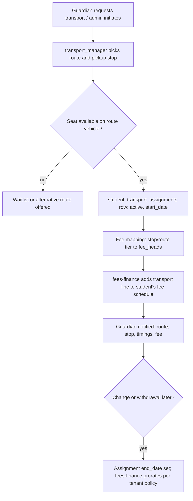

# Module: Transport Management

> **Agent Context** — Load this block first.
> **Summary:** Manages the school's transport operation: vehicles and their compliance documents, drivers (linked to staff records), routes with ordered stops, student route/stop assignments, driver/vehicle route allocation, and vehicle maintenance. Transport fees are billed through fees-finance fee heads; live GPS tracking is a marked future integration. Business value: safe, auditable student transport with costs and fees flowing through the standard finance rails.
> **Co-load with:** `../02-architecture/auth-and-rbac.md` · `../05-database/entities/library-transport-inventory.md` · `fees-finance.md` · `staff-management.md`
> **Owns entities:** vehicles, drivers, routes, route_stops, student_transport_assignments, vehicle_maintenance
> **Depends on modules:** staff-management, student-management, fees-finance, communication, school-organization, inventory-assets

## 1. Purpose

This module runs everything on wheels: the vehicle fleet (registration, capacity, insurance/fitness expiry), drivers and transport staff (each linked to a `staff` record for HR/payroll continuity), routes composed of ordered stops with pickup/drop times, per-student transport assignments (route + pickup/drop stop, session-bound), and scheduled/reactive vehicle maintenance. It answers, at any moment: which students ride which vehicle, driven by whom, boarding where.

## 2. Business Objective

- Student safety and accountability: a complete manifest per vehicle per day.
- Compliance: never miss an insurance/fitness/license expiry (automated alerts).
- Revenue accuracy: every assigned student is billed the correct stop/route fee via fees-finance.
- Cost control: maintenance history per vehicle feeds cost-per-kilometer reporting.

## 3. Target Users

| Role | How they use this module |
| ---- | ------------------------ |
| `transport_manager` | Fleet, drivers, routes/stops, assignments, maintenance, reports |
| `transport_staff` | Views own route, stop list, student manifest; reports trip issues |
| `school_admin` | Policy/fee-head mapping oversight, approvals where configured |
| `accountant` | Sees transport fee heads and billing outcomes in fees-finance |
| `guardian` / `student` | Views assigned route, stop, timings in the portal |
| `hr_staff` | Driver license/verification documents alongside staff records |

## 4. Permissions

Permissions follow the RBAC model in [`auth-and-rbac.md`](../02-architecture/auth-and-rbac.md). Module-specific action verb declared here: `assign`. `transport_staff` carries record scope `own` (own route/vehicle only).

| Permission key | Description | Default roles |
| -------------- | ----------- | ------------- |
| `transport.vehicle.view/create/update/delete` | Fleet management | `transport_manager` (view also `school_admin`) |
| `transport.driver.view/create/update` | Driver records (license, verification) | `transport_manager`, `hr_staff` (view) |
| `transport.route.view/create/update/delete` | Routes and stops | `transport_manager`; view: `transport_staff` (scope `own`), `guardian`/`student` (scope `own`) |
| `transport.assignment.assign` | Assign/withdraw students to routes/stops | `transport_manager` |
| `transport.assignment.view` | View assignments/manifests | `transport_manager`, `transport_staff` (scope `own`), `guardian` (scope `own`) |
| `transport.maintenance.view/create/update` | Maintenance scheduling and logging | `transport_manager` |
| `transport.report.view/export` | Transport reports | `transport_manager`, `school_admin`, `school_owner` |

## 5. Main Features

1. **Vehicle management** — fleet register: registration number, type, capacity, ownership (owned/leased/contracted), insurance & fitness expiries, status (`active/in_maintenance/retired`).
2. **Driver management** — driver/conductor/attendant records linked 1:1 to `staff`; license number/type/expiry, background-verification date (recommendation); availability status.
3. **Routes & stops** — named routes per campus/shift with ordered stops (sequence, pickup/drop times, optional geo-coordinates and stop-level fee tier).
4. **Student assignments** — session-bound assignment of a student to route + pickup stop (+ optional different drop stop); capacity-checked; drives billing.
5. **Driver/vehicle allocation** — current vehicle, driver, and attendant per route; substitution handling for absence.
6. **Vehicle maintenance** — scheduled services and reactive repairs with odometer, cost (posted to finance `expenses`), workshop (`suppliers`), and next-due tracking.
7. **Transport fees** — stop/route fee mapped to a fees-finance `fee_heads` entry; assignment changes trigger billing adjustments there (fees-finance owns invoicing).
8. **Tracking integration (future)** — GPS/live tracking is explicitly deferred; `vehicles.gps_device_id` and SSE/WebSocket groundwork reserve the slot (recommendation, scope §21).

## 6. Sub-features

- **Fleet:** document uploads (registration, insurance) via `files`; expiry alert thresholds; seat-capacity utilization view.
- **Drivers:** license-expiry alerts; duty roster view; link to staff attendance/leave (absence surfaces as route uncovered).
- **Routes:** morning/afternoon/both shift variants; printable route sheet + student manifest (PDF); stop reorder tool.
- **Assignments:** bulk assign by class/area; waitlist when a vehicle is full (recommendation); start/end dating for mid-session changes; sibling-grouping helper.
- **Maintenance:** recurring schedules (by months or km), cost history, downtime log feeding availability.

## 7. Workflows

**Student transport assignment → billing:**

Actors: `transport_manager` (assign), fees-finance (billing, proration policy). No approval gate by default; tenants may add one (configurable workflow, recommendation).

**Maintenance cycle:** system flags due service (date/km) → `transport_manager` schedules with workshop supplier → vehicle set `in_maintenance` (routes show uncovered → substitute vehicle allocated) → work done, cost + odometer logged → expense posted to finance `expenses` → vehicle `active`, next-due computed.

**Driver absence:** staff leave approval (hr-leave) emits event → route flagged uncovered → manager allocates substitute driver → manifest and guardians notified of any timing change.

## 8. User Journeys

- **Transport manager (daily):** dashboard shows two license expiries in 30 days and one route uncovered (driver on leave) → allocates the spare driver → mid-morning, logs a completed brake job on Bus 4 with the invoice → afternoon, assigns three new admissions to Route B and watches billing lines appear.
- **Transport staff (driver):** opens own-route view: today's manifest of 38 students, stop order and times; reports a delay which notifies affected guardians (via communication).
- **Guardian:** sees the child's route, stop, and pickup time in the portal; gets a notification when the stop time shifts by 10 minutes.

## 9. Inputs

- Vehicle registration/compliance data + document uploads; odometer readings.
- Driver license/verification details (alongside staff records).
- Route/stop definitions incl. times, sequence, coordinates, fee tier.
- Assignment requests (student, route, stop, start date); withdrawal dates.
- Maintenance schedules, work logs, invoices/costs.

## 10. Outputs

- Records: `vehicles`, `drivers`, `routes`, `route_stops`, `student_transport_assignments`, `vehicle_maintenance` (+ posted `expenses` in finance).
- Documents: route sheets, per-vehicle student manifests (PDF), fleet compliance register export.
- Events emitted: `transport.assignment.created/ended`, `transport.route.changed`, `transport.vehicle.maintenance-due` (webhook-eligible).
- Billing signals to fees-finance (fee-head mapping per assignment).

## 11. Validations

- `registration_no` unique per tenant; `drivers.staff_id` unique per tenant (one driver record per staff member); license expiry must be future-dated on activation.
- Route stop `sequence` unique within a route; pickup/drop times must be ordered along the sequence (warning, not hard block — recommendation).
- One **active** assignment per student at a time; assignment stop must belong to the assigned route; active assignments ≤ vehicle capacity (hard block, waitlist otherwise).
- A vehicle `in_maintenance`/`retired` cannot be a route's current vehicle; a driver on approved leave cannot be the route's driver for those dates.
- Assignments are session-bound (`academic_sessions`); ending an assignment requires an end date ≥ start date; billing proration delegated to fees-finance rules.
- Maintenance cost posting is idempotent (one finance expense per maintenance row).

## 12. Notifications

| Event | Recipients | Channels | Template ref |
| ----- | ---------- | -------- | ------------ |
| Assignment confirmed / changed / ended | Guardian, student | email, push, in-app | `transport.assignment-confirmed` |
| Route/stop timing change | Affected guardians, `transport_staff` | push, SMS | `transport.route-changed` |
| Insurance/fitness/license expiring (T-30/T-7) | `transport_manager`, `school_admin` | in-app, email | `transport.compliance-expiry` |
| Maintenance due / vehicle down | `transport_manager` | in-app, email | `transport.vehicle-maintenance-due` |
| Trip delay/incident report | Affected guardians | push, SMS | `transport.trip-alert` |

Channels and delivery behavior follow [`notifications.md`](../02-architecture/notifications.md).

## 13. Reports

- **Fleet & compliance register:** vehicles with document expiries, status; filters: campus, status; export XLSX/PDF.
- **Route utilization:** capacity vs. assigned per route/shift; under/over-utilized routes.
- **Maintenance cost report:** cost per vehicle, per km (odometer-based), downtime days; period filters.
- **Transport billing reconciliation:** assignments vs. billed fee lines (joint view with fees-finance).
- **Manifest:** per vehicle/route/day, printable. Visibility per RBAC (`transport.report.view`); drivers see own-route manifests only.

## 14. AI Capabilities

Cross-referenced to [`ai-features.md`](../04-ai/ai-features.md).

- **`AI-TRN-01` Route optimization suggestions** — proposes stop ordering/route splits from stop coordinates, student counts, and time windows; suggestions only, `transport_manager` applies changes manually (human approval required).
- **`AI-TRN-02` Predictive maintenance** — flags vehicles with anomalous maintenance frequency/cost patterns and predicts next-failure windows from service history and odometer trends; advisory, never auto-schedules.
- **`AI-TRN-03` Transport Q&A for staff** — natural-language queries over own-scope transport data ("which routes are over 90% full?"), read-only under the caller's permissions.

## 15. Database Entities

Owned tables (tenant-scoped, RLS; column specs in [`entities/library-transport-inventory.md`](../05-database/entities/library-transport-inventory.md)):

- `vehicles` — fleet register with compliance dates and status.
- `drivers` — transport staff records linked to `staff`, license/verification data.
- `routes` — named route + current vehicle/driver allocation, shift.
- `route_stops` — ordered stops with times, coordinates, fee tier.
- `student_transport_assignments` — session-bound student ↔ route/stop links.
- `vehicle_maintenance` — service/repair events with cost posting reference to finance `expenses`.

Transport fee amounts and invoicing live entirely in fees-finance (`fee_heads`, `fee_structures`, `fee_invoices` — [`entities/finance.md`](../05-database/entities/finance.md)).

## 16. API Requirements

Conventions per [`api-architecture.md`](../02-architecture/api-architecture.md).

- `GET/POST /api/v1/vehicles` · `PATCH /api/v1/vehicles/{id}` · `POST /api/v1/vehicles/{id}:retire` — filters: `status`, `campus_id`, `insurance_expiry__lte`
- `GET/POST/PATCH /api/v1/drivers` — filters: `status`, `license_expiry__lte`
- `GET/POST/PATCH/DELETE /api/v1/routes` · `GET/POST/PATCH /api/v1/routes/{id}/route-stops` · `POST /api/v1/routes/{id}:allocate` (vehicle/driver allocation, audited)
- `GET /api/v1/student-transport-assignments?route_id=…&status=active` · `POST /api/v1/students/{id}:assign-transport` · `POST /api/v1/student-transport-assignments/{id}:end`
- `GET/POST/PATCH /api/v1/vehicle-maintenance` · `POST /api/v1/vehicle-maintenance/{id}:complete` (posts expense; `Idempotency-Key`)
- `GET /api/v1/routes/{id}/manifest` — PDF/JSON manifest (drivers: own route only)

## 17. Integration Requirements

- **fees-finance** (internal): fee-head mapping, billing adjustments, maintenance expense posting.
- **hr-leave / staff-management** (internal): driver identity, leave events for coverage.
- **Notification service** for guardian/manager alerts.
- **GPS/telematics providers:** future integration (scope §21) — reserved via `gps_device_id` and the SSE channel in [`api-architecture.md`](../02-architecture/api-architecture.md) §3; explicitly **not** in v1 (recommendation).

## 18. Dependencies on Other Modules

| Module | Direction | What is shared |
| ------ | --------- | -------------- |
| staff-management | reads | `staff` identity behind drivers, documents |
| hr-leave | consumes | driver leave/absence events |
| student-management | reads | students for assignments, withdrawal events (auto-end assignment) |
| fees-finance | writes/reads | transport fee heads & billing; maintenance expenses |
| school-organization | reads | campuses, academic sessions |
| inventory-assets | optional reads | shared `suppliers` for workshops; vehicle spares as stock items |
| communication | uses | all notifications; parent-portal serves route/stop view |

## 19. Open Questions / Recommendations

- Live GPS tracking, guardian bus-approach alerts, and boarding scans (RFID) are **future enhancements** (scope §21); v1 keeps schema hooks only (recommendation).
- Whether transport assignment requires an approval step (fee commitment): default no; configurable per tenant (recommendation).
- Contracted-fleet operators (third-party buses): modeled as `ownership=contracted` + `suppliers`; a full operator-contract module is deferred.
- Stop-level vs. route-level fee tiers: both supported (stop tier overrides route default) — confirm with client at Phase 0.
