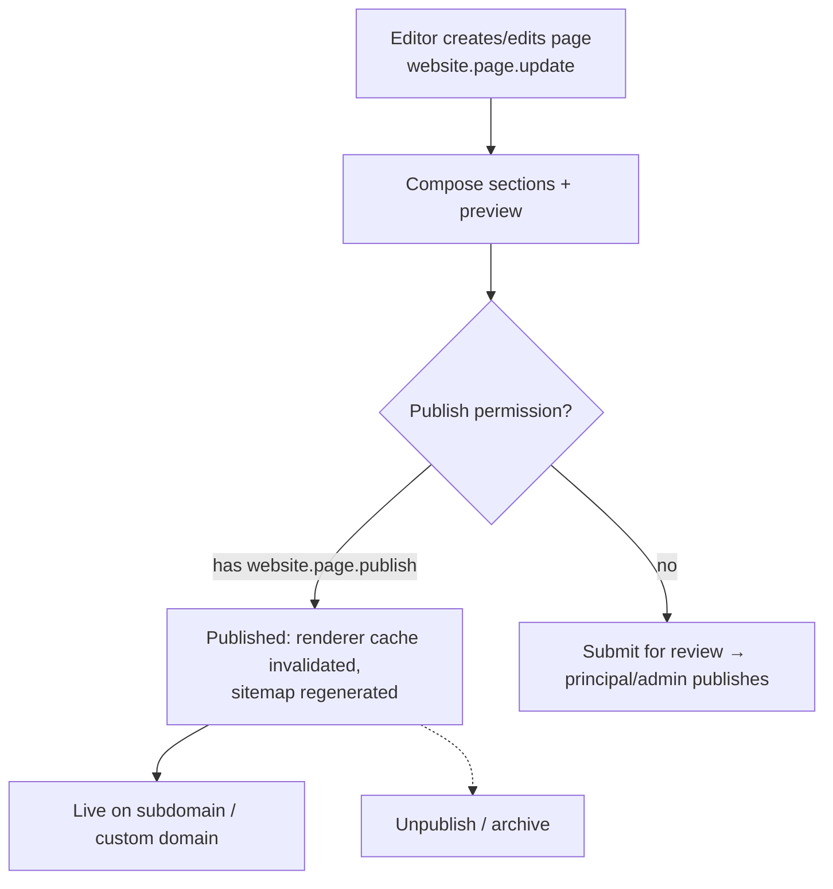
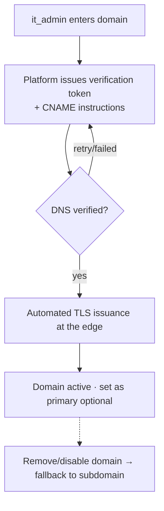

# Module: Website & CMS

> **Agent Context** — Load this block first.
> **Summary:** Gives every tenant school a dynamic public-facing website — homepage, about, principal message, departments, teachers, classes, admissions, events, news, notices, gallery, contact — managed through a CMS with dynamic sections, SEO settings, tenant branding, navigation/footer control, and custom domain binding. One theme ships initially; a theme system enables more later. Rendering/hosting architecture lives in [`website-builder.md`](../02-architecture/website-builder.md); this doc is functional.
> **Co-load with:** `../02-architecture/website-builder.md` · `../05-database/entities/website-cms.md` · `../02-architecture/multi-tenancy.md`
> **Owns entities:** `website_settings`, `themes`, `website_pages`, `page_sections`, `navigation_menus`, `news_posts`, `school_events`, `gallery_albums`, `gallery_items`, `contact_submissions`, `seo_settings`
> **Depends on modules:** admissions, communication, academics, staff-management, platform-admin

## 1. Purpose

The product is not limited to an admin dashboard (scope §11): every school operates a public website on `<slug>.<platform-domain>` or its verified custom domain. This module is the CMS behind that website — page management with dynamic sections, news/events/gallery content, an admissions page whose form feeds the admissions module, published notices from the communication module, SEO, and branding drawn from tenant settings.

The website and the admin system share tenant data across a strict security boundary: the public renderer reads only content explicitly published, via a scoped read-only machine token ([`api-architecture.md`](../02-architecture/api-architecture.md) §2.2).

## 2. Business Objective

- Make the platform a full digital presence, not just back-office software — a differentiator when selling to schools without a website.
- Drive admissions: the website is the top of the enquiry funnel; measurable via contact/admission form conversions.
- Zero-IT publishing: non-technical school staff update news, events, and pages without a developer.

## 3. Target Users

| Role | How they use this module |
| ---- | ------------------------ |
| `school_admin` | Owns website content: pages, sections, news, events, gallery, navigation |
| `it_admin` | Custom domain binding, SEO settings, theme configuration, analytics IDs |
| `principal` | Provides/approves the principal message; reviews content before publish |
| `reception` | Triages contact-form submissions; forwards admission enquiries |
| `school_owner` | Approves branding and theme decisions |
| Public visitor (no account) | Browses the website, submits contact/admission forms |

## 4. Permissions

Permissions follow the RBAC model in [`auth-and-rbac.md`](../02-architecture/auth-and-rbac.md). Permission keys use `<module>.<resource>.<action>`.

| Permission key | Description | Default roles |
| -------------- | ----------- | ------------- |
| `website.page.view` | View pages/sections in the CMS | `school_admin`, `it_admin`, `principal` |
| `website.page.create` / `website.page.update` / `website.page.delete` | Manage pages and their sections | `school_admin` |
| `website.page.publish` | Publish/unpublish pages | `school_admin`, `principal` |
| `website.news-post.create` / `update` / `delete` | Manage news posts | `school_admin` |
| `website.news-post.publish` | Publish news | `school_admin`, `principal` |
| `website.school-event.create` / `update` / `publish` | Manage website events | `school_admin` |
| `website.gallery-album.create` / `update` / `publish` / `delete` | Manage galleries and items | `school_admin` |
| `website.navigation.update` | Edit header/footer menus | `school_admin`, `it_admin` |
| `website.settings.update` | Theme config, homepage assignment, publish/maintenance toggle | `it_admin`, `school_admin` |
| `website.seo.update` | Site and per-page SEO settings | `it_admin`, `school_admin` |
| `website.custom-domain.create` / `update` / `delete` | Bind/verify/remove custom domains | `it_admin`, `school_owner` |
| `website.contact-submission.view` / `update` | Read and triage contact submissions | `reception`, `school_admin` |

## 5. Main Features

1. **Standard pages** — homepage, about school, principal message, departments, teachers, classes, admissions, contact (scope §11), each composed of theme-defined dynamic sections; unlimited additional custom pages.
2. **Dynamic CMS sections** — each page is an ordered list of typed sections (hero, rich text, stats, staff grid, CTA, FAQ, embedded form…) whose types the active theme declares; content is structured JSON, so themes can re-skin it later.
3. **News & events** — publishable news posts and school events with listing + detail pages; notices published by the communication module surface on the site (read-only here — cross-ref).
4. **Gallery** — albums of images/video embeds, optionally linked to events.
5. **Admissions page & forms** — admission enquiry/application form whose submissions create records in the admissions module (enquiries/applications); generic contact form stored as `contact_submissions`.
6. **Branding** — logo, colors, fonts, favicon come from tenant settings ([`multi-tenancy.md`](../02-architecture/multi-tenancy.md) §5) and are applied by the theme; no per-page branding forks.
7. **Navigation & footer** — editable header menu, footer menus, social links, contact block.
8. **SEO** — site-wide and per-content meta title/description, Open Graph image, canonical URL, robots directives, sitemap.xml and structured data emitted by the renderer.
9. **Custom domain binding** — school connects `www.myschool.tld` (CNAME + automated TLS per multi-tenancy §4); subdomain remains as fallback.
10. **Theme system** — one platform theme at launch; themes are a platform-scope catalog with declared section types and a config schema, so new themes can ship without data migration (scope §11 "WordPress-style" future).

## 6. Sub-features

- **Pages:** draft/published/archived states; publish scheduling *(recommendation)*; page duplication; slug management with redirects on rename *(recommendation)*; per-locale content for tenant languages.
- **Sections:** drag-and-drop reordering; per-section visibility toggle; live preview before publish; teacher/class/department sections can auto-populate from academics and staff-management data marked "show on website".
- **News/events:** cover images, excerpts, publish dates; events with start/end, location, all-day flag; past-event auto-archival on listings.
- **Forms:** spam protection (honeypot + rate limiting; CAPTCHA configurable *(recommendation)*); consent text configurable per tenant.
- **Custom domains:** guided DNS instructions, verification token check, TLS issuance status, primary-domain selection.
- **Maintenance mode:** replace the site with a neutral notice (also forced during tenant suspension per multi-tenancy §7).

## 7. Workflows

### 7.1 Page publish

Steps: editor composes sections against the active theme's section catalog; preview renders through the real renderer with a draft token; publishing flips status, invalidates the edge cache, and regenerates sitemap/feeds. Review gate applies only when the editor lacks the publish permission.

### 7.2 Custom domain binding

### 7.3 Website form submission

Visitor submits admissions/contact form → rate-limit + spam checks → contact forms create `contact_submissions`; admission forms create enquiry/application records **in the admissions module** (cross-ref [`admissions.md`](admissions.md)) → notification to `reception`/`admission_staff` → triage status tracked.

## 8. User Journeys

- **School admin:** onboarding creates the site pre-populated from wizard data → replaces placeholder homepage sections → uploads gallery from the annual day → publishes a news post; total time under an hour, no IT involvement.
- **it_admin:** binds `www.school.tld`, watches verification turn green, sets it primary; fills site-wide SEO defaults and the analytics ID.
- **Principal:** drafts the principal message with the AI assistant, edits tone, publishes.
- **Prospective parent (visitor):** lands on homepage → checks classes and fees info page → submits the admissions enquiry form → receives confirmation email; the enquiry appears in the admissions pipeline.

## 9. Inputs

- Page/section content (structured JSON per section type), rich text, uploaded media (via platform `files`, api-architecture §2.8).
- News posts, events, gallery uploads, navigation trees, SEO fields, theme configuration values.
- Custom domain names; DNS verification results (automated).
- Public form submissions (contact, admissions) — unauthenticated, validated, rate-limited.

## 10. Outputs

- Published website content served by the multi-tenant renderer ([`website-builder.md`](../02-architecture/website-builder.md)): pages, listings, detail pages, sitemap.xml, robots.txt, RSS for news *(recommendation)*.
- `contact_submissions` records; enquiry/application records handed to admissions.
- Events emitted: `website.page.published`, `website.contact-submission.created` (webhooks per api-architecture §2.6).

## 11. Validations

- Slugs unique per tenant per content type; reserved slugs (`admin`, `api`, `verify`…) blocked.
- A page cannot publish with zero visible sections; section content validated against the section type's schema.
- Only one homepage; deleting a published page requires unpublish first; navigation items must reference existing published targets or external URLs.
- Custom domain: valid FQDN, not already claimed by another tenant (global uniqueness), verification before activation.
- Uploaded media validated for type/size and AV-scanned per [`security.md`](../06-security/security.md); public forms: field-level validation, honeypot, per-IP rate limits.
- Published content must never expose non-public data: only staff/class records flagged "show on website" are readable by the renderer token.

## 12. Notifications

| Event | Recipients | Channels | Template ref |
| ----- | ---------- | -------- | ------------ |
| Contact form submitted | `reception`, `school_admin` | In-app, email | `web-contact-received` |
| Admission form submitted | `admission_staff`, `reception` | In-app, email | `web-admission-enquiry` (owned by admissions) |
| Custom domain verified / TLS issued | `it_admin` | In-app, email | `web-domain-active` |
| Custom domain verification failing > 24 h | `it_admin` | Email | `web-domain-failed` |

Channels and delivery behavior follow [`notifications.md`](../02-architecture/notifications.md).

## 13. Reports

- **Contact submissions** — by status/source page/date; export CSV. Visible to `reception`, `school_admin`.
- **Content inventory** — pages/posts by status, last updated, stale-content flag. Visible to `school_admin`.
- **Traffic summary** — via the configured analytics integration, embedded read-only *(recommendation)*; visible to `school_owner`, `school_admin`.
- Admission funnel conversion reporting lives in the admissions module and [`reporting-analytics.md`](reporting-analytics.md).

## 14. AI Capabilities

Cross-referenced to [`ai-features.md`](../04-ai/ai-features.md). All AI-generated content is a **draft**; the publish permission gate is the human approval point — nothing goes live without an editor publishing it.

- **`AI-WEB-01` — AI-generated website content** (scope §6): generate/rewrite section copy, about pages, principal message drafts, news posts from bullet points, in the tenant's tone and locale.
- **`AI-WEB-02` — AI SEO assistant** *(recommendation)*: draft meta titles/descriptions and Open Graph text from page content; flag missing/duplicate SEO fields.
- **`AI-WEB-03` — Image alt-text generation** *(recommendation)*: propose accessible alt text for gallery and section images; supports the accessibility requirement (scope §22).

## 15. Database Entities

Full column specs in [`../05-database/entities/website-cms.md`](../05-database/entities/website-cms.md). All tenant-scoped except `themes` (platform-scope catalog, no `tenant_id`):

- `website_settings` — one row per tenant: theme, homepage, publish/maintenance state, header/footer config.
- `themes` — **platform-scope** theme catalog with section-type and config schemas.
- `website_pages` / `page_sections` — pages and their ordered typed sections.
- `navigation_menus` — header/footer menu trees.
- `news_posts`, `school_events`, `gallery_albums`, `gallery_items` — publishable content.
- `contact_submissions` — public contact-form records.
- `seo_settings` — site-wide and per-content SEO metadata.

Referenced (not owned): `custom_domains`, `tenant_settings`, `files` ([`tenancy.md`](../05-database/entities/tenancy.md)); notices (communication), enquiries/applications (admissions).

## 16. API Requirements

Conventions per [`api-architecture.md`](../02-architecture/api-architecture.md). Two surfaces: authenticated CMS API and the read-only public content API consumed by the renderer via a scoped machine token.

- CMS: `GET/POST /api/v1/website-pages` · `GET/PATCH/DELETE /api/v1/website-pages/{id}` · `POST /api/v1/website-pages/{id}:publish` / `:unpublish` · `PATCH /api/v1/website-pages/{id}/page-sections` (ordered bulk update)
- `GET/POST/PATCH /api/v1/news-posts` (+ `:publish`) · `/api/v1/school-events` · `/api/v1/gallery-albums` · `/api/v1/gallery-albums/{id}/gallery-items`
- `GET/PATCH /api/v1/website-settings` · `GET/PATCH /api/v1/navigation-menus` · `GET/PATCH /api/v1/seo-settings` · `GET /api/v1/themes`
- `GET/POST /api/v1/custom-domains` · `POST /api/v1/custom-domains/{id}:verify` · `DELETE /api/v1/custom-domains/{id}`
- `GET /api/v1/contact-submissions` (filters: `status`, `created_at__gte`) · `PATCH /api/v1/contact-submissions/{id}`
- Public (renderer/visitor): `GET /api/v1/public/site` (resolved by domain) · `GET /api/v1/public/pages/{slug}` · `GET /api/v1/public/news-posts` · `POST /api/v1/public/contact-submissions` (rate-limited, `Idempotency-Key` supported) · `POST /api/v1/public/admission-forms` (proxies to admissions).

## 17. Integration Requirements

- **Renderer app** (Next.js multi-tenant renderer per [`tech-stack.md`](../02-architecture/tech-stack.md)) — domain-based tenant resolution, edge cache invalidation hooks; architecture in [`website-builder.md`](../02-architecture/website-builder.md).
- **Edge/DNS provider** for wildcard subdomains, CNAME verification, automated TLS.
- **Object storage/CDN** for media; **analytics** (tenant-supplied ID, e.g. GA4/Plausible) *(recommendation)*.
- Internal: admissions API (form hand-off), communication API (published notices feed).

## 18. Dependencies on Other Modules

| Module | Direction | What is shared |
| ------ | --------- | -------------- |
| admissions | outbound | Website admission form creates enquiries/applications |
| communication | inbound | Published notices/announcements surfaced on the site |
| academics | inbound | Classes/departments data for auto-populated sections |
| staff-management | inbound | Teacher profiles flagged public for the teachers page |
| school-organization | inbound | Tenant branding (logo, colors, fonts), campus contact details |
| platform-admin | inbound | Website feature flag, storage quota, custom-domain plan gating |

## 19. Open Questions / Recommendations

- Publish scheduling, slug-rename redirects, CAPTCHA, RSS, and the analytics embed are **recommendations** pending client confirmation.
- Multi-locale public content (full page translation vs. single-locale site) needs a client decision; the data model supports per-locale content.
- Theme marketplace/pricing for future themes is a platform-admin commercial decision, out of initial scope.
