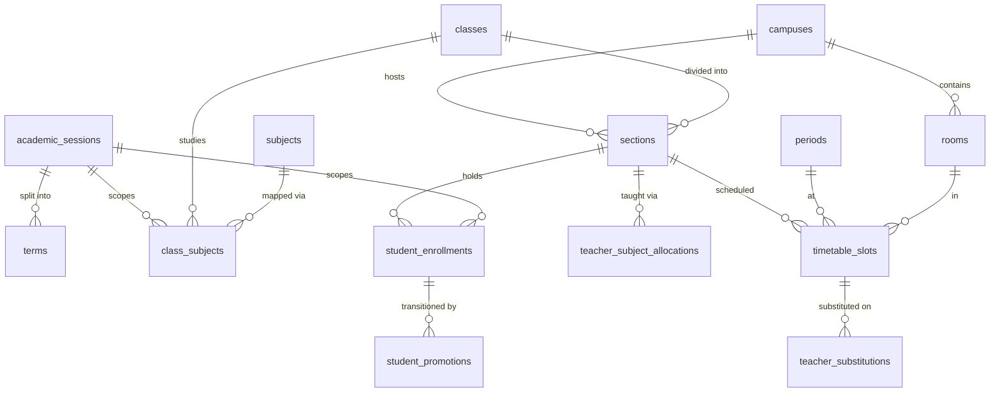

# Entities: Academic Structure, Enrollment & Timetable

> **Agent Context** — Load this block first.
> **Summary:** Column-level specifications for the academic-structure domain: campuses, departments, sessions/terms, classes, sections, subjects, houses (owned by module `school-organization`); enrollments (module `student-management`); curriculum, teacher allocations, promotions (module `academics`); and rooms, periods, timetable slots, substitutions (module `timetable`). Every table is tenant-owned: it implicitly carries `id UUID PK`, `tenant_id FK → tenants`, `created_at/updated_at`, `created_by/updated_by`, `deleted_at` (soft delete) per [`../database-architecture.md`](../../02-architecture/database-architecture.md) — not repeated per table. All uniques/indexes are tenant-scoped (leading `tenant_id`).
> **Co-load with:** `../../03-modules/school-organization.md` · `../../03-modules/academics.md` · `../../03-modules/timetable.md` · `people.md` (students, staff) · `tenancy.md` (users, files)

## Organizational Structure (module: school-organization)

### campuses

Physical branch of a school; a tenant has one or more campuses.

| Column | Type | Null | Default | Notes |
| ------ | ---- | ---- | ------- | ----- |
| name | varchar(150) | no | — | |
| code | varchar(20) | no | — | Unique (tenant_id, code) |
| address | jsonb | yes | null | |
| phone | varchar(32) | yes | null | |
| email | varchar(254) | yes | null | |
| timezone | varchar(64) | yes | null | IANA identifier; null = tenant default (tenant_settings) |
| head_staff_id | uuid | yes | null | FK → staff(id); campus head |
| is_primary | boolean | no | `false` | Exactly one primary per tenant (partial unique) |
| is_active | boolean | no | `true` | |

Indexes: unique (tenant_id, code); unique (tenant_id) where is_primary = true.
Relationships: 1:N → sections, rooms, students, staff, departments (optional scope); N:1 → staff (head).

### departments

Academic or administrative department.

| Column | Type | Null | Default | Notes |
| ------ | ---- | ---- | ------- | ----- |
| name | varchar(150) | no | — | |
| code | varchar(20) | no | — | Unique (tenant_id, code) |
| department_type | varchar(20) | no | `'academic'` | Enum: `academic` \| `administrative` |
| campus_id | uuid | yes | null | FK → campuses(id); null = all campuses |
| head_staff_id | uuid | yes | null | FK → staff(id) |
| description | varchar(300) | yes | null | |
| is_active | boolean | no | `true` | |

Indexes: unique (tenant_id, code); (tenant_id, campus_id); (tenant_id, department_type).
Relationships: 1:N → staff, subjects; N:1 → campuses, staff (head).

### academic_sessions

School year with lifecycle status; exactly one current session per tenant.

| Column | Type | Null | Default | Notes |
| ------ | ---- | ---- | ------- | ----- |
| name | varchar(50) | no | — | e.g. "2026–27"; unique (tenant_id, name) |
| start_date | date | no | — | |
| end_date | date | no | — | > start_date; no overlap with other sessions (service-enforced) |
| status | varchar(20) | no | `'planned'` | Enum: `planned` \| `active` \| `closed` \| `archived` |
| is_current | boolean | no | `false` | Exactly one true per tenant (partial unique) |

Indexes: unique (tenant_id, name); unique (tenant_id) where is_current = true; (tenant_id, status).
Relationships: 1:N → terms, class_subjects, student_enrollments, teacher_subject_allocations, timetable_slots.

### terms

Term/semester subdivision of an academic session.

| Column | Type | Null | Default | Notes |
| ------ | ---- | ---- | ------- | ----- |
| academic_session_id | uuid | no | — | FK → academic_sessions(id) |
| name | varchar(50) | no | — | Unique (tenant_id, academic_session_id, name) |
| sequence | smallint | no | — | Order within session; unique (tenant_id, academic_session_id, sequence) |
| start_date | date | no | — | Within session window |
| end_date | date | no | — | > start_date; no overlap with sibling terms |

Indexes: unique (tenant_id, academic_session_id, name); unique (tenant_id, academic_session_id, sequence).
Relationships: N:1 → academic_sessions; referenced by exams (see `examinations.md`) and term plans in class_subjects.

### classes

Grade level (e.g. "Grade 6"); `level` defines the promotion ladder. Structural — persists across sessions.

| Column | Type | Null | Default | Notes |
| ------ | ---- | ---- | ------- | ----- |
| name | varchar(80) | no | — | Unique (tenant_id, name) |
| code | varchar(20) | yes | null | Unique (tenant_id, code) when set |
| level | smallint | no | — | Unique (tenant_id, level); promotion ordering (next level = promotion target) |
| is_active | boolean | no | `true` | |

Indexes: unique (tenant_id, name); unique (tenant_id, level); unique (tenant_id, code) where code not null.
Relationships: 1:N → sections, class_subjects; referenced by student_enrollments, student_promotions, fee_structures (see `finance.md`).

### sections

Division of a class at a campus (e.g. "Grade 6 – A, North Campus").

| Column | Type | Null | Default | Notes |
| ------ | ---- | ---- | ------- | ----- |
| class_id | uuid | no | — | FK → classes(id) |
| campus_id | uuid | no | — | FK → campuses(id) |
| name | varchar(30) | no | — | e.g. "A"; unique (tenant_id, class_id, campus_id, name) |
| capacity | smallint | yes | null | Enrollment validation; null = unlimited |
| class_teacher_staff_id | uuid | yes | null | FK → staff(id); homeroom teacher (`class_teacher` role scope) |
| room_id | uuid | yes | null | FK → rooms(id); default homeroom |
| is_active | boolean | no | `true` | |

Indexes: unique (tenant_id, class_id, campus_id, name); (tenant_id, campus_id); (tenant_id, class_teacher_staff_id).
Relationships: N:1 → classes, campuses, staff, rooms; 1:N → student_enrollments, teacher_subject_allocations, timetable_slots.

### subjects

Tenant-wide subject catalog; class mapping lives in class_subjects.

| Column | Type | Null | Default | Notes |
| ------ | ---- | ---- | ------- | ----- |
| name | varchar(120) | no | — | Unique (tenant_id, name) |
| code | varchar(20) | no | — | Unique (tenant_id, code) |
| subject_type | varchar(20) | no | `'core'` | Enum: `core` \| `elective` \| `co_curricular` |
| department_id | uuid | yes | null | FK → departments(id) |
| description | varchar(300) | yes | null | |
| is_active | boolean | no | `true` | |

Indexes: unique (tenant_id, name); unique (tenant_id, code); (tenant_id, department_id).
Relationships: N:1 → departments; 1:N → class_subjects, teacher_subject_allocations, timetable_slots; referenced by exam_subjects (see `examinations.md`).

### houses

Student houses/groups for sports, discipline, and points.

| Column | Type | Null | Default | Notes |
| ------ | ---- | ---- | ------- | ----- |
| name | varchar(80) | no | — | Unique (tenant_id, name) |
| code | varchar(20) | yes | null | Unique (tenant_id, code) when set |
| color | varchar(20) | yes | null | Display color token/hex |
| motto | varchar(200) | yes | null | |
| house_master_staff_id | uuid | yes | null | FK → staff(id) |
| is_active | boolean | no | `true` | |

Indexes: unique (tenant_id, name).
Relationships: 1:N → students (house assignment); N:1 → staff (house master).

## Enrollment (module: student-management)

### student_enrollments

Session-scoped placement of a student: class, section, roll number, and outcome. One active row per student per session.

| Column | Type | Null | Default | Notes |
| ------ | ---- | ---- | ------- | ----- |
| student_id | uuid | no | — | FK → students(id) (see `people.md`) |
| academic_session_id | uuid | no | — | FK → academic_sessions(id) |
| class_id | uuid | no | — | FK → classes(id) |
| section_id | uuid | no | — | FK → sections(id); must belong to class_id |
| roll_number | varchar(16) | yes | null | Unique (tenant_id, section_id, roll_number) when set |
| enrollment_date | date | no | — | |
| end_date | date | yes | null | Set when status leaves `active` |
| status | varchar(20) | no | `'active'` | Enum: `active` \| `promoted` \| `retained` \| `transferred_out` \| `withdrawn` \| `graduated` |
| elective_subject_ids | jsonb | yes | null | Chosen elective subject UUIDs *(recommendation, see academics module §19)* |

Indexes: unique (tenant_id, student_id, academic_session_id); unique (tenant_id, section_id, roll_number) where roll_number not null; (tenant_id, section_id, status); (tenant_id, academic_session_id, class_id).
Relationships: N:1 → students, academic_sessions, classes, sections; referenced by student_attendance (see `attendance.md`), results (see `examinations.md`), fee_invoices (see `finance.md`), student_promotions.

## Curriculum, Allocation & Promotion (module: academics)

### class_subjects

Session-scoped curriculum row: this class studies this subject, with elective grouping, period targets, syllabus, and term plans.

| Column | Type | Null | Default | Notes |
| ------ | ---- | ---- | ------- | ----- |
| academic_session_id | uuid | no | — | FK → academic_sessions(id) |
| class_id | uuid | no | — | FK → classes(id) |
| subject_id | uuid | no | — | FK → subjects(id) |
| campus_id | uuid | yes | null | FK → campuses(id); null = all campuses (per-campus override optional) |
| is_elective | boolean | no | `false` | |
| elective_group | varchar(50) | yes | null | Options sharing a group are mutually choosable ("choose 1 of N") |
| weekly_periods | smallint | no | `1` | Target periods/week; timetable constraint; ≥ 1 |
| syllabus_file_id | uuid | yes | null | FK → files(id) |
| term_plans | jsonb | yes | null | Per-term topic plan `[{term_id, topics: [...]}]`; feeds AI-ACA-01 |
| notes | varchar(500) | yes | null | |

Indexes: unique (tenant_id, academic_session_id, class_id, subject_id, campus_id); (tenant_id, academic_session_id, class_id); (tenant_id, subject_id).
Relationships: N:1 → academic_sessions, classes, subjects, campuses, files; logically 1:N → teacher_subject_allocations (via matching session/class/subject).

### teacher_subject_allocations

Assignment of a teacher to teach a subject to a section within a session; supports co-teachers.

| Column | Type | Null | Default | Notes |
| ------ | ---- | ---- | ------- | ----- |
| academic_session_id | uuid | no | — | FK → academic_sessions(id) |
| section_id | uuid | no | — | FK → sections(id) |
| subject_id | uuid | no | — | FK → subjects(id); must exist in the class's curriculum (service-enforced) |
| staff_id | uuid | no | — | FK → staff(id); staff_type = teaching (service-enforced) |
| is_primary | boolean | no | `true` | One primary per (section, subject); others are co-teachers |
| weekly_periods | smallint | yes | null | Override of class_subjects.weekly_periods for load math |
| effective_from | date | yes | null | Mid-session reassignment history |
| effective_to | date | yes | null | Null = current |

Indexes: unique (tenant_id, academic_session_id, section_id, subject_id, staff_id); unique (tenant_id, academic_session_id, section_id, subject_id) where is_primary = true and effective_to is null; (tenant_id, staff_id, academic_session_id).
Relationships: N:1 → academic_sessions, sections, subjects, staff; consumed by timetable_slots and marks entry rights (see `examinations.md`).

### student_promotions

Per-student promotion decision within an approvable batch (batch = shared `batch_id`; states move batch-wide).

| Column | Type | Null | Default | Notes |
| ------ | ---- | ---- | ------- | ----- |
| batch_id | uuid | no | — | Logical batch grouping (one per class per rollover); no separate batch table — see §Open Items |
| student_id | uuid | no | — | FK → students(id) |
| from_enrollment_id | uuid | no | — | FK → student_enrollments(id) |
| from_academic_session_id | uuid | no | — | FK → academic_sessions(id) |
| to_academic_session_id | uuid | no | — | FK → academic_sessions(id) |
| from_class_id | uuid | no | — | FK → classes(id) |
| to_class_id | uuid | yes | null | FK → classes(id); null when decision = `graduated` |
| to_section_id | uuid | yes | null | FK → sections(id); assigned at/before execution |
| decision | varchar(30) | no | — | Enum: `promoted` \| `retained` \| `promoted_on_trial` \| `graduated` |
| decision_basis | jsonb | yes | null | Snapshot: result aggregates, attendance %, rule evaluation |
| override_reason | varchar(500) | yes | null | Required when decision deviates from rule proposal |
| remarks | varchar(500) | yes | null | Class-teacher input |
| status | varchar(30) | no | `'draft'` | Enum: `draft` \| `pending_approval` \| `approved` \| `executed` \| `reverted` |
| approved_by | uuid | yes | null | FK → users(id); ≠ preparer (service-enforced) |
| approved_at | timestamptz | yes | null | |
| executed_at | timestamptz | yes | null | Set by idempotent execution job |

Indexes: unique (tenant_id, batch_id, student_id); (tenant_id, batch_id, status); (tenant_id, student_id); (tenant_id, to_academic_session_id).
Relationships: N:1 → students, student_enrollments (from), academic_sessions (from/to), classes (from/to), sections (target), users (approver); execution creates the new student_enrollments row.

## Scheduling (module: timetable)

### rooms

Physical rooms per campus, used for section homerooms and timetable slot allocation.

| Column | Type | Null | Default | Notes |
| ------ | ---- | ---- | ------- | ----- |
| campus_id | uuid | no | — | FK → campuses(id) |
| name | varchar(80) | no | — | |
| code | varchar(20) | no | — | Unique (tenant_id, campus_id, code) |
| room_type | varchar(20) | no | `'classroom'` | Enum: `classroom` \| `lab` \| `library` \| `auditorium` \| `sports` \| `office` \| `other` |
| capacity | smallint | yes | null | |
| building | varchar(80) | yes | null | |
| floor | varchar(20) | yes | null | |
| is_active | boolean | no | `true` | |

Indexes: unique (tenant_id, campus_id, code); (tenant_id, campus_id, room_type).
Relationships: N:1 → campuses; 1:N → timetable_slots; referenced by sections (homeroom), exam_schedules (see `examinations.md`).

### periods

Bell-schedule slots (teaching periods and breaks) per campus.

| Column | Type | Null | Default | Notes |
| ------ | ---- | ---- | ------- | ----- |
| campus_id | uuid | yes | null | FK → campuses(id); null = all campuses |
| name | varchar(50) | no | — | e.g. "Period 1", "Recess" |
| sequence | smallint | no | — | Unique (tenant_id, campus_id, sequence); daily order |
| start_time | time | no | — | Local to campus/tenant timezone |
| end_time | time | no | — | > start_time; no overlap within (tenant, campus) |
| is_break | boolean | no | `false` | Breaks are non-schedulable |
| weekdays | jsonb | yes | null | Applicable weekdays; null = tenant working days (tenant_settings) |

Indexes: unique (tenant_id, campus_id, sequence); (tenant_id, campus_id).
Relationships: N:1 → campuses; 1:N → timetable_slots.

### timetable_slots

One scheduled cell of the weekly grid: (session, section, weekday, period) → subject, teacher, room.

| Column | Type | Null | Default | Notes |
| ------ | ---- | ---- | ------- | ----- |
| academic_session_id | uuid | no | — | FK → academic_sessions(id) |
| section_id | uuid | no | — | FK → sections(id) |
| day_of_week | smallint | no | — | 0–6; week start per tenant configuration |
| period_id | uuid | no | — | FK → periods(id); is_break = false |
| subject_id | uuid | yes | null | FK → subjects(id); null for homeroom/assembly slots |
| staff_id | uuid | yes | null | FK → staff(id); should match a teacher_subject_allocation (service-enforced) |
| room_id | uuid | yes | null | FK → rooms(id) |
| status | varchar(20) | no | `'draft'` | Enum: `draft` \| `published` |
| effective_from | date | yes | null | Mid-session timetable revisions |
| effective_to | date | yes | null | Null = current |

Indexes: unique (tenant_id, academic_session_id, section_id, day_of_week, period_id) where status = 'published' and effective_to is null; unique (tenant_id, academic_session_id, staff_id, day_of_week, period_id) where status = 'published' and effective_to is null and staff_id not null (teacher clash guard); unique (tenant_id, academic_session_id, room_id, day_of_week, period_id) where status = 'published' and effective_to is null and room_id not null (room clash guard); (tenant_id, section_id, status).
Relationships: N:1 → academic_sessions, sections, periods, subjects, staff, rooms; 1:N → teacher_substitutions.

### teacher_substitutions

Dated substitution of the scheduled teacher for one slot (typically triggered by an approved leave).

| Column | Type | Null | Default | Notes |
| ------ | ---- | ---- | ------- | ----- |
| timetable_slot_id | uuid | no | — | FK → timetable_slots(id) |
| date | date | no | — | Must fall on the slot's weekday and within the session |
| absent_staff_id | uuid | no | — | FK → staff(id); the scheduled teacher |
| substitute_staff_id | uuid | no | — | FK → staff(id); ≠ absent_staff_id; must be free that period (service-enforced) |
| reason | varchar(200) | yes | null | e.g. approved leave reference |
| leave_request_id | uuid | yes | null | FK → leave_requests(id) (see `attendance.md`) |
| status | varchar(20) | no | `'proposed'` | Enum: `proposed` \| `confirmed` \| `declined` \| `completed` \| `cancelled` |

Indexes: unique (tenant_id, timetable_slot_id, date); (tenant_id, substitute_staff_id, date); (tenant_id, absent_staff_id, date).
Relationships: N:1 → timetable_slots, staff (absent/substitute), leave_requests.

## Relationship Overview

## Open Items

- `student_promotions.batch_id` is a logical grouping UUID; if batch-level metadata (preparer, rule template snapshot) needs its own home, a `promotion_batches` table would be an addition to the locked entity map — flagged for the consistency pass.
- Cross-file references: `students`, `staff` → [`people.md`](people.md); `users`, `files`, `tenant_settings` → [`tenancy.md`](tenancy.md); `leave_requests`, `student_attendance` → [`attendance.md`](attendance.md); `exam_subjects`, `exam_schedules`, `results` → [`examinations.md`](examinations.md); `fee_structures`, `fee_invoices` → [`finance.md`](finance.md).
