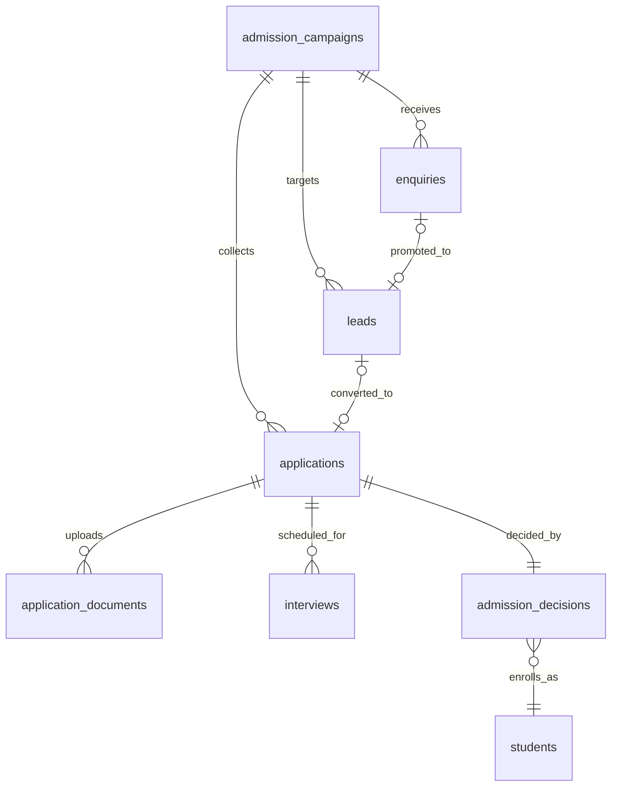

# Entities: Admissions & Lead Management

> **Agent Context**
> **Summary:** Column-level specs for the 7 tables owned by the admissions module: campaigns, enquiries, leads, applications, application documents, interviews, and decisions. Every table is tenant-owned and implicitly carries `id UUID PK`, `tenant_id FK`, `created_at`/`updated_at`, `created_by`/`updated_by`, `deleted_at` (soft delete) — exceptions stated per table. Public-website submissions create rows with `created_by = null` (unauthenticated channel; captured source retained). Monetary columns are `numeric(12,2)` in the tenant's configured currency.
> **Co-load with:** `../../03-modules/admissions.md` · `academics.md` (sessions, classes, campuses) · `people.md` (students) · `finance.md` (fee_invoices) · `tenancy.md` (users, files)

### admission_campaigns

Admission drive per academic session, optionally per campus, with seats, fee, form, and document checklist configuration.

| Column | Type | Null | Default | Notes |
| ------ | ---- | ---- | ------- | ----- |
| name | varchar(160) | no | — | e.g. "2027–28 Primary Intake" |
| academic_session_id | uuid | no | — | FK → `academic_sessions.id` |
| campus_id | uuid | yes | null | FK → `campuses.id`; null = all campuses |
| target_class_ids | jsonb | no | `'[]'` | Array of `classes.id` the campaign admits into |
| start_date | date | no | — | |
| end_date | date | no | — | Applications rejected after this date (permissioned override) |
| seats_target | integer | yes | null | Seat-fill target; accepts beyond target trigger override warning |
| application_fee | numeric(12,2) | yes | null | Null = free; invoiced via fees-finance when set |
| form_schema | jsonb | no | `'{}'` | Configurable application-form field definitions |
| required_documents | jsonb | no | `'[]'` | Document-type checklist (see `application_documents.document_type`) |
| status | varchar(15) | no | `'draft'` | Enum: `draft`, `open`, `closed`, `archived` |
| is_published_on_website | boolean | no | `false` | Exposed to the public site read path when true |
| description | text | yes | null | Public-facing campaign description |

Indexes: unique `(tenant_id, academic_session_id, campus_id, name)`; `(tenant_id, status, is_published_on_website)`.
Relationships: many→one `academic_sessions`, `campuses`; one→many `enquiries`, `leads`, `applications`.

### enquiries

Raw first-contact records from any source; promoted to leads when qualified.

| Column | Type | Null | Default | Notes |
| ------ | ---- | ---- | ------- | ----- |
| admission_campaign_id | uuid | yes | null | FK → `admission_campaigns.id`; null for general enquiries |
| source | varchar(20) | no | `'walk_in'` | Enum: `website`, `walk_in`, `phone`, `referral`, `event`, `other` |
| enquirer_name | varchar(160) | no | — | Parent/guardian making contact |
| phone | varchar(30) | no | — | Duplicate-merge key with email |
| email | varchar(160) | yes | null | |
| child_name | varchar(160) | yes | null | |
| child_dob | date | yes | null | |
| class_id | uuid | yes | null | FK → `classes.id` (class applied for) |
| message | text | yes | null | Free-text enquiry content |
| status | varchar(15) | no | `'new'` | Enum: `new`, `contacted`, `converted`, `closed` |
| closed_reason | varchar(160) | yes | null | Required when status = `closed` |
| handled_by | uuid | yes | null | FK → `users.id` (owner) |

Indexes: `(tenant_id, status, handled_by)`; `(tenant_id, phone)`; `(tenant_id, admission_campaign_id, source)`.
Relationships: many→one `admission_campaigns`, `classes`, `users`; one→one optional `leads` (via `leads.enquiry_id`).

### leads

Qualified prospects tracked through the pipeline with ownership, follow-ups, and AI score.

| Column | Type | Null | Default | Notes |
| ------ | ---- | ---- | ------- | ----- |
| enquiry_id | uuid | yes | null | FK → `enquiries.id`; null for imported/direct leads |
| admission_campaign_id | uuid | yes | null | FK → `admission_campaigns.id` |
| guardian_name | varchar(160) | no | — | |
| phone | varchar(30) | no | — | Duplicate-detection key |
| email | varchar(160) | yes | null | |
| student_name | varchar(160) | no | — | Prospective student |
| student_dob | date | yes | null | |
| class_id | uuid | yes | null | FK → `classes.id` (desired class) |
| stage | varchar(25) | no | `'new'` | Enum: `new`, `contacted`, `engaged`, `application_started`, `converted`, `lost` |
| lost_reason | varchar(160) | yes | null | Required when stage = `lost` |
| assigned_to | uuid | yes | null | FK → `users.id` (owner) |
| lead_score | smallint | yes | null | 0–100, written by `AI-ADM-01`; null until first scoring |
| score_factors | jsonb | yes | null | Explanation payload for the score (transparency) |
| last_contact_at | timestamptz | yes | null | |
| next_follow_up_at | timestamptz | yes | null | Drives the follow-up queue |
| notes | text | yes | null | Activity log summary (detailed activity via audit trail) |

Indexes: `(tenant_id, stage, assigned_to)`; `(tenant_id, next_follow_up_at)`; `(tenant_id, phone)`; `(tenant_id, lead_score)`.
Relationships: many→one `enquiries`, `admission_campaigns`, `classes`, `users`; one→one optional `applications` (via `applications.lead_id`).

### applications

Formal admission applications with configurable form data and funnel status.

| Column | Type | Null | Default | Notes |
| ------ | ---- | ---- | ------- | ----- |
| application_no | varchar(30) | no | — | Tenant sequence; unique `(tenant_id, application_no)` |
| admission_campaign_id | uuid | no | — | FK → `admission_campaigns.id` |
| lead_id | uuid | yes | null | FK → `leads.id`; null for direct applications |
| applicant_name | varchar(160) | no | — | |
| applicant_dob | date | no | — | |
| applicant_gender | varchar(20) | yes | null | Tenant-configurable value list |
| guardian_name | varchar(160) | no | — | |
| guardian_phone | varchar(30) | no | — | Applicant contact for notifications |
| guardian_email | varchar(160) | yes | null | |
| class_id | uuid | no | — | FK → `classes.id` (applied class) |
| campus_id | uuid | yes | null | FK → `campuses.id` |
| form_data | jsonb | no | `'{}'` | Answers to the campaign's `form_schema` |
| submitted_via | varchar(20) | no | `'dashboard'` | Enum: `public_website`, `dashboard` |
| public_token | varchar(64) | yes | null | Unique tracking token for public status page; unique partial where not null |
| status | varchar(25) | no | `'draft'` | Enum: `draft`, `submitted`, `under_review`, `documents_pending`, `interview_scheduled`, `decision_pending`, `accepted`, `rejected`, `waitlisted`, `withdrawn`, `enrolled` |
| submitted_at | timestamptz | yes | null | |
| application_fee_invoice_id | uuid | yes | null | FK → `fee_invoices.id` (see `finance.md`); set when campaign has a fee |
| reviewed_by | uuid | yes | null | FK → `users.id` |
| review_notes | text | yes | null | |

Indexes: unique `(tenant_id, application_no)`; unique partial `(tenant_id, public_token)`; `(tenant_id, admission_campaign_id, status)`; `(tenant_id, guardian_phone)`; `(tenant_id, applicant_name, applicant_dob)` for duplicate flagging.
Relationships: many→one `admission_campaigns`, `leads`, `classes`, `campuses`, `fee_invoices`, `users`; one→many `application_documents`, `interviews`; one→one `admission_decisions`.

### application_documents

Uploaded applicant documents with verification state and OCR extraction.

| Column | Type | Null | Default | Notes |
| ------ | ---- | ---- | ------- | ----- |
| application_id | uuid | no | — | FK → `applications.id` |
| document_type | varchar(30) | no | — | Enum: `birth_certificate`, `photo`, `transfer_certificate`, `report_card`, `id_document`, `guardian_id`, `other` |
| file_id | uuid | no | — | FK → `files.id` (tenant-scoped object storage) |
| verification_status | varchar(15) | no | `'pending'` | Enum: `pending`, `verified`, `rejected` |
| verified_by | uuid | yes | null | FK → `users.id`; requires `admissions.application-document.verify` |
| verified_at | timestamptz | yes | null | |
| rejection_reason | varchar(255) | yes | null | Required when status = `rejected` |
| extracted_data | jsonb | yes | null | OCR field extraction from `AI-ADM-03` (advisory only) |

Indexes: `(tenant_id, application_id, document_type)`; `(tenant_id, verification_status)`.
Relationships: many→one `applications`, `files`, `users`.

### interviews

Scheduled interviews with outcome scoring and recommendation.

| Column | Type | Null | Default | Notes |
| ------ | ---- | ---- | ------- | ----- |
| application_id | uuid | no | — | FK → `applications.id` |
| scheduled_at | timestamptz | no | — | |
| duration_minutes | smallint | no | `30` | |
| mode | varchar(15) | no | `'in_person'` | Enum: `in_person`, `online` |
| location | varchar(160) | yes | null | Room name or meeting URL |
| interviewer_id | uuid | no | — | FK → `staff.id` (accountable interviewer; panel noted in remarks) |
| status | varchar(15) | no | `'scheduled'` | Enum: `scheduled`, `completed`, `no_show`, `canceled`, `rescheduled` |
| score | numeric(5,2) | yes | null | Tenant-defined scale; set on completion |
| remarks | text | yes | null | |
| recommendation | varchar(15) | yes | null | Enum: `recommend`, `hold`, `reject`; set on completion |

Indexes: `(tenant_id, application_id)`; `(tenant_id, interviewer_id, scheduled_at)`; `(tenant_id, status, scheduled_at)`.
Relationships: many→one `applications`, `staff`.

### admission_decisions

Approved decision per application, offer window, waitlist ordering, and enrollment linkage.

| Column | Type | Null | Default | Notes |
| ------ | ---- | ---- | ------- | ----- |
| application_id | uuid | no | — | FK → `applications.id`; unique (one active decision) |
| decision | varchar(15) | no | — | Enum: `accepted`, `rejected`, `waitlisted` |
| decided_by | uuid | no | — | FK → `users.id` (approver holding `admissions.decision.approve`; ≠ drafter/created_by) |
| decided_at | timestamptz | no | `now()` | |
| reason | text | yes | null | Required for `rejected`/`waitlisted` |
| offer_expires_at | timestamptz | yes | null | Required when decision = `accepted`; lapse triggers waitlist promotion |
| offer_confirmed_at | timestamptz | yes | null | Guardian confirmation timestamp |
| waitlist_position | smallint | yes | null | Ordered within `(campaign, class)` when `waitlisted` |
| enrolled_student_id | uuid | yes | null | FK → `students.id` (see `people.md`); set by student-management handoff |
| enrolled_at | timestamptz | yes | null | |

Indexes: unique `(tenant_id, application_id)`; `(tenant_id, decision)`; `(tenant_id, waitlist_position)`; `(tenant_id, offer_expires_at)` for lapse jobs.
Relationships: one→one `applications`; many→one `users`, `students`.

## Relationship Overview

