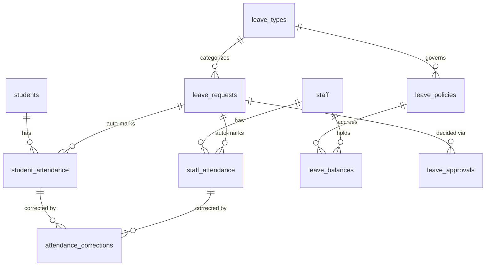

# Entities: Attendance & Leave

> **Agent Context**
> **Summary:** Column-level specifications for the attendance domain: student and staff attendance records, the correction workflow, and the shared leave system (types, policies, balances, requests, approvals) used by both the attendance module (student leave) and hr-leave (staff leave). Every table below is tenant-owned.
> **Co-load with:** `../../03-modules/attendance.md` · `../../03-modules/hr-leave.md` · `../../02-architecture/multi-tenancy.md`

Every table implicitly carries `id UUID PK`, `tenant_id FK`, `created_at/updated_at`, `created_by/updated_by`, `deleted_at` (soft delete) per the platform convention — these are not repeated below; exceptions are stated per table. Referenced tables owned elsewhere: `students`, `staff` ([`people.md`](people.md)); `sections`, `academic_sessions`, `periods` ([`academics.md`](academics.md)); `users`, `files` ([`tenancy.md`](tenancy.md)).

### student_attendance

One row per student per date (per period when the tenant enables period mode) recording presence status.

| Column | Type | Null | Default | Notes |
| ------ | ---- | ---- | ------- | ----- |
| student_id | UUID | no | — | FK → students |
| section_id | UUID | no | — | FK → sections; section at time of marking |
| academic_session_id | UUID | no | — | FK → academic_sessions |
| period_id | UUID | yes | NULL | FK → periods; NULL = daily attendance |
| attendance_date | DATE | no | — | Tenant-timezone calendar date |
| status | VARCHAR(20) | no | — | Enum: `present`, `absent`, `late`, `half_day`, `excused`, `on_leave` |
| check_in_time | TIME | yes | NULL | Set for `late` (late-arrival capture) |
| check_out_time | TIME | yes | NULL | Set for early departure / `half_day` |
| late_minutes | INTEGER | yes | NULL | Computed server-side from tenant day window |
| leave_request_id | UUID | yes | NULL | FK → leave_requests; set when status = `on_leave` |
| source | VARCHAR(20) | no | `manual` | Enum: `manual`, `import`, `device` (reserved for biometric/RFID) |
| marked_by | UUID | no | — | FK → users; the marking actor |
| is_locked | BOOLEAN | no | false | True after lock window; changes then require a correction |
| remarks | VARCHAR(255) | yes | NULL | |

Indexes: unique partial `(tenant_id, student_id, attendance_date)` where `period_id IS NULL`; unique partial `(tenant_id, student_id, attendance_date, period_id)` where `period_id IS NOT NULL`; `(tenant_id, section_id, attendance_date)`; `(tenant_id, attendance_date, status)`.
Relationships: N:1 students, sections, academic_sessions, periods, leave_requests; 1:N attendance_corrections.

### staff_attendance

One row per staff member (including teachers) per date with check-in/out times.

| Column | Type | Null | Default | Notes |
| ------ | ---- | ---- | ------- | ----- |
| staff_id | UUID | no | — | FK → staff |
| attendance_date | DATE | no | — | |
| status | VARCHAR(20) | no | — | Enum: `present`, `absent`, `late`, `half_day`, `on_leave`, `holiday` |
| check_in_time | TIME | yes | NULL | |
| check_out_time | TIME | yes | NULL | Must be > check_in_time |
| late_minutes | INTEGER | yes | NULL | Computed vs tenant work-day window |
| early_departure_minutes | INTEGER | yes | NULL | Computed |
| leave_request_id | UUID | yes | NULL | FK → leave_requests; set when status = `on_leave` |
| source | VARCHAR(20) | no | `manual` | Enum: `manual`, `self`, `import`, `device` (reserved) |
| marked_by | UUID | no | — | FK → users |
| is_locked | BOOLEAN | no | false | |
| remarks | VARCHAR(255) | yes | NULL | |

Indexes: unique `(tenant_id, staff_id, attendance_date)`; `(tenant_id, attendance_date, status)`.
Relationships: N:1 staff, leave_requests; 1:N attendance_corrections. Absence rows feed teacher_substitutions ([`academics.md`](academics.md)).

### attendance_corrections

A requested change to a locked attendance record, with approval outcome; approved corrections update the target row and remain as audit trail.

| Column | Type | Null | Default | Notes |
| ------ | ---- | ---- | ------- | ----- |
| subject_type | VARCHAR(10) | no | — | Enum: `student`, `staff` |
| student_attendance_id | UUID | yes | NULL | FK → student_attendance; exactly one target FK set (CHECK) |
| staff_attendance_id | UUID | yes | NULL | FK → staff_attendance |
| requested_by | UUID | no | — | FK → users |
| old_values | JSONB | no | — | Snapshot: status/times before |
| new_values | JSONB | no | — | Proposed status/times |
| reason | VARCHAR(500) | no | — | Mandatory justification |
| status | VARCHAR(20) | no | `pending` | Enum: `pending`, `approved`, `rejected`, `cancelled` |
| reviewed_by | UUID | yes | NULL | FK → users; must differ from requested_by |
| reviewed_at | TIMESTAMPTZ | yes | NULL | |
| review_note | VARCHAR(500) | yes | NULL | |

Indexes: `(tenant_id, status)`; `(tenant_id, student_attendance_id)`; `(tenant_id, staff_attendance_id)`.
Relationships: N:1 student_attendance, staff_attendance, users (requester/reviewer).

### leave_types

Tenant-configured leave categories, applicable to staff, students, or both.

| Column | Type | Null | Default | Notes |
| ------ | ---- | ---- | ------- | ----- |
| name | VARCHAR(100) | no | — | e.g. "Sick Leave", "Casual Leave" |
| code | VARCHAR(20) | no | — | Unique per tenant |
| applies_to | VARCHAR(10) | no | `both` | Enum: `staff`, `student`, `both` |
| is_paid | BOOLEAN | no | true | Staff payroll relevance only |
| requires_attachment | BOOLEAN | no | false | e.g. medical note |
| max_consecutive_days | INTEGER | yes | NULL | NULL = unlimited |
| is_active | BOOLEAN | no | true | |

Indexes: unique `(tenant_id, code)`.
Relationships: 1:N leave_policies, leave_requests.

### leave_policies

Quota and accrual rules for a leave type applied to a staff population. Business semantics governed by the hr-leave module; students have no policies/balances.

| Column | Type | Null | Default | Notes |
| ------ | ---- | ---- | ------- | ----- |
| leave_type_id | UUID | no | — | FK → leave_types (applies_to must include staff) |
| name | VARCHAR(100) | no | — | |
| annual_quota_days | NUMERIC(5,1) | no | — | Entitlement per cycle; half-days supported |
| accrual_frequency | VARCHAR(20) | no | `annual` | Enum: `annual`, `monthly` |
| carry_forward_max_days | NUMERIC(5,1) | no | 0 | |
| min_notice_days | INTEGER | no | 0 | |
| applicability | JSONB | yes | NULL | Optional filter: departments/designations/employment types (recommendation) |
| effective_from | DATE | no | — | |
| effective_to | DATE | yes | NULL | NULL = open-ended |
| is_active | BOOLEAN | no | true | |

Indexes: `(tenant_id, leave_type_id, is_active)`.
Relationships: N:1 leave_types; 1:N leave_balances.

### leave_balances

Per-staff entitlement and usage for one policy in one balance period; maintained by hr-leave accrual jobs and consumed by payroll.

| Column | Type | Null | Default | Notes |
| ------ | ---- | ---- | ------- | ----- |
| staff_id | UUID | no | — | FK → staff |
| leave_policy_id | UUID | no | — | FK → leave_policies |
| period_start | DATE | no | — | Balance cycle start (session/calendar year per tenant) |
| period_end | DATE | no | — | |
| entitled_days | NUMERIC(5,1) | no | — | Quota + adjustments |
| carried_forward_days | NUMERIC(5,1) | no | 0 | |
| used_days | NUMERIC(5,1) | no | 0 | Incremented on approval, decremented on cancellation |
| pending_days | NUMERIC(5,1) | no | 0 | Days in pending requests (soft hold) |

Indexes: unique `(tenant_id, staff_id, leave_policy_id, period_start)`.
Relationships: N:1 staff, leave_policies.

### leave_requests

A leave application by (or on behalf of) a staff member or student.

| Column | Type | Null | Default | Notes |
| ------ | ---- | ---- | ------- | ----- |
| requester_type | VARCHAR(10) | no | — | Enum: `staff`, `student` |
| staff_id | UUID | yes | NULL | FK → staff; exactly one of staff_id/student_id set (CHECK) |
| student_id | UUID | yes | NULL | FK → students |
| submitted_by | UUID | no | — | FK → users; guardian may submit for a student |
| leave_type_id | UUID | no | — | FK → leave_types |
| start_date | DATE | no | — | ≤ end_date (CHECK) |
| end_date | DATE | no | — | |
| day_part | VARCHAR(20) | no | `full` | Enum: `full`, `first_half`, `second_half` |
| days_count | NUMERIC(5,1) | no | — | Computed net of holidays |
| reason | VARCHAR(1000) | no | — | |
| attachment_file_id | UUID | yes | NULL | FK → files |
| status | VARCHAR(20) | no | `pending` | Enum: `pending`, `approved`, `rejected`, `cancelled` |
| current_approval_level | INTEGER | no | 1 | Step pointer into the tenant's approval chain |
| decided_at | TIMESTAMPTZ | yes | NULL | Terminal decision timestamp |

Indexes: `(tenant_id, staff_id, start_date)`; `(tenant_id, student_id, start_date)`; `(tenant_id, status)`.
Relationships: N:1 leave_types, staff, students, files; 1:N leave_approvals; 1:N student_attendance / staff_attendance rows via leave_request_id.

### leave_approvals

One row per approval step per leave request (tenant-configurable chains).

| Column | Type | Null | Default | Notes |
| ------ | ---- | ---- | ------- | ----- |
| leave_request_id | UUID | no | — | FK → leave_requests |
| level | INTEGER | no | — | 1-based step order |
| required_permission | VARCHAR(100) | no | — | e.g. `attendance.leave-request.approve`, `hr.leave-request.approve` |
| approver_id | UUID | yes | NULL | FK → users; set on decision; must differ from submitted_by |
| decision | VARCHAR(20) | no | `pending` | Enum: `pending`, `approved`, `rejected`, `skipped` |
| decided_at | TIMESTAMPTZ | yes | NULL | |
| note | VARCHAR(500) | yes | NULL | |

Indexes: unique `(tenant_id, leave_request_id, level)`; `(tenant_id, approver_id, decision)`.
Relationships: N:1 leave_requests, users.

## Relationship Overview

