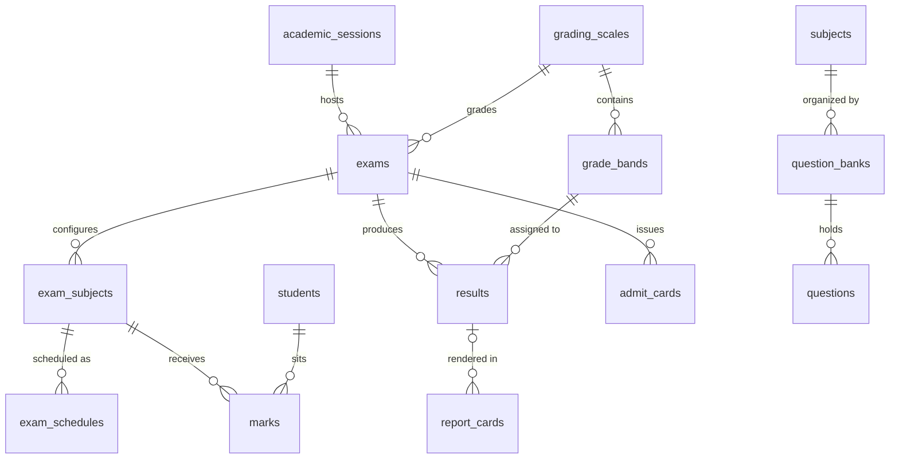

# Entities: Examinations & Assessment

> **Agent Context**
> **Summary:** Column-level specifications for the examination domain: exam definitions, per-class subject configuration, schedules, tenant grading scales/bands, marks, processed results, report cards, admit cards, and the question bank. Every table below is tenant-owned.
> **Co-load with:** `../../03-modules/examinations.md` · `../../02-architecture/multi-tenancy.md` · `academics.md`

Every table implicitly carries `id UUID PK`, `tenant_id FK`, `created_at/updated_at`, `created_by/updated_by`, `deleted_at` (soft delete) per the platform convention — these are not repeated below; exceptions are stated per table. Referenced tables owned elsewhere: `students` ([`people.md`](people.md)); `staff` ([`people.md`](people.md)); `classes`, `sections`, `subjects`, `academic_sessions`, `terms`, `rooms` ([`academics.md`](academics.md)); `users`, `files` ([`tenancy.md`](tenancy.md)).

### exams

An examination event (unit test, midterm, final, practical) within an academic session/term, carrying its lifecycle status and grading scale.

| Column | Type | Null | Default | Notes |
| ------ | ---- | ---- | ------- | ----- |
| academic_session_id | UUID | no | — | FK → academic_sessions |
| term_id | UUID | yes | NULL | FK → terms |
| name | VARCHAR(150) | no | — | e.g. "Term 1 Midterm" |
| exam_type | VARCHAR(30) | no | — | Enum: `unit_test`, `midterm`, `final`, `practical`, `custom` |
| grading_scale_id | UUID | no | — | FK → grading_scales |
| weightage_percent | NUMERIC(5,2) | no | 100 | Contribution to term/session consolidated result |
| starts_on | DATE | yes | NULL | |
| ends_on | DATE | yes | NULL | ≥ starts_on (CHECK) |
| status | VARCHAR(20) | no | `draft` | Enum: `draft`, `scheduled`, `ongoing`, `marks_entry`, `processing`, `approved`, `published`, `archived` |
| description | VARCHAR(500) | yes | NULL | |

Indexes: unique `(tenant_id, academic_session_id, name)`; `(tenant_id, status)`; `(tenant_id, term_id)`.
Relationships: N:1 academic_sessions, terms, grading_scales; 1:N exam_subjects, results, report_cards, admit_cards.

### exam_subjects

Per-class subject configuration for an exam: marks structure and pass criteria.

| Column | Type | Null | Default | Notes |
| ------ | ---- | ---- | ------- | ----- |
| exam_id | UUID | no | — | FK → exams |
| class_id | UUID | no | — | FK → classes |
| subject_id | UUID | no | — | FK → subjects |
| max_marks | NUMERIC(6,2) | no | — | Theory component maximum |
| pass_marks | NUMERIC(6,2) | no | — | ≤ max_marks (CHECK) |
| has_practical | BOOLEAN | no | false | |
| practical_max_marks | NUMERIC(6,2) | yes | NULL | Required when has_practical (CHECK) |
| practical_pass_marks | NUMERIC(6,2) | yes | NULL | |
| subject_weightage_percent | NUMERIC(5,2) | no | 100 | Weight within the exam's aggregate |
| marks_entry_opens_at | TIMESTAMPTZ | yes | NULL | Entry window start |
| marks_entry_closes_at | TIMESTAMPTZ | yes | NULL | Entry window end |
| marks_locked_at | TIMESTAMPTZ | yes | NULL | Set by `:lock-marks` |

Indexes: unique `(tenant_id, exam_id, class_id, subject_id)`; `(tenant_id, exam_id)`.
Relationships: N:1 exams, classes, subjects; 1:N exam_schedules, marks.

### exam_schedules

Date/time/room/invigilator assignment of one exam-subject for one section.

| Column | Type | Null | Default | Notes |
| ------ | ---- | ---- | ------- | ----- |
| exam_subject_id | UUID | no | — | FK → exam_subjects |
| section_id | UUID | no | — | FK → sections |
| exam_date | DATE | no | — | Within exam starts_on/ends_on |
| start_time | TIME | no | — | Tenant timezone |
| end_time | TIME | no | — | > start_time (CHECK) |
| room_id | UUID | yes | NULL | FK → rooms |
| invigilator_staff_id | UUID | yes | NULL | FK → staff |
| status | VARCHAR(20) | no | `scheduled` | Enum: `scheduled`, `completed`, `cancelled` |
| instructions | VARCHAR(500) | yes | NULL | Printed on admit cards |

Indexes: unique `(tenant_id, exam_subject_id, section_id)`; `(tenant_id, exam_date, room_id)`; `(tenant_id, exam_date, invigilator_staff_id)`.
Relationships: N:1 exam_subjects, sections, rooms, staff.

### grading_scales

A tenant grading model mapping percentages to grades/points; no country-specific scheme assumed.

| Column | Type | Null | Default | Notes |
| ------ | ---- | ---- | ------- | ----- |
| name | VARCHAR(100) | no | — | e.g. "Standard Letter Grades" |
| scale_type | VARCHAR(20) | no | `letter` | Enum: `percentage`, `letter`, `gpa`, `hybrid` |
| gpa_max | NUMERIC(4,2) | yes | NULL | e.g. 4.00 or 5.00; required for `gpa`/`hybrid` |
| is_default | BOOLEAN | no | false | One default per tenant (partial unique) |
| description | VARCHAR(500) | yes | NULL | |

Indexes: unique `(tenant_id, name)`; unique partial `(tenant_id)` where `is_default`.
Relationships: 1:N grade_bands, exams.

### grade_bands

One band within a grading scale; bands must be contiguous and non-overlapping, covering 0–100%.

| Column | Type | Null | Default | Notes |
| ------ | ---- | ---- | ------- | ----- |
| grading_scale_id | UUID | no | — | FK → grading_scales |
| label | VARCHAR(10) | no | — | e.g. `A+`, `B` |
| min_percent | NUMERIC(5,2) | no | — | Inclusive; < max_percent (CHECK) |
| max_percent | NUMERIC(5,2) | no | — | Inclusive upper bound |
| grade_point | NUMERIC(4,2) | yes | NULL | For GPA scales |
| is_passing | BOOLEAN | no | true | |
| remark | VARCHAR(100) | yes | NULL | e.g. "Excellent" |
| sort_order | INTEGER | no | — | |

Indexes: unique `(tenant_id, grading_scale_id, label)`; `(grading_scale_id, min_percent)`.
Relationships: N:1 grading_scales; 1:N results (grade assignment).

### marks

Raw marks for one student in one exam-subject; the input to result processing. AI grading assistance never writes here directly — teacher-confirmed values only.

| Column | Type | Null | Default | Notes |
| ------ | ---- | ---- | ------- | ----- |
| exam_subject_id | UUID | no | — | FK → exam_subjects |
| student_id | UUID | no | — | FK → students |
| theory_marks | NUMERIC(6,2) | yes | NULL | 0 ≤ value ≤ max_marks (CHECK); NULL when absent/exempt |
| practical_marks | NUMERIC(6,2) | yes | NULL | 0 ≤ value ≤ practical_max_marks (CHECK) |
| is_absent | BOOLEAN | no | false | Mutually exclusive with marks (CHECK) |
| is_exempt | BOOLEAN | no | false | Excluded from aggregates |
| status | VARCHAR(20) | no | `draft` | Enum: `draft`, `submitted`, `locked` |
| entered_by | UUID | no | — | FK → users; teacher/exam_staff who entered |
| remarks | VARCHAR(255) | yes | NULL | |

Indexes: unique `(tenant_id, exam_subject_id, student_id)`; `(tenant_id, student_id)`; `(tenant_id, exam_subject_id, status)`.
Relationships: N:1 exam_subjects, students, users.

### results

Processed per-student outcome for one exam: aggregates, grade, GPA, rank, and the approval/publishing state. Recomputed idempotently until approved.

| Column | Type | Null | Default | Notes |
| ------ | ---- | ---- | ------- | ----- |
| exam_id | UUID | no | — | FK → exams |
| student_id | UUID | no | — | FK → students |
| section_id | UUID | no | — | FK → sections; section at processing time |
| total_max_marks | NUMERIC(8,2) | no | — | Sum across applicable exam_subjects |
| total_obtained_marks | NUMERIC(8,2) | no | — | |
| percentage | NUMERIC(5,2) | no | — | Server-computed |
| grade_band_id | UUID | yes | NULL | FK → grade_bands |
| gpa | NUMERIC(4,2) | yes | NULL | For GPA scales |
| rank_in_section | INTEGER | yes | NULL | Optional per tenant policy |
| rank_in_class | INTEGER | yes | NULL | |
| outcome | VARCHAR(20) | no | — | Enum: `pass`, `fail`, `absent`, `withheld` |
| grace_marks | NUMERIC(6,2) | no | 0 | Moderation adjustment, audited (recommendation) |
| status | VARCHAR(20) | no | `processing` | Enum: `processing`, `pending_approval`, `approved`, `published` |
| approved_by | UUID | yes | NULL | FK → users; must differ from processing initiator |
| approved_at | TIMESTAMPTZ | yes | NULL | |
| published_at | TIMESTAMPTZ | yes | NULL | |

Indexes: unique `(tenant_id, exam_id, student_id)`; `(tenant_id, exam_id, section_id)`; `(tenant_id, student_id)`; `(tenant_id, status)`.
Relationships: N:1 exams, students, sections, grade_bands, users; 1:1 report_cards for exam-scoped cards (term-consolidated cards span multiple results). Consumed by certificates-documents for transcripts.

### report_cards

A generated report-card record for one student and exam (or term consolidation), linking the rendered PDF and remarks.

| Column | Type | Null | Default | Notes |
| ------ | ---- | ---- | ------- | ----- |
| exam_id | UUID | yes | NULL | FK → exams; exactly one of exam_id/term_id set (CHECK) |
| term_id | UUID | yes | NULL | FK → terms; term-consolidated card |
| student_id | UUID | no | — | FK → students |
| result_id | UUID | yes | NULL | FK → results; NULL for term consolidation (spans multiple results) |
| file_id | UUID | yes | NULL | FK → files; rendered PDF |
| class_teacher_remarks | VARCHAR(1000) | yes | NULL | |
| principal_remarks | VARCHAR(1000) | yes | NULL | |
| attendance_summary | JSONB | yes | NULL | Snapshot from the attendance module at generation time |
| version | INTEGER | no | 1 | Incremented on regeneration |
| status | VARCHAR(20) | no | `draft` | Enum: `draft`, `generated`, `published` |
| published_at | TIMESTAMPTZ | yes | NULL | |

Indexes: unique partial `(tenant_id, exam_id, student_id)` where `exam_id IS NOT NULL`; unique partial `(tenant_id, term_id, student_id)` where `term_id IS NOT NULL`.
Relationships: N:1 exams, terms, students, results, files.

### admit_cards

An issued admit card for one student for one exam, linking the rendered PDF.

| Column | Type | Null | Default | Notes |
| ------ | ---- | ---- | ------- | ----- |
| exam_id | UUID | no | — | FK → exams |
| student_id | UUID | no | — | FK → students |
| admit_card_no | VARCHAR(50) | no | — | Tenant-unique, template-generated sequence |
| file_id | UUID | yes | NULL | FK → files; rendered PDF |
| status | VARCHAR(20) | no | `generated` | Enum: `generated`, `issued`, `revoked` |
| issued_by | UUID | yes | NULL | FK → users |
| issued_at | TIMESTAMPTZ | yes | NULL | |
| revoked_reason | VARCHAR(255) | yes | NULL | e.g. fee-clearance policy (tenant-configurable) |

Indexes: unique `(tenant_id, exam_id, student_id)`; unique `(tenant_id, admit_card_no)`.
Relationships: N:1 exams, students, files, users.

### question_banks

A collection of questions for one subject (optionally scoped to a class level), feeding exam-paper assembly and quizzes.

| Column | Type | Null | Default | Notes |
| ------ | ---- | ---- | ------- | ----- |
| subject_id | UUID | no | — | FK → subjects |
| class_id | UUID | yes | NULL | FK → classes; NULL = all levels |
| name | VARCHAR(150) | no | — | |
| description | VARCHAR(500) | yes | NULL | |
| status | VARCHAR(20) | no | `active` | Enum: `active`, `archived` |

Indexes: unique `(tenant_id, subject_id, name)`; `(tenant_id, class_id)`.
Relationships: N:1 subjects, classes; 1:N questions.

### questions

An individual question with type, difficulty, and source; AI-generated questions require approval before use.

| Column | Type | Null | Default | Notes |
| ------ | ---- | ---- | ------- | ----- |
| question_bank_id | UUID | no | — | FK → question_banks |
| question_text | TEXT | no | — | |
| question_type | VARCHAR(20) | no | — | Enum: `mcq`, `true_false`, `short_answer`, `long_answer`, `fill_blank`, `numerical` |
| difficulty | VARCHAR(10) | no | `medium` | Enum: `easy`, `medium`, `hard` |
| default_marks | NUMERIC(5,2) | no | 1 | |
| options | JSONB | yes | NULL | MCQ choices; required for `mcq`/`true_false` (CHECK) |
| answer_key | JSONB | yes | NULL | Correct answer(s) / model answer |
| topic | VARCHAR(150) | yes | NULL | Blueprint filter |
| source | VARCHAR(20) | no | `manual` | Enum: `manual`, `ai_generated`, `imported` |
| is_approved | BOOLEAN | no | true | False on creation for `ai_generated`; flipped by `exams.question.approve` |
| approved_by | UUID | yes | NULL | FK → users |
| usage_count | INTEGER | no | 0 | Incremented per paper assembly |

Indexes: `(tenant_id, question_bank_id, difficulty)`; `(tenant_id, question_bank_id, topic)`; `(tenant_id, source, is_approved)`.
Relationships: N:1 question_banks, users. Assembled papers are stored as `files` (no dedicated table — see module doc §15).

## Relationship Overview

