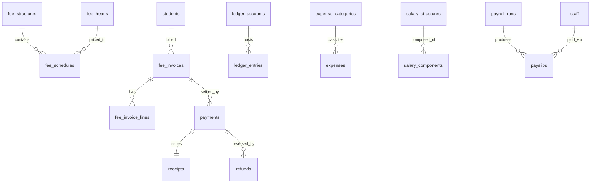

# Entities: Finance & Payroll

> **Agent Context**
> **Summary:** Column-level specs for the 20 tables owned by the fees-finance module: fee configuration, invoicing, collections, refunds, general ledger, expenses, budgets, and payroll. Every table is tenant-owned and implicitly carries `id UUID PK`, `tenant_id FK`, `created_at`/`updated_at`, `created_by`/`updated_by`, `deleted_at` (soft delete) — exceptions are stated per table. All monetary columns are `numeric(12,2)` in the tenant's configured currency (no per-row currency column).
> **Co-load with:** `../../03-modules/fees-finance.md` · `people.md` (students, staff) · `academics.md` (sessions, terms, classes, campuses) · `tenancy.md` (users, files)

### fee_heads

Chargeable fee categories (tuition, transport, exam, admission, fine, …) mapped to income ledger accounts.

| Column | Type | Null | Default | Notes |
| ------ | ---- | ---- | ------- | ----- |
| name | varchar(120) | no | — | Display name |
| code | varchar(30) | no | — | Unique per tenant: `(tenant_id, code)` |
| category | varchar(20) | no | `'other'` | Enum: `tuition`, `admission`, `transport`, `library`, `exam`, `fine`, `other` |
| ledger_account_id | uuid | no | — | FK → `ledger_accounts.id` (income account) |
| is_refundable | boolean | no | `true` | Whether payments against this head may be refunded |
| is_active | boolean | no | `true` | Inactive heads excluded from new structures |

Indexes: unique `(tenant_id, code)`; `(tenant_id, category)`.
Relationships: many→one `ledger_accounts`; one→many `fee_schedules`, `fee_invoice_lines`.

### fee_structures

Named fee set for a session, optionally scoped to a class and/or campus.

| Column | Type | Null | Default | Notes |
| ------ | ---- | ---- | ------- | ----- |
| name | varchar(120) | no | — | e.g. "Grade 5 — 2026–27" |
| academic_session_id | uuid | no | — | FK → `academic_sessions.id` |
| class_id | uuid | yes | null | FK → `classes.id`; null = session-wide |
| campus_id | uuid | yes | null | FK → `campuses.id`; null = all campuses |
| status | varchar(15) | no | `'draft'` | Enum: `draft`, `active`, `archived` |

Indexes: unique `(tenant_id, academic_session_id, class_id, campus_id, name)`; `(tenant_id, academic_session_id, status)`.
Relationships: many→one `academic_sessions`, `classes`, `campuses`; one→many `fee_schedules`, `fee_invoices`.

### fee_schedules

Line of a fee structure: which head is charged, how much, and when (acts as the installment schedule).

| Column | Type | Null | Default | Notes |
| ------ | ---- | ---- | ------- | ----- |
| fee_structure_id | uuid | no | — | FK → `fee_structures.id` |
| fee_head_id | uuid | no | — | FK → `fee_heads.id` |
| amount | numeric(12,2) | no | — | Amount per occurrence |
| frequency | varchar(15) | no | `'monthly'` | Enum: `one_time`, `monthly`, `per_term`, `annual` |
| term_id | uuid | yes | null | FK → `terms.id`; required when frequency = `per_term` |
| due_day | smallint | yes | null | Day-of-month due rule for `monthly` |
| due_date | date | yes | null | Fixed due date for `one_time`/`annual` |
| late_fee_policy | jsonb | yes | null | Grace days, fixed/percent late fee (tenant-configured) |

Indexes: unique `(tenant_id, fee_structure_id, fee_head_id, frequency, term_id)`; `(tenant_id, fee_structure_id)`.
Relationships: many→one `fee_structures`, `fee_heads`, `terms`; referenced by `fee_invoice_lines.source_id`.

### fee_invoices

Student invoice header with lifecycle status and denormalized totals.

| Column | Type | Null | Default | Notes |
| ------ | ---- | ---- | ------- | ----- |
| invoice_no | varchar(30) | no | — | Tenant sequence; unique `(tenant_id, invoice_no)` |
| student_id | uuid | no | — | FK → `students.id` |
| student_enrollment_id | uuid | yes | null | FK → `student_enrollments.id` (class/section at billing time) |
| academic_session_id | uuid | no | — | FK → `academic_sessions.id` |
| fee_structure_id | uuid | yes | null | FK → `fee_structures.id`; null for ad-hoc invoices |
| period_label | varchar(40) | yes | null | e.g. "2026-09", "Term 1"; part of duplicate guard |
| issue_date | date | no | — | |
| due_date | date | no | — | |
| status | varchar(20) | no | `'draft'` | Enum: `draft`, `issued`, `partially_paid`, `paid`, `overdue`, `canceled` |
| subtotal | numeric(12,2) | no | `0` | Sum of line amounts before discounts/fines |
| discount_total | numeric(12,2) | no | `0` | |
| fine_total | numeric(12,2) | no | `0` | |
| paid_total | numeric(12,2) | no | `0` | Maintained from confirmed payments/refunds |
| balance_due | numeric(12,2) | no | `0` | `subtotal − discount_total + fine_total − paid_total` |
| canceled_reason | text | yes | null | Required when status = `canceled` |

Indexes: unique `(tenant_id, invoice_no)`; unique partial `(tenant_id, student_id, fee_structure_id, period_label)` where status ≠ `canceled` (duplicate guard); `(tenant_id, student_id, status)`; `(tenant_id, due_date)` for aging.
Relationships: many→one `students`, `student_enrollments`, `academic_sessions`, `fee_structures`; one→many `fee_invoice_lines`, `payments`.

### fee_invoice_lines

Individual charges on an invoice with their origin.

| Column | Type | Null | Default | Notes |
| ------ | ---- | ---- | ------- | ----- |
| fee_invoice_id | uuid | no | — | FK → `fee_invoices.id` |
| fee_head_id | uuid | no | — | FK → `fee_heads.id` |
| description | varchar(255) | no | — | |
| amount | numeric(12,2) | no | — | Gross line amount (≥ 0) |
| discount_amount | numeric(12,2) | no | `0` | Applied portion of discounts/scholarships |
| source_type | varchar(20) | no | `'schedule'` | Enum: `schedule`, `fine`, `adjustment` |
| source_id | uuid | yes | null | FK to `fee_schedules.id` or `fines.id` per source_type |

Indexes: `(tenant_id, fee_invoice_id)`; `(tenant_id, source_type, source_id)`.
Relationships: many→one `fee_invoices`, `fee_heads`; polymorphic origin → `fee_schedules` / `fines`.

### discounts

Student-level discount grants (sibling, early-payment, staff-ward, custom).

| Column | Type | Null | Default | Notes |
| ------ | ---- | ---- | ------- | ----- |
| student_id | uuid | no | — | FK → `students.id` |
| academic_session_id | uuid | no | — | FK → `academic_sessions.id` |
| name | varchar(120) | no | — | e.g. "Sibling discount" |
| discount_type | varchar(10) | no | — | Enum: `percent`, `fixed` |
| value | numeric(12,2) | no | — | Percent (0–100) or fixed amount |
| fee_head_id | uuid | yes | null | FK → `fee_heads.id`; null = all heads |
| valid_from | date | yes | null | |
| valid_to | date | yes | null | |
| status | varchar(15) | no | `'active'` | Enum: `active`, `expired`, `revoked` |
| reason | text | yes | null | |
| approved_by | uuid | yes | null | FK → `users.id` (granter with waive/create permission) |

Indexes: `(tenant_id, student_id, academic_session_id, status)`.
Relationships: many→one `students`, `academic_sessions`, `fee_heads`, `users`.

### scholarships

Scholarship awards with lifecycle and sponsor.

| Column | Type | Null | Default | Notes |
| ------ | ---- | ---- | ------- | ----- |
| student_id | uuid | no | — | FK → `students.id` |
| academic_session_id | uuid | no | — | FK → `academic_sessions.id` |
| name | varchar(120) | no | — | |
| scholarship_type | varchar(20) | no | `'merit'` | Enum: `merit`, `need`, `sports`, `staff_ward`, `other` |
| coverage_type | varchar(10) | no | — | Enum: `percent`, `fixed` |
| value | numeric(12,2) | no | — | Percent (0–100) or fixed amount per session |
| sponsor | varchar(120) | yes | null | External sponsor name where applicable |
| status | varchar(15) | no | `'approved'` | Enum: `applied`, `approved`, `active`, `ended`, `revoked` |
| approved_by | uuid | yes | null | FK → `users.id` |
| notes | text | yes | null | |

Indexes: `(tenant_id, student_id, academic_session_id, status)`.
Relationships: many→one `students`, `academic_sessions`, `users`.

### fines

Fines raised manually or by other modules; invoiced as lines on the next invoice.

| Column | Type | Null | Default | Notes |
| ------ | ---- | ---- | ------- | ----- |
| student_id | uuid | no | — | FK → `students.id` |
| fee_head_id | uuid | no | — | FK → `fee_heads.id` (category `fine`) |
| fine_type | varchar(20) | no | `'other'` | Enum: `late_fee`, `library`, `transport`, `damage`, `discipline`, `other` |
| amount | numeric(12,2) | no | — | |
| reason | text | no | — | |
| source_module | varchar(30) | yes | null | Originating module slug (e.g. `library`) |
| source_reference | uuid | yes | null | Origin record id in the source module |
| status | varchar(15) | no | `'pending'` | Enum: `pending`, `invoiced`, `paid`, `waived` |
| waived_by | uuid | yes | null | FK → `users.id`; requires `fees.fine.waive` |
| waived_reason | text | yes | null | Required when status = `waived` |

Indexes: `(tenant_id, student_id, status)`; `(tenant_id, source_module, source_reference)`.
Relationships: many→one `students`, `fee_heads`, `users`; one→one optional `fee_invoice_lines` (via source).

### payments

Payments received against a single invoice (one invoice per payment; multi-invoice settlement handled as separate payments).

| Column | Type | Null | Default | Notes |
| ------ | ---- | ---- | ------- | ----- |
| fee_invoice_id | uuid | no | — | FK → `fee_invoices.id` |
| student_id | uuid | no | — | FK → `students.id` (denormalized for ledger queries) |
| amount | numeric(12,2) | no | — | > 0 and ≤ invoice balance at confirmation |
| method | varchar(20) | no | — | Enum: `cash`, `cheque`, `bank_transfer`, `card`, `online_gateway` |
| reference_no | varchar(80) | yes | null | Cheque/transaction reference |
| gateway_provider | varchar(40) | yes | null | Set for `online_gateway` |
| gateway_payload | jsonb | yes | null | Sanitized gateway confirmation snapshot |
| status | varchar(15) | no | `'pending'` | Enum: `pending`, `confirmed`, `failed`, `reversed` |
| paid_at | timestamptz | yes | null | Set on confirmation |
| received_by | uuid | yes | null | FK → `users.id`; null for gateway self-service |
| idempotency_key | varchar(80) | yes | null | Unique partial `(tenant_id, idempotency_key)` where not null |

Indexes: `(tenant_id, fee_invoice_id)`; `(tenant_id, student_id, paid_at)`; `(tenant_id, status, method)`; unique partial on idempotency_key.
Relationships: many→one `fee_invoices`, `students`, `users`; one→one `receipts`; one→many `refunds`.

### receipts

Numbered receipt issued for each confirmed payment.

| Column | Type | Null | Default | Notes |
| ------ | ---- | ---- | ------- | ----- |
| payment_id | uuid | no | — | FK → `payments.id`; unique (1:1) |
| receipt_no | varchar(30) | no | — | Tenant sequence; unique `(tenant_id, receipt_no)` |
| issued_at | timestamptz | no | `now()` | |
| amount | numeric(12,2) | no | — | Snapshot of payment amount |
| pdf_file_id | uuid | yes | null | FK → `files.id` (generated PDF) |

Indexes: unique `(tenant_id, receipt_no)`; unique `(tenant_id, payment_id)`.
Relationships: one→one `payments`; many→one `files`.

### refunds

Refund requests with approval state (workflow in fees-finance §7.2).

| Column | Type | Null | Default | Notes |
| ------ | ---- | ---- | ------- | ----- |
| payment_id | uuid | no | — | FK → `payments.id` |
| student_id | uuid | no | — | FK → `students.id` |
| amount | numeric(12,2) | no | — | ≤ refundable remainder of the payment |
| reason | text | no | — | |
| status | varchar(15) | no | `'requested'` | Enum: `requested`, `approved`, `rejected`, `processed` |
| requested_by | uuid | no | — | FK → `users.id` |
| approved_by | uuid | yes | null | FK → `users.id`; must differ from requested_by |
| decision_note | text | yes | null | |
| method | varchar(20) | yes | null | Enum as `payments.method`; set at processing |
| reference_no | varchar(80) | yes | null | |
| processed_at | timestamptz | yes | null | |
| idempotency_key | varchar(80) | yes | null | Unique partial `(tenant_id, idempotency_key)` where not null |

Indexes: `(tenant_id, status)`; `(tenant_id, payment_id)`; `(tenant_id, student_id)`.
Relationships: many→one `payments`, `students`, `users` (requester/approver).

### ledger_accounts

Tenant chart of accounts; system accounts seeded at provisioning.

| Column | Type | Null | Default | Notes |
| ------ | ---- | ---- | ------- | ----- |
| code | varchar(20) | no | — | Unique per tenant: `(tenant_id, code)` |
| name | varchar(120) | no | — | |
| account_type | varchar(15) | no | — | Enum: `asset`, `liability`, `equity`, `income`, `expense` |
| parent_id | uuid | yes | null | FK → `ledger_accounts.id` (hierarchy) |
| is_system | boolean | no | `false` | Seeded accounts; cannot be deleted |
| is_active | boolean | no | `true` | Archived accounts reject new postings |

Indexes: unique `(tenant_id, code)`; `(tenant_id, account_type)`.
Relationships: self-referencing hierarchy; one→many `ledger_entries`, `fee_heads`, `expense_categories`, `budgets`.

### ledger_entries

Immutable double-entry journal lines; corrections by reversal entries only. Exception to implicit columns: **no `updated_at`/`updated_by`/`deleted_at`** — append-only (no update/delete grants for the application role).

| Column | Type | Null | Default | Notes |
| ------ | ---- | ---- | ------- | ----- |
| transaction_id | uuid | no | — | Groups the balanced lines of one posting (Σ debit = Σ credit) |
| entry_date | date | no | — | Posting date |
| ledger_account_id | uuid | no | — | FK → `ledger_accounts.id` |
| debit | numeric(12,2) | no | `0` | Exactly one of debit/credit > 0 per row |
| credit | numeric(12,2) | no | `0` | |
| reference_type | varchar(30) | yes | null | Enum: `payment`, `refund`, `expense`, `payroll_run`, `fine`, `manual`, `reversal` |
| reference_id | uuid | yes | null | Origin record id per reference_type |
| memo | varchar(255) | yes | null | |
| reversed_by_transaction_id | uuid | yes | null | Set when a reversal supersedes this posting |

Indexes: `(tenant_id, transaction_id)`; `(tenant_id, ledger_account_id, entry_date)`; `(tenant_id, reference_type, reference_id)`.
Relationships: many→one `ledger_accounts`; polymorphic origin → `payments` / `refunds` / `expenses` / `payroll_runs` / `fines`.

### expense_categories

Expense taxonomy mapped to expense ledger accounts.

| Column | Type | Null | Default | Notes |
| ------ | ---- | ---- | ------- | ----- |
| name | varchar(120) | no | — | |
| code | varchar(30) | no | — | Unique per tenant: `(tenant_id, code)` |
| ledger_account_id | uuid | no | — | FK → `ledger_accounts.id` (expense account) |
| parent_id | uuid | yes | null | FK → `expense_categories.id` |
| is_active | boolean | no | `true` | |

Indexes: unique `(tenant_id, code)`.
Relationships: self-referencing hierarchy; many→one `ledger_accounts`; one→many `expenses`, `budgets`.

### expenses

Operational expense records with approval state and attachments.

| Column | Type | Null | Default | Notes |
| ------ | ---- | ---- | ------- | ----- |
| expense_no | varchar(30) | no | — | Tenant sequence; unique `(tenant_id, expense_no)` |
| expense_category_id | uuid | no | — | FK → `expense_categories.id` |
| campus_id | uuid | yes | null | FK → `campuses.id` |
| vendor_name | varchar(160) | yes | null | Free text (supplier master lives in inventory-assets) |
| description | text | no | — | |
| amount | numeric(12,2) | no | — | Net of tax |
| tax_amount | numeric(12,2) | no | `0` | Per tenant tax configuration |
| expense_date | date | no | — | |
| payment_method | varchar(20) | yes | null | Enum as `payments.method` minus `online_gateway` |
| status | varchar(15) | no | `'draft'` | Enum: `draft`, `submitted`, `approved`, `paid`, `rejected` |
| approved_by | uuid | yes | null | FK → `users.id`; must differ from created_by |
| receipt_file_id | uuid | yes | null | FK → `files.id` |

Indexes: unique `(tenant_id, expense_no)`; `(tenant_id, expense_category_id, expense_date)`; `(tenant_id, status)`.
Relationships: many→one `expense_categories`, `campuses`, `users`, `files`; posts `ledger_entries` on approval/payment.

### budgets

Planned amounts per ledger account or expense category and fiscal period.

| Column | Type | Null | Default | Notes |
| ------ | ---- | ---- | ------- | ----- |
| name | varchar(120) | no | — | e.g. "FY 2026–27 Operations" |
| ledger_account_id | uuid | yes | null | FK → `ledger_accounts.id`; exactly one of account/category set |
| expense_category_id | uuid | yes | null | FK → `expense_categories.id` |
| campus_id | uuid | yes | null | FK → `campuses.id`; null = tenant-wide |
| period_start | date | no | — | |
| period_end | date | no | — | |
| amount | numeric(12,2) | no | — | |
| status | varchar(15) | no | `'draft'` | Enum: `draft`, `approved`, `closed` |
| approved_by | uuid | yes | null | FK → `users.id` |
| notes | text | yes | null | |

Indexes: unique `(tenant_id, ledger_account_id, expense_category_id, campus_id, period_start)`; `(tenant_id, status)`.
Relationships: many→one `ledger_accounts` / `expense_categories`, `campuses`, `users`.

### salary_structures

Effective-dated salary structure versions per staff member; exactly one active per staff at a time.

| Column | Type | Null | Default | Notes |
| ------ | ---- | ---- | ------- | ----- |
| staff_id | uuid | no | — | FK → `staff.id` |
| name | varchar(120) | no | — | e.g. "Senior Teacher — 2026 revision" |
| basic_amount | numeric(12,2) | no | — | Base for percent-of-basic components |
| effective_from | date | no | — | |
| effective_to | date | yes | null | Null = open-ended |
| status | varchar(15) | no | `'draft'` | Enum: `draft`, `active`, `superseded` |
| notes | text | yes | null | |

Indexes: `(tenant_id, staff_id, status)`; exclusion/unique guard on overlapping `(staff_id, effective_from, effective_to)` for `active` rows.
Relationships: many→one `staff`; one→many `salary_components`; snapshotted into `payslips`.

### salary_components

Earning/deduction lines (allowances, statutory deductions, tax lines) of a salary structure.

| Column | Type | Null | Default | Notes |
| ------ | ---- | ---- | ------- | ----- |
| salary_structure_id | uuid | no | — | FK → `salary_structures.id` |
| name | varchar(120) | no | — | e.g. "House Rent Allowance", "Income Tax" |
| code | varchar(30) | no | — | Unique within structure: `(salary_structure_id, code)` |
| component_type | varchar(12) | no | — | Enum: `earning`, `deduction` |
| calc_type | varchar(20) | no | `'fixed'` | Enum: `fixed`, `percent_of_basic` |
| value | numeric(12,2) | no | — | Amount or percent (0–100) |
| is_taxable | boolean | no | `true` | Earnings included in the tenant-configured tax base |
| is_statutory | boolean | no | `false` | Statutory deduction per tenant configuration |
| sequence | smallint | no | `0` | Payslip display/calculation order |

Indexes: unique `(tenant_id, salary_structure_id, code)`.
Relationships: many→one `salary_structures`.

### payroll_runs

Payroll processing batch for one period.

| Column | Type | Null | Default | Notes |
| ------ | ---- | ---- | ------- | ----- |
| period_start | date | no | — | |
| period_end | date | no | — | No overlapping non-canceled runs per campus scope |
| campus_id | uuid | yes | null | FK → `campuses.id`; null = all campuses |
| run_type | varchar(15) | no | `'regular'` | Enum: `regular`, `off_cycle` |
| status | varchar(20) | no | `'draft'` | Enum: `draft`, `processing`, `pending_approval`, `approved`, `paid`, `canceled` |
| processed_at | timestamptz | yes | null | |
| approved_by | uuid | yes | null | FK → `users.id`; must differ from processor |
| payment_date | date | yes | null | |
| total_gross | numeric(12,2) | no | `0` | Denormalized from payslips |
| total_deductions | numeric(12,2) | no | `0` | |
| total_net | numeric(12,2) | no | `0` | |

Indexes: `(tenant_id, period_start, period_end, campus_id)`; `(tenant_id, status)`.
Relationships: many→one `campuses`, `users`; one→many `payslips`; posts `ledger_entries` on approval.

### payslips

Computed per-staff payslip; component values frozen as a snapshot at processing.

| Column | Type | Null | Default | Notes |
| ------ | ---- | ---- | ------- | ----- |
| payroll_run_id | uuid | no | — | FK → `payroll_runs.id` |
| staff_id | uuid | no | — | FK → `staff.id`; unique `(payroll_run_id, staff_id)` |
| salary_structure_id | uuid | no | — | FK → `salary_structures.id` (version used) |
| gross_amount | numeric(12,2) | no | — | |
| total_deductions | numeric(12,2) | no | — | Includes tax and LOP |
| tax_amount | numeric(12,2) | no | `0` | Per tenant tax configuration |
| lop_days | numeric(5,2) | no | `0` | From hr-leave (`leave_requests` outcomes) |
| lop_amount | numeric(12,2) | no | `0` | |
| net_amount | numeric(12,2) | no | — | |
| components_snapshot | jsonb | no | — | Frozen component lines (name, type, computed amount) |
| status | varchar(15) | no | `'generated'` | Enum: `generated`, `published`, `paid` |
| payment_reference | varchar(80) | yes | null | Bank/gateway reference |
| paid_at | timestamptz | yes | null | |
| pdf_file_id | uuid | yes | null | FK → `files.id` |

Indexes: unique `(tenant_id, payroll_run_id, staff_id)`; `(tenant_id, staff_id)` for staff payslip history.
Relationships: many→one `payroll_runs`, `staff`, `salary_structures`, `files`.

## Relationship Overview

