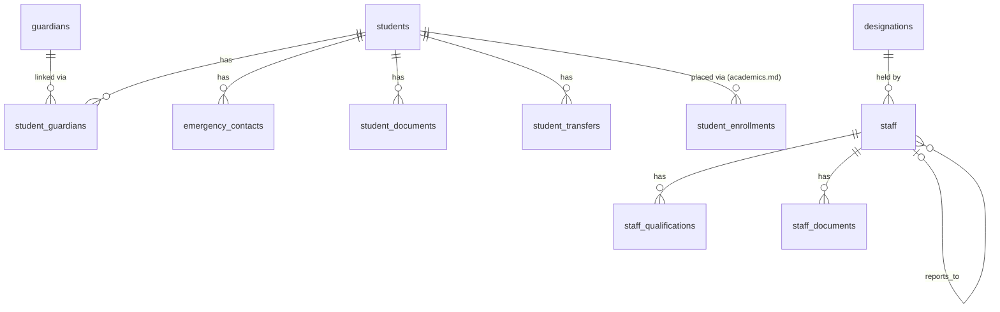

# Entities: People (Students, Guardians, Staff)

> **Agent Context** — Load this block first.
> **Summary:** Column-level specifications for the person-domain tables: student master data, guardians and their links, emergency contacts, student documents and transfers, and the staff domain (staff, designations, qualifications, staff documents). Owned by the `student-management` and `staff-management` modules. Every table below is tenant-owned: it implicitly carries `id UUID PK`, `tenant_id FK → tenants`, `created_at/updated_at`, `created_by/updated_by`, `deleted_at` (soft delete) per [`../database-architecture.md`](../../02-architecture/database-architecture.md) — these are not repeated per table. All uniques/indexes listed are tenant-scoped (leading `tenant_id`).
> **Co-load with:** `../../03-modules/student-management.md` · `../../03-modules/staff-management.md` · `academics.md` (enrollments, structure) · `tenancy.md` (users, files)

## Student Domain

### students

Student master record — one durable row per child, independent of session placement (placement lives in `student_enrollments`, see [`academics.md`](academics.md)).

| Column | Type | Null | Default | Notes |
| ------ | ---- | ---- | ------- | ----- |
| admission_number | varchar(32) | no | — | Unique (tenant_id, admission_number); generated per tenant pattern; immutable |
| user_id | uuid | yes | null | FK → users(id); portal account; unique when set |
| first_name | varchar(100) | no | — | |
| last_name | varchar(100) | no | — | |
| preferred_name | varchar(100) | yes | null | |
| date_of_birth | date | no | — | |
| gender | varchar(20) | no | — | Enum: `male` \| `female` \| `other` \| `unspecified` |
| photo_file_id | uuid | yes | null | FK → files(id) |
| campus_id | uuid | no | — | FK → campuses(id) |
| house_id | uuid | yes | null | FK → houses(id) |
| status | varchar(20) | no | `'active'` | Enum: `active` \| `suspended` \| `transferred` \| `withdrawn` \| `graduated` |
| admission_date | date | no | — | |
| blood_group | varchar(8) | yes | null | |
| nationality | varchar(80) | yes | null | Tenant-configurable field; no country assumed |
| religion | varchar(80) | yes | null | Optional/sensitive; tenant may disable |
| previous_school | varchar(200) | yes | null | |
| medical_notes | text | yes | null | Restricted visibility (admins + class teacher) |
| address | jsonb | yes | null | Structured address; format tenant-configurable |
| custom_fields | jsonb | no | `'{}'` | Tenant-defined extra fields |

Indexes: unique (tenant_id, admission_number); unique (tenant_id, user_id) where user_id not null; (tenant_id, status); (tenant_id, campus_id); (tenant_id, last_name, first_name); GIN on custom_fields *(recommendation)*.
Relationships: 1:N → student_guardians, emergency_contacts, student_documents, student_transfers, student_enrollments; N:1 → campuses, houses, users, files.

### guardians

Guardian/parent person record; linkable to many students (and one student to many guardians) via `student_guardians`.

| Column | Type | Null | Default | Notes |
| ------ | ---- | ---- | ------- | ----- |
| user_id | uuid | yes | null | FK → users(id); portal account; unique when set |
| first_name | varchar(100) | no | — | |
| last_name | varchar(100) | no | — | |
| phone | varchar(32) | no | — | Primary contact; indexed for duplicate matching |
| alt_phone | varchar(32) | yes | null | |
| email | varchar(254) | yes | null | |
| occupation | varchar(120) | yes | null | |
| employer | varchar(200) | yes | null | |
| national_id | varchar(64) | yes | null | Type/label tenant-configurable |
| photo_file_id | uuid | yes | null | FK → files(id) |
| address | jsonb | yes | null | |
| custom_fields | jsonb | no | `'{}'` | |

Indexes: unique (tenant_id, user_id) where user_id not null; (tenant_id, phone); (tenant_id, email); (tenant_id, last_name, first_name).
Relationships: 1:N → student_guardians; N:1 → users, files.

### student_guardians

Join table linking students to guardians with per-link authority and communication flags.

| Column | Type | Null | Default | Notes |
| ------ | ---- | ---- | ------- | ----- |
| student_id | uuid | no | — | FK → students(id) |
| guardian_id | uuid | no | — | FK → guardians(id) |
| relationship | varchar(30) | no | — | Enum: `father` \| `mother` \| `grandparent` \| `sibling` \| `legal_guardian` \| `other` |
| is_primary | boolean | no | `false` | Exactly one primary per student (partial unique) |
| is_fee_responsible | boolean | no | `false` | Consumed by fees-finance invoicing |
| can_pick_up | boolean | no | `true` | Pickup authorization |
| receives_communications | boolean | no | `true` | Consumed by communication module |
| has_portal_access | boolean | no | `true` | Child visible in guardian's portal |
| access_revoked_reason | varchar(200) | yes | null | Custody edge cases; set with audit |

Indexes: unique (tenant_id, student_id, guardian_id); unique (tenant_id, student_id) where is_primary = true; (tenant_id, guardian_id).
Relationships: N:1 → students, guardians (realizes the students↔guardians M:N).

### emergency_contacts

Ordered emergency contacts per student (may duplicate a guardian or be a third party).

| Column | Type | Null | Default | Notes |
| ------ | ---- | ---- | ------- | ----- |
| student_id | uuid | no | — | FK → students(id) |
| name | varchar(200) | no | — | |
| relationship | varchar(50) | no | — | Free text (e.g. "aunt", "neighbor") |
| phone | varchar(32) | no | — | |
| alt_phone | varchar(32) | yes | null | |
| priority | smallint | no | `1` | Call order; 1 = first |
| notes | varchar(300) | yes | null | |

Indexes: (tenant_id, student_id, priority).
Relationships: N:1 → students.

### student_documents

Typed, verifiable document vault entries per student.

| Column | Type | Null | Default | Notes |
| ------ | ---- | ---- | ------- | ----- |
| student_id | uuid | no | — | FK → students(id) |
| file_id | uuid | no | — | FK → files(id) |
| document_type | varchar(50) | no | — | Tenant-extensible; seeded values: `birth_certificate`, `prior_transfer_certificate`, `immunization_record`, `photo_id`, `prior_report_card`, `other` |
| title | varchar(200) | no | — | |
| notes | varchar(500) | yes | null | |
| verification_status | varchar(20) | no | `'pending'` | Enum: `pending` \| `verified` \| `rejected` |
| verified_by | uuid | yes | null | FK → users(id); required when status ≠ pending |
| verified_at | timestamptz | yes | null | |
| expires_at | date | yes | null | Drives expiry reminders |

Indexes: (tenant_id, student_id, document_type); (tenant_id, verification_status); (tenant_id, expires_at) where expires_at not null.
Relationships: N:1 → students, files, users (verifier).

### student_transfers

Transfer requests and their lifecycle (inter-campus and outbound to other schools).

| Column | Type | Null | Default | Notes |
| ------ | ---- | ---- | ------- | ----- |
| student_id | uuid | no | — | FK → students(id) |
| transfer_type | varchar(20) | no | — | Enum: `inter_campus` \| `outgoing` \| `incoming` |
| from_campus_id | uuid | yes | null | FK → campuses(id); null for `incoming` |
| to_campus_id | uuid | yes | null | FK → campuses(id); null for `outgoing` |
| external_school_name | varchar(200) | yes | null | For `outgoing`/`incoming` |
| reason | text | no | — | |
| status | varchar(20) | no | `'requested'` | Enum: `requested` \| `approved` \| `rejected` \| `completed` \| `cancelled` |
| effective_date | date | no | — | |
| decided_by | uuid | yes | null | FK → users(id); approver ≠ initiator (service-enforced) |
| decided_at | timestamptz | yes | null | |
| certificate_document_id | uuid | yes | null | FK → generated_documents(id) (see `documents.md`); issued transfer certificate |

Indexes: (tenant_id, student_id); (tenant_id, status); (tenant_id, effective_date).
Relationships: N:1 → students, campuses (from/to), users (decider), generated_documents.

## Staff Domain

### staff

Employee master record for teaching and non-teaching staff.

| Column | Type | Null | Default | Notes |
| ------ | ---- | ---- | ------- | ----- |
| employee_number | varchar(32) | no | — | Unique (tenant_id, employee_number); generated per tenant pattern; immutable |
| user_id | uuid | yes | null | FK → users(id); null until account invite accepted; unique when set |
| first_name | varchar(100) | no | — | |
| last_name | varchar(100) | no | — | |
| gender | varchar(20) | yes | null | Enum as in `students.gender` |
| date_of_birth | date | yes | null | |
| photo_file_id | uuid | yes | null | FK → files(id) |
| staff_type | varchar(20) | no | — | Enum: `teaching` \| `non_teaching` |
| campus_id | uuid | no | — | FK → campuses(id) |
| department_id | uuid | yes | null | FK → departments(id) |
| designation_id | uuid | yes | null | FK → designations(id) |
| reports_to_staff_id | uuid | yes | null | FK → staff(id); acyclic (service-enforced) |
| employment_type | varchar(20) | no | `'full_time'` | Enum: `full_time` \| `part_time` \| `contract` \| `visiting` |
| employment_status | varchar(20) | no | `'active'` | Enum: `active` \| `on_leave` \| `suspended` \| `resigned` \| `retired` \| `terminated` |
| joining_date | date | no | — | |
| exit_date | date | yes | null | ≥ joining_date |
| exit_reason | varchar(300) | yes | null | |
| email | varchar(254) | yes | null | |
| phone | varchar(32) | no | — | |
| national_id | varchar(64) | yes | null | Unique (tenant_id, national_id) when set |
| public_bio | text | yes | null | Opt-in website-published bio |
| address | jsonb | yes | null | |
| custom_fields | jsonb | no | `'{}'` | |

Indexes: unique (tenant_id, employee_number); unique (tenant_id, user_id) where user_id not null; unique (tenant_id, national_id) where national_id not null; (tenant_id, campus_id); (tenant_id, department_id); (tenant_id, employment_status); (tenant_id, staff_type).
Relationships: 1:N → staff_qualifications, staff_documents, teacher_subject_allocations, teacher_substitutions (see `academics.md`); self-referential N:1 → staff (reports_to); N:1 → users, campuses, departments, designations, files. No compensation columns — salary data lives in `finance.md` (salary_structures, payslips).

### designations

Tenant-defined designation catalog (e.g. Senior Teacher, Coordinator, Lab Assistant).

| Column | Type | Null | Default | Notes |
| ------ | ---- | ---- | ------- | ----- |
| name | varchar(100) | no | — | Unique (tenant_id, name) |
| code | varchar(20) | yes | null | Unique (tenant_id, code) when set |
| description | varchar(300) | yes | null | |
| level | smallint | yes | null | Optional seniority ordering |
| is_active | boolean | no | `true` | Deactivate instead of delete while assigned |

Indexes: unique (tenant_id, name); unique (tenant_id, code) where code not null.
Relationships: 1:N → staff; referenced by salary_structures (see `finance.md`).

### staff_qualifications

Degrees, diplomas, certifications, trainings, and licenses per staff member, with verification.

| Column | Type | Null | Default | Notes |
| ------ | ---- | ---- | ------- | ----- |
| staff_id | uuid | no | — | FK → staff(id) |
| qualification_type | varchar(30) | no | — | Enum: `degree` \| `diploma` \| `certification` \| `training` \| `license` |
| title | varchar(200) | no | — | e.g. "M.Sc. Physics" |
| institution | varchar(200) | yes | null | |
| field_of_study | varchar(120) | yes | null | Used for allocation hints |
| year_awarded | smallint | yes | null | Not in the future (service-enforced) |
| grade | varchar(50) | yes | null | Grade/GPA/class as free text |
| document_file_id | uuid | yes | null | FK → files(id); evidence |
| verification_status | varchar(20) | no | `'pending'` | Enum: `pending` \| `verified` \| `rejected` |
| verified_by | uuid | yes | null | FK → users(id) |
| verified_at | timestamptz | yes | null | |

Indexes: (tenant_id, staff_id); (tenant_id, qualification_type); (tenant_id, field_of_study).
Relationships: N:1 → staff, files, users (verifier).

### staff_documents

Typed, verifiable staff document vault entries (contracts, IDs, clearances).

| Column | Type | Null | Default | Notes |
| ------ | ---- | ---- | ------- | ----- |
| staff_id | uuid | no | — | FK → staff(id) |
| file_id | uuid | no | — | FK → files(id) |
| document_type | varchar(50) | no | — | Tenant-extensible; seeded values: `contract`, `national_id`, `resume`, `police_clearance`, `medical_certificate`, `other` |
| title | varchar(200) | no | — | |
| notes | varchar(500) | yes | null | |
| verification_status | varchar(20) | no | `'pending'` | Enum: `pending` \| `verified` \| `rejected` |
| verified_by | uuid | yes | null | FK → users(id) |
| verified_at | timestamptz | yes | null | |
| expires_at | date | yes | null | Contract/license expiry reminders |

Indexes: (tenant_id, staff_id, document_type); (tenant_id, verification_status); (tenant_id, expires_at) where expires_at not null.
Relationships: N:1 → staff, files, users (verifier).

## Relationship Overview

Cross-file references: `users`, `files` → [`tenancy.md`](tenancy.md); `campuses`, `departments`, `houses`, `student_enrollments` → [`academics.md`](academics.md); `generated_documents` → [`documents.md`](documents.md); `salary_structures` → [`finance.md`](finance.md).
