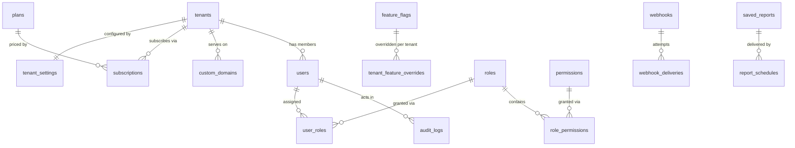
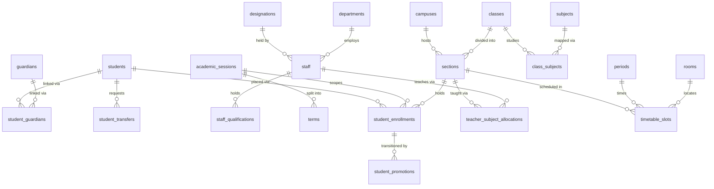
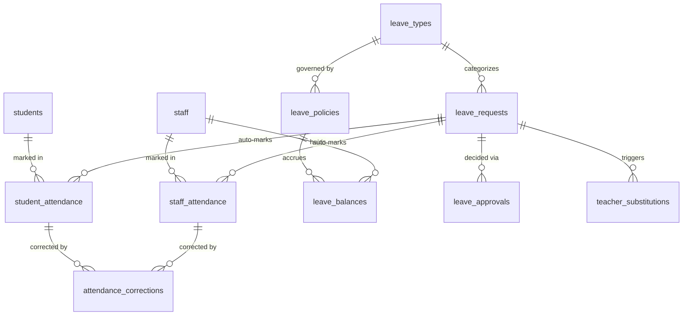
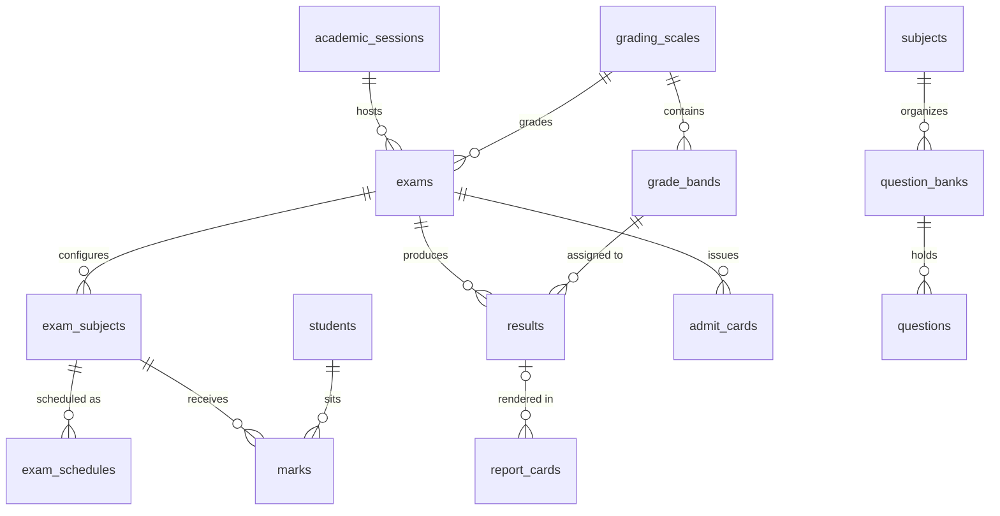
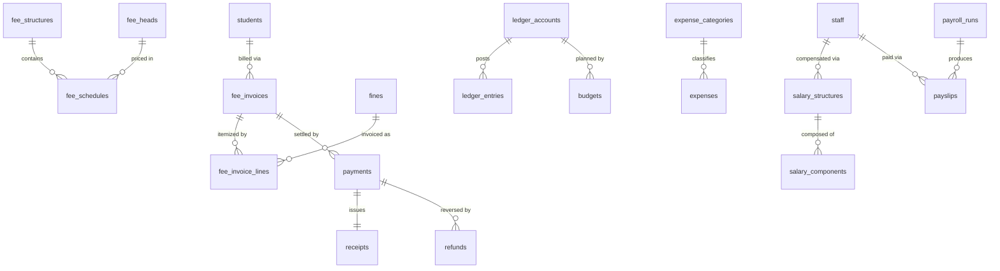
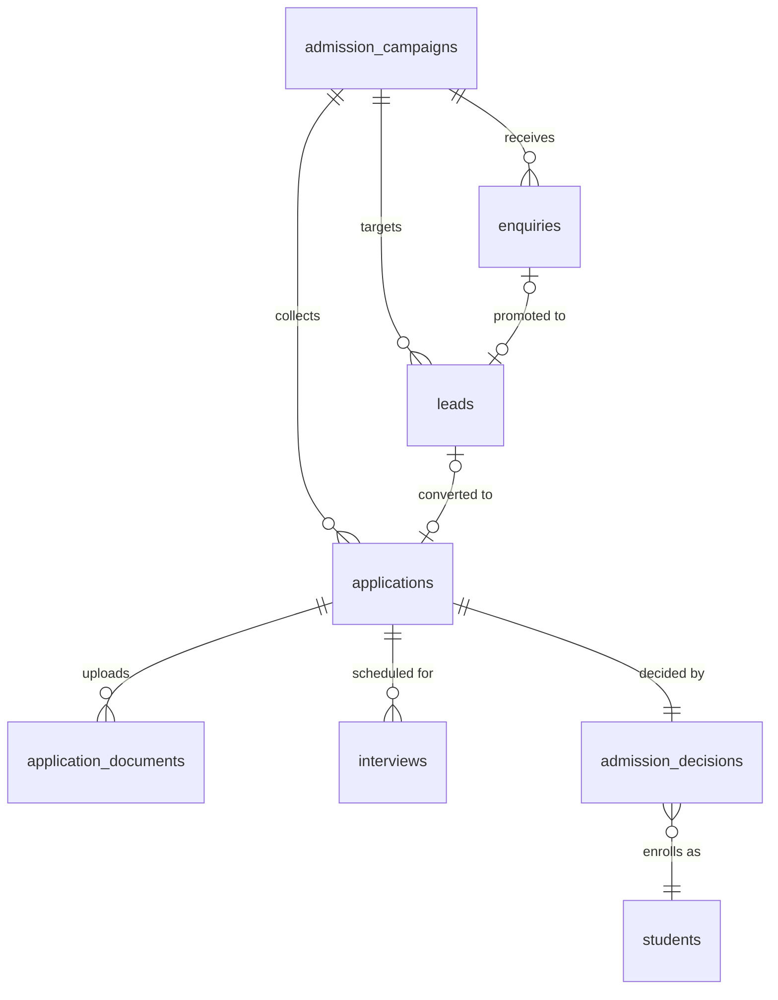
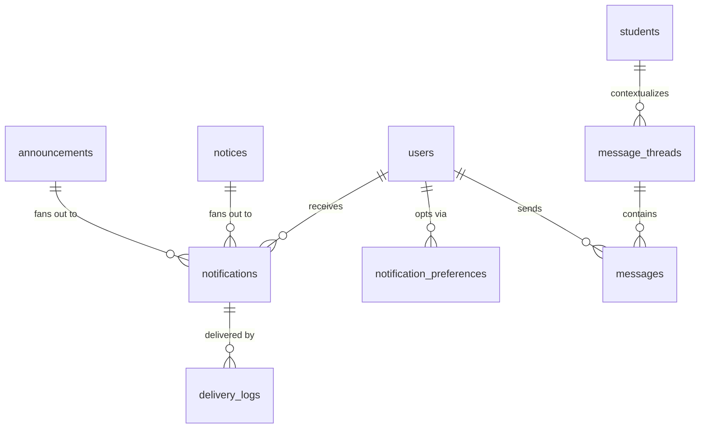
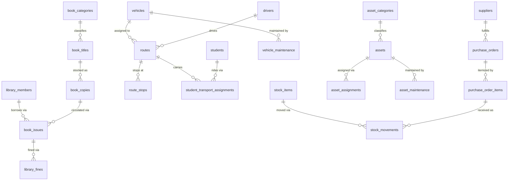
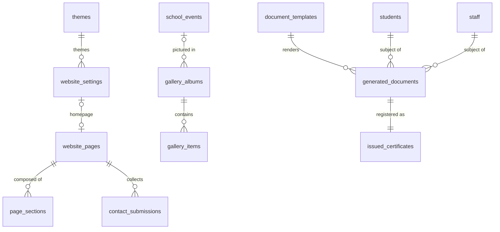

# ERD Overview

> **Agent Context** — Load this block first.
> **Summary:** Entity-relationship overview of the full SchoolHub schema (134 tables across 11 entity files): a domain map of which file owns which tables, per-domain Mermaid ER diagrams showing key relationships only (no attribute lists), a catalog of representative 1:1 / 1:N / M:N and cross-domain relationships, and a conventions recap. Column-level truth lives in [`entities/`](entities/); platform-wide column and RLS rules live in [`../02-architecture/database-architecture.md`](../02-architecture/database-architecture.md).
> **Co-load with:** [`../02-architecture/database-architecture.md`](../02-architecture/database-architecture.md) · [`entities/`](entities/) (the file owning the domain under discussion)

## 1. Domain Map

| Entity file | Domain | Tables |
| ----------- | ------ | ------ |
| [`entities/tenancy.md`](entities/tenancy.md) | Tenancy, identity & platform core | tenants, tenant_settings, plans, subscriptions, feature_flags, tenant_feature_overrides, custom_domains, users, roles, permissions, role_permissions, user_roles, audit_logs, files, webhooks, webhook_deliveries, background_jobs, saved_reports, report_schedules |
| [`entities/people.md`](entities/people.md) | Students, guardians & staff | students, guardians, student_guardians, emergency_contacts, student_documents, student_transfers, staff, designations, staff_qualifications, staff_documents |
| [`entities/academics.md`](entities/academics.md) | Academic structure, enrollment & timetable | campuses, departments, academic_sessions, terms, classes, sections, subjects, houses, student_enrollments, class_subjects, teacher_subject_allocations, student_promotions, rooms, periods, timetable_slots, teacher_substitutions |
| [`entities/attendance.md`](entities/attendance.md) | Attendance & leave | student_attendance, staff_attendance, attendance_corrections, leave_types, leave_policies, leave_balances, leave_requests, leave_approvals |
| [`entities/examinations.md`](entities/examinations.md) | Examinations & assessment | exams, exam_subjects, exam_schedules, grading_scales, grade_bands, marks, results, report_cards, admit_cards, question_banks, questions |
| [`entities/finance.md`](entities/finance.md) | Finance & payroll | fee_heads, fee_structures, fee_schedules, fee_invoices, fee_invoice_lines, discounts, scholarships, fines, payments, receipts, refunds, ledger_accounts, ledger_entries, expense_categories, expenses, budgets, salary_structures, salary_components, payroll_runs, payslips |
| [`entities/admissions.md`](entities/admissions.md) | Admissions & lead management | admission_campaigns, enquiries, leads, applications, application_documents, interviews, admission_decisions |
| [`entities/communication.md`](entities/communication.md) | Communication | announcements, notices, message_threads, messages, notification_templates, notifications, notification_preferences, delivery_logs |
| [`entities/library-transport-inventory.md`](entities/library-transport-inventory.md) | Library, transport, inventory & assets | book_categories, book_titles, book_copies, library_members, book_issues, library_fines, vehicles, drivers, routes, route_stops, student_transport_assignments, vehicle_maintenance, suppliers, asset_categories, assets, asset_assignments, asset_maintenance, stock_items, stock_movements, purchase_orders, purchase_order_items |
| [`entities/website-cms.md`](entities/website-cms.md) | Website & CMS | website_settings, themes, website_pages, page_sections, navigation_menus, news_posts, school_events, gallery_albums, gallery_items, contact_submissions, seo_settings |
| [`entities/documents.md`](entities/documents.md) | Certificates & documents | document_templates, generated_documents, issued_certificates |

## 2. Domain Diagrams

One diagram per domain cluster; entity names are exact table names, and only key relationships are shown. Attribute lists are intentionally omitted — see the owning entity file for columns.

### 2.1 Tenancy & Identity

### 2.2 People & Academics Core

### 2.3 Attendance & Leave

### 2.4 Examinations

### 2.5 Finance & Payroll

### 2.6 Admissions

### 2.7 Communication

### 2.8 Library, Transport & Inventory

### 2.9 Website & Documents

## 3. Relationship Catalog

### 3.1 Representative one-to-one

| Relationship | Via | Notes |
| ------------ | --- | ----- |
| tenants ↔ tenant_settings | `tenant_settings.tenant_id` unique | Exactly one settings row per tenant |
| payments ↔ receipts | `receipts.payment_id` unique | One numbered receipt per confirmed payment |
| applications ↔ admission_decisions | `admission_decisions.application_id` unique | One active decision per application |
| generated_documents ↔ issued_certificates | `issued_certificates.generated_document_id` unique | Immutable issuance registry entry |
| staff ↔ drivers | `drivers.staff_id` unique per tenant | Transport role extension of the staff record |
| library_fines ↔ fines | `library_fines.posted_fine_id` unique | 1:1 once posted to finance |

### 3.2 Representative one-to-many

| Relationship | Cardinality rule |
| ------------ | ---------------- |
| students → student_enrollments | One row per student per session (unique `tenant_id, student_id, academic_session_id`); one `active` placement at a time |
| tenants → subscriptions | 1:N history, but at most one live row (partial unique on `trialing`/`active`/`past_due`) |
| fee_invoices → fee_invoice_lines | 1:N; lines carry a polymorphic origin (`fee_schedules` or `fines` via `source_type`/`source_id`) |
| exams → exam_subjects → marks | Marks unique per (`exam_subject_id`, `student_id`); processed into one `results` row per (`exam_id`, `student_id`) |
| leave_requests → leave_approvals | One row per approval level (unique `leave_request_id, level`) |
| payroll_runs → payslips | One payslip per staff per run (unique `payroll_run_id, staff_id`) |
| book_copies → book_issues | 1:N history; at most one open issue per copy (partial unique where status in `issued`/`overdue`) |

### 3.3 Representative many-to-many

| Relationship | Junction | Extra semantics on the junction |
| ------------ | -------- | ------------------------------- |
| students ↔ guardians | student_guardians | Relationship type, exactly one primary per student, fee responsibility, pickup and communication flags |
| users ↔ roles | user_roles | Record scope (`own`/`assigned`/`campus`/`all`) + `scope_ref` |
| roles ↔ permissions | role_permissions | Mirrors the role's tenant scope |
| classes ↔ subjects | class_subjects | Session-scoped curriculum: elective grouping, weekly periods, term plans |
| sections ↔ staff (per subject) | teacher_subject_allocations | Session-scoped; one primary teacher per (section, subject), co-teachers allowed |

### 3.4 Cross-domain foreign keys

These FKs cross entity-file boundaries and are the seams between modules:

| FK | From → To | Purpose |
| -- | --------- | ------- |
| `library_fines.posted_fine_id` | library → finance `fines` | Library assessment posted for collection in fees-finance |
| `vehicle_maintenance.expense_id`, `asset_maintenance.expense_id` | transport/inventory → finance `expenses` | Maintenance cost posting, idempotent |
| `purchase_orders.expense_id`, `purchase_orders.budget_id` | inventory → finance `expenses`/`budgets` | Procurement posting and budget linkage |
| `student_attendance.leave_request_id`, `staff_attendance.leave_request_id` | attendance → leave `leave_requests` | Approved leave auto-marks `on_leave` rows |
| `teacher_substitutions.leave_request_id` | timetable → leave `leave_requests` | Substitution provoked by an approved leave |
| `student_transfers.certificate_document_id` | people → documents `generated_documents` | Issued transfer certificate |
| `applications.application_fee_invoice_id` | admissions → finance `fee_invoices` | Campaign application fee billed via fees-finance |
| `admission_decisions.enrolled_student_id` | admissions → people `students` | Accepted applicant handed off to student-management |
| `generated_documents.batch_job_id` | documents → platform `background_jobs` | Bulk generation tracking |
| `fee_heads.ledger_account_id`, `expense_categories.ledger_account_id` | finance config → general ledger | Income/expense account mapping |
| `*_file_id` columns platform-wide | any module → tenancy `files` | Single object-storage registry for all documents/media |

## 4. Conventions Recap

Full rules in [`../02-architecture/database-architecture.md`](../02-architecture/database-architecture.md); in brief:

- **UUID PKs** (`id uuid DEFAULT gen_random_uuid()`) on every table; never sequential integers.
- **`tenant_id UUID NOT NULL FK → tenants` + forced RLS** (`app.tenant_id` GUC, `SET LOCAL` per transaction) on every tenant-owned table.
- **Soft delete** via `deleted_at`; partial unique constraints exclude soft-deleted rows.
- **Audit columns**: `created_at`/`updated_at` (`timestamptz`, UTC) and `created_by`/`updated_by` (FK → users) everywhere; append-only tables (audit_logs, ledger_entries, stock_movements, messages, delivery_logs) drop the update/delete columns.
- **Naming**: plural `snake_case` tables, `<entity>_id` FK columns, `tenant_id` leads every composite index.

## 5. Platform-Scope and Tenant-Nullable Tables

Per [`entities/tenancy.md`](entities/tenancy.md) (and [`entities/website-cms.md`](entities/website-cms.md) for `themes`), these tables deviate from the tenant-owned convention:

- **No `tenant_id` at all (platform scope, exempt from RLS):** `tenants`, `plans`, `feature_flags`, `permissions`, `themes`.
- **Nullable `tenant_id` (NULL = platform-scope row):** `users` (platform staff accounts), `roles` (platform-seeded default roles), `role_permissions` (mirrors `roles.tenant_id`), `audit_logs` (platform-scope actions), `files` (platform assets such as theme previews), `background_jobs` (platform jobs).

Every other table in the domain map is strictly tenant-owned and participates in the RLS policy.
